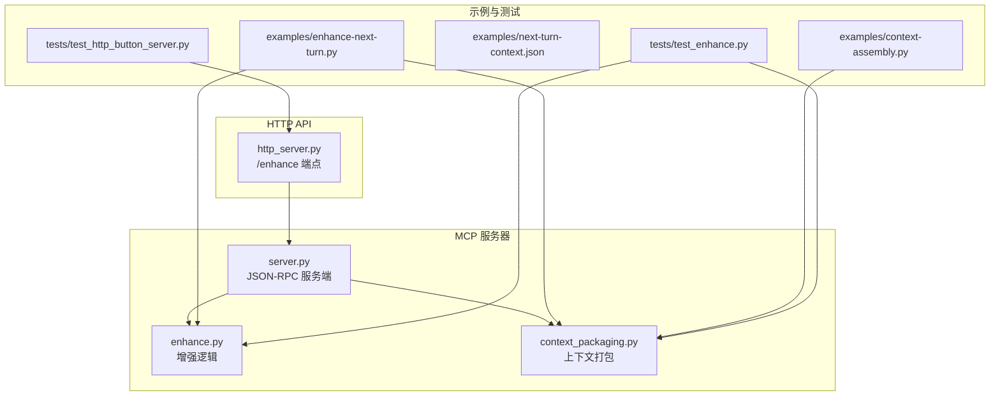
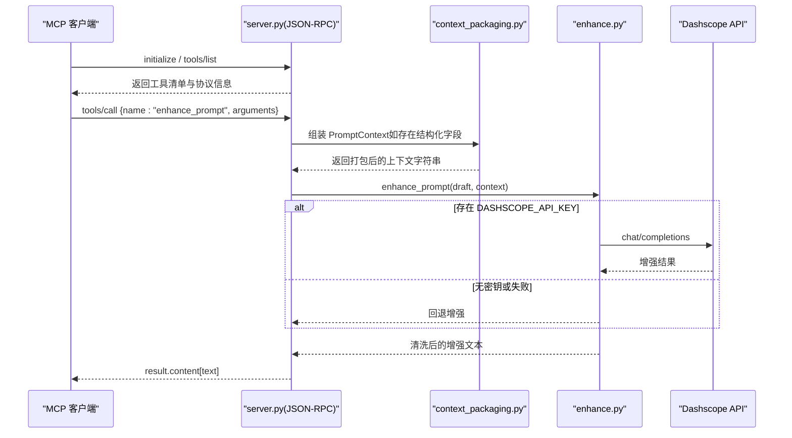
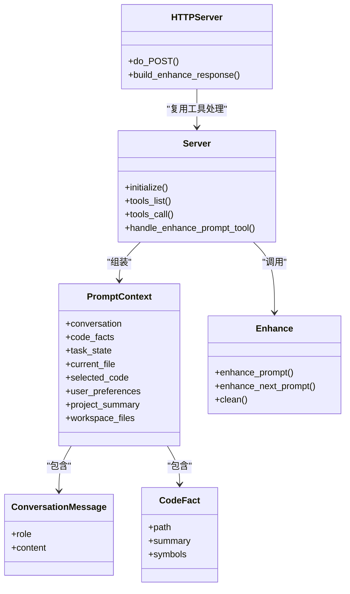

# API 参考

<cite>
**本文引用的文件**
- [mcp-server/server.py](file://mcp-server/server.py)
- [mcp-server/http_server.py](file://mcp-server/http_server.py)
- [mcp-server/enhance.py](file://mcp-server/enhance.py)
- [mcp-server/context_packaging.py](file://mcp-server/context_packaging.py)
- [examples/enhance-next-turn.py](file://examples/enhance-next-turn.py)
- [examples/context-assembly.py](file://examples/context-assembly.py)
- [examples/next-turn-context.json](file://examples/next-turn-context.json)
- [tests/test_enhance.py](file://tests/test_enhance.py)
- [tests/test_http_button_server.py](file://tests/test_http_button_server.py)
- [docs/codex-button-integration.md](file://docs/codex-button-integration.md)
- [README.md](file://README.md)
- [package.json](file://package.json)
</cite>

## 目录
1. [简介](#简介)
2. [项目结构](#项目结构)
3. [核心组件](#核心组件)
4. [架构总览](#架构总览)
5. [详细组件分析](#详细组件分析)
6. [依赖关系分析](#依赖关系分析)
7. [性能考量](#性能考量)
8. [故障排除指南](#故障排除指南)
9. [结论](#结论)
10. [附录](#附录)

## 简介
本文件为 PromptCocoPilot 的 API 参考文档，聚焦 MCP 工具接口与本地 HTTP API，涵盖：
- MCP 工具 enhance_prompt 的 JSON-RPC 协议、方法调用格式、参数验证与错误码
- HTTP API 端点 /enhance 的请求/响应与状态码
- 参数规范：draft、context、conversation、code_facts、task_state、current_file、selected_code、user_preferences、project_summary、workspace_files、structured_output 等
- 请求/响应示例、错误处理策略、安全与速率限制建议、版本管理与迁移说明
- 客户端实现指南与性能优化建议

## 项目结构
- mcp-server：MCP 服务器与增强逻辑实现
  - server.py：MCP JSON-RPC 服务端，暴露 enhance_prompt 工具
  - http_server.py：本地 HTTP API（/enhance），用于 Codex 优化输入按钮
  - enhance.py：核心增强逻辑，支持 Dashscope 实际调用与回退
  - context_packaging.py：上下文打包与 PromptContext 数据结构
- examples：示例脚本与样例 JSON
- tests：单元测试
- docs：集成与技术方案文档
- README.md：项目说明与使用流程

图表来源
- [mcp-server/server.py:1-232](file://mcp-server/server.py#L1-L232)
- [mcp-server/http_server.py:1-101](file://mcp-server/http_server.py#L1-L101)
- [mcp-server/enhance.py:1-167](file://mcp-server/enhance.py#L1-L167)
- [mcp-server/context_packaging.py:1-211](file://mcp-server/context_packaging.py#L1-L211)
- [examples/enhance-next-turn.py:1-55](file://examples/enhance-next-turn.py#L1-L55)
- [examples/context-assembly.py:1-93](file://examples/context-assembly.py#L1-L93)
- [examples/next-turn-context.json:1-33](file://examples/next-turn-context.json#L1-L33)
- [tests/test_enhance.py:1-69](file://tests/test_enhance.py#L1-L69)
- [tests/test_http_button_server.py:1-53](file://tests/test_http_button_server.py#L1-L53)

章节来源
- [README.md:23-30](file://README.md#L23-L30)

## 核心组件
- MCP JSON-RPC 服务端（server.py）
  - 初始化握手：返回 protocolVersion、capabilities、serverInfo
  - 工具清单：列出 enhance_prompt 工具及其 inputSchema
  - 工具调用：执行 enhance_prompt，返回文本内容
- 增强逻辑（enhance.py）
  - 使用 Dashscope OpenAI 兼容接口进行真实增强；失败时回退
  - 清洗输出（去除代码块与引号）
- 上下文打包（context_packaging.py）
  - PromptContext 结构体与对话、代码事实、任务状态、编辑器上下文、用户偏好、项目摘要、工作区文件等字段
  - 智能截断与预算控制，避免超出小模型上下文窗口
- HTTP API（http_server.py）
  - /enhance 端点，接收 JSON，返回 {draft, enhanced}

章节来源
- [mcp-server/server.py:82-232](file://mcp-server/server.py#L82-L232)
- [mcp-server/enhance.py:90-167](file://mcp-server/enhance.py#L90-L167)
- [mcp-server/context_packaging.py:20-178](file://mcp-server/context_packaging.py#L20-L178)
- [mcp-server/http_server.py:39-101](file://mcp-server/http_server.py#L39-L101)

## 架构总览
MCP 与 HTTP 两种接入方式均指向同一增强逻辑，前者面向 Claude Code/Qoder 等 MCP 客户端，后者面向 Codex 本地按钮。

图表来源
- [mcp-server/server.py:49-80](file://mcp-server/server.py#L49-L80)
- [mcp-server/context_packaging.py:79-178](file://mcp-server/context_packaging.py#L79-L178)
- [mcp-server/enhance.py:41-68](file://mcp-server/enhance.py#L41-L68)

## 详细组件分析

### MCP 工具：enhance_prompt
- JSON-RPC 方法
  - initialize：握手，返回 protocolVersion、capabilities、serverInfo
  - tools/list：返回工具清单，包含 enhance_prompt 的 inputSchema
  - tools/call：调用 enhance_prompt，返回 result.content[{type: "text", text}]
- 参数与 inputSchema
  - draft（必填，string）：待增强的原始提示词
  - context（可选，string）：自由格式上下文（历史、文件、选区等）
  - include_history（可选，boolean）：是否包含历史（当未直接提供 context 时）
  - conversation（可选，数组）：最近对话消息，每项包含 role、content
  - code_facts（可选，数组）：代码事实，包含 path、summary、symbols
  - task_state（可选，string）：当前任务状态
  - current_file（可选，string）：当前编辑文件路径
  - selected_code（可选，string）：当前选中的代码片段
  - user_preferences（可选，数组）：用户偏好/约束
  - project_summary（可选，string）：项目总体描述
  - workspace_files（可选，数组）：项目文件列表（最多显示 40 项）
  - structured_output（可选，boolean）：为 true 时返回 JSON {original, enhanced, context_used}
- 处理逻辑
  - 若传入结构化字段（conversation/code_facts/task_state/current_file/selected_code/user_preferences/project_summary/workspace_files），则组装为 PromptContext 并拼接到 context
  - 调用增强函数，返回清洗后的文本或结构化 JSON
- 错误码
  - -32601：Method not found 或 Tool not found
- 认证
  - MCP 通道不内置认证；由运行环境或客户端负责访问控制
- 版本
  - protocolVersion: "2024-11-05"
  - serverInfo.version: "0.1.0"

章节来源
- [mcp-server/server.py:93-228](file://mcp-server/server.py#L93-L228)
- [mcp-server/server.py:117-191](file://mcp-server/server.py#L117-L191)
- [mcp-server/server.py:49-80](file://mcp-server/server.py#L49-L80)

### HTTP API：/enhance
- 方法与 URL
  - POST http://HOST:PORT/enhance
- 请求头
  - Content-Type: application/json
- 请求体字段
  - draft（必填，string）：原始提示词
  - 其余字段同 MCP enhance_prompt 的结构化字段（conversation、code_facts、task_state、current_file、selected_code、user_preferences、project_summary、workspace_files）
- 成功响应
  - 200 OK，返回 {draft, enhanced}
- 错误响应
  - 400 Bad Request：draft 缺失或 JSON 解析失败
  - 500 Internal Server Error：未知异常
- CORS
  - Access-Control-Allow-Origin: *
  - Access-Control-Allow-Methods: POST, OPTIONS
  - Access-Control-Allow-Headers: Content-Type

章节来源
- [mcp-server/http_server.py:47-84](file://mcp-server/http_server.py#L47-L84)
- [mcp-server/http_server.py:22-36](file://mcp-server/http_server.py#L22-L36)
- [docs/codex-button-integration.md:30-72](file://docs/codex-button-integration.md#L30-L72)

### 增强逻辑与上下文打包
- 增强函数
  - enhance_prompt(text, context=None, generate_fn=None)：根据系统指令与上下文生成增强文本
  - 若未提供 generate_fn，则尝试 Dashscope 实际调用；失败则回退
  - clean()：去除代码块与外层引号
- 上下文打包
  - assemble_enhancement_context(draft, context, ...)：按预算与智能截断组装上下文
  - prompt_context_from_dict()：将 MCP 参数转为 PromptContext
  - DEFAULT_CONTEXT_BUDGET：约 6000 字符，避免小模型上下文溢出
  - 智能截断：保留开头与结尾，中间省略，避免丢失结论
  - dedup：按文件路径合并 code_facts，去重符号

章节来源
- [mcp-server/enhance.py:90-167](file://mcp-server/enhance.py#L90-L167)
- [mcp-server/context_packaging.py:79-178](file://mcp-server/context_packaging.py#L79-L178)
- [mcp-server/context_packaging.py:181-211](file://mcp-server/context_packaging.py#L181-L211)

### 示例与用法
- 下一轮问题增强示例
  - examples/enhance-next-turn.py：读取 next-turn-context.json，打印打包上下文或直接增强
  - examples/context-assembly.py：演示结构化与自由格式上下文组装
- 测试覆盖
  - tests/test_enhance.py：验证 clean、增强返回值、instruction 严格性、上下文传递
  - tests/test_http_button_server.py：验证 /enhance 响应结构与缺失 draft 的错误

章节来源
- [examples/enhance-next-turn.py:21-55](file://examples/enhance-next-turn.py#L21-L55)
- [examples/context-assembly.py:63-93](file://examples/context-assembly.py#L63-L93)
- [examples/next-turn-context.json:1-33](file://examples/next-turn-context.json#L1-L33)
- [tests/test_enhance.py:10-61](file://tests/test_enhance.py#L10-L61)
- [tests/test_http_button_server.py:11-47](file://tests/test_http_button_server.py#L11-L47)

## 依赖关系分析

图表来源
- [mcp-server/context_packaging.py:20-33](file://mcp-server/context_packaging.py#L20-L33)
- [mcp-server/server.py:49-80](file://mcp-server/server.py#L49-L80)
- [mcp-server/http_server.py:22-36](file://mcp-server/http_server.py#L22-L36)
- [mcp-server/enhance.py:90-149](file://mcp-server/enhance.py#L90-L149)

章节来源
- [mcp-server/context_packaging.py:1-211](file://mcp-server/context_packaging.py#L1-L211)
- [mcp-server/server.py:1-232](file://mcp-server/server.py#L1-L232)
- [mcp-server/http_server.py:1-101](file://mcp-server/http_server.py#L1-L101)
- [mcp-server/enhance.py:1-167](file://mcp-server/enhance.py#L1-L167)

## 性能考量
- 上下文预算控制
  - 默认上下文预算约 6000 字符，超过时按比例收紧每条消息长度，优先保留对话开头与结尾
- 智能截断
  - 采用“头+尾”截断策略，避免丢失长回复结论
- 代码事实去重
  - 按文件路径合并，合并 summary 与 symbols，减少冗余
- 模型选择
  - 默认模型可通过环境变量配置；失败时回退以保证可用性
- HTTP 服务
  - 单线程阻塞处理，适合本地按钮调用；高并发场景建议部署反向代理或自定义高性能服务

章节来源
- [mcp-server/context_packaging.py:35-53](file://mcp-server/context_packaging.py#L35-L53)
- [mcp-server/context_packaging.py:60-77](file://mcp-server/context_packaging.py#L60-L77)
- [mcp-server/context_packaging.py:164-177](file://mcp-server/context_packaging.py#L164-L177)
- [mcp-server/enhance.py:25-37](file://mcp-server/enhance.py#L25-L37)

## 故障排除指南
- MCP 工具调用失败
  - 检查 method 是否为 tools/call，name 是否为 enhance_prompt
  - 确认参数中包含 draft
  - 若返回 -32601，检查工具名或方法名拼写
- HTTP /enhance 400
  - draft 缺失或为空；或 JSON 解析失败
- HTTP /enhance 500
  - Dashscope API 密钥缺失或网络异常；增强逻辑抛出异常
- Dashscope API
  - 确保设置 DASHSCOPE_API_KEY；否则将使用回退逻辑
- CORS 问题
  - 确认浏览器或前端跨域头设置正确；后端已允许 OPTIONS 与指定头部

章节来源
- [mcp-server/server.py:216-228](file://mcp-server/server.py#L216-L228)
- [mcp-server/http_server.py:56-64](file://mcp-server/http_server.py#L56-L64)
- [mcp-server/enhance.py:43-44](file://mcp-server/enhance.py#L43-L44)

## 结论
本项目提供两类稳定接口：
- MCP JSON-RPC：面向 Claude Code/Qoder 等 MCP 客户端，支持结构化上下文与严格增强指令
- 本地 HTTP API：面向 Codex 优化输入按钮，提供简洁稳定的 /enhance 端点

通过 PromptContext 的智能打包与预算控制，确保在小模型上下文中获得高质量增强结果；同时提供回退机制保障离线可用性。

## 附录

### 参数规范总览
- draft（必填，string）：待增强的原始提示词
- context（可选，string）：自由格式上下文
- include_history（可选，boolean）：是否包含历史
- conversation（可选，array）：消息数组，每项含 role、content
- code_facts（可选，array）：代码事实数组，含 path、summary、symbols
- task_state（可选，string）：当前任务状态
- current_file（可选，string）：当前编辑文件路径
- selected_code（可选，string）：当前选中代码片段
- user_preferences（可选，array）：用户偏好/约束列表
- project_summary（可选，string）：项目总体描述
- workspace_files（可选，array）：项目文件列表（最多 40 项）
- structured_output（可选，boolean）：true 时返回 JSON {original, enhanced, context_used}

章节来源
- [mcp-server/server.py:117-191](file://mcp-server/server.py#L117-L191)
- [mcp-server/context_packaging.py:20-33](file://mcp-server/context_packaging.py#L20-L33)

### 请求/响应示例
- HTTP /enhance 请求
  - 参考：[docs/codex-button-integration.md:37-63](file://docs/codex-button-integration.md#L37-L63)
- HTTP /enhance 响应
  - 参考：[docs/codex-button-integration.md:65-72](file://docs/codex-button-integration.md#L65-L72)
- MCP tools/call 响应
  - result.content[{type: "text", text}]，其中 text 为增强后的提示词
- 结构化输出（structured_output=true）
  - 返回 JSON {original, enhanced, context_used}

章节来源
- [docs/codex-button-integration.md:37-72](file://docs/codex-button-integration.md#L37-L72)
- [mcp-server/server.py:203-214](file://mcp-server/server.py#L203-L214)

### 安全、速率限制与版本管理
- 安全
  - MCP 通道无内置认证；建议仅在受信环境中运行或通过反向代理限制访问
  - HTTP 仅允许本地回环地址；生产环境需自行加固
- 速率限制
  - 未内置限流；建议在网关或反向代理层实施
- 版本管理
  - MCP protocolVersion: "2024-11-05"
  - serverInfo.version: "0.1.0"
  - 项目版本：0.2.0（package.json）

章节来源
- [mcp-server/server.py:98-106](file://mcp-server/server.py#L98-L106)
- [package.json:3-4](file://package.json#L3-L4)

### 客户端实现指南
- MCP 客户端
  - 先调用 initialize 获取协议版本与 capabilities
  - 调用 tools/list 获取工具清单与 inputSchema
  - 调用 tools/call 传入 draft 与结构化上下文
- HTTP 客户端
  - POST http://127.0.0.1:8765/enhance
  - Content-Type: application/json
  - 读取 enhanced 字段替换输入框内容
- 最佳实践
  - 优先使用结构化字段（conversation、code_facts 等）而非自由字符串
  - 控制 workspace_files 数量，避免超预算
  - 使用 include_history 时注意历史长度与字符上限

章节来源
- [mcp-server/server.py:93-195](file://mcp-server/server.py#L93-L195)
- [docs/codex-button-integration.md:74-99](file://docs/codex-button-integration.md#L74-L99)

### 迁移与向后兼容
- 从自由字符串上下文迁移到结构化字段
  - 使用 prompt_context_from_dict 将旧参数映射到 PromptContext
  - 保持 draft 与 context 字段的同时，逐步引入 conversation、code_facts 等
- 版本演进
  - 当前 MCP 协议版本为 "2024-11-05"
  - 未来如需变更 inputSchema，建议通过扩展字段与向后兼容策略

章节来源
- [mcp-server/context_packaging.py:181-211](file://mcp-server/context_packaging.py#L181-L211)
- [mcp-server/server.py:98-106](file://mcp-server/server.py#L98-L106)