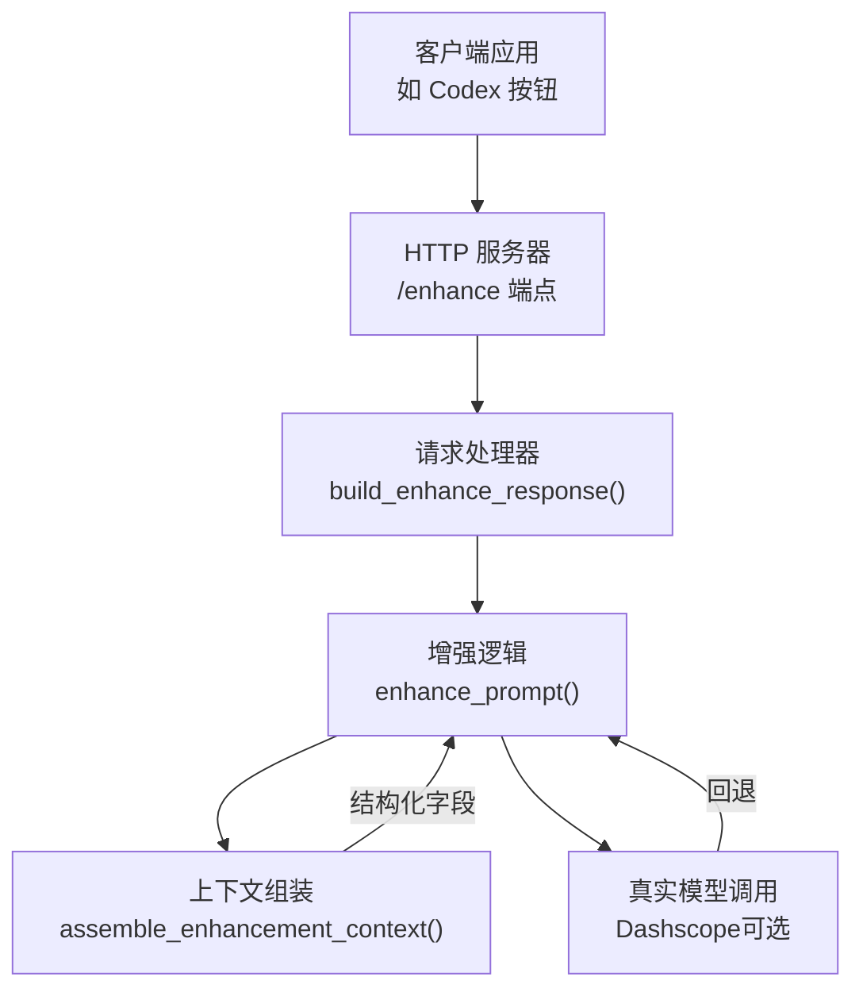
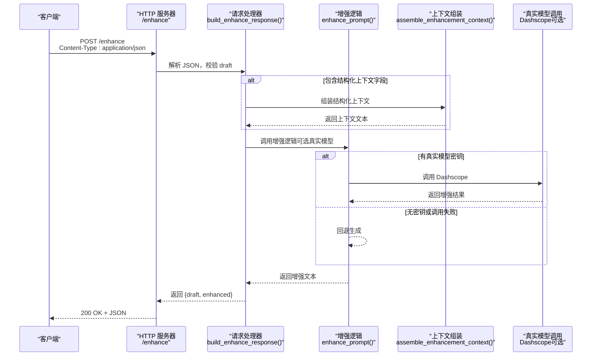
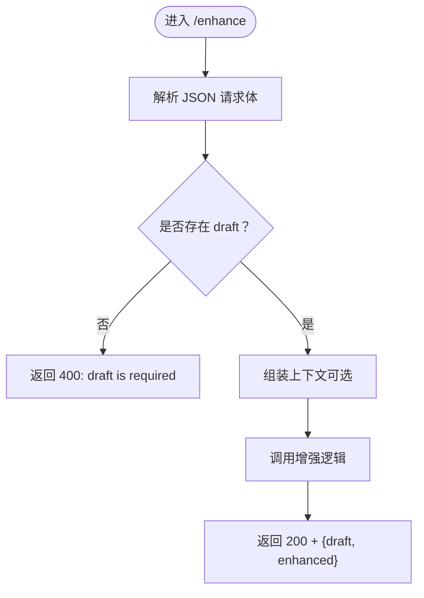
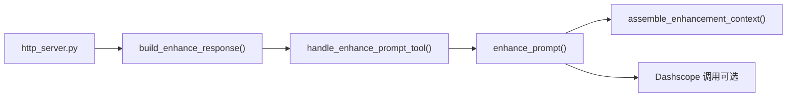

# HTTP API 接口

<cite>
**本文引用的文件**
- [mcp-server/http_server.py](file://mcp-server/http_server.py)
- [mcp-server/enhance.py](file://mcp-server/enhance.py)
- [mcp-server/context_packaging.py](file://mcp-server/context_packaging.py)
- [mcp-server/server.py](file://mcp-server/server.py)
- [docs/codex-button-integration.md](file://docs/codex-button-integration.md)
- [docs/TECH_SCHEME.md](file://docs/TECH_SCHEME.md)
- [tests/test_http_button_server.py](file://tests/test_http_button_server.py)
- [examples/enhance-next-turn.py](file://examples/enhance-next-turn.py)
- [examples/next-turn-context.json](file://examples/next-turn-context.json)
- [README.md](file://README.md)
</cite>

## 目录
1. [简介](#简介)
2. [项目结构](#项目结构)
3. [核心组件](#核心组件)
4. [架构总览](#架构总览)
5. [详细组件分析](#详细组件分析)
6. [依赖关系分析](#依赖关系分析)
7. [性能考量](#性能考量)
8. [故障排除指南](#故障排除指南)
9. [结论](#结论)
10. [附录](#附录)

## 简介
本文件面向 PromptCocoPilot 的 HTTP API，聚焦于本地“优化输入”按钮端点 /enhance。该端点用于接收用户草稿与上下文，返回经优化的提示词文本，供用户审阅后再发送。文档覆盖：
- HTTP 方法、URL 模式与请求格式
- 请求参数规范（draft、context、conversation、code_facts、task_state、current_file、selected_code、user_preferences 等）
- 成功与错误响应示例及状态码说明
- 认证、请求头与响应头要求
- 客户端实现指南（curl 与常见语言示例）
- 安全、跨域与性能优化建议

## 项目结构
与 /enhance HTTP API 直接相关的模块如下：
- mcp-server/http_server.py：本地 HTTP 服务器，提供 /enhance 端点
- mcp-server/enhance.py：核心增强逻辑（支持真实模型调用与回退）
- mcp-server/context_packaging.py：结构化上下文打包与裁剪
- mcp-server/server.py：MCP 工具入口（定义输入 schema，供 UI/调用方参考）
- docs/codex-button-integration.md：本地 HTTP API 的使用说明与示例
- tests/test_http_button_server.py：针对 HTTP 端点行为的测试
- examples/enhance-next-turn.py 与 examples/next-turn-context.json：演示如何将结构化上下文打包并增强

图表来源
- [mcp-server/http_server.py:47-66](file://mcp-server/http_server.py#L47-L66)
- [mcp-server/http_server.py:22-36](file://mcp-server/http_server.py#L22-L36)
- [mcp-server/enhance.py:90-133](file://mcp-server/enhance.py#L90-L133)
- [mcp-server/context_packaging.py:79-178](file://mcp-server/context_packaging.py#L79-L178)

章节来源
- [README.md:55-66](file://README.md#L55-L66)
- [docs/codex-button-integration.md:22-36](file://docs/codex-button-integration.md#L22-L36)

## 核心组件
- /enhance HTTP 端点：仅接受 POST，路径为 /enhance；请求体为 JSON；返回 JSON；支持 CORS。
- 响应体字段：
  - draft：原始草稿字符串（来自请求）
  - enhanced：优化后的提示词字符串
- 错误处理：
  - 404：路径不为 /enhance
  - 400：缺少必需字段 draft、JSON 解析失败
  - 500：内部异常
- 上下文增强：
  - 若请求包含结构化字段（如 conversation、code_facts、task_state、current_file、selected_code、user_preferences），将被打包为文本上下文传入增强逻辑
  - 若未提供结构化字段，可直接提供 context 字符串

章节来源
- [mcp-server/http_server.py:47-66](file://mcp-server/http_server.py#L47-L66)
- [mcp-server/http_server.py:22-36](file://mcp-server/http_server.py#L22-L36)
- [mcp-server/server.py:49-80](file://mcp-server/server.py#L49-L80)
- [mcp-server/context_packaging.py:79-178](file://mcp-server/context_packaging.py#L79-L178)

## 架构总览
下图展示了从客户端发起请求到返回优化结果的整体流程，以及与核心增强逻辑的关系。

图表来源
- [mcp-server/http_server.py:47-66](file://mcp-server/http_server.py#L47-L66)
- [mcp-server/http_server.py:22-36](file://mcp-server/http_server.py#L22-L36)
- [mcp-server/enhance.py:90-133](file://mcp-server/enhance.py#L90-L133)
- [mcp-server/context_packaging.py:79-178](file://mcp-server/context_packaging.py#L79-L178)

## 详细组件分析

### /enhance 端点定义
- 方法：POST
- URL：/enhance
- Content-Type：application/json
- 允许的请求头：
  - Content-Type: application/json
- 允许的响应头：
  - Access-Control-Allow-Origin: *
  - Access-Control-Allow-Methods: POST, OPTIONS
  - Access-Control-Allow-Headers: Content-Type
  - Content-Type: application/json; charset=utf-8
  - Content-Length: 字节长度
- 跨域处理：OPTIONS 预检返回 204，并设置上述 CORS 头

章节来源
- [mcp-server/http_server.py:42-46](file://mcp-server/http_server.py#L42-L46)
- [mcp-server/http_server.py:71-83](file://mcp-server/http_server.py#L71-L83)

### 请求参数规范
- 必填
  - draft：字符串，用户草稿提示词
- 可选（二选一）
  - context：字符串，直接提供的上下文文本
  - 结构化字段：当提供以下任一项时，将被自动打包为上下文文本
    - conversation：数组，元素为 {role, content}，最近对话消息
    - code_facts：数组，元素为 {path, summary, symbols}，已读取代码的事实
    - task_state：字符串，当前任务状态
    - current_file：字符串，当前编辑器文件路径
    - selected_code：字符串，当前选中的代码片段
    - user_preferences：数组，用户偏好或约束
    - project_summary：字符串，项目总体描述
    - workspace_files：数组，项目文件路径样本
- 说明
  - 若同时提供 context 字符串与结构化字段，结构化字段会被打包后与 context 拼接
  - 结构化字段将被转换为 PromptContext 并由 assemble_enhancement_context 组装为文本上下文

章节来源
- [mcp-server/server.py:49-80](file://mcp-server/server.py#L49-L80)
- [mcp-server/context_packaging.py:181-210](file://mcp-server/context_packaging.py#L181-L210)
- [docs/codex-button-integration.md:37-63](file://docs/codex-button-integration.md#L37-L63)

### 响应格式
- 成功响应（200 OK）
  - draft：原始草稿
  - enhanced：优化后的提示词
- 错误响应（4xx/5xx）
  - JSON 对象，包含 error 字段，值为错误描述字符串

章节来源
- [mcp-server/http_server.py:22-36](file://mcp-server/http_server.py#L22-L36)
- [mcp-server/http_server.py:56-64](file://mcp-server/http_server.py#L56-L64)

### 错误处理与状态码
- 404：路径不是 /enhance
- 400：缺少 draft 或 JSON 解析失败
- 500：内部异常（如真实模型调用失败且回退不可用）

章节来源
- [mcp-server/http_server.py:47-66](file://mcp-server/http_server.py#L47-L66)

### 认证与安全
- 本端点不强制要求认证头（如 Authorization）。是否需要认证取决于部署环境策略。
- 建议：
  - 限制监听地址为 localhost（默认）
  - 如需跨主机访问，结合反向代理与鉴权
  - 仅暴露必要端口，避免公网直连

章节来源
- [mcp-server/http_server.py:86-96](file://mcp-server/http_server.py#L86-L96)
- [docs/codex-button-integration.md:101-104](file://docs/codex-button-integration.md#L101-L104)

### 客户端实现指南

#### curl 示例
- 启动服务
  - python3 mcp-server/http_server.py --host 127.0.0.1 --port 8765
- 发送请求
  - curl -X POST http://127.0.0.1:8765/enhance -H "Content-Type: application/json" -d '{...}'
- 示例请求体（来自文档）
  - 见“请求示例”小节

章节来源
- [docs/codex-button-integration.md:24-28](file://docs/codex-button-integration.md#L24-L28)
- [docs/codex-button-integration.md:37-63](file://docs/codex-button-integration.md#L37-L63)

#### 常见语言调用示例
- JavaScript（fetch）
  - 参考“Codex Toolbar Adapter Pseudocode”
- Python（requests）
  - 构造 JSON 负载，设置 headers={"Content-Type": "application/json"}，POST 到 /enhance
- 其他语言
  - 保持相同的请求头与 JSON 结构即可

章节来源
- [docs/codex-button-integration.md:74-99](file://docs/codex-button-integration.md#L74-L99)

### 请求/响应示例

#### 成功示例
- 请求
  - POST /enhance
  - Content-Type: application/json
  - 示例负载（来自文档）
    - 见“请求示例”小节
- 响应
  - 200 OK
  - JSON：{"draft": "...", "enhanced": "..."}

章节来源
- [docs/codex-button-integration.md:37-72](file://docs/codex-button-integration.md#L37-L72)

#### 错误示例
- 缺少 draft
  - 400，{"error": "draft is required"}
- JSON 解析失败
  - 400，{"error": "invalid_json"}
- 路径错误
  - 404，{"error": "not_found"}
- 其他异常
  - 500，{"error": "..."}

章节来源
- [mcp-server/http_server.py:56-64](file://mcp-server/http_server.py#L56-L64)
- [tests/test_http_button_server.py:40-47](file://tests/test_http_button_server.py#L40-L47)

### 数据流与处理逻辑
- 输入校验：检查 draft 是否存在
- 上下文组装：若存在结构化字段，转换为 PromptContext 并组装为文本
- 增强：调用增强逻辑，优先真实模型，失败则回退
- 输出：返回 {draft, enhanced}

图表来源
- [mcp-server/http_server.py:47-66](file://mcp-server/http_server.py#L47-L66)
- [mcp-server/http_server.py:22-36](file://mcp-server/http_server.py#L22-L36)
- [mcp-server/context_packaging.py:79-178](file://mcp-server/context_packaging.py#L79-L178)
- [mcp-server/enhance.py:90-133](file://mcp-server/enhance.py#L90-L133)

## 依赖关系分析
- /enhance 端点依赖：
  - build_enhance_response：负责校验 draft、调用增强处理器并返回响应
  - handle_enhance_prompt_tool：MCP 工具函数（在 HTTP 层作为增强处理器使用）
  - enhance_prompt：核心增强逻辑
  - assemble_enhancement_context：结构化上下文组装
- 关键耦合点：
  - 结构化字段到 PromptContext 的映射
  - 上下文预算裁剪与去重
  - 真实模型调用与回退策略

图表来源
- [mcp-server/http_server.py:13-16](file://mcp-server/http_server.py#L13-L16)
- [mcp-server/http_server.py:22-36](file://mcp-server/http_server.py#L22-L36)
- [mcp-server/server.py:49-80](file://mcp-server/server.py#L49-L80)
- [mcp-server/enhance.py:90-133](file://mcp-server/enhance.py#L90-L133)
- [mcp-server/context_packaging.py:79-178](file://mcp-server/context_packaging.py#L79-L178)

章节来源
- [mcp-server/http_server.py:13-16](file://mcp-server/http_server.py#L13-L16)
- [mcp-server/server.py:49-80](file://mcp-server/server.py#L49-L80)
- [mcp-server/context_packaging.py:79-178](file://mcp-server/context_packaging.py#L79-L178)

## 性能考量
- 上下文预算控制：默认上下文预算约 6000 字符，超过时按比例裁剪对话部分，避免超出模型上下文窗口
- 去重与压缩：对相同文件的 code_facts 进行合并，减少冗余
- 智能截断：对长文本采用“首尾保留”的策略，避免丢失结论
- 模型选择：生产环境建议使用轻量快速模型以降低延迟

章节来源
- [mcp-server/context_packaging.py:35-53](file://mcp-server/context_packaging.py#L35-L53)
- [mcp-server/context_packaging.py:60-77](file://mcp-server/context_packaging.py#L60-L77)
- [mcp-server/context_packaging.py:164-177](file://mcp-server/context_packaging.py#L164-L177)
- [docs/TECH_SCHEME.md:38-47](file://docs/TECH_SCHEME.md#L38-L47)

## 故障排除指南
- 400 错误
  - 缺少 draft：确保请求体包含 draft 字段
  - JSON 解析失败：检查 Content-Type 与 JSON 格式
- 500 错误
  - 真实模型调用失败：检查 DASHSCOPE_API_KEY 环境变量或 .env 文件
  - 回退不可用：确认开发环境具备基本增强逻辑
- CORS 问题
  - 确保浏览器或客户端正确处理预检请求（OPTIONS）
  - 检查 Access-Control-Allow-* 响应头

章节来源
- [mcp-server/http_server.py:56-64](file://mcp-server/http_server.py#L56-L64)
- [mcp-server/enhance.py:27-37](file://mcp-server/enhance.py#L27-L37)
- [mcp-server/http_server.py:80-83](file://mcp-server/http_server.py#L80-L83)

## 结论
/enhance 端点提供了一个轻量、可扩展的“优化输入”能力，适合在编辑器或客户端中作为按钮动作调用。其核心在于：
- 明确的请求参数与响应格式
- 结构化上下文的自动打包与裁剪
- 可选的真实模型增强与稳健的回退策略
- 完善的 CORS 支持与错误处理

## 附录

### 请求示例
- 最小请求体
  - {"draft": "fix the bug"}
- 完整请求体（来自文档）
  - 见“请求示例”小节

章节来源
- [docs/codex-button-integration.md:37-63](file://docs/codex-button-integration.md#L37-L63)

### 响应示例
- 成功响应
  - {"draft": "...", "enhanced": "..."}
- 错误响应
  - {"error": "..."}

章节来源
- [docs/codex-button-integration.md:65-72](file://docs/codex-button-integration.md#L65-L72)
- [mcp-server/http_server.py:56-64](file://mcp-server/http_server.py#L56-L64)

### 结构化字段说明
- conversation：最近对话消息数组，元素为 {role, content}
- code_facts：代码事实数组，元素为 {path, summary, symbols}
- task_state：当前任务状态
- current_file：当前编辑器文件路径
- selected_code：当前选中的代码片段
- user_preferences：用户偏好数组
- project_summary：项目总体描述
- workspace_files：项目文件路径样本数组

章节来源
- [mcp-server/server.py:117-191](file://mcp-server/server.py#L117-L191)
- [mcp-server/context_packaging.py:181-210](file://mcp-server/context_packaging.py#L181-L210)

### 测试参考
- HTTP 端点行为测试
  - 见 tests/test_http_button_server.py
- 增强逻辑单元测试
  - 见 tests/test_enhance.py

章节来源
- [tests/test_http_button_server.py:11-47](file://tests/test_http_button_server.py#L11-L47)
- [tests/test_enhance.py:10-61](file://tests/test_enhance.py#L10-L61)