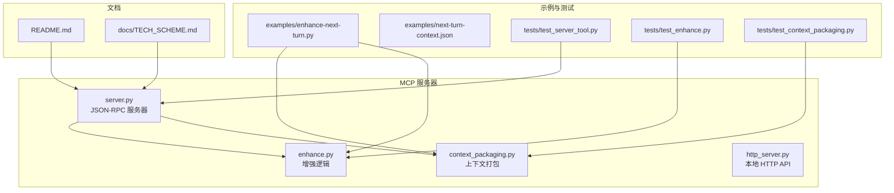
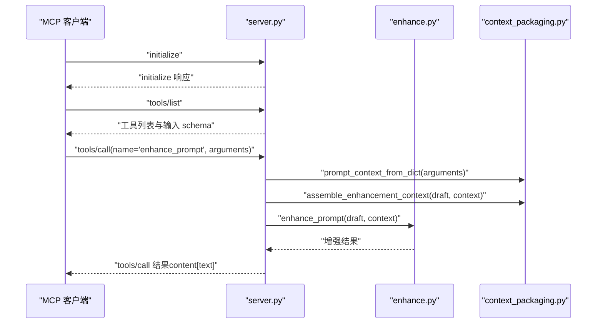
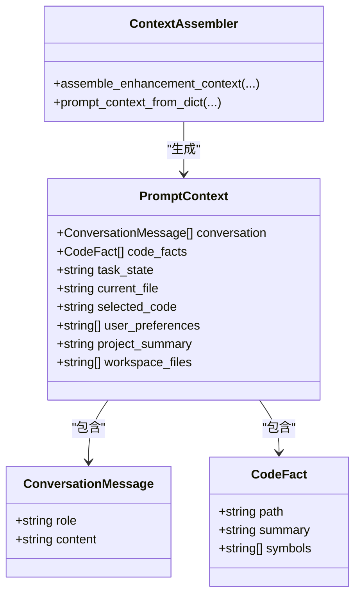
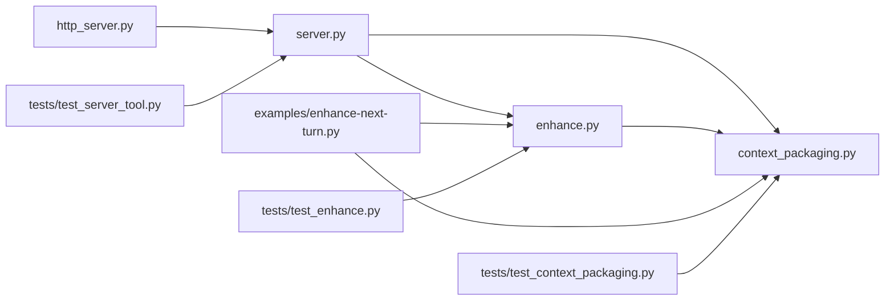

# MCP 工具接口

<cite>
**本文引用的文件**
- [mcp-server/server.py](file://mcp-server/server.py)
- [mcp-server/enhance.py](file://mcp-server/enhance.py)
- [mcp-server/context_packaging.py](file://mcp-server/context_packaging.py)
- [mcp-server/http_server.py](file://mcp-server/http_server.py)
- [examples/enhance-next-turn.py](file://examples/enhance-next-turn.py)
- [examples/next-turn-context.json](file://examples/next-turn-context.json)
- [tests/test_server_tool.py](file://tests/test_server_tool.py)
- [tests/test_enhance.py](file://tests/test_enhance.py)
- [tests/test_context_packaging.py](file://tests/test_context_packaging.py)
- [README.md](file://README.md)
- [docs/TECH_SCHEME.md](file://docs/TECH_SCHEME.md)
</cite>

## 目录
1. [简介](#简介)
2. [项目结构](#项目结构)
3. [核心组件](#核心组件)
4. [架构总览](#架构总览)
5. [详细组件分析](#详细组件分析)
6. [依赖关系分析](#依赖关系分析)
7. [性能考量](#性能考量)
8. [故障排除指南](#故障排除指南)
9. [结论](#结论)
10. [附录](#附录)

## 简介
本文件为 PromptCocoPilot 的 MCP 工具接口提供系统化的 API 文档，聚焦于 JSON-RPC 协议实现与增强工具 enhance_prompt 的完整参数规范。文档覆盖以下要点：
- JSON-RPC 协议实现：initialize、tools/list、tools/call 等标准方法的调用格式与响应结构
- enhance_prompt 工具参数：基础参数 draft、context、structured_output，以及结构化上下文参数 conversation、code_facts、task_state、current_file、selected_code、user_preferences、project_summary、workspace_files
- 请求/响应示例、参数验证规则与错误处理机制
- MCP 服务器握手流程、工具注册过程与调用处理逻辑

## 项目结构
该仓库围绕 MCP 服务端与增强逻辑组织，关键目录与文件如下：
- mcp-server：MCP 服务器实现与增强逻辑
  - server.py：JSON-RPC 兼容的 MCP stdio 服务器，暴露工具注册与调用
  - enhance.py：核心增强逻辑，支持真实 Dashscope 调用与回退策略
  - context_packaging.py：上下文打包与 PromptContext 数据结构
  - http_server.py：本地 HTTP API（用于 Codex 优化输入按钮）
- examples：示例脚本与上下文样例
- tests：单元测试与集成测试
- docs：技术方案与集成文档
- skill：Claude Code Skill 定义文件

图表来源
- [mcp-server/server.py:1-232](file://mcp-server/server.py#L1-L232)
- [mcp-server/enhance.py:1-167](file://mcp-server/enhance.py#L1-L167)
- [mcp-server/context_packaging.py:1-211](file://mcp-server/context_packaging.py#L1-L211)
- [mcp-server/http_server.py:1-101](file://mcp-server/http_server.py#L1-L101)
- [examples/enhance-next-turn.py:1-55](file://examples/enhance-next-turn.py#L1-L55)
- [examples/next-turn-context.json:1-33](file://examples/next-turn-context.json#L1-L33)
- [tests/test_server_tool.py:1-48](file://tests/test_server_tool.py#L1-L48)
- [tests/test_enhance.py:1-69](file://tests/test_enhance.py#L1-L69)
- [tests/test_context_packaging.py:1-160](file://tests/test_context_packaging.py#L1-L160)
- [README.md:1-181](file://README.md#L1-L181)
- [docs/TECH_SCHEME.md:1-166](file://docs/TECH_SCHEME.md#L1-L166)

章节来源
- [README.md:23-29](file://README.md#L23-L29)
- [docs/TECH_SCHEME.md:7-14](file://docs/TECH_SCHEME.md#L7-L14)

## 核心组件
- JSON-RPC MCP 服务器：实现 initialize、tools/list、tools/call 方法，兼容 Claude MCP 客户端
- 增强工具 enhance_prompt：接收 draft 与可选 context，返回优化后的提示词；支持 structured_output 返回结构化结果
- 上下文打包：将 conversation、code_facts、task_state、current_file、selected_code、user_preferences、project_summary、workspace_files 等结构化信息打包为文本上下文
- 本地 HTTP API：为 Codex 优化输入按钮提供稳定本地端点

章节来源
- [mcp-server/server.py:42-232](file://mcp-server/server.py#L42-L232)
- [mcp-server/enhance.py:90-167](file://mcp-server/enhance.py#L90-L167)
- [mcp-server/context_packaging.py:79-211](file://mcp-server/context_packaging.py#L79-L211)
- [mcp-server/http_server.py:22-101](file://mcp-server/http_server.py#L22-L101)

## 架构总览
MCP 服务器通过 stdio 接收 JSON-RPC 请求，根据 method 分派处理：
- initialize：返回协议版本、能力声明与服务器信息
- tools/list：注册工具 enhance_prompt，并定义输入 schema
- tools/call：调用增强工具，返回文本内容数组

图表来源
- [mcp-server/server.py:82-229](file://mcp-server/server.py#L82-L229)
- [mcp-server/enhance.py:90-134](file://mcp-server/enhance.py#L90-L134)
- [mcp-server/context_packaging.py:181-211](file://mcp-server/context_packaging.py#L181-L211)

## 详细组件分析

### JSON-RPC 协议与方法
- initialize
  - 请求：包含 id
  - 响应：包含 protocolVersion、capabilities（含 tools）、serverInfo（name、version）
- tools/list
  - 请求：包含 id
  - 响应：包含 tools 数组，其中包含 enhance_prompt 工具及其描述与 inputSchema
- tools/call
  - 请求：包含 id、params.name、params.arguments
  - 响应：result.content 为文本数组，元素类型为 text

章节来源
- [mcp-server/server.py:93-107](file://mcp-server/server.py#L93-L107)
- [mcp-server/server.py:108-195](file://mcp-server/server.py#L108-L195)
- [mcp-server/server.py:196-229](file://mcp-server/server.py#L196-L229)

### enhance_prompt 工具参数规范
- 基础参数
  - draft（字符串，必填）：待增强的原始提示词
  - context（字符串，可选）：附加上下文（对话历史、当前文件、选中代码等）
  - structured_output（布尔，可选，默认 false）：是否返回结构化 JSON
- 结构化上下文参数（可选，与 context 共存时会被打包合并）
  - conversation（数组，元素为 {role, content}）：最近对话消息
  - code_facts（数组，元素为 {path, summary, symbols}）：代码事实
  - task_state（字符串）：当前调查或实现状态
  - current_file（字符串）：当前编辑器文件路径
  - selected_code（字符串）：当前选中的代码片段
  - user_preferences（字符串数组）：用户约束或风格偏好
  - project_summary（字符串）：项目总体描述（替代 Kilo Code 的工作区摘要）
  - workspace_files（字符串数组）：项目轻量文件列表（最多显示 40 项）

章节来源
- [mcp-server/server.py:49-80](file://mcp-server/server.py#L49-L80)
- [mcp-server/server.py:117-191](file://mcp-server/server.py#L117-L191)
- [mcp-server/context_packaging.py:20-33](file://mcp-server/context_packaging.py#L20-L33)

### 参数验证与错误处理
- tools/call 未找到工具：返回 JSON-RPC 错误码 -32601（Method not found）
- unknown method：返回 JSON-RPC 错误码 -32601（Method not found）
- initialize：成功返回初始化响应
- tools/list：成功返回工具清单与 schema
- 增强逻辑异常（如 Dashscope API 失败）：打印错误并回退到简单增强

章节来源
- [mcp-server/server.py:215-228](file://mcp-server/server.py#L215-L228)
- [mcp-server/enhance.py:118-133](file://mcp-server/enhance.py#L118-L133)

### MCP 服务器握手与工具注册
- 握手流程：客户端发送 initialize，服务器返回协议版本与能力
- 工具注册：tools/list 返回工具列表与输入 schema，客户端据此调用
- 调用处理：tools/call 解析 arguments，组装上下文，调用增强函数，封装为 content[text] 返回

章节来源
- [mcp-server/server.py:82-229](file://mcp-server/server.py#L82-L229)

### 上下文打包与结构化数据
- PromptContext 数据结构：包含 conversation、code_facts、task_state、current_file、selected_code、user_preferences、project_summary、workspace_files
- 上下文组装：smart truncation（保留首尾）、去重 code_facts、按预算裁剪、拼接各部分
- 结构化到 PromptContext：prompt_context_from_dict 将 JSON 参数映射为 PromptContext

图表来源
- [mcp-server/context_packaging.py:7-33](file://mcp-server/context_packaging.py#L7-L33)
- [mcp-server/context_packaging.py:79-211](file://mcp-server/context_packaging.py#L79-L211)

章节来源
- [mcp-server/context_packaging.py:79-178](file://mcp-server/context_packaging.py#L79-L178)
- [mcp-server/context_packaging.py:181-211](file://mcp-server/context_packaging.py#L181-L211)

### 增强逻辑与 Dashscope 集成
- 增强指令：严格重写，不回答、不执行、不讨论，仅返回优化后的提示词
- 输入拼装：可选 context 作为“附加上下文”，并在用户内容前加上“草稿提示…”
- 实际调用：通过 Dashscope OpenAI 兼容接口进行增强；失败时回退到简单增强
- 输出清理：去除代码块与外层引号，保持语言一致性与可执行性

章节来源
- [mcp-server/enhance.py:71-134](file://mcp-server/enhance.py#L71-L134)
- [mcp-server/enhance.py:41-68](file://mcp-server/enhance.py#L41-L68)

### 示例与用法
- 下一轮提示词增强：示例脚本读取 JSON 上下文，组装后调用增强函数
- 示例 JSON：包含 draft、conversation、code_facts、task_state、current_file、selected_code、user_preferences 等字段

章节来源
- [examples/enhance-next-turn.py:21-51](file://examples/enhance-next-turn.py#L21-L51)
- [examples/next-turn-context.json:1-33](file://examples/next-turn-context.json#L1-L33)

## 依赖关系分析
- server.py 依赖 enhance.py 与 context_packaging.py
- enhance.py 依赖 context_packaging.py 的 PromptContext 与上下文组装函数
- http_server.py 依赖 server.py 的增强处理函数
- 示例与测试分别验证 server、enhance、context_packaging 的行为

图表来源
- [mcp-server/server.py:35-41](file://mcp-server/server.py#L35-L41)
- [mcp-server/enhance.py:17-21](file://mcp-server/enhance.py#L17-L21)
- [mcp-server/http_server.py:13-16](file://mcp-server/http_server.py#L13-L16)
- [examples/enhance-next-turn.py:14-18](file://examples/enhance-next-turn.py#L14-L18)
- [tests/test_server_tool.py:6-20](file://tests/test_server_tool.py#L6-L20)
- [tests/test_enhance.py:5-8](file://tests/test_enhance.py#L5-L8)
- [tests/test_context_packaging.py:6-16](file://tests/test_context_packaging.py#L6-L16)

章节来源
- [mcp-server/server.py:35-41](file://mcp-server/server.py#L35-L41)
- [mcp-server/enhance.py:17-21](file://mcp-server/enhance.py#L17-L21)
- [mcp-server/http_server.py:13-16](file://mcp-server/http_server.py#L13-L16)
- [examples/enhance-next-turn.py:14-18](file://examples/enhance-next-turn.py#L14-L18)
- [tests/test_server_tool.py:6-20](file://tests/test_server_tool.py#L6-L20)
- [tests/test_enhance.py:5-8](file://tests/test_enhance.py#L5-L8)
- [tests/test_context_packaging.py:6-16](file://tests/test_context_packaging.py#L6-L16)

## 性能考量
- 上下文预算控制：默认上下文预算约 6000 字符，超过时逐步收紧每条消息长度以保证结论不被截断
- 智能截断：保留消息首部与尾部，避免丢失结论
- 去重与采样：对相同路径的 code_facts 合并，workspace_files 最多展示 40 项
- 模型调用：生产环境优先使用 Dashscope 实际调用，失败时回退至简单增强

章节来源
- [mcp-server/context_packaging.py:35-53](file://mcp-server/context_packaging.py#L35-L53)
- [mcp-server/context_packaging.py:164-178](file://mcp-server/context_packaging.py#L164-L178)
- [mcp-server/enhance.py:118-133](file://mcp-server/enhance.py#L118-L133)

## 故障排除指南
- 初始化失败：检查客户端是否正确发送 initialize 请求，服务器是否返回协议版本与 capabilities
- 工具未找到：tools/call 的 name 不匹配时返回 -32601；确认工具名称为 enhance_prompt
- 参数缺失：tools/list 的输入 schema 明确 draft 为必填；确保 arguments 中包含 draft
- Dashscope API 失败：检查 DASHSCOPE_API_KEY 是否设置；失败时会回退到简单增强
- HTTP API 400/500：Codex 优化输入按钮接口对无效 JSON 或缺失 draft 返回相应错误码

章节来源
- [mcp-server/server.py:215-228](file://mcp-server/server.py#L215-L228)
- [mcp-server/enhance.py:41-68](file://mcp-server/enhance.py#L41-L68)
- [mcp-server/http_server.py:56-66](file://mcp-server/http_server.py#L56-L66)

## 结论
本文件系统性梳理了 PromptCocoPilot 的 MCP 工具接口，明确了 JSON-RPC 协议实现、增强工具参数规范、上下文打包策略与错误处理机制。通过 tools/list 注册的 enhance_prompt 工具，结合结构化上下文，能够为 Claude Code、Qoder 等 MCP 客户端提供高质量的提示词优化能力，帮助用户在发送前进行审阅与改进。

## 附录

### API 定义与示例

- initialize
  - 请求
    - 字段：jsonrpc（固定为 2.0）、id（数字或字符串）、method（固定为 initialize）
  - 响应
    - 字段：jsonrpc（固定为 2.0）、id（与请求一致）、result（包含 protocolVersion、capabilities、serverInfo）

- tools/list
  - 请求
    - 字段：jsonrpc（固定为 2.0）、id（数字或字符串）、method（固定为 tools/list）
  - 响应
    - 字段：jsonrpc（固定为 2.0）、id（与请求一致）、result.tools（包含工具数组）
    - 工具数组元素：name（enhance_prompt）、description、inputSchema（包含 properties 与 required）

- tools/call
  - 请求
    - 字段：jsonrpc（固定为 2.0）、id（数字或字符串）、method（固定为 tools/call）、params.name（enhance_prompt）、params.arguments（对象）
  - 响应
    - 字段：jsonrpc（固定为 2.0）、id（与请求一致）、result.content（文本数组，元素类型为 text）

- enhance_prompt 参数
  - draft（字符串，必填）
  - context（字符串，可选）
  - structured_output（布尔，可选）
  - conversation（数组，元素为 {role, content}，可选）
  - code_facts（数组，元素为 {path, summary, symbols}，可选）
  - task_state（字符串，可选）
  - current_file（字符串，可选）
  - selected_code（字符串，可选）
  - user_preferences（字符串数组，可选）
  - project_summary（字符串，可选）
  - workspace_files（字符串数组，可选）

- 响应内容
  - 默认：纯文本增强结果
  - structured_output=true：返回 JSON，包含 original、enhanced、context_used

章节来源
- [mcp-server/server.py:93-107](file://mcp-server/server.py#L93-L107)
- [mcp-server/server.py:108-195](file://mcp-server/server.py#L108-L195)
- [mcp-server/server.py:196-229](file://mcp-server/server.py#L196-L229)
- [mcp-server/server.py:49-80](file://mcp-server/server.py#L49-L80)

### 测试与验证
- 单元测试覆盖
  - server 工具参数处理：结构化上下文打包、参数传递
  - 增强逻辑：clean 去除代码块、带/不带 context 的增强、指令严格性
  - 上下文打包：智能截断、去重、预算控制、字段包含性
- 示例验证
  - 下一轮提示词增强脚本与示例 JSON

章节来源
- [tests/test_server_tool.py:11-43](file://tests/test_server_tool.py#L11-L43)
- [tests/test_enhance.py:10-61](file://tests/test_enhance.py#L10-L61)
- [tests/test_context_packaging.py:19-158](file://tests/test_context_packaging.py#L19-L158)
- [examples/enhance-next-turn.py:21-51](file://examples/enhance-next-turn.py#L21-L51)
- [examples/next-turn-context.json:1-33](file://examples/next-turn-context.json#L1-L33)