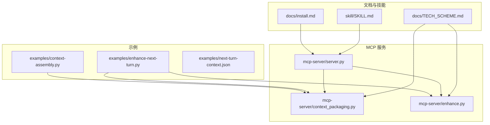
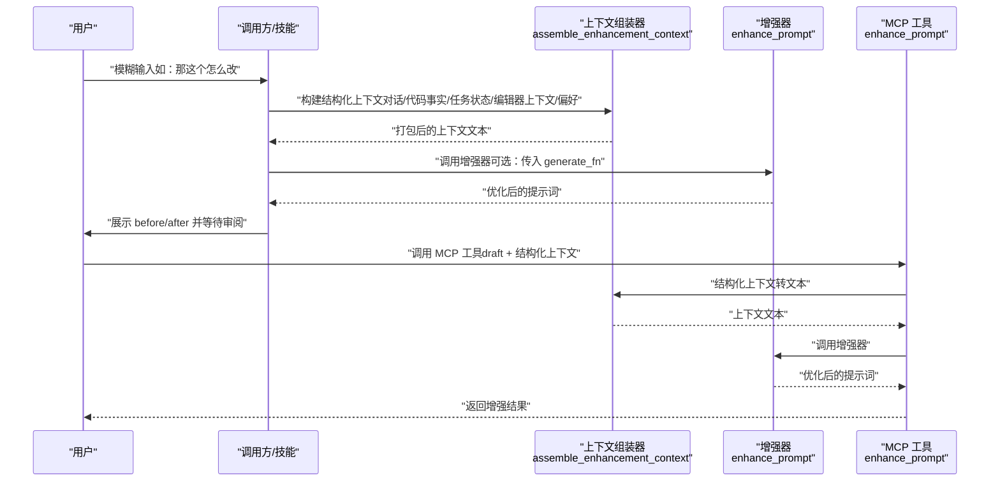
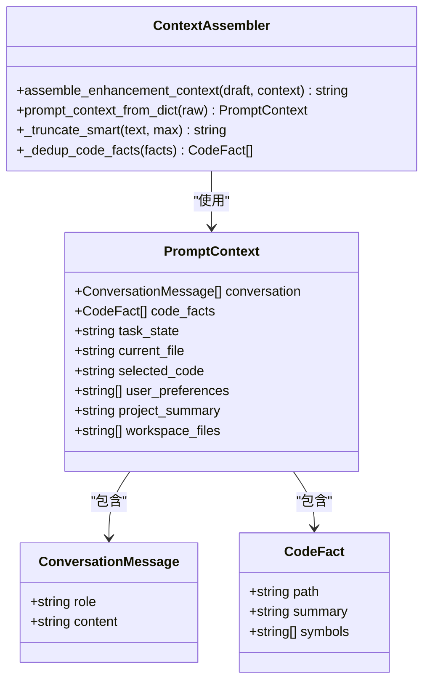
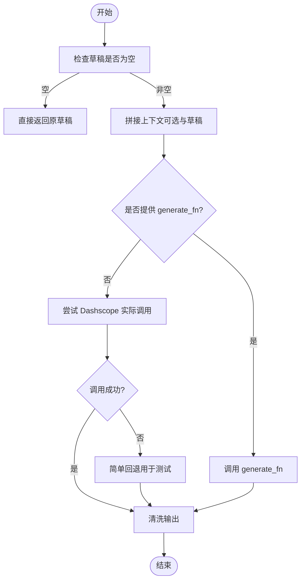
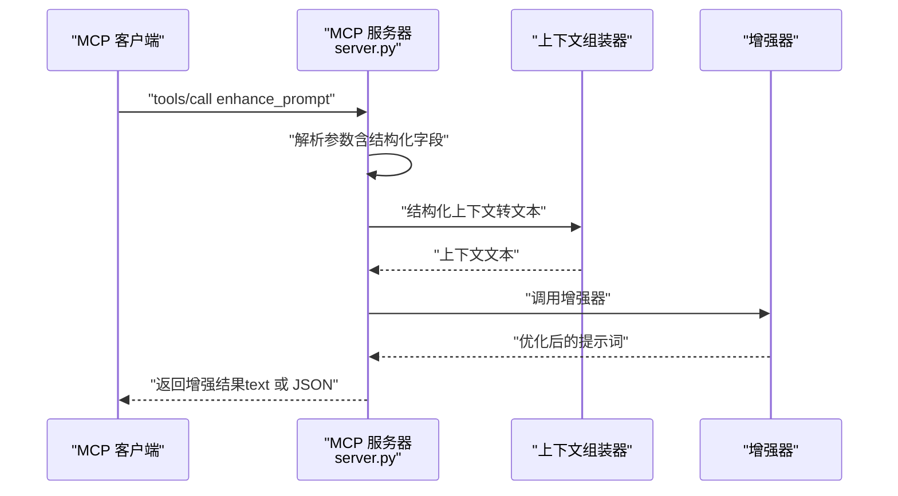
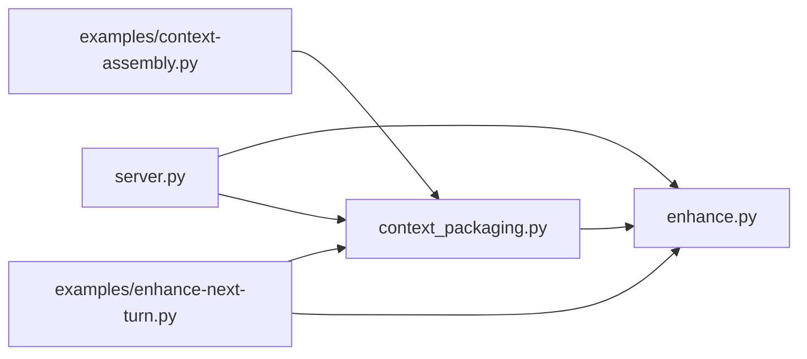

# 使用示例

<cite>
**本文引用的文件**
- [README.md](file://README.md)
- [docs/TECH_SCHEME.md](file://docs/TECH_SCHEME.md)
- [docs/install.md](file://docs/install.md)
- [skill/SKILL.md](file://skill/SKILL.md)
- [mcp-server/context_packaging.py](file://mcp-server/context_packaging.py)
- [mcp-server/enhance.py](file://mcp-server/enhance.py)
- [mcp-server/server.py](file://mcp-server/server.py)
- [examples/context-assembly.py](file://examples/context-assembly.py)
- [examples/enhance-next-turn.py](file://examples/enhance-next-turn.py)
- [examples/next-turn-context.json](file://examples/next-turn-context.json)
- [tests/test_context_packaging.py](file://tests/test_context_packaging.py)
- [tests/test_enhance.py](file://tests/test_enhance.py)
- [package.json](file://package.json)
</cite>

## 目录
1. [简介](#简介)
2. [项目结构](#项目结构)
3. [核心组件](#核心组件)
4. [架构总览](#架构总览)
5. [详细组件分析](#详细组件分析)
6. [依赖关系分析](#依赖关系分析)
7. [性能考量](#性能考量)
8. [故障排查指南](#故障排查指南)
9. [结论](#结论)
10. [附录](#附录)

## 简介
本文件面向使用者与集成者，提供 PromptCocoPilot 的完整使用示例与最佳实践，涵盖：
- 多维上下文组装：对话历史、代码事实、任务状态、编辑器上下文、用户偏好等
- 增强流程：从模糊输入到优化提示词的端到端操作
- 配置模板与 JSON 示例：MCP、技能、HTTP API 等
- 场景示例：连续编码对话、问题修复、功能开发等
- 自定义策略与参数：如何调整截断、预算、偏好等
- 调试与测试：验证增强效果与性能指标
- 最佳实践与性能优化建议

## 项目结构
- mcp-server：MCP 服务器与增强核心逻辑
- examples：示例脚本与 JSON 上下文
- tests：单元测试
- docs：技术方案与安装说明
- skill：Claude Code 技能定义
- qoder-ui：Qoder 相关前端与测试（与 MCP 服务配合）

图表来源
- [mcp-server/server.py:1-232](file://mcp-server/server.py#L1-L232)
- [mcp-server/context_packaging.py:1-211](file://mcp-server/context_packaging.py#L1-L211)
- [mcp-server/enhance.py:1-167](file://mcp-server/enhance.py#L1-L167)
- [examples/context-assembly.py:1-93](file://examples/context-assembly.py#L1-L93)
- [examples/enhance-next-turn.py:1-55](file://examples/enhance-next-turn.py#L1-L55)
- [examples/next-turn-context.json:1-33](file://examples/next-turn-context.json#L1-L33)
- [docs/TECH_SCHEME.md:1-166](file://docs/TECH_SCHEME.md#L1-L166)
- [docs/install.md:1-81](file://docs/install.md#L1-L81)
- [skill/SKILL.md:1-105](file://skill/SKILL.md#L1-L105)

章节来源
- [README.md:23-30](file://README.md#L23-L30)
- [docs/TECH_SCHEME.md:7-19](file://docs/TECH_SCHEME.md#L7-L19)

## 核心组件
- 上下文组装器：将对话历史、代码事实、任务状态、编辑器上下文、用户偏好等结构化为增强器可用的文本
- 增强器：根据严格系统指令对草稿提示词进行重写，保持语言一致性与可执行性
- MCP 服务器：注册工具、接收调用、返回增强结果；支持结构化输出
- 示例与测试：演示如何组装上下文、如何调用工具、如何验证行为

章节来源
- [mcp-server/context_packaging.py:20-33](file://mcp-server/context_packaging.py#L20-L33)
- [mcp-server/enhance.py:71-83](file://mcp-server/enhance.py#L71-L83)
- [mcp-server/server.py:49-80](file://mcp-server/server.py#L49-L80)
- [examples/context-assembly.py:63-93](file://examples/context-assembly.py#L63-L93)

## 架构总览
下图展示了“模糊输入 → 上下文组装 → 增强 → 审阅 → 发送”的完整流程，映射到实际代码文件。

图表来源
- [mcp-server/context_packaging.py:79-178](file://mcp-server/context_packaging.py#L79-L178)
- [mcp-server/enhance.py:90-148](file://mcp-server/enhance.py#L90-L148)
- [mcp-server/server.py:49-80](file://mcp-server/server.py#L49-L80)

## 详细组件分析

### 组件一：上下文组装器（PromptContext 与 assemble_enhancement_context）
- 数据结构
  - ConversationMessage：角色与内容
  - CodeFact：路径、摘要、符号集合
  - PromptContext：对话、代码事实、任务状态、当前文件、选中代码、用户偏好、项目概要、工作区文件
- 组装策略
  - 智能截断：保留首尾，避免丢失结论
  - 代码事实去重：按路径合并摘要与符号
  - 预算控制：整体上下文字符数上限，超限时逐步收紧消息长度
  - 可视化：分段标题与格式化输出，便于审阅

图表来源
- [mcp-server/context_packaging.py:7-33](file://mcp-server/context_packaging.py#L7-L33)
- [mcp-server/context_packaging.py:79-178](file://mcp-server/context_packaging.py#L79-L178)

章节来源
- [mcp-server/context_packaging.py:79-178](file://mcp-server/context_packaging.py#L79-L178)
- [mcp-server/context_packaging.py:181-211](file://mcp-server/context_packaging.py#L181-L211)

### 组件二：增强器（enhance_prompt 与增强指令）
- 严格指令：仅重写草稿，不回答、不执行、不解释
- 清洗输出：去除代码块与外层引号
- 生成函数：支持外部 generate_fn，生产环境默认使用 Dashscope 实际调用
- 兼容模式：支持字符串上下文与结构化上下文混合

图表来源
- [mcp-server/enhance.py:90-134](file://mcp-server/enhance.py#L90-L134)
- [mcp-server/enhance.py:150-159](file://mcp-server/enhance.py#L150-L159)

章节来源
- [mcp-server/enhance.py:71-83](file://mcp-server/enhance.py#L71-L83)
- [mcp-server/enhance.py:90-134](file://mcp-server/enhance.py#L90-L134)

### 组件三：MCP 工具（enhance_prompt）
- 注册工具：列出工具描述与输入模式
- 输入：draft、context、include_history、结构化上下文字段（conversation、code_facts、task_state、current_file、selected_code、user_preferences、project_summary、workspace_files、structured_output）
- 输出：纯文本或结构化 JSON（包含 original、enhanced、context_used）

图表来源
- [mcp-server/server.py:49-80](file://mcp-server/server.py#L49-L80)
- [mcp-server/server.py:108-195](file://mcp-server/server.py#L108-L195)
- [mcp-server/context_packaging.py:181-211](file://mcp-server/context_packaging.py#L181-L211)
- [mcp-server/enhance.py:90-134](file://mcp-server/enhance.py#L90-L134)

章节来源
- [mcp-server/server.py:49-80](file://mcp-server/server.py#L49-L80)
- [mcp-server/server.py:108-195](file://mcp-server/server.py#L108-L195)

### 组件四：示例与 JSON 配置
- 上下文组装示例：展示结构化与自由格式两种方式
- 下一轮提示增强示例：读取 JSON，组装上下文，可打印或调用增强器
- JSON 示例：包含 draft、conversation、code_facts、task_state、current_file、selected_code、user_preferences 等字段

章节来源
- [examples/context-assembly.py:25-93](file://examples/context-assembly.py#L25-L93)
- [examples/enhance-next-turn.py:21-55](file://examples/enhance-next-turn.py#L21-L55)
- [examples/next-turn-context.json:1-33](file://examples/next-turn-context.json#L1-L33)

## 依赖关系分析
- 上下文组装器依赖于数据类（ConversationMessage、CodeFact、PromptContext）与辅助函数（智能截断、去重、预算控制）
- 增强器依赖上下文组装器提供的文本，或直接使用 generate_fn
- MCP 服务器同时依赖上下文组装器与增强器，负责协议处理与工具注册

图表来源
- [mcp-server/context_packaging.py:79-178](file://mcp-server/context_packaging.py#L79-L178)
- [mcp-server/enhance.py:90-134](file://mcp-server/enhance.py#L90-L134)
- [mcp-server/server.py:49-80](file://mcp-server/server.py#L49-L80)
- [examples/context-assembly.py:16-21](file://examples/context-assembly.py#L16-L21)
- [examples/enhance-next-turn.py:17-18](file://examples/enhance-next-turn.py#L17-L18)

章节来源
- [mcp-server/context_packaging.py:79-178](file://mcp-server/context_packaging.py#L79-L178)
- [mcp-server/enhance.py:90-134](file://mcp-server/enhance.py#L90-L134)
- [mcp-server/server.py:49-80](file://mcp-server/server.py#L49-L80)

## 性能考量
- 上下文预算：默认约 6000 字符，超限自动收紧消息长度，避免超出小模型上下文窗口
- 智能截断：保留首尾，避免丢失结论
- 代码事实去重：减少重复信息，降低 token 消耗
- 增强器轻量化：仅做提示词重写，不执行任务，适合快速迭代
- 模型选择：生产环境建议使用小而快的模型以降低延迟与成本

章节来源
- [mcp-server/context_packaging.py:35-39](file://mcp-server/context_packaging.py#L35-L39)
- [mcp-server/context_packaging.py:164-177](file://mcp-server/context_packaging.py#L164-L177)
- [mcp-server/enhance.py:22-26](file://mcp-server/enhance.py#L22-L26)

## 故障排查指南
- MCP 未找到工具：确认 MCP 服务器已正确注册工具列表
- Dashscope API Key 缺失：增强器在无 Key 时使用简单回退，建议设置 DASHSCOPE_API_KEY 或 .env 文件
- 上下文过长：检查 max_messages、max_chars_per_message、context_budget 参数，必要时缩小范围
- 输出格式异常：确认增强器清洗逻辑（去除代码块与引号）是否生效
- 测试验证：使用单元测试覆盖增强前后行为与上下文组装逻辑

章节来源
- [mcp-server/server.py:108-195](file://mcp-server/server.py#L108-L195)
- [mcp-server/enhance.py:27-37](file://mcp-server/enhance.py#L27-L37)
- [tests/test_enhance.py:10-69](file://tests/test_enhance.py#L10-L69)
- [tests/test_context_packaging.py:19-160](file://tests/test_context_packaging.py#L19-L160)

## 结论
通过 PromptCocoPilot，您可以将“模糊输入”转化为“可审阅、可执行”的高质量提示词，显著提升连续编码对话中的效率与准确性。结合 MCP 工具与 Claude Code 技能，可实现自动化触发与透明审阅；通过结构化上下文与预算控制，兼顾性能与效果。

## 附录

### A. 使用场景示例（路径指引）
- 连续编码对话（下一轮增强）
  - 步骤：读取 JSON → 组装上下文 → 可选打印或调用增强器
  - 参考：[examples/enhance-next-turn.py:21-55](file://examples/enhance-next-turn.py#L21-L55)，[examples/next-turn-context.json:1-33](file://examples/next-turn-context.json#L1-L33)
- 问题修复（基于代码事实与任务状态）
  - 步骤：准备 conversation、code_facts、task_state、current_file、selected_code、user_preferences
  - 参考：[examples/context-assembly.py:63-93](file://examples/context-assembly.py#L63-L93)，[mcp-server/context_packaging.py:79-178](file://mcp-server/context_packaging.py#L79-L178)
- 功能开发（项目概要与工作区文件）
  - 步骤：提供 project_summary、workspace_files，增强器自动纳入上下文
  - 参考：[mcp-server/context_packaging.py:98-100](file://mcp-server/context_packaging.py#L98-L100)，[mcp-server/context_packaging.py:156-160](file://mcp-server/context_packaging.py#L156-L160)

章节来源
- [examples/enhance-next-turn.py:21-55](file://examples/enhance-next-turn.py#L21-L55)
- [examples/context-assembly.py:63-93](file://examples/context-assembly.py#L63-L93)
- [mcp-server/context_packaging.py:98-100](file://mcp-server/context_packaging.py#L98-L100)
- [mcp-server/context_packaging.py:156-160](file://mcp-server/context_packaging.py#L156-L160)

### B. 配置模板与 JSON 示例
- MCP 服务器配置（Claude Code）
  - 参考：[docs/install.md:13-25](file://docs/install.md#L13-L25)
- 技能配置（SKILL.md）
  - 参考：[skill/SKILL.md:18-39](file://skill/SKILL.md#L18-L39)
- 下一轮提示增强 JSON 示例
  - 参考：[examples/next-turn-context.json:1-33](file://examples/next-turn-context.json#L1-L33)
- HTTP API（Codex 风格“优化输入”按钮）
  - 参考：[docs/install.md:43-53](file://docs/install.md#L43-L53)

章节来源
- [docs/install.md:13-25](file://docs/install.md#L13-L25)
- [skill/SKILL.md:18-39](file://skill/SKILL.md#L18-L39)
- [examples/next-turn-context.json:1-33](file://examples/next-turn-context.json#L1-L33)
- [docs/install.md:43-53](file://docs/install.md#L43-L53)

### C. 自定义增强策略与参数
- 截断策略：max_messages、max_chars_per_message、max_selected_code_chars
- 预算控制：context_budget（默认约 6000 字符）
- 语言保留：增强器严格遵循草稿语言
- 行为约束：增强器仅重写，不回答、不执行、不解释
- 生成函数：可替换为任意 generate_fn，便于集成自有模型或路由策略

章节来源
- [mcp-server/context_packaging.py:82-87](file://mcp-server/context_packaging.py#L82-L87)
- [mcp-server/context_packaging.py:35-39](file://mcp-server/context_packaging.py#L35-L39)
- [mcp-server/enhance.py:71-83](file://mcp-server/enhance.py#L71-L83)
- [mcp-server/enhance.py:90-134](file://mcp-server/enhance.py#L90-L134)

### D. 调试与测试方法
- 单元测试
  - 上下文组装：智能截断、去重、预算控制、项目概要与工作区文件
  - 增强器：清洗输出、带上下文增强、指令严格性
  - 参考：[tests/test_context_packaging.py:19-160](file://tests/test_context_packaging.py#L19-L160)，[tests/test_enhance.py:10-69](file://tests/test_enhance.py#L10-L69)
- 示例运行
  - 打印上下文：[examples/enhance-next-turn.py:26-35](file://examples/enhance-next-turn.py#L26-L35)
  - 调用增强器：[examples/enhance-next-turn.py:32-35](file://examples/enhance-next-turn.py#L32-L35)
- MCP 服务器测试
  - 参考：[docs/install.md:37-41](file://docs/install.md#L37-L41)

章节来源
- [tests/test_context_packaging.py:19-160](file://tests/test_context_packaging.py#L19-L160)
- [tests/test_enhance.py:10-69](file://tests/test_enhance.py#L10-L69)
- [examples/enhance-next-turn.py:26-35](file://examples/enhance-next-turn.py#L26-L35)
- [docs/install.md:37-41](file://docs/install.md#L37-L41)

### E. 最佳实践与性能优化建议
- 自动触发：对短、模糊、不完整指令自动调用增强工具
- 保留上下文：优先传递 conversation、code_facts、task_state、current_file、selected_code、user_preferences
- 透明审阅：展示 before/after 与改动说明
- 控制预算：合理设置 max_messages、max_chars_per_message、context_budget
- 语言一致：确保增强输出与草稿语言一致
- 模型选择：生产环境使用小而快模型，降低延迟与成本

章节来源
- [skill/SKILL.md:41-56](file://skill/SKILL.md#L41-L56)
- [mcp-server/context_packaging.py:35-39](file://mcp-server/context_packaging.py#L35-L39)
- [mcp-server/enhance.py:71-83](file://mcp-server/enhance.py#L71-L83)