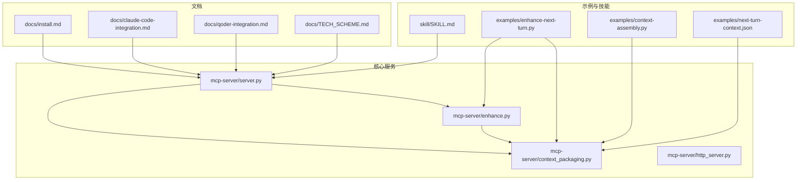
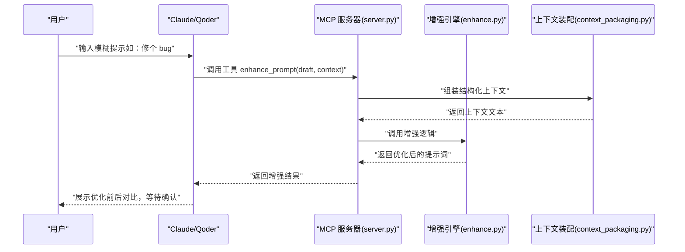
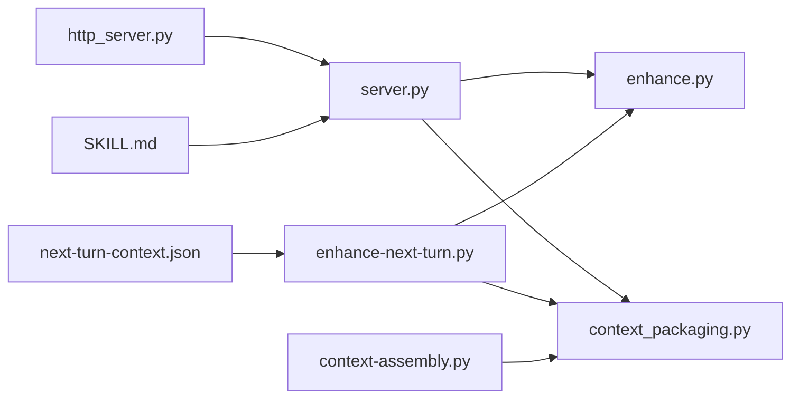

# 快速开始

<cite>
**本文引用的文件**
- [README.md](file://README.md)
- [docs/install.md](file://docs/install.md)
- [docs/claude-code-integration.md](file://docs/claude-code-integration.md)
- [docs/qoder-integration.md](file://docs/qoder-integration.md)
- [docs/TECH_SCHEME.md](file://docs/TECH_SCHEME.md)
- [mcp-server/server.py](file://mcp-server/server.py)
- [mcp-server/enhance.py](file://mcp-server/enhance.py)
- [mcp-server/context_packaging.py](file://mcp-server/context_packaging.py)
- [mcp-server/http_server.py](file://mcp-server/http_server.py)
- [examples/enhance-next-turn.py](file://examples/enhance-next-turn.py)
- [examples/context-assembly.py](file://examples/context-assembly.py)
- [examples/next-turn-context.json](file://examples/next-turn-context.json)
- [skill/SKILL.md](file://skill/SKILL.md)
- [package.json](file://package.json)
</cite>

## 目录
1. [简介](#简介)
2. [项目结构](#项目结构)
3. [核心组件](#核心组件)
4. [架构总览](#架构总览)
5. [详细组件解析](#详细组件解析)
6. [依赖关系分析](#依赖关系分析)
7. [性能与稳定性建议](#性能与稳定性建议)
8. [故障排查](#故障排查)
9. [结论](#结论)
10. [附录](#附录)

## 简介
本指南面向首次接触 PromptCocoPilot 的用户，目标是在 10 分钟内完成安装与基础验证，体验从“模糊输入”到“优化提示”的完整流程。你将学会：
- 安装与启动 MCP 服务器
- 在 Claude Code 与 Qoder 中配置与验证
- 使用第一个示例，从模糊输入逐步获得优化后的提示词
- 了解不同集成方式的取舍与适用场景

## 项目结构
仓库采用“技能 + MCP 服务器 + 示例 + 文档”的分层组织，便于按需集成与扩展。

图表来源
- [docs/install.md:1-81](file://docs/install.md#L1-L81)
- [docs/claude-code-integration.md:1-200](file://docs/claude-code-integration.md#L1-L200)
- [docs/qoder-integration.md:1-101](file://docs/qoder-integration.md#L1-L101)
- [docs/TECH_SCHEME.md:1-166](file://docs/TECH_SCHEME.md#L1-L166)
- [mcp-server/server.py:1-232](file://mcp-server/server.py#L1-L232)
- [mcp-server/enhance.py:1-167](file://mcp-server/enhance.py#L1-L167)
- [mcp-server/context_packaging.py:1-211](file://mcp-server/context_packaging.py#L1-L211)
- [mcp-server/http_server.py:1-101](file://mcp-server/http_server.py#L1-L101)
- [examples/enhance-next-turn.py:1-55](file://examples/enhance-next-turn.py#L1-L55)
- [examples/context-assembly.py:1-93](file://examples/context-assembly.py#L1-L93)
- [examples/next-turn-context.json:1-33](file://examples/next-turn-context.json#L1-L33)
- [skill/SKILL.md:1-105](file://skill/SKILL.md#L1-L105)

章节来源
- [README.md:23-29](file://README.md#L23-L29)
- [docs/TECH_SCHEME.md:7-72](file://docs/TECH_SCHEME.md#L7-L72)

## 核心组件
- MCP 服务器：暴露增强工具，支持结构化上下文与 JSON 输出；内置真实 LLM 调用能力（默认使用 Dashscope/DeepSeek）。
- 增强逻辑：严格遵循“只改写不执行”的原则，输出干净、可直接发送的提示词。
- 上下文装配：将对话历史、代码事实、任务状态、编辑器上下文、用户偏好等整合为紧凑文本，支持预算控制与智能截断。
- 示例与技能：提供从模糊输入到优化提示的端到端演示，以及 Claude Code 的 Skill 指引。

章节来源
- [mcp-server/server.py:49-80](file://mcp-server/server.py#L49-L80)
- [mcp-server/enhance.py:90-134](file://mcp-server/enhance.py#L90-L134)
- [mcp-server/context_packaging.py:79-178](file://mcp-server/context_packaging.py#L79-L178)
- [skill/SKILL.md:10-56](file://skill/SKILL.md#L10-L56)

## 架构总览
PromptCocoPilot 的核心是“轻量改写器 + 结构化上下文 + MCP 工具”。其典型交互流程如下：

图表来源
- [mcp-server/server.py:49-80](file://mcp-server/server.py#L49-L80)
- [mcp-server/enhance.py:90-134](file://mcp-server/enhance.py#L90-L134)
- [mcp-server/context_packaging.py:79-178](file://mcp-server/context_packaging.py#L79-L178)

## 详细组件解析

### MCP 服务器（启动与配置）
- 启动方式
  - 标准 MCP 服务器：直接运行脚本，等待 stdio JSON-RPC 请求。
  - HTTP API（用于 Codex 风格“优化输入”按钮）：启动本地 HTTP 服务，监听指定主机与端口。
- 关键配置项
  - MCP 命令与参数：指向 server.py 绝对路径。
  - 环境变量：可传入 DASHSCOPE_API_KEY 以启用真实 LLM 增强。
  - 结构化输出：可通过参数开启，返回包含原始提示、优化提示与是否使用上下文的 JSON。
- 验证方法
  - 在 Claude/Qoder 中列出可用工具，确认工具存在。
  - 手动调用工具，观察输出是否包含优化后的提示词。

章节来源
- [docs/install.md:37-56](file://docs/install.md#L37-L56)
- [docs/claude-code-integration.md:43-67](file://docs/claude-code-integration.md#L43-L67)
- [mcp-server/server.py:82-232](file://mcp-server/server.py#L82-L232)
- [mcp-server/http_server.py:86-101](file://mcp-server/http_server.py#L86-L101)

### 增强逻辑（只改写不执行）
- 输入规范
  - draft：用户原始提示词。
  - context：可选的自由文本上下文；也可传入结构化字段（conversation、code_facts、task_state、current_file、selected_code、user_preferences 等）。
- 行为特征
  - 严格遵循系统指令，不回答、不执行、不讨论。
  - 输出清理：去除代码块、引号等多余标记，保证可直接粘贴发送。
  - 失败回退：无 API Key 时使用简单回退逻辑，便于测试。
- 实际调用
  - 默认使用 Dashscope/DeepSeek 进行高质量改写；可通过环境变量或自定义 generate_fn 控制。

章节来源
- [mcp-server/enhance.py:71-134](file://mcp-server/enhance.py#L71-L134)
- [mcp-server/enhance.py:150-159](file://mcp-server/enhance.py#L150-L159)

### 上下文装配（结构化打包）
- 数据模型
  - PromptContext：承载 conversation、code_facts、task_state、current_file、selected_code、user_preferences、project_summary、workspace_files。
  - CodeFact：记录文件路径、摘要与符号集合。
- 打包策略
  - 智能截断：保留首尾，避免长对话结论丢失。
  - 去重合并：相同文件的 code_facts 合并，去重符号。
  - 总预算控制：限制上下文总字符数，优先保留关键信息。
- 使用建议
  - 优先使用结构化字段，便于工具与客户端自动收集与呈现。
  - 若无法结构化，可使用 free-form 形式作为回退。

章节来源
- [mcp-server/context_packaging.py:7-33](file://mcp-server/context_packaging.py#L7-L33)
- [mcp-server/context_packaging.py:79-178](file://mcp-server/context_packaging.py#L79-L178)
- [examples/context-assembly.py:25-61](file://examples/context-assembly.py#L25-L61)

### 示例：从模糊输入到优化提示
- 场景目标
  - 以“那这个怎么改”为例，结合历史对话、代码事实、当前文件与用户偏好，生成可直接发送的优化提示。
- 执行步骤
  - 解析示例 JSON，组装上下文。
  - 可选打印上下文，或直接调用增强工具。
- 命令参考
  - 打印上下文：[examples/enhance-next-turn.py:5](file://examples/enhance-next-turn.py#L5)
  - 调用增强：[examples/enhance-next-turn.py:34-35](file://examples/enhance-next-turn.py#L34-L35)

章节来源
- [examples/enhance-next-turn.py:1-55](file://examples/enhance-next-turn.py#L1-L55)
- [examples/next-turn-context.json:1-33](file://examples/next-turn-context.json#L1-L33)

### 技能（Skill）与最佳实践
- 自动触发：对模糊输入（如“fix bug”“add feature”）自动调用增强工具。
- 上下文组装：默认包含最近 8-12 条消息；优先传递已读代码事实、任务状态、当前文件与选区。
- 透明审阅：必须展示 before/after 与改动说明，供用户审阅后再发送。
- 不执行原提示：永远先增强再行动。

章节来源
- [skill/SKILL.md:41-56](file://skill/SKILL.md#L41-L56)
- [docs/TECH_SCHEME.md:73-83](file://docs/TECH_SCHEME.md#L73-L83)

## 依赖关系分析

图表来源
- [mcp-server/server.py:35-41](file://mcp-server/server.py#L35-L41)
- [mcp-server/enhance.py:17-21](file://mcp-server/enhance.py#L17-L21)
- [mcp-server/context_packaging.py:1-21](file://mcp-server/context_packaging.py#L1-L21)
- [mcp-server/http_server.py:13-17](file://mcp-server/http_server.py#L13-L17)
- [examples/enhance-next-turn.py:14-18](file://examples/enhance-next-turn.py#L14-L18)
- [examples/context-assembly.py:13-22](file://examples/context-assembly.py#L13-L22)
- [examples/next-turn-context.json:1-33](file://examples/next-turn-context.json#L1-L33)
- [skill/SKILL.md:1-105](file://skill/SKILL.md#L1-L105)

## 性能与稳定性建议
- 使用真实 LLM 增强：在 MCP 配置中设置 DASHSCOPE_API_KEY，以获得高质量改写；否则将使用简单回退逻辑。
- 控制上下文大小：通过智能截断与预算控制，避免超出小模型上下文窗口。
- 低延迟模型：MCP 服务器内部使用快速模型进行增强，减少主会话开销。
- 结构化输出：开启 structured_output 可获得更丰富的元信息，便于前端展示与调试。

章节来源
- [docs/claude-code-integration.md:145-162](file://docs/claude-code-integration.md#L145-L162)
- [mcp-server/context_packaging.py:35-39](file://mcp-server/context_packaging.py#L35-L39)
- [mcp-server/server.py:185-188](file://mcp-server/server.py#L185-L188)

## 故障排查
- 工具未显示
  - 检查 MCP 配置文件路径与命令是否正确，确保 python3 可用。
  - 在终端手动运行 MCP 服务器，观察是否有报错。
- 增强效果一般
  - 当前可能走回退逻辑。请配置 DASHSCOPE_API_KEY 后重启客户端。
- Codex 风格“优化输入”按钮
  - 启动本地 HTTP 服务，确保端口未被占用；客户端按钮向 /enhance 发起 POST 请求，接收 {draft, enhanced}。
- Qoder 集成
  - 在 ~/.qoder/mcp.json 中添加 MCP 服务器条目，重启 Qoder 后在工具列表中查找 enhance_prompt。

章节来源
- [docs/claude-code-integration.md:180-191](file://docs/claude-code-integration.md#L180-L191)
- [docs/install.md:35-56](file://docs/install.md#L35-L56)
- [mcp-server/http_server.py:47-67](file://mcp-server/http_server.py#L47-L67)
- [docs/qoder-integration.md:15-41](file://docs/qoder-integration.md#L15-L41)

## 结论
通过本指南，你已掌握 PromptCocoPilot 的安装、配置与首个使用示例。建议：
- 优先在 Claude Code 中使用 Skill + MCP 的组合，体验自动触发与透明审阅。
- 在 Qoder 中直接调用 MCP 工具，或等待未来插件提供“✨ 按钮”体验。
- 配置真实 LLM 增强，以获得更贴近 Kilo Code 的改写质量。

## 附录

### 安装与启动（Claude Code）
- 步骤概览
  - 启动 MCP 服务器
  - 在 Claude 配置中添加 MCP 服务器条目（包含绝对路径与环境变量）
  - 重启 Claude Code
  - 在聊天中输入模糊提示，观察自动增强效果
- 参考命令
  - 启动 MCP 服务器：[docs/install.md:37-41](file://docs/install.md#L37-L41)
  - 启动本地 HTTP API（Codex 风格按钮）：[docs/install.md:43-53](file://docs/install.md#L43-L53)
- 配置模板
  - MCP 服务器配置（Claude）：[docs/install.md:13-25](file://docs/install.md#L13-L25)
  - MCP 服务器配置（Qoder）：[docs/qoder-integration.md:18-31](file://docs/qoder-integration.md#L18-L31)

章节来源
- [docs/install.md:37-56](file://docs/install.md#L37-L56)
- [docs/claude-code-integration.md:29-67](file://docs/claude-code-integration.md#L29-L67)
- [docs/qoder-integration.md:15-41](file://docs/qoder-integration.md#L15-L41)

### 第一个使用示例：从模糊输入到优化提示
- 示例 JSON
  - [examples/next-turn-context.json:1-33](file://examples/next-turn-context.json#L1-L33)
- 打印上下文
  - [examples/enhance-next-turn.py:26-35](file://examples/enhance-next-turn.py#L26-L35)
- 调用增强
  - [examples/enhance-next-turn.py:32-35](file://examples/enhance-next-turn.py#L32-L35)
- 上下文装配 API
  - [examples/context-assembly.py:63-93](file://examples/context-assembly.py#L63-L93)

章节来源
- [examples/enhance-next-turn.py:1-55](file://examples/enhance-next-turn.py#L1-L55)
- [examples/context-assembly.py:1-93](file://examples/context-assembly.py#L1-L93)
- [examples/next-turn-context.json:1-33](file://examples/next-turn-context.json#L1-L33)

### 集成方式选择建议
- Claude Code
  - 推荐：Skill + MCP 工具。自动触发、透明审阅、结构化上下文传递。
  - 参考：[docs/claude-code-integration.md:100-142](file://docs/claude-code-integration.md#L100-L142)
- Qoder
  - 推荐：MCP 工具直连。适合任务/Quest 模式下的上下文增强。
  - 参考：[docs/qoder-integration.md:42-58](file://docs/qoder-integration.md#L42-L58)
- Codex（桌面客户端）
  - 推荐：本地 HTTP API + 按钮。按钮向 /enhance 发起请求，返回 {draft, enhanced}。
  - 参考：[docs/install.md:43-53](file://docs/install.md#L43-L53)

章节来源
- [docs/claude-code-integration.md:100-142](file://docs/claude-code-integration.md#L100-L142)
- [docs/qoder-integration.md:42-58](file://docs/qoder-integration.md#L42-L58)
- [docs/install.md:43-53](file://docs/install.md#L43-L53)