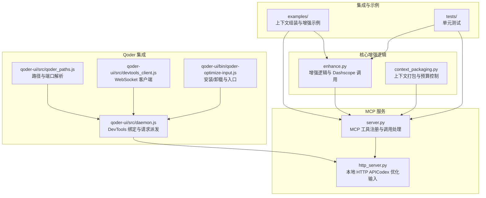
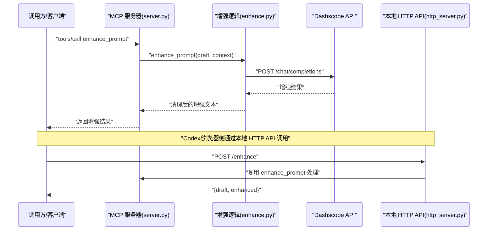
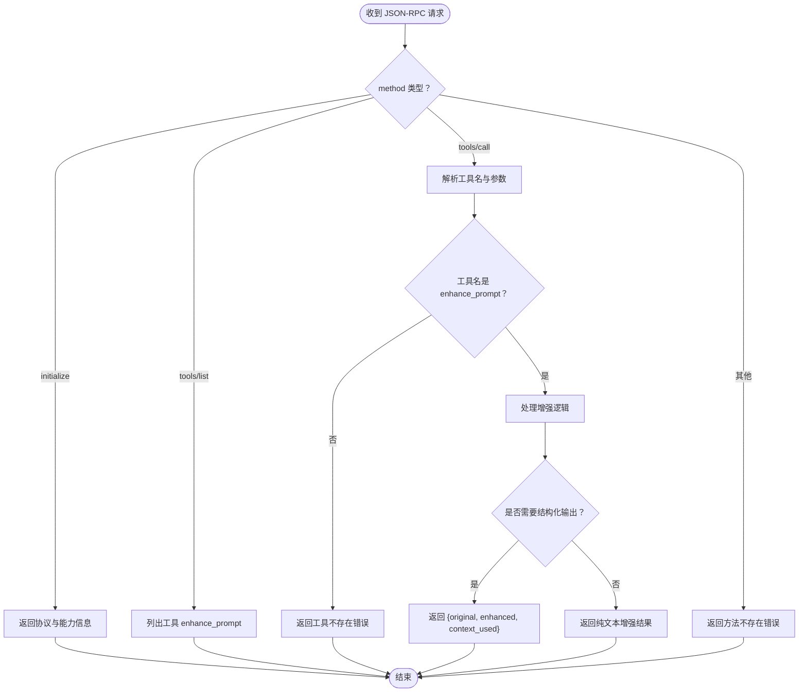
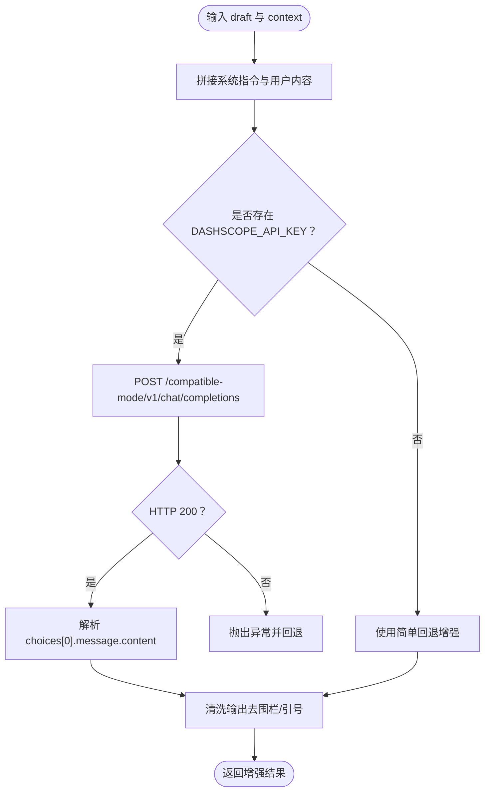
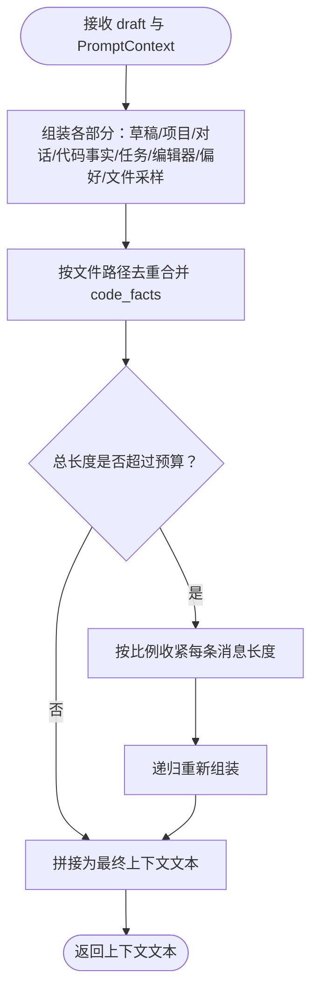
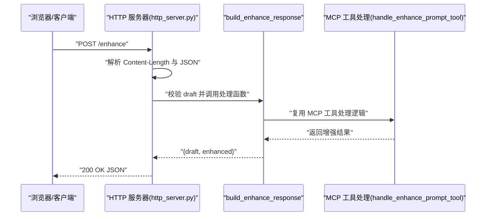
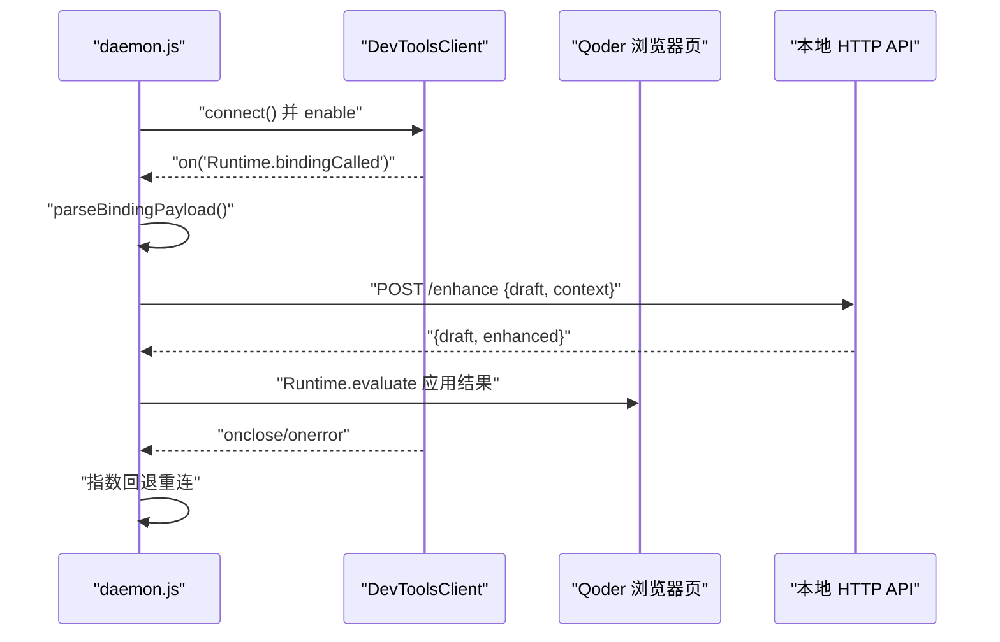
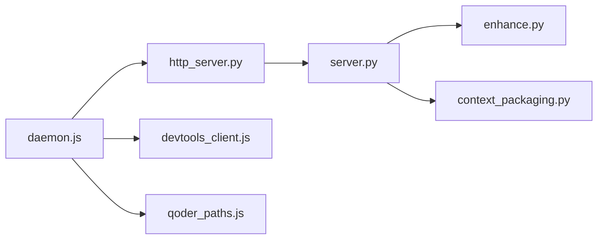

# 故障排除

<cite>
**本文引用的文件**
- [README.md](file://README.md)
- [docs/install.md](file://docs/install.md)
- [docs/TECH_SCHEME.md](file://docs/TECH_SCHEME.md)
- [package.json](file://package.json)
- [mcp-server/server.py](file://mcp-server/server.py)
- [mcp-server/http_server.py](file://mcp-server/http_server.py)
- [mcp-server/enhance.py](file://mcp-server/enhance.py)
- [mcp-server/context_packaging.py](file://mcp-server/context_packaging.py)
- [examples/enhance-next-turn.py](file://examples/enhance-next-turn.py)
- [tests/test_enhance.py](file://tests/test_enhance.py)
- [tests/test_server_tool.py](file://tests/test_server_tool.py)
- [qoder-ui/src/daemon.js](file://qoder-ui/src/daemon.js)
- [qoder-ui/src/devtools_client.js](file://qoder-ui/src/devtools_client.js)
- [qoder-ui/src/qoder_paths.js](file://qoder-ui/src/qoder_paths.js)
- [qoder-ui/bin/qoder-optimize-input.js](file://qoder-ui/bin/qoder-optimize-input.js)
</cite>

## 目录
1. [简介](#简介)
2. [项目结构](#项目结构)
3. [核心组件](#核心组件)
4. [架构总览](#架构总览)
5. [详细组件分析](#详细组件分析)
6. [依赖关系分析](#依赖关系分析)
7. [性能考虑](#性能考虑)
8. [故障排除指南](#故障排除指南)
9. [结论](#结论)
10. [附录](#附录)

## 简介
本指南面向使用 PromptCocoPilot 的用户与集成开发者，聚焦于安装、配置、运行与排错。内容覆盖：
- MCP 服务器与本地 HTTP API 的启动与连接
- API 密钥配置（Dashscope）与网络访问
- 常见问题诊断流程与日志分析要点
- 性能问题定位与优化建议
- 如何收集与提交问题报告
- 社区支持与预防性维护建议

## 项目结构
项目采用分层组织：核心增强逻辑位于 mcp-server，提供 MCP 工具与本地 HTTP API；qoder-ui 提供与 Qoder 的集成；examples 与 tests 辅助验证与演示。

图表来源
- [mcp-server/server.py:1-232](file://mcp-server/server.py#L1-L232)
- [mcp-server/http_server.py:1-101](file://mcp-server/http_server.py#L1-L101)
- [mcp-server/enhance.py:1-167](file://mcp-server/enhance.py#L1-L167)
- [mcp-server/context_packaging.py:1-211](file://mcp-server/context_packaging.py#L1-L211)
- [qoder-ui/src/daemon.js:1-165](file://qoder-ui/src/daemon.js#L1-L165)
- [qoder-ui/src/qoder_paths.js:1-20](file://qoder-ui/src/qoder_paths.js#L1-L20)
- [qoder-ui/src/devtools_client.js:1-46](file://qoder-ui/src/devtools_client.js#L1-L46)
- [qoder-ui/bin/qoder-optimize-input.js:1-28](file://qoder-ui/bin/qoder-optimize-input.js#L1-L28)
- [examples/enhance-next-turn.py:1-55](file://examples/enhance-next-turn.py#L1-L55)
- [tests/test_enhance.py:1-69](file://tests/test_enhance.py#L1-L69)
- [tests/test_server_tool.py:1-48](file://tests/test_server_tool.py#L1-L48)

章节来源
- [README.md:23-29](file://README.md#L23-L29)
- [docs/TECH_SCHEME.md:7-166](file://docs/TECH_SCHEME.md#L7-L166)

## 核心组件
- 增强逻辑与模型调用：负责将草稿提示词重写为更清晰、具体、可执行的版本，支持真实 Dashscope 调用与回退策略。
- 上下文打包：将对话历史、代码事实、任务状态、编辑器上下文、用户偏好等结构化数据智能拼接，并进行预算裁剪与去重。
- MCP 服务器：以 stdio JSON-RPC 兼容方式暴露 enhance_prompt 工具，支持结构化参数与输出。
- 本地 HTTP API：为 Codex/浏览器侧提供 /enhance 端点，用于“优化输入”按钮。
- Qoder 集成：通过 DevTools 连接与绑定，监听前端优化请求并转发至本地 HTTP API。
- 示例与测试：提供上下文组装与增强流程示例，以及核心逻辑与工具处理的单元测试。

章节来源
- [mcp-server/enhance.py:1-167](file://mcp-server/enhance.py#L1-L167)
- [mcp-server/context_packaging.py:1-211](file://mcp-server/context_packaging.py#L1-L211)
- [mcp-server/server.py:1-232](file://mcp-server/server.py#L1-L232)
- [mcp-server/http_server.py:1-101](file://mcp-server/http_server.py#L1-L101)
- [qoder-ui/src/daemon.js:1-165](file://qoder-ui/src/daemon.js#L1-L165)
- [examples/enhance-next-turn.py:1-55](file://examples/enhance-next-turn.py#L1-L55)
- [tests/test_enhance.py:1-69](file://tests/test_enhance.py#L1-L69)
- [tests/test_server_tool.py:1-48](file://tests/test_server_tool.py#L1-L48)

## 架构总览
下图展示了从调用方到增强器再到模型的真实调用链路与本地 HTTP API 的桥接。

图表来源
- [mcp-server/server.py:49-80](file://mcp-server/server.py#L49-L80)
- [mcp-server/enhance.py:41-68](file://mcp-server/enhance.py#L41-L68)
- [mcp-server/http_server.py:22-36](file://mcp-server/http_server.py#L22-L36)

## 详细组件分析

### MCP 服务器（server.py）
- 工具注册与调用：支持 tools/list 与 tools/call，注册 enhance_prompt 工具，输入支持 draft、context、结构化上下文字段与布尔开关。
- 结构化上下文处理：当存在 conversation、code_facts、task_state、current_file、selected_code、user_preferences、project_summary、workspace_files 等键时，自动打包上下文并注入增强。
- 输出格式：默认返回纯文本增强结果；当开启 structured_output 时返回 JSON，包含 original、enhanced、context_used。
- 错误处理：对未知方法与工具返回标准 JSON-RPC 错误码；初始化阶段返回协议版本与服务器信息。

图表来源
- [mcp-server/server.py:82-229](file://mcp-server/server.py#L82-L229)

章节来源
- [mcp-server/server.py:49-80](file://mcp-server/server.py#L49-L80)
- [mcp-server/server.py:108-195](file://mcp-server/server.py#L108-L195)
- [mcp-server/server.py:196-229](file://mcp-server/server.py#L196-L229)

### 增强逻辑与 Dashscope 调用（enhance.py）
- 关键点：
  - 严格系统指令（INSTRUCTION）确保仅重写提示词，不回答或执行。
  - 支持真实 Dashscope 调用，自动加载 DASHSCOPE_API_KEY，或从特定路径读取。
  - 调用失败时回退到简单增强逻辑，保证开发与测试可用。
  - 清洗输出（去除代码围栏与外层引号）。
- 常见错误：
  - 未设置 DASHSCOPE_API_KEY 或密钥无效导致 401/鉴权失败。
  - Dashscope 返回非 200 状态码，抛出异常并触发回退。

图表来源
- [mcp-server/enhance.py:90-133](file://mcp-server/enhance.py#L90-L133)
- [mcp-server/enhance.py:27-68](file://mcp-server/enhance.py#L27-L68)

章节来源
- [mcp-server/enhance.py:27-68](file://mcp-server/enhance.py#L27-L68)
- [mcp-server/enhance.py:90-133](file://mcp-server/enhance.py#L90-L133)

### 上下文打包与预算控制（context_packaging.py）
- 数据模型：PromptContext、ConversationMessage、CodeFact。
- 打包策略：
  - 智能截断（头+尾），避免长回复结论丢失。
  - 同文件多条 code_facts 合并去重。
  - 项目摘要与工作区文件列表补充上下文。
  - 总上下文预算限制，超限时逐步收紧每条消息长度。
- 关键参数：消息数量上限、单条最大字符、选区最大字符、上下文预算。

图表来源
- [mcp-server/context_packaging.py:79-178](file://mcp-server/context_packaging.py#L79-L178)

章节来源
- [mcp-server/context_packaging.py:79-178](file://mcp-server/context_packaging.py#L79-L178)

### 本地 HTTP API（http_server.py）
- 提供 /enhance 端点，支持跨域 OPTIONS/POST。
- 参数校验：要求 draft 存在且非空；JSON 解析失败返回 400。
- 异常处理：捕获业务异常与通用异常，返回 500。
- 与 MCP 服务器共享处理函数，保持行为一致。

图表来源
- [mcp-server/http_server.py:22-66](file://mcp-server/http_server.py#L22-L66)
- [mcp-server/http_server.py:86-96](file://mcp-server/http_server.py#L86-L96)

章节来源
- [mcp-server/http_server.py:22-66](file://mcp-server/http_server.py#L22-L66)
- [mcp-server/http_server.py:86-96](file://mcp-server/http_server.py#L86-L96)

### Qoder 集成（daemon.js 与相关模块）
- DevTools 连接：读取 Qoder DevToolsActivePort，查找 agents 窗口或工作台页面目标，建立 WebSocket 连接。
- 绑定与观察：注入脚本，监听 Runtime.bindingCalled，解析绑定负载，过滤非目标绑定。
- 请求派发：轮询窗口中的待处理请求，向本地 HTTP API 发送 POST，应用结果或回填错误。
- 日志与重连：连接关闭/错误时记录日志并指数回退重连。

图表来源
- [qoder-ui/src/daemon.js:44-164](file://qoder-ui/src/daemon.js#L44-L164)
- [qoder-ui/src/devtools_client.js:1-46](file://qoder-ui/src/devtools_client.js#L1-L46)
- [qoder-ui/src/qoder_paths.js:1-20](file://qoder-ui/src/qoder_paths.js#L1-L20)

章节来源
- [qoder-ui/src/daemon.js:44-164](file://qoder-ui/src/daemon.js#L44-L164)
- [qoder-ui/src/devtools_client.js:1-46](file://qoder-ui/src/devtools_client.js#L1-L46)
- [qoder-ui/src/qoder_paths.js:1-20](file://qoder-ui/src/qoder_paths.js#L1-L20)

## 依赖关系分析
- 组件内聚与耦合：
  - server.py 与 enhance.py、context_packaging.py 低耦合，通过函数调用解耦。
  - http_server.py 与 server.py 共享处理函数，保持行为一致性。
  - qoder-ui 通过本地 HTTP API 与 MCP 服务器解耦，便于替换或扩展。
- 外部依赖：
  - Dashscope API（HTTPS）：认证与网络可达性。
  - DevTools 端口与目标页面：Qoder 运行时环境。
  - Python/Node 生态：依赖 requests、http.server、WebSocket 等。

图表来源
- [mcp-server/server.py:35-40](file://mcp-server/server.py#L35-L40)
- [mcp-server/http_server.py:13-16](file://mcp-server/http_server.py#L13-L16)
- [qoder-ui/src/daemon.js:1-6](file://qoder-ui/src/daemon.js#L1-L6)

章节来源
- [mcp-server/server.py:35-40](file://mcp-server/server.py#L35-L40)
- [mcp-server/http_server.py:13-16](file://mcp-server/http_server.py#L13-L16)
- [qoder-ui/src/daemon.js:1-6](file://qoder-ui/src/daemon.js#L1-L6)

## 性能考虑
- 上下文预算控制：通过 DEFAULT_CONTEXT_BUDGET 与智能截断，避免超出小模型上下文窗口，减少超时与失败。
- 模型选择：生产环境建议使用轻量模型（如 deepseek-v4-flash），降低延迟与成本。
- 网络超时与重试：Dashscope 调用设置合理超时，失败时回退增强保证可用性。
- Qoder 轮询频率：daemon.js 默认 500ms 轮询，连接断开时指数回退，避免频繁重试造成压力。
- 建议指标：
  - 响应时间：MCP 工具调用与 HTTP API 延迟
  - 上下文长度：实际拼接后的字符数
  - 错误率：Dashscope 非 200 比例、HTTP 5xx 比例
  - 回退命中：增强逻辑触发回退次数占比

[本节为通用性能指导，无需特定文件引用]

## 故障排除指南

### 一、安装与环境准备
- 环境要求
  - Python 3.10+，建议使用虚拟环境隔离依赖。
  - 安装 MCP 协议支持（可选，官方 SDK 更完整）。
- 安装步骤
  - 复制/链接 mcp-server 目录到可执行位置。
  - 配置 Claude Code / Desktop 的 claude_desktop_config.json，指向 server.py 的绝对路径。
  - 在 Qoder 中配置 ~/.qoder/mcp.json，添加 prompt-enhancer 服务器项。
- 常见问题
  - 路径错误：配置文件中命令或参数路径不正确，导致无法启动 MCP 服务器。
  - 权限不足：脚本或目录权限导致无法读取或执行。
  - Python 版本过低：运行时报语法或库兼容性错误。

章节来源
- [docs/install.md:3-27](file://docs/install.md#L3-L27)
- [README.md:67-76](file://README.md#L67-L76)
- [package.json:1-13](file://package.json#L1-L13)

### 二、MCP 服务器启动与连接失败
- 现象
  - Claude Code/Qoder 无法发现工具或报“工具不存在”。
  - 控制台打印“方法不存在”或“工具未找到”。
- 诊断步骤
  - 手动启动 server.py，检查初始化响应与工具列表。
  - 确认客户端已重启，MCP 配置已生效。
  - 检查 server.py 的 tools/list 与 tools/call 分支是否被正确调用。
- 关键日志
  - initialize 成功返回协议版本与能力。
  - tools/list 返回工具定义与输入模式。
  - tools/call 未匹配工具名时返回 -32601 错误。

章节来源
- [mcp-server/server.py:82-107](file://mcp-server/server.py#L82-L107)
- [mcp-server/server.py:108-195](file://mcp-server/server.py#L108-L195)
- [mcp-server/server.py:196-229](file://mcp-server/server.py#L196-L229)

### 三、API 密钥配置与网络连接问题
- 现象
  - Dashscope 调用返回鉴权失败或 401。
  - 增强逻辑触发回退，输出质量下降。
- 诊断步骤
  - 确认 DASHSCOPE_API_KEY 环境变量已设置。
  - 若未设置，确认 /Users/wy770/Resume-Agent/.env 是否存在且包含密钥。
  - 检查网络代理与防火墙是否允许访问 dashscope.aliyuncs.com。
- 关键日志
  - “DASHSCOPE_API_KEY not found”错误提示。
  - Dashscope 返回非 200 时的错误信息与状态码。
- 解决方案
  - 设置环境变量或在指定 .env 文件中写入密钥。
  - 使用直连网络或配置合规代理。
  - 切换到支持的模型名称（如 qwen-plus）并确认配额充足。

章节来源
- [mcp-server/enhance.py:27-44](file://mcp-server/enhance.py#L27-L44)
- [mcp-server/enhance.py:41-68](file://mcp-server/enhance.py#L41-L68)

### 四、本地 HTTP API（Codex/浏览器）连接失败
- 现象
  - 浏览器侧“优化输入”按钮点击无响应或报 404/400/500。
- 诊断步骤
  - 启动 http_server.py，确认监听地址与端口。
  - 检查 /enhance 路由与 CORS 头设置。
  - 使用 curl 或浏览器开发者工具验证请求体与响应。
- 关键日志
  - “draft is required”表示缺少必填字段。
  - “invalid_json”表示请求体不是合法 JSON。
  - 通用异常被捕获并返回 500。
- 解决方案
  - 确保请求体包含 draft 字段。
  - 修正 JSON 格式或 Content-Type。
  - 修复后端异常（如 Dashscope 调用失败）。

章节来源
- [mcp-server/http_server.py:22-66](file://mcp-server/http_server.py#L22-L66)
- [mcp-server/http_server.py:86-96](file://mcp-server/http_server.py#L86-L96)

### 五、Qoder 集成问题
- 现象
  - 无法看到“优化输入”按钮或点击无响应。
  - 控制台出现“attach failed”“DevTools target not found”等错误。
- 诊断步骤
  - 确认 Qoder DevToolsActivePort 文件存在且端口为正整数。
  - 检查 agents 窗口或工作台页面目标是否可被识别。
  - 查看 daemon.js 的轮询与重连日志。
- 关键日志
  - “Qoder agents window DevTools target was not found”
  - “DevTools port was not found in DevToolsActivePort”
  - “optimize-error: 服务未开”（HTTP 未启动）
- 解决方案
  - 重启 Qoder 并确保 DevTools 端口文件更新。
  - 检查 Qoder 插件或 LaunchAgent 是否正确安装。
  - 启动本地 HTTP API 并确认 127.0.0.1:8765 可达。

章节来源
- [qoder-ui/src/daemon.js:8-23](file://qoder-ui/src/daemon.js#L8-L23)
- [qoder-ui/src/daemon.js:44-50](file://qoder-ui/src/daemon.js#L44-L50)
- [qoder-ui/src/qoder_paths.js:13-20](file://qoder-ui/src/qoder_paths.js#L13-L20)
- [qoder-ui/src/daemon.js:100-126](file://qoder-ui/src/daemon.js#L100-L126)

### 六、上下文过大导致失败或性能下降
- 现象
  - 增强结果为空或质量差。
  - Dashscope 调用超时或返回错误。
- 诊断步骤
  - 使用 examples/enhance-next-turn.py 打印打包后的上下文，检查长度与结构。
  - 减少 conversation 数量、选区大小或 workspace_files 数量。
- 关键日志
  - 智能截断后的上下文长度与截断标记。
- 解决方案
  - 控制每条消息长度与上下文预算。
  - 优先保留关键代码事实与最近对话。

章节来源
- [examples/enhance-next-turn.py:21-51](file://examples/enhance-next-turn.py#L21-L51)
- [mcp-server/context_packaging.py:79-178](file://mcp-server/context_packaging.py#L79-L178)

### 七、日志分析与关键错误信息
- MCP 服务器
  - 初始化成功：检查 protocolVersion 与 serverInfo。
  - 工具未找到：核对工具名与参数结构。
  - 方法不存在：检查客户端是否使用了未知方法。
- 增强逻辑
  - “DASHSCOPE_API_KEY not found”：设置密钥。
  - Dashscope 非 200：检查模型、配额与网络。
- HTTP 服务器
  - 400：draft 缺失或 JSON 不合法。
  - 500：后端异常（如 Dashscope 调用失败）。
- Qoder 集成
  - “attach failed”：DevTools 端口或目标页面不可用。
  - “optimize-error: 服务未开”：本地 HTTP API 未启动。

章节来源
- [mcp-server/server.py:82-107](file://mcp-server/server.py#L82-L107)
- [mcp-server/server.py:196-229](file://mcp-server/server.py#L196-L229)
- [mcp-server/enhance.py:41-68](file://mcp-server/enhance.py#L41-L68)
- [mcp-server/http_server.py:56-64](file://mcp-server/http_server.py#L56-L64)
- [qoder-ui/src/daemon.js:156-158](file://qoder-ui/src/daemon.js#L156-L158)

### 八、性能问题诊断与优化
- 延迟与吞吐
  - 检查 Dashscope 调用耗时与错误率。
  - 评估上下文长度与模型选择对延迟的影响。
- 内存与稳定性
  - 避免一次性注入过多对话与代码事实。
  - 控制 workspace_files 采样数量。
- 优化建议
  - 使用更小的模型或合适的 temperature/top_p。
  - 启用结构化输出以减少二次处理。
  - 在客户端缓存常用上下文片段。

章节来源
- [mcp-server/context_packaging.py:35-39](file://mcp-server/context_packaging.py#L35-L39)
- [mcp-server/enhance.py:57-60](file://mcp-server/enhance.py#L57-L60)

### 九、获取与提交问题报告
- 收集信息
  - 系统与 Python 版本、操作系统版本。
  - 配置文件（claude_desktop_config.json、~/.qoder/mcp.json）关键片段。
  - 重现步骤与期望/实际结果。
  - 日志文件（MCP 服务器、HTTP API、Qoder daemon 控制台输出）。
- 提交渠道
  - 仓库 Issues 页面提交问题单，附带上述信息。
- 参考路径
  - 安装与技术方案文档路径，便于核对配置。

章节来源
- [docs/install.md:1-81](file://docs/install.md#L1-L81)
- [docs/TECH_SCHEME.md:1-166](file://docs/TECH_SCHEME.md#L1-L166)

### 十、社区支持与联系方式
- 仓库 Issues：用于反馈问题与建议。
- 文档与示例：参考 README 与 docs 目录获取集成指引。
- 社区讨论：根据项目 README 中的许可证与贡献说明参与讨论。

章节来源
- [README.md:171-181](file://README.md#L171-L181)

### 十一、预防性维护与最佳实践
- 定期检查 API 密钥有效性与配额。
- 控制上下文规模，遵循 DEFAULT_CONTEXT_BUDGET。
- 在客户端集成中实现重试与降级策略。
- 保持 Python 与依赖版本更新，关注安全补丁。
- 使用示例与测试作为回归保障，定期运行测试。

章节来源
- [tests/test_enhance.py:1-69](file://tests/test_enhance.py#L1-L69)
- [tests/test_server_tool.py:1-48](file://tests/test_server_tool.py#L1-L48)
- [examples/enhance-next-turn.py:1-55](file://examples/enhance-next-turn.py#L1-L55)

## 结论
本指南围绕 PromptCocoPilot 的核心组件与集成路径，提供了系统化的故障排除流程、日志分析方法与性能优化建议。建议在集成与日常使用中遵循最佳实践，定期验证配置与性能，遇到问题时按流程逐项排查并提交规范的问题报告，以获得更快的解决与持续改进。

## 附录
- 快速自检清单
  - MCP 服务器已启动并返回工具列表。
  - Dashscope 密钥已设置且网络可达。
  - 本地 HTTP API 正常监听并返回 200。
  - Qoder DevTools 端口与目标页面可识别。
  - 上下文长度与结构符合预算与要求。
- 相关脚本与命令
  - 启动 MCP 服务器：python3 mcp-server/server.py
  - 启动本地 HTTP API：python3 mcp-server/http_server.py --host 127.0.0.1 --port 8765
  - Qoder 安装/卸载 LaunchAgent：npm run qoder:install-agent | npm run qoder:uninstall-agent
  - 运行 Node 测试：npm run test:node

章节来源
- [docs/install.md:37-53](file://docs/install.md#L37-L53)
- [package.json:6-11](file://package.json#L6-L11)
- [qoder-ui/bin/qoder-optimize-input.js:9-22](file://qoder-ui/bin/qoder-optimize-input.js#L9-L22)