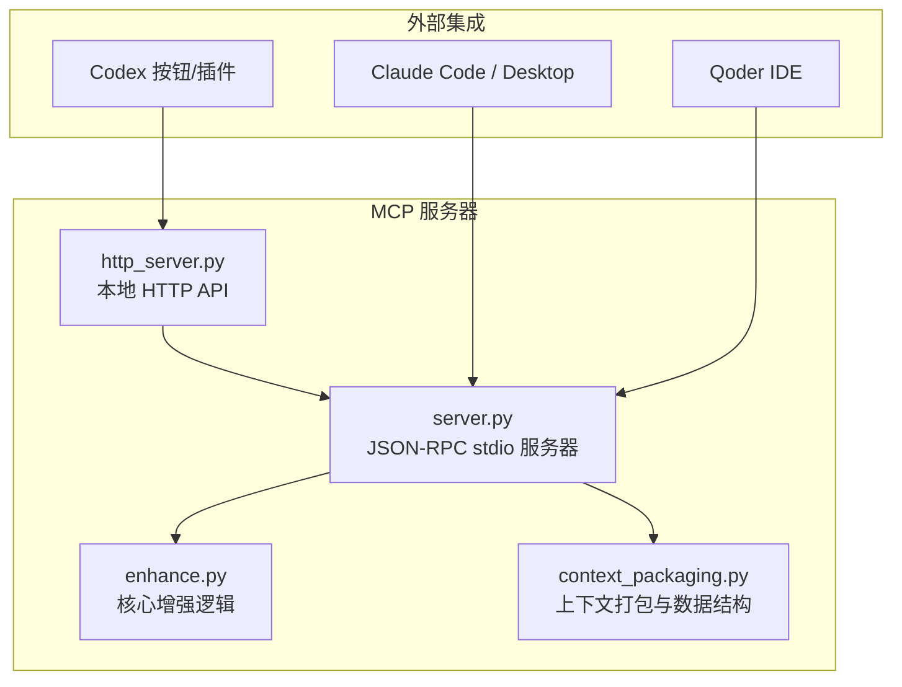
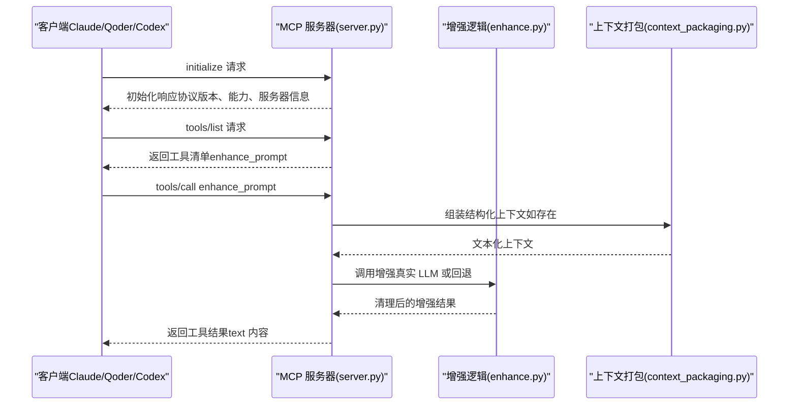
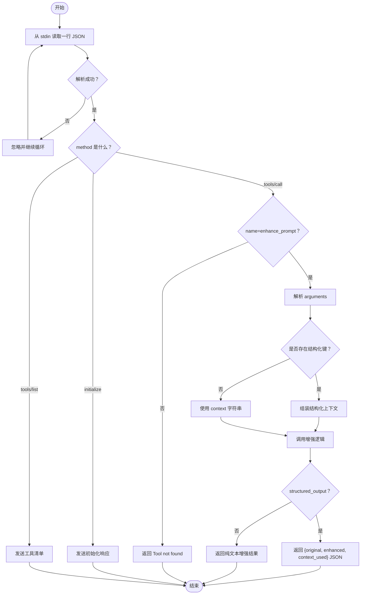
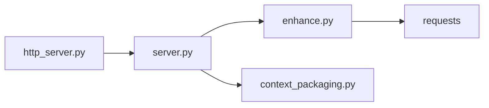

# MCP 服务器

<cite>
**本文引用的文件**
- [mcp-server/server.py](file://mcp-server/server.py)
- [mcp-server/enhance.py](file://mcp-server/enhance.py)
- [mcp-server/context_packaging.py](file://mcp-server/context_packaging.py)
- [mcp-server/http_server.py](file://mcp-server/http_server.py)
- [README.md](file://README.md)
- [docs/TECH_SCHEME.md](file://docs/TECH_SCHEME.md)
- [docs/install.md](file://docs/install.md)
- [docs/claude-code-integration.md](file://docs/claude-code-integration.md)
- [docs/codex-button-integration.md](file://docs/codex-button-integration.md)
- [docs/qoder-integration.md](file://docs/qoder-integration.md)
- [skill/SKILL.md](file://skill/SKILL.md)
- [examples/enhance-next-turn.py](file://examples/enhance-next-turn.py)
- [examples/next-turn-context.json](file://examples/next-turn-context.json)
- [tests/test_server_tool.py](file://tests/test_server_tool.py)
</cite>

## 目录
1. [简介](#简介)
2. [项目结构](#项目结构)
3. [核心组件](#核心组件)
4. [架构总览](#架构总览)
5. [详细组件分析](#详细组件分析)
6. [依赖关系分析](#依赖关系分析)
7. [性能考量](#性能考量)
8. [故障排除指南](#故障排除指南)
9. [结论](#结论)
10. [附录](#附录)

## 简介
本文件面向 PromptCocoPilot 的 MCP 服务器，系统性说明其 JSON-RPC 协议实现、标准输入输出接口、消息格式与错误处理机制；详述工具注册流程（特别是 enhance_prompt 工具的注册与参数定义）；阐述从客户端请求接收、参数解析到响应返回的完整调用处理流程；说明 MCP 服务器的配置选项与部署方式；提供实现 MCP 工具接口的参考路径；解释与 Claude Code 的集成方式与最佳实践；最后给出故障排除与性能优化建议。

## 项目结构
- mcp-server：MCP 服务器与核心增强逻辑
  - server.py：MCP stdio 服务器，实现 JSON-RPC 协议与工具注册
  - enhance.py：核心增强逻辑，支持真实 Dashscope 调用
  - context_packaging.py：上下文打包与数据结构定义
  - http_server.py：本地 HTTP API（用于 Codex 优化输入按钮）
- skill：技能定义（指导如何在 Claude Code 中使用工具）
- docs：技术方案、安装与集成文档
- examples：上下文打包与增强示例
- tests：工具参数处理测试

图表来源
- [mcp-server/server.py:1-232](file://mcp-server/server.py#L1-L232)
- [mcp-server/enhance.py:1-167](file://mcp-server/enhance.py#L1-L167)
- [mcp-server/context_packaging.py:1-211](file://mcp-server/context_packaging.py#L1-L211)
- [mcp-server/http_server.py:1-101](file://mcp-server/http_server.py#L1-L101)

章节来源
- [README.md:23-30](file://README.md#L23-L30)
- [docs/TECH_SCHEME.md:7-14](file://docs/TECH_SCHEME.md#L7-L14)

## 核心组件
- JSON-RPC stdio MCP 服务器：实现 initialize、tools/list、tools/call 等方法，向客户端暴露 enhance_prompt 工具
- 增强逻辑：基于 Dashscope 的真实 LLM 调用，支持严格系统指令与清理输出
- 上下文打包：将对话、代码事实、任务状态、编辑器上下文等结构化为增强器输入
- 本地 HTTP API：为 Codex 按钮提供稳定端点，返回优化后的输入文本
- 技能定义：指导 Claude Code 在何时、如何调用工具并呈现优化前后对比

章节来源
- [mcp-server/server.py:42-232](file://mcp-server/server.py#L42-L232)
- [mcp-server/enhance.py:22-167](file://mcp-server/enhance.py#L22-L167)
- [mcp-server/context_packaging.py:7-211](file://mcp-server/context_packaging.py#L7-L211)
- [mcp-server/http_server.py:1-101](file://mcp-server/http_server.py#L1-L101)
- [skill/SKILL.md:1-105](file://skill/SKILL.md#L1-L105)

## 架构总览
MCP 服务器以标准输入输出（stdio）承载 JSON-RPC 协议，兼容常见 Claude MCP 客户端。服务启动后等待客户端请求，完成握手与工具清单查询后，按需执行工具调用。增强逻辑由独立模块提供，支持真实 LLM 调用与回退策略。上下文打包模块负责将多源上下文整合为增强器可理解的文本。同时提供本地 HTTP API，满足 Codex 按钮集成场景。

图表来源
- [mcp-server/server.py:82-232](file://mcp-server/server.py#L82-L232)
- [mcp-server/enhance.py:90-134](file://mcp-server/enhance.py#L90-L134)
- [mcp-server/context_packaging.py:79-178](file://mcp-server/context_packaging.py#L79-L178)

## 详细组件分析

### JSON-RPC 协议与 stdio 接口
- 协议版本与能力
  - 协议版本：遵循 2024-11-05
  - 能力声明：声明支持 tools
  - 服务器信息：名称与版本
- 方法与消息格式
  - initialize：握手初始化
  - tools/list：列举工具清单
  - tools/call：调用指定工具，参数包含工具名与参数对象
- 标准输入输出
  - 服务器从标准输入读取 JSON 行
  - 通过标准输出打印 JSON 响应，使用 print 并 flush
- 错误处理
  - Method not found：未识别方法返回 -32601
  - Tool not found：工具不存在返回 -32601
  - 未知异常：忽略无效行或返回错误对象

章节来源
- [mcp-server/server.py:82-232](file://mcp-server/server.py#L82-L232)

### 工具注册：enhance_prompt
- 工具名称与描述
  - 名称：enhance_prompt
  - 描述：使用提供的上下文重写并优化用户提示词，返回可审阅的改进版本
- 输入模式
  - 兼容两种输入形式：
    - 传统字符串上下文：context（可选）
    - 结构化上下文：conversation、code_facts、task_state、current_file、selected_code、user_preferences、project_summary、workspace_files 等
  - 选项：structured_output（布尔），控制返回纯文本或包含 original/enhanced/context_used 的 JSON
- 输入 Schema 关键字段
  - draft（必需）：原始用户输入
  - context（可选）：自由文本上下文
  - include_history（可选）：是否包含对话历史（辅助逻辑）
  - conversation：最近对话消息数组（role/content）
  - code_facts：代码事实数组（path/summary/symbols）
  - task_state：当前调查或实现状态
  - current_file / selected_code：编辑器上下文
  - user_preferences：用户约束或风格偏好
  - project_summary：项目总体描述
  - workspace_files：项目文件采样列表
  - structured_output：是否返回结构化 JSON

章节来源
- [mcp-server/server.py:108-195](file://mcp-server/server.py#L108-L195)

### 调用处理流程
- 接收与解析
  - 从 stdin 逐行读取 JSON
  - 解析 method 与 id，提取 params/name/arguments
- 工具分发
  - 若为 tools/call 且 name=enhance_prompt，则进入处理分支
  - 否则返回 Method not found 或 Tool not found 错误
- 参数解析与上下文组装
  - 读取 draft、context、structured_output
  - 若存在结构化键（conversation/code_facts 等），通过 prompt_context_from_dict 转换为 PromptContext
  - 使用 assemble_enhancement_context 生成文本化上下文
- 增强执行
  - 调用 enhance_prompt(draft, context 或 None)
  - 若 structured_output 为真，返回包含 original/enhanced/context_used 的 JSON
  - 否则返回纯文本增强结果
- 响应封装
  - result.content 为包含单个 text 块的结果数组

图表来源
- [mcp-server/server.py:82-232](file://mcp-server/server.py#L82-L232)
- [mcp-server/context_packaging.py:79-178](file://mcp-server/context_packaging.py#L79-L178)
- [mcp-server/enhance.py:90-134](file://mcp-server/enhance.py#L90-L134)

章节来源
- [mcp-server/server.py:49-81](file://mcp-server/server.py#L49-L81)
- [mcp-server/server.py:196-229](file://mcp-server/server.py#L196-L229)

### 增强逻辑：核心实现与回退策略
- 系统指令（INSTRUCTION）
  - 严格指令：仅重写提示词，不回答、不执行、不讨论
  - 输出规范：仅返回增强后的提示词，去除代码围栏与外层引号
- 实际调用（Dashscope）
  - 通过兼容 OpenAI 接口的地址调用 chat/completions
  - 自动从环境变量或特定 .env 文件加载 DASHSCOPE_API_KEY
  - 默认模型可通过环境变量 ENHANCE_MODEL 指定
  - 超时时间与安全参数（温度、最大 token、top_p）
- 回退策略
  - 真实调用失败时，使用简单回退逻辑生成基础增强文本
  - 开发/测试阶段可无 LLM 依赖
- 输出清理
  - 去除 Markdown 代码围栏与首尾引号，保证干净文本

章节来源
- [mcp-server/enhance.py:22-69](file://mcp-server/enhance.py#L22-L69)
- [mcp-server/enhance.py:71-89](file://mcp-server/enhance.py#L71-L89)
- [mcp-server/enhance.py:118-134](file://mcp-server/enhance.py#L118-L134)
- [mcp-server/enhance.py:150-159](file://mcp-server/enhance.py#L150-L159)

### 上下文打包：数据结构与智能截断
- 数据结构
  - PromptContext：聚合 conversation、code_facts、task_state、current_file、selected_code、user_preferences、project_summary、workspace_files
  - ConversationMessage：role/content
  - CodeFact：path/summary/symbols
- 智能截断与预算控制
  - DEFAULT_CONTEXT_BUDGET 控制上下文总字符数，避免小模型上下文窗口溢出
  - smart truncation：保留前 60% 与后 40%，避免丢失结论
  - dedup_code_facts：按文件路径合并重复条目，去重符号列表
- 组装策略
  - 优先追加 project_summary、最近对话、代码事实、任务状态、编辑器上下文、用户偏好
  - workspace_files 限制最多显示 40 项，超出部分以省略表示
  - 超预算时递归收紧 per-message 截断上限

章节来源
- [mcp-server/context_packaging.py:7-33](file://mcp-server/context_packaging.py#L7-L33)
- [mcp-server/context_packaging.py:42-53](file://mcp-server/context_packaging.py#L42-L53)
- [mcp-server/context_packaging.py:79-178](file://mcp-server/context_packaging.py#L79-L178)
- [mcp-server/context_packaging.py:181-211](file://mcp-server/context_packaging.py#L181-L211)

### 本地 HTTP API：Codex 优化输入按钮
- 目标
  - 为 Codex 按钮提供稳定的本地端点，用于“优化输入”
- 端点与方法
  - POST /enhance
  - 支持 CORS（OPTIONS 预检）
- 请求体
  - draft（必需）：当前输入草稿
  - 其他字段与 MCP 工具一致（conversation、code_facts、task_state、current_file、selected_code、user_preferences 等）
- 响应体
  - { draft, enhanced }：原始与增强后的输入文本
- 错误处理
  - draft 缺失：400 + invalid_json
  - JSON 解析失败：400 + invalid_json
  - 其他异常：500 + 错误信息

章节来源
- [mcp-server/http_server.py:22-37](file://mcp-server/http_server.py#L22-L37)
- [mcp-server/http_server.py:47-67](file://mcp-server/http_server.py#L47-L67)
- [docs/codex-button-integration.md:22-73](file://docs/codex-button-integration.md#L22-L73)

### MCP 服务器配置与部署
- 配置位置
  - Claude Code / Desktop：claude_desktop_config.json（macOS 路径示例）
  - Qoder：~/.qoder/mcp.json 或插件 mcp.json
- 关键配置项
  - command：python3
  - args：server.py 的绝对路径
  - env：可选，传入 DASHSCOPE_API_KEY、DEEPSEEK_BASE_URL 等
- 启动与验证
  - 手动运行 server.py 观察是否等待 stdio JSON-RPC
  - 在聊天中询问可用工具或直接调用工具验证
- 与 Dashscope 集成
  - 通过环境变量自动加载 API Key
  - 默认模型为 deepseek-v4-flash（可通过 ENHANCE_MODEL 覆盖）

章节来源
- [docs/install.md:9-25](file://docs/install.md#L9-L25)
- [docs/claude-code-integration.md:35-67](file://docs/claude-code-integration.md#L35-L67)
- [docs/qoder-integration.md:15-31](file://docs/qoder-integration.md#L15-L31)
- [README.md:67-96](file://README.md#L67-L96)

### 与 Claude Code 的集成与最佳实践
- 两层能力
  - MCP Tool：提供增强能力
  - Skill：指导何时调用工具、如何传递上下文、如何呈现优化前后对比
- 使用方式
  - 自动触发：对模糊输入（如“fix bug”、“add feature”）自动调用工具
  - 显式调用：直接要求使用 enhance_prompt 工具
  - 结构化上下文：优先传递 conversation、code_facts、task_state、current_file、selected_code、user_preferences
- 最佳实践
  - 始终在发送前展示 before/after 与改动说明
  - 不直接执行原始模糊提示
  - 使用快速模型进行增强，降低延迟与 token 消耗
  - 在 Claude 设置中开启“包含近期历史”以获得对话感知结果

章节来源
- [skill/SKILL.md:10-50](file://skill/SKILL.md#L10-L50)
- [docs/claude-code-integration.md:100-177](file://docs/claude-code-integration.md#L100-L177)
- [docs/install.md:35-81](file://docs/install.md#L35-L81)

### 与 Qoder 的集成与测试建议
- 配置 MCP 服务器并在 Qoder 中加载
- 公开测试建议
  - 新建完全空白的聊天（无前置对话）
  - 基线：直接粘贴模糊提示，观察搜索与回答行为
  - 增强：使用 /prompt-enhancer 或手动调用 MCP 工具，呈现 before/after 与解释
- 结构化上下文示例
  - draft + conversation + code_facts + task_state + current_file + selected_code + user_preferences

章节来源
- [docs/qoder-integration.md:15-59](file://docs/qoder-integration.md#L15-L59)
- [examples/next-turn-context.json:1-33](file://examples/next-turn-context.json#L1-L33)

### 示例：上下文打包与增强
- 命令行示例
  - 打印打包后的上下文：python3 examples/enhance-next-turn.py examples/next-turn-context.json --print-context
  - 打包并调用增强：python3 examples/enhance-next-turn.py examples/next-turn-context.json --enhance
- 示例输入
  - 包含 draft、conversation、code_facts、task_state、current_file、selected_code、user_preferences 的 JSON

章节来源
- [examples/enhance-next-turn.py:1-55](file://examples/enhance-next-turn.py#L1-L55)
- [examples/next-turn-context.json:1-33](file://examples/next-turn-context.json#L1-L33)

## 依赖关系分析
- 组件耦合
  - server.py 依赖 enhance.py 与 context_packaging.py
  - http_server.py 依赖 server.py 的工具处理函数
- 外部依赖
  - requests：Dashscope API 调用
  - json、sys、argparse：标准库
- 潜在环依赖
  - 通过相对导入与模块路径插入避免循环导入

图表来源
- [mcp-server/server.py:35-41](file://mcp-server/server.py#L35-L41)
- [mcp-server/enhance.py:10-15](file://mcp-server/enhance.py#L10-L15)
- [mcp-server/http_server.py:13-16](file://mcp-server/http_server.py#L13-L16)

章节来源
- [mcp-server/server.py:35-41](file://mcp-server/server.py#L35-L41)
- [mcp-server/enhance.py:10-15](file://mcp-server/enhance.py#L10-L15)
- [mcp-server/http_server.py:8-16](file://mcp-server/http_server.py#L8-L16)

## 性能考量
- 上下文预算
  - DEFAULT_CONTEXT_BUDGET 限制上下文长度，避免小模型上下文溢出
  - 超预算时动态收紧 per-message 截断上限，平衡信息完整性与性能
- 模型选择
  - 默认使用 fast 模型（如 deepseek-v4-flash），降低延迟与 token 消耗
  - 可通过 ENHANCE_MODEL 覆盖模型
- I/O 与序列化
  - 通过 print + flush 实现即时输出，减少等待
  - JSON-RPC 消息按行传输，解析简单高效
- 网络调用
  - Dashscope 调用设置合理超时，失败时快速回退至本地逻辑

章节来源
- [mcp-server/context_packaging.py:35-53](file://mcp-server/context_packaging.py#L35-L53)
- [mcp-server/context_packaging.py:164-177](file://mcp-server/context_packaging.py#L164-L177)
- [mcp-server/enhance.py:25](file://mcp-server/enhance.py#L25)
- [mcp-server/enhance.py:62-68](file://mcp-server/enhance.py#L62-L68)

## 故障排除指南
- 工具不可见或无法调用
  - 检查 MCP 配置文件路径与命令是否正确
  - 确认 python3 可用且 server.py 绝对路径正确
  - 重启客户端后再次验证
- 增强效果不佳
  - 当前 server.py 调用增强时未传入真实 LLM 生成函数，会走回退逻辑
  - 在 MCP env 中设置 DASHSCOPE_API_KEY，或在系统环境/指定 .env 文件中提供密钥
- Dashscope 调用失败
  - 确认 API Key 有效且网络可达
  - 查看错误码与响应摘要，必要时更换模型或检查请求负载
- HTTP API 无法访问
  - 确认端口未被占用，主机与端口参数正确
  - 检查 CORS 头与 Content-Type
- 参数解析错误
  - 确保 POST /enhance 的 JSON 结构正确
  - draft 为必填字段，JSON 格式需合法

章节来源
- [docs/claude-code-integration.md:180-191](file://docs/claude-code-integration.md#L180-L191)
- [docs/install.md:77-81](file://docs/install.md#L77-L81)
- [mcp-server/http_server.py:52-66](file://mcp-server/http_server.py#L52-L66)
- [mcp-server/enhance.py:43-44](file://mcp-server/enhance.py#L43-L44)

## 结论
本 MCP 服务器以轻量、可移植的方式实现了上下文感知的提示词增强能力，通过 JSON-RPC stdio 协议与 Claude Code、Qoder 等客户端无缝对接。结合技能定义与结构化上下文，能够显著提升用户输入的质量与可执行性。通过 Dashscope 真实调用与回退策略，兼顾效果与稳定性；通过上下文预算与 fast 模型，保障性能与用户体验。建议在生产环境中配置 API Key 并启用结构化上下文传递，以获得最佳增强效果。

## 附录

### JSON-RPC 方法与错误码对照
- initialize：握手初始化
- tools/list：列举工具
- tools/call：调用工具
- 错误码
  - -32601：Method not found 或 Tool not found
  - 其他：根据 Dashscope 响应或内部异常返回

章节来源
- [mcp-server/server.py:93-229](file://mcp-server/server.py#L93-L229)

### MCP 工具接口实现参考路径
- 工具注册与参数定义：[mcp-server/server.py:108-195](file://mcp-server/server.py#L108-L195)
- 工具调用处理与响应封装：[mcp-server/server.py:196-229](file://mcp-server/server.py#L196-L229)
- 增强逻辑入口与真实调用：[mcp-server/enhance.py:90-134](file://mcp-server/enhance.py#L90-L134)
- 上下文打包与预算控制：[mcp-server/context_packaging.py:79-178](file://mcp-server/context_packaging.py#L79-L178)
- 本地 HTTP API 端点与错误处理：[mcp-server/http_server.py:47-67](file://mcp-server/http_server.py#L47-L67)

### 测试与验证
- 工具参数处理测试：[tests/test_server_tool.py:11-47](file://tests/test_server_tool.py#L11-L47)
- 示例上下文与增强流程：[examples/enhance-next-turn.py:21-51](file://examples/enhance-next-turn.py#L21-L51)