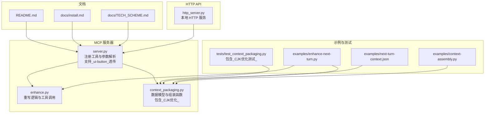
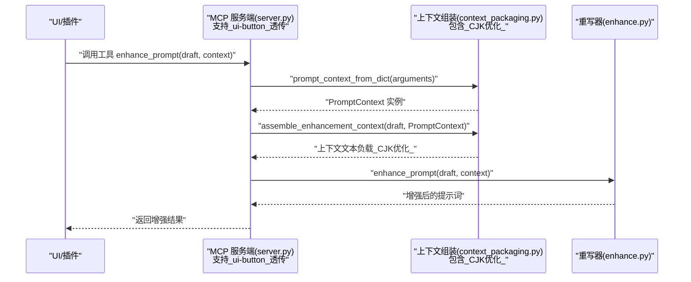
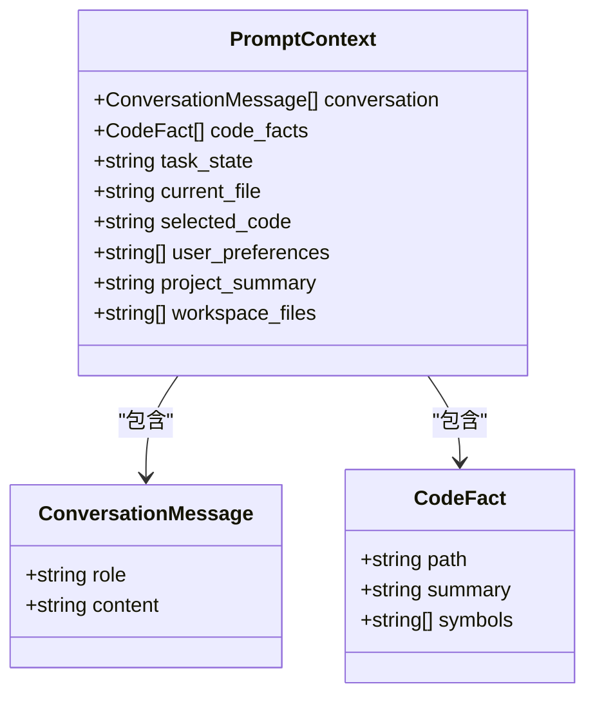
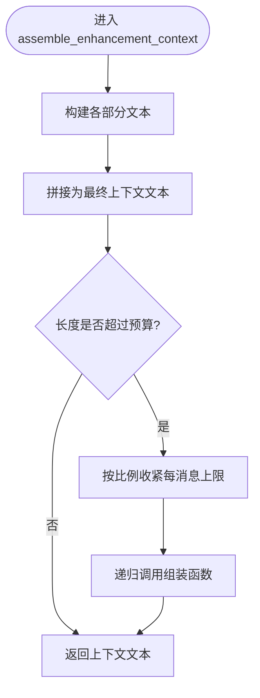
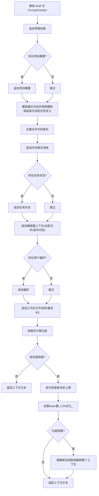
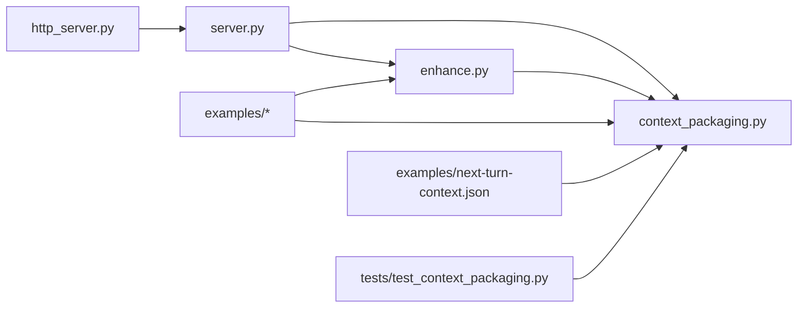

# 上下文组装器

<cite>
**本文引用的文件**
- [mcp-server/context_packaging.py](file://mcp-server/context_packaging.py)
- [mcp-server/enhance.py](file://mcp-server/enhance.py)
- [mcp-server/server.py](file://mcp-server/server.py)
- [mcp-server/http_server.py](file://mcp-server/http_server.py)
- [examples/context-assembly.py](file://examples/context-assembly.py)
- [examples/enhance-next-turn.py](file://examples/enhance-next-turn.py)
- [examples/next-turn-context.json](file://examples/next-turn-context.json)
- [tests/test_context_packaging.py](file://tests/test_context_packaging.py)
- [docs/TECH_SCHEME.md](file://docs/TECH_SCHEME.md)
- [docs/install.md](file://docs/install.md)
- [README.md](file://README.md)
</cite>

## 更新摘要
**所做更改**
- 新增_CJK优化的_token估算算法（_estimate_tokens）章节
- 新增首次消息任务定义保留机制章节
- 新增迭代预算强制（bounded iteration enforcement）章节
- 新增硬截断回退（hard-truncation fallback）机制章节
- 新增_source: 'ui-button'透传功能章节
- 更新智能截断算法章节以反映CJK优化
- 更新上下文组装流程章节以反映改进
- 更新性能考量章节以反映新的预算控制机制

## 目录
1. [简介](#简介)
2. [项目结构](#项目结构)
3. [核心组件](#核心组件)
4. [架构总览](#架构总览)
5. [详细组件分析](#详细组件分析)
6. [依赖关系分析](#依赖关系分析)
7. [性能考量](#性能考量)
8. [故障排查指南](#故障排查指南)
9. [结论](#结论)
10. [附录](#附录)

## 简介
本文件面向 PromptCocoPilot 的"上下文组装器"，系统性阐述其数据结构设计、智能截断算法、上下文组装流程、不同类型的上下文处理方式、组装示例与配置选项，以及与 UI 层的集成方式与数据传递机制。**最新版本引入了CJK优化的上下文打包改进**，包括新增的_token估算算法、首次消息任务定义保留机制、迭代预算强制、硬截断回退机制，以及_source: 'ui-button'透传功能，显著提升了中文和长对话场景的上下文处理准确性。

## 项目结构
围绕上下文组装器的核心目录与文件如下：
- mcp-server/context_packaging.py：定义数据模型与上下文组装函数，包含CJK优化的_token估算算法
- mcp-server/enhance.py：提示词重写核心逻辑与工具入口
- mcp-server/server.py：MCP 工具服务端，暴露 enhance_prompt 工具，支持_ui-button_透传功能
- mcp-server/http_server.py：本地 HTTP API，用于 UI 按钮"优化输入"
- examples/*：示例脚本与样例 JSON，演示如何组装上下文与调用工具
- tests/test_context_packaging.py：针对上下文组装的单元测试，包含CJK优化测试
- docs/TECH_SCHEME.md、docs/install.md、README.md：技术方案、安装与使用说明

**图表来源**
- [mcp-server/server.py:1-261](file://mcp-server/server.py#L1-L261)
- [mcp-server/enhance.py:1-175](file://mcp-server/enhance.py#L1-L175)
- [mcp-server/context_packaging.py:1-252](file://mcp-server/context_packaging.py#L1-L252)
- [mcp-server/http_server.py:1-112](file://mcp-server/http_server.py#L1-L112)
- [examples/context-assembly.py:1-93](file://examples/context-assembly.py#L1-L93)
- [examples/enhance-next-turn.py:1-55](file://examples/enhance-next-turn.py#L1-L55)
- [examples/next-turn-context.json:1-33](file://examples/next-turn-context.json#L1-L33)
- [tests/test_context_packaging.py:1-187](file://tests/test_context_packaging.py#L1-L187)
- [docs/TECH_SCHEME.md:1-166](file://docs/TECH_SCHEME.md#L1-L166)
- [docs/install.md:1-81](file://docs/install.md#L1-L81)
- [README.md:1-181](file://README.md#L1-L181)

**章节来源**
- [README.md:23-30](file://README.md#L23-L30)
- [docs/TECH_SCHEME.md:7-10](file://docs/TECH_SCHEME.md#L7-L10)

## 核心组件
- 数据模型
  - ConversationMessage：表示一条对话消息，包含角色与内容
  - CodeFact：表示从代码中抽取的事实，包含路径、摘要与符号集合
  - PromptContext：承载所有上下文要素的结构化载体，包括对话历史、代码事实、任务状态、当前文件、选中代码、用户偏好、项目概要与工作区文件列表
- 组装函数
  - assemble_enhancement_context：将草稿与结构化上下文拼接为最终文本负载，内置智能截断、去重与预算控制，**现已支持CJK优化的_token估算算法**
  - prompt_context_from_dict：将 MCP JSON 参数转换为 PromptContext
- 重写工具
  - enhance_prompt / enhance_next_prompt：在上下文基础上进行提示词重写
- MCP 服务端
  - server.py：注册工具、解析参数、调用组装与重写，**支持_source: 'ui-button'_透传功能**
- HTTP API
  - http_server.py：提供本地 HTTP 接口，供 UI 按钮调用

**章节来源**
- [mcp-server/context_packaging.py:7-33](file://mcp-server/context_packaging.py#L7-L33)
- [mcp-server/context_packaging.py:79-178](file://mcp-server/context_packaging.py#L79-L178)
- [mcp-server/context_packaging.py:181-210](file://mcp-server/context_packaging.py#L181-L210)
- [mcp-server/enhance.py:90-148](file://mcp-server/enhance.py#L90-L148)
- [mcp-server/server.py:49-80](file://mcp-server/server.py#L49-L80)

## 架构总览
上下文组装器遵循"上下文由调用方收集，核心仅负责拼装与重写"的设计原则。调用方可来自 UI 插件、VS Code 扩展、Qoder、Claude Code 或其他 MCP 客户端；核心通过 MCP 工具或本地 HTTP API 暴露，统一输出可审阅的优化提示词。**最新版本增强了对CJK文本的处理能力，确保中文场景下的准确预算控制。**

**图表来源**
- [mcp-server/server.py:49-80](file://mcp-server/server.py#L49-L80)
- [mcp-server/context_packaging.py:181-210](file://mcp-server/context_packaging.py#L181-L210)
- [mcp-server/context_packaging.py:79-178](file://mcp-server/context_packaging.py#L79-L178)
- [mcp-server/enhance.py:90-148](file://mcp-server/enhance.py#L90-L148)

## 详细组件分析

### 数据结构设计
- ConversationMessage
  - 字段：role（字符串）、content（字符串）
  - 用途：承载最近对话历史中的消息条目
- CodeFact
  - 字段：path（字符串）、summary（字符串）、symbols（序列，默认空元组）
  - 用途：记录从代码中抽取的事实，包含文件路径、摘要与符号列表
- PromptContext
  - 字段：conversation（消息序列，默认空元组）、code_facts（CodeFact 序列，默认空元组）、task_state（字符串，默认空）、current_file（字符串，默认空）、selected_code（字符串，默认空）、user_preferences（字符串序列，默认空元组）、project_summary（字符串，默认空）、workspace_files（字符串序列，默认空元组）
  - 用途：作为上下文组装的统一载体，支持项目概要与工作区文件等扩展字段

**图表来源**
- [mcp-server/context_packaging.py:7-33](file://mcp-server/context_packaging.py#L7-L33)

**章节来源**
- [mcp-server/context_packaging.py:7-33](file://mcp-server/context_packaging.py#L7-L33)

### CJK优化的_token估算算法
**新增功能**：为准确处理中文和混合文本，系统引入了专门的_token估算算法。

- 目标：解决传统"1 token ≈ 4 chars"假设对中文过度高估的问题
- 策略：CJK字符按1 token/char计算，ASCII/代码按≈4 chars/token计算
- 实现：_estimate_tokens 函数通过Unicode范围判断CJK字符，提供更精确的token估算
- 影响：显著提升中文场景下的预算控制准确性，避免中文内容被过度压缩

**章节来源**
- [mcp-server/context_packaging.py:56-65](file://mcp-server/context_packaging.py#L56-L65)
- [tests/test_context_packaging.py:163-171](file://tests/test_context_packaging.py#L163-L171)

### 首次消息任务定义保留机制
**新增功能**：确保长对话场景中原始任务目标不会丢失。

- 目标：避免长对话中首次消息（任务定义）被尾部截断策略丢失
- 策略：在max_messages限制下，始终保留第一条消息（原始任务定义）+ 最近的消息
- 实现：_assemble_with_cap 函数中对消息截断时采用"首+尾"策略，确保任务意图保持
- 影响：显著改善中文长对话场景的上下文完整性

**章节来源**
- [mcp-server/context_packaging.py:158-161](file://mcp-server/context_packaging.py#L158-L161)
- [tests/test_context_packaging.py:151-161](file://tests/test_context_packaging.py#L151-L161)

### 迭代预算强制（bounded iteration enforcement）
**新增功能**：通过多次迭代收紧消息上限，确保上下文严格控制在预算内。

- 目标：在对话部分超预算时，通过迭代收紧消息上限来强制满足预算
- 策略：最多4次迭代，每次根据当前估算的token数与预算比值调整消息上限
- 实现：assemble_enhancement_context中的预算检查循环，使用cap变量控制消息上限
- 保证：即使在极端情况下，也能确保最终上下文不超过预算的2倍

**章节来源**
- [mcp-server/context_packaging.py:112-128](file://mcp-server/context_packaging.py#L112-L128)
- [tests/test_context_packaging.py:128-139](file://tests/test_context_packaging.py#L128-L139)

### 硬截断回退（hard-truncation fallback）机制
**新增功能**：当非对话内容单独超过预算时的最终保障措施。

- 目标：防止任何情况下出现上下文溢出，特别是当项目概要、工作区文件等非对话内容过多时
- 策略：当估算的token数超过预算的120%时，直接对整个上下文进行智能截断
- 实现：在迭代预算强制后，使用1.2倍预算阈值检测，触发_hard-truncation_
- 保证：即使在最坏情况下，也能确保最终输出不超过合理范围

**章节来源**
- [mcp-server/context_packaging.py:129-134](file://mcp-server/context_packaging.py#L129-L134)
- [tests/test_context_packaging.py:128-139](file://tests/test_context_packaging.py#L128-L139)

### 智能截断算法
- 目标：避免长回复被头截断导致结论丢失，同时控制整体上下文长度
- 策略：对长文本采用"头+尾"截断，保留前 60% 与后 40%，中间以省略号分隔
- **改进**：结合CJK优化的_token估算算法，提供更准确的截断边界
- 实现位置：_truncate_smart 函数
- 预算控制：assemble_enhancement_context 在组装完成后检查长度是否超过预算，若超限则按比例收紧每条消息的字符上限并递归重试

**图表来源**
- [mcp-server/context_packaging.py:79-178](file://mcp-server/context_packaging.py#L79-L178)
- [mcp-server/context_packaging.py:42-52](file://mcp-server/context_packaging.py#L42-L52)

**章节来源**
- [mcp-server/context_packaging.py:42-52](file://mcp-server/context_packaging.py#L42-L52)
- [mcp-server/context_packaging.py:79-178](file://mcp-server/context_packaging.py#L79-L178)

### 上下文组装流程
- 输入：草稿文本 draft 与 PromptContext
- **改进**：集成了CJK优化的_token估算算法、首次消息任务定义保留机制、迭代预算强制和硬截断回退
- 步骤：
  1) 追加草稿标题
  2) 追加项目概要（如存在）
  3) 追加最近对话（受 max_messages 限制，单条消息受 max_chars_per_message 限制，使用智能截断，**保留首次消息任务定义**）
  4) 去重合并代码事实（同路径合并摘要与符号，去重符号）
  5) 追加代码事实清单
  6) 追加任务状态
  7) 追加编辑器上下文（当前文件与选中代码，选中代码受 max_selected_code_chars 限制）
  8) 追加用户偏好
  9) 追加工作区文件采样（最多显示 40 项）
  10) **预算控制**：估算token数，若超预算则迭代收紧消息上限
  11) **硬截断回退**：若仍超预算，则对整个上下文进行智能截断
  12) 拼接并计算长度
- 输出：最终上下文文本

**图表来源**
- [mcp-server/context_packaging.py:79-178](file://mcp-server/context_packaging.py#L79-L178)

**章节来源**
- [mcp-server/context_packaging.py:79-178](file://mcp-server/context_packaging.py#L79-L178)

### 不同类型上下文的处理方式
- 对话历史
  - 仅保留最近 N 条（默认 12），每条消息按字符上限截断，保留首尾结论，**特别保留首次消息任务定义**
- 代码事实
  - 同路径去重合并摘要，符号去重合并，形成简洁的事实清单
- 任务状态
  - 直接追加，保持原意不变
- 编辑器上下文
  - 当前文件与选中代码分别追加；选中代码单独受上限保护
- 用户偏好
  - 逐条追加，作为约束条件
- 工作区文件
  - 最多展示 40 个文件，超出部分以"更多"提示
- 项目概要
  - 作为"工作区摘要"角色，补充项目技术栈与模块信息
- **CJK优化**
  - 使用专门的_token估算算法，确保中文场景的准确预算控制

**章节来源**
- [mcp-server/context_packaging.py:102-160](file://mcp-server/context_packaging.py#L102-L160)
- [mcp-server/context_packaging.py:60-76](file://mcp-server/context_packaging.py#L60-L76)

### 组装示例与配置选项
- 示例脚本
  - examples/context-assembly.py：演示自由格式与结构化两种组装方式
  - examples/enhance-next-turn.py：读取 JSON 上下文并输出组装结果或直接调用重写
  - examples/next-turn-context.json：下一轮问题的结构化上下文样例
- 关键配置参数（assemble_enhancement_context）
  - max_messages：最近对话条数上限（默认 12）
  - max_chars_per_message：单条消息字符上限（默认 600）
  - max_selected_code_chars：选中代码字符上限（默认 1200）
  - context_budget：上下文总预算（默认约 6000 字符，**基于CJK优化的_token估算**）

**章节来源**
- [examples/context-assembly.py:25-61](file://examples/context-assembly.py#L25-L61)
- [examples/enhance-next-turn.py:21-51](file://examples/enhance-next-turn.py#L21-L51)
- [examples/next-turn-context.json:1-33](file://examples/next-turn-context.json#L1-L33)
- [mcp-server/context_packaging.py:79-87](file://mcp-server/context_packaging.py#L79-L87)

### 与 UI 层的集成方式与数据传递机制
- MCP 工具集成
  - server.py 注册 enhance_prompt 工具，支持结构化字段（conversation、code_facts、task_state、current_file、selected_code、user_preferences、project_summary、workspace_files）与字符串 context
  - 结构化字段优先：若传入结构化字段，将与字符串 context 合并
  - **新增**：支持_source: 'ui-button'透传功能，用于区分UI按钮触发的上下文
- HTTP API 集成
  - http_server.py 提供本地 HTTP 服务，UI 按钮可 POST 当前草稿与上下文到 /enhance，返回 {draft, enhanced}
- **新增**：UI按钮路径的上下文清理功能
  - _clean_button_context 函数用于清理UI按钮路径的原始document.body.innerText噪声
  - 轻量去噪：折叠空白行、过滤UI控件标签、保留真实文本内容
- 典型调用链
  - UI/插件收集上下文（历史、代码事实、任务状态、编辑器上下文、偏好、项目概要、工作区文件）
  - **新增**：UI按钮触发时自动添加_source: 'ui-button'标记
  - 通过 MCP 工具或 HTTP API 调用，获得增强后的提示词供用户审阅

**章节来源**
- [mcp-server/server.py:49-80](file://mcp-server/server.py#L49-L80)
- [mcp-server/http_server.py:22-36](file://mcp-server/http_server.py#L22-L36)
- [docs/install.md:43-53](file://docs/install.md#L43-L53)
- [mcp-server/server.py:50-71](file://mcp-server/server.py#L50-L71)

## 依赖关系分析
- 组件耦合
  - server.py 依赖 enhance.py 与 context_packaging.py
  - enhance.py 依赖 context_packaging.py
  - http_server.py 依赖 server.py
  - examples 与 tests 依赖 mcp-server 子模块
- 外部依赖
  - HTTP 服务基于标准库 http.server
  - MCP 服务端为最小 stdio 实现，兼容常见客户端
- 循环依赖
  - 未发现循环依赖

**图表来源**
- [mcp-server/http_server.py:13-16](file://mcp-server/http_server.py#L13-L16)
- [mcp-server/server.py:35-40](file://mcp-server/server.py#L35-L40)
- [mcp-server/enhance.py:17-21](file://mcp-server/enhance.py#L17-L21)
- [examples/context-assembly.py:16-21](file://examples/context-assembly.py#L16-L21)
- [examples/enhance-next-turn.py:17-18](file://examples/enhance-next-turn.py#L17-L18)
- [examples/next-turn-context.json:1-33](file://examples/next-turn-context.json#L1-L33)
- [tests/test_context_packaging.py:8-16](file://tests/test_context_packaging.py#L8-L16)

**章节来源**
- [mcp-server/server.py:35-40](file://mcp-server/server.py#L35-L40)
- [mcp-server/enhance.py:17-21](file://mcp-server/enhance.py#L17-L21)
- [mcp-server/http_server.py:13-16](file://mcp-server/http_server.py#L13-L16)

## 性能考量
- **CJK优化的长度预算**
  - 默认上下文预算约为 6000 字符，基于CJK优化的_token估算算法，兼顾小模型上下文窗口安全
  - **改进**：使用专门的CJK估算算法，避免中文内容被过度压缩
  - 超限时按比例收紧消息上限并递归重试，确保最终长度在预算范围内
- 截断策略
  - 智能截断保留首尾，避免结论丢失
  - **改进**：结合CJK优化，提供更准确的截断边界
- 去重与采样
  - 代码事实按路径去重合并，减少冗余
  - 工作区文件最多展示 40 项，避免上下文膨胀
- **新增**：预算控制的多重保障
  - 迭代预算强制：最多4次迭代收紧消息上限
  - 硬截断回退：最终保障措施，防止任何溢出
- I/O 与并发
  - HTTP 服务使用线程化 HTTP 服务器，适合轻量本地集成
  - MCP 服务端为 stdio 流式协议，适合嵌入式运行

**章节来源**
- [mcp-server/context_packaging.py:35-39](file://mcp-server/context_packaging.py#L35-L39)
- [mcp-server/context_packaging.py:164-176](file://mcp-server/context_packaging.py#L164-L176)
- [mcp-server/context_packaging.py:60-76](file://mcp-server/context_packaging.py#L60-L76)
- [mcp-server/context_packaging.py:156-160](file://mcp-server/context_packaging.py#L156-L160)
- [mcp-server/http_server.py:94-96](file://mcp-server/http_server.py#L94-L96)

## 故障排查指南
- API 密钥缺失（Dashscope）
  - 现象：调用真实重写时抛出异常
  - 处理：设置环境变量 DASHSCOPE_API_KEY，或在指定路径的 .env 文件中提供
- 输入为空
  - 现象：增强函数直接返回原文本
  - 处理：确保 draft 非空
- **新增**：CJK文本显示异常
  - 现象：中文字符显示为问号或乱码
  - 处理：确保系统支持CJK字符集，检查终端编码设置
- **新增**：预算控制问题
  - 现象：上下文超预算或被过度压缩
  - 处理：检查_default_context_budget_设置，考虑增加预算或减少上下文内容
- **新增**：UI按钮上下文噪声
  - 现象：UI按钮触发时出现UI控件标签
  - 处理：确认使用了_source: 'ui-button'_标记，系统会自动清理UI噪声
- 结构化字段未生效
  - 现象：仅传入字符串 context
  - 处理：使用结构化字段（conversation、code_facts、task_state、current_file、selected_code、user_preferences、project_summary、workspace_files）

**章节来源**
- [mcp-server/enhance.py:27-37](file://mcp-server/enhance.py#L27-L37)
- [mcp-server/enhance.py:108-109](file://mcp-server/enhance.py#L108-L109)
- [mcp-server/context_packaging.py:164-176](file://mcp-server/context_packaging.py#L164-L176)
- [mcp-server/server.py:64-69](file://mcp-server/server.py#L64-L69)

## 结论
上下文组装器通过结构化的数据模型与稳健的智能截断、预算控制机制，将对话历史、代码事实、任务状态、编辑器上下文与用户偏好等异构信息整合为高质量的提示词上下文。**最新版本引入的CJK优化改进**，包括专门的_token估算算法、首次消息任务定义保留机制、迭代预算强制和硬截断回退，显著提升了中文和长对话场景的处理准确性。配合 MCP 工具与本地 HTTP API，可无缝集成到各类 UI 插件与 IDE 中，实现"发送前优化"的闭环体验，显著提升后续提示词重写与执行的质量与可控性。

## 附录
- 相关文档
  - 技术方案：docs/TECH_SCHEME.md
  - 安装与使用：docs/install.md、README.md
- 示例与测试
  - examples/context-assembly.py、examples/enhance-next-turn.py、examples/next-turn-context.json
  - tests/test_context_packaging.py（包含CJK优化测试）

**章节来源**
- [docs/TECH_SCHEME.md:1-166](file://docs/TECH_SCHEME.md#L1-L166)
- [docs/install.md:1-81](file://docs/install.md#L1-L81)
- [README.md:1-181](file://README.md#L1-L181)
- [examples/context-assembly.py:1-93](file://examples/context-assembly.py#L1-L93)
- [examples/enhance-next-turn.py:1-55](file://examples/enhance-next-turn.py#L1-L55)
- [examples/next-turn-context.json:1-33](file://examples/next-turn-context.json#L1-L33)
- [tests/test_context_packaging.py:1-187](file://tests/test_context_packaging.py#L1-L187)