# 会话管理系统

<cite>
**本文档引用的文件**
- [README.md](file://README.md)
- [package.json](file://package.json)
- [session_reader.py](file://claude-ui/src/session_reader.py)
- [SessionReader.swift](file://claude-ui/swift/Sources/SessionReader.swift)
- [floating_webview.py](file://claude-ui/src/floating_webview.py)
- [draggable_card.py](file://claude-ui/src/draggable_card.py)
- [invoko_card.py](file://claude-ui/src/invoko_card.py)
- [server.py](file://mcp-server/server.py)
- [context_packaging.py](file://mcp-server/context_packaging.py)
- [enhance.py](file://mcp-server/enhance.py)
- [http_server.py](file://mcp-server/http_server.py)
- [claude-float.py](file://claude-ui/bin/claude-float.py)
- [SKILL.md](file://skill/SKILL.md)
- [TECH_SCHEME.md](file://docs/TECH_SCHEME.md)
- [enhance-next-turn.py](file://examples/enhance-next-turn.py)
- [next-turn-context.json](file://examples/next-turn-context.json)
- [test_enhance.py](file://tests/test_enhance.py)
- [test_context_packaging.py](file://tests/test_context_packaging.py)
- [multi_round_smoke.py](file://tests/multi_round_smoke.py)
- [edge_round_smoke.py](file://tests/edge_round_smoke.py)
- [App.swift](file://claude-ui/swift/Sources/App.swift)
- [IslandView.swift](file://claude-ui/swift/Sources/IslandView.swift)
- [EnhanceClient.swift](file://claude-ui/swift/Sources/EnhanceClient.swift)
- [Selection.swift](file://claude-ui/swift/Sources/Selection.swift)
- [build.sh](file://claude-ui/swift/build.sh)
- [qoder-integration.md](file://docs/qoder-integration.md)
- [qoder_paths.js](file://qoder-ui/src/qoder_paths.js)
- [qoder-optimize-input.js](file://qoder-ui/bin/qoder-optimize-input.js)
- [daemon.test.js](file://qoder-ui/test/daemon.test.js)
</cite>

## 更新摘要
**所做更改**
- 新增 Qoder 代理支持，AgentKind 枚举中添加 .qoder 代理类型
- 上下文处理能力从 20 轮扩展到 40 轮，提升长对话处理能力
- 会话 ID 显示增强，帮助区分相似名称的会话，包含代理前缀标识
- 完整实现多代理会话聚合功能，支持 Claude、Codex 和 Qoder 三类代理
- 新增 Qoder 集成文档和相关工具链支持

## 目录
1. [简介](#简介)
2. [项目结构](#项目结构)
3. [核心组件](#核心组件)
4. [架构概览](#架构概览)
5. [详细组件分析](#详细组件分析)
6. [多代理会话管理](#多代理会话管理)
7. [Qoder 集成支持](#qoder-集成支持)
8. [增强的上下文处理能力](#增强的上下文处理能力)
9. [会话 ID 显示增强](#会话-id-显示增强)
10. [Swift 异步Task.detached处理](#swift-异步taskdetached处理)
11. [会话处理性能优化](#会话处理性能优化)
12. [Swift 原生会话读取器](#swift-原生会话读取器)
13. [会话消歧系统](#会话消歧系统)
14. [会话选择体验增强](#会话选择体验增强)
15. [依赖关系分析](#依赖关系分析)
16. [性能考虑](#性能考虑)
17. [故障排除指南](#故障排除指南)
18. [结论](#结论)
19. [附录](#附录)

## 简介

会话管理系统是一个基于 Python 的上下文感知提示词增强器，专为 Claude Code 设计，复刻了 Kilo Code 的 "Enhance Prompt" 功能。该系统提供了一个轻量级的专用重写器，能够读取当前对话历史和任务上下文，对用户输入的草稿进行重写和优化，提升提示词的清晰度、具体性和完整性。

**更新** 系统现已实现原生 Swift 会话读取器，通过新的 SessionReader.swift 模块直接解析 Claude 会话数据，提供更好的性能和可靠性。最新的架构增强包括多代理会话管理支持，新增 AgentKind 枚举支持 Claude、Codex 和 Qoder 会话、SessionInfo 结构体扩展包含代理识别和唯一会话ID、SessionReader 完全重写支持多代理会话聚合，以及 Swift UI 中的彩色徽章显示不同代理类型等功能。

系统的核心目标是在用户发送前提供一个提示词优化层，支持对话历史上下文、代码事实注入、用户偏好保留等功能。通过 MCP（Model Context Protocol）服务器和多种集成方式，该系统可以在不同的开发环境中提供一致的提示词优化体验。

**新增** 系统现已支持 Qoder 代理集成，Qoder 是一个类似 Cursor/Claude Code 的 AI 编程 IDE，具有 MCP 支持。通过新增的 Qoder 代理支持，用户可以在 Qoder 环境中使用相同的提示词增强功能。

## 项目结构

该项目采用模块化的文件组织结构，主要分为以下几个核心目录：

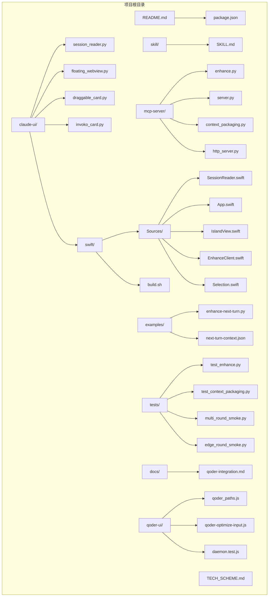

**图表来源**
- [README.md:23-29](file://README.md#L23-L29)
- [package.json:1-23](file://package.json#L1-L23)

**章节来源**
- [README.md:23-29](file://README.md#L23-L29)
- [package.json:1-23](file://package.json#L1-L23)

## 核心组件

会话管理系统由多个相互协作的核心组件构成，每个组件都有明确的职责和功能：

### 多代理会话管理组件
**更新** 系统现已支持多代理会话管理，通过 AgentKind 枚举和 SessionInfo 结构体扩展实现：

- **AgentKind 枚举**：定义支持的代理类型（Claude、Codex、Qoder）
- **SessionInfo 结构体**：扩展包含代理识别、唯一会话ID和日志路径
- **SessionReader 枚举**：完全重写支持多代理会话聚合和差异化处理

### MCP 服务器组件
MCP 服务器是系统的核心服务组件，负责暴露 `enhance_prompt` 工具供外部调用。它实现了标准的 JSON-RPC 协议，支持工具注册和调用。

### 上下文包装器组件
该组件负责将各种类型的上下文信息（对话历史、代码事实、任务状态等）整合成结构化的增强提示词上下文。

### 增强逻辑组件
这是系统的核心算法组件，实现了提示词重写和优化的逻辑，确保输出符合严格的要求和格式规范。

### 会话读取器组件
**更新** 现在提供三种实现方式：
- **Python 实现**：传统的 session_reader.py 模块，通过文件系统解析 Claude 会话数据
- **Swift 实现**：全新的 SessionReader.swift 模块，直接解析 Claude、Codex 和 Qoder 会话数据，提供更好的性能和可靠性
- **Qoder 实现**：专门的 Qoder 会话读取器，支持 Qoder 环境的会话管理

### 会话消歧系统
新增的会话管理增强功能，通过显示路径尾部、相对时间戳和缩短的会话ID来改善会话列表的可读性和选择体验。

### 异步处理组件
**新增** Swift 应用程序使用 Task.detached 进行异步处理，避免阻塞主线程，提升用户界面响应速度。

### Qoder 集成组件
**新增** 专门的 Qoder 集成支持，包括 Qoder 会话路径解析、MCP 服务器配置和 Qoder 环境适配。

**章节来源**
- [server.py:1-261](file://mcp-server/server.py#L1-L261)
- [context_packaging.py:1-252](file://mcp-server/context_packaging.py#L1-L252)
- [enhance.py:1-175](file://mcp-server/enhance.py#L1-L175)
- [session_reader.py:1-124](file://claude-ui/src/session_reader.py#L1-L124)
- [SessionReader.swift:1-304](file://claude-ui/swift/Sources/SessionReader.swift#L1-L304)
- [floating_webview.py:522-551](file://claude-ui/src/floating_webview.py#L522-L551)
- [App.swift:155-183](file://claude-ui/swift/Sources/App.swift#L155-L183)

## 架构概览

系统采用分层架构设计，从底层的数据存储到上层的用户界面，形成了完整的会话管理生态系统：

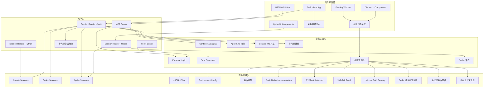

**图表来源**
- [server.py:42-261](file://mcp-server/server.py#L42-L261)
- [http_server.py:1-112](file://mcp-server/http_server.py#L1-112)
- [session_reader.py:11-124](file://claude-ui/src/session_reader.py#L11-L124)
- [SessionReader.swift:36-37](file://claude-ui/swift/Sources/SessionReader.swift#L36-L37)
- [floating_webview.py:522-551](file://claude-ui/src/floating_webview.py#L522-L551)
- [App.swift:155-183](file://claude-ui/swift/Sources/App.swift#L155-L183)

系统架构的关键特点包括：

1. **多代理支持**：支持 Claude Code、Codex 和 Qoder 三种代理类型的会话管理
2. **统一会话视图**：通过多代理会话聚合提供统一的会话选择体验
3. **代理识别机制**：通过 AgentKind 枚举和 SessionInfo 结构体实现代理识别
4. **差异化处理**：针对不同代理类型采用差异化的会话解析策略
5. **彩色视觉标识**：Swift UI 中使用彩色徽章区分不同代理类型
6. **三重实现架构**：支持 Python、Swift 和 Qoder 三种会话读取器实现
7. **多入口设计**：支持 MCP 协议、HTTP API、直接 Python 调用和 Qoder 集成四种使用方式
8. **上下文感知**：能够处理对话历史、代码事实、编辑器状态等多种上下文类型
9. **可扩展性**：模块化设计允许轻松添加新的上下文类型和增强策略
10. **稳定性**：提供降级机制和错误处理，确保系统可靠性
11. **原生性能**：Swift 实现提供更好的性能和可靠性
12. **异步处理**：使用 Task.detached 避免阻塞主线程
13. **内存优化**：1MB 尾部读取避免大文件全量加载
14. **Unicode 支持**：改进的路径解析支持非ASCII字符
15. **Qoder 集成**：完整的 Qoder 环境支持和 MCP 服务器配置

## 详细组件分析

### 多代理会话管理组件分析

**更新** 系统现已实现完整的多代理会话管理架构，支持 Claude Code、Codex 和 Qoder 会话的统一管理。

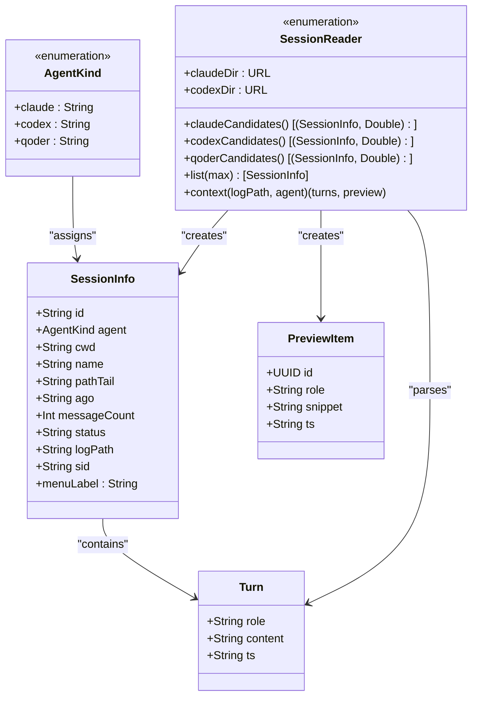

**图表来源**
- [SessionReader.swift:5](file://claude-ui/swift/Sources/SessionReader.swift#L5)
- [SessionReader.swift:16](file://claude-ui/swift/Sources/SessionReader.swift#L16)
- [SessionReader.swift:43](file://claude-ui/swift/Sources/SessionReader.swift#L43)
- [SessionReader.swift:9](file://claude-ui/swift/Sources/SessionReader.swift#L9)

多代理会话管理的核心功能包括：

1. **代理类型识别**：通过 AgentKind 枚举区分 Claude、Codex 和 Qoder 会话
2. **唯一会话ID**：使用 "agent:id" 格式生成跨代理的唯一会话标识符
3. **会话聚合**：将不同代理的会话合并到统一列表中
4. **差异化解析**：针对不同代理类型采用差异化的会话解析策略
5. **彩色徽章**：Swift UI 中使用不同颜色标识不同代理类型

**章节来源**
- [SessionReader.swift:1-304](file://claude-ui/swift/Sources/SessionReader.swift#L1-L304)

### 会话读取器组件分析

会话读取器是 Claude Code 集成的关键组件，负责从 Claude 的本地存储中提取当前活动会话的信息。

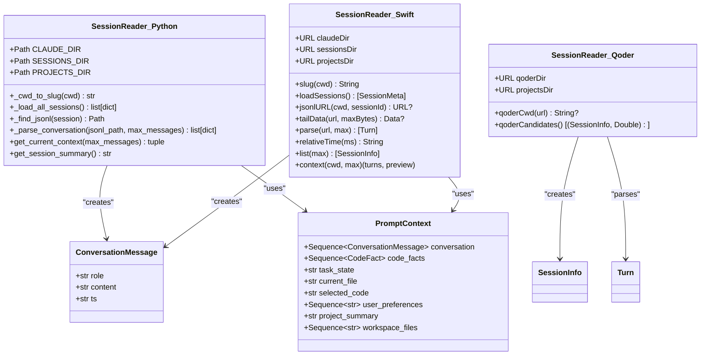

**图表来源**
- [session_reader.py:16-124](file://claude-ui/src/session_reader.py#L16-L124)
- [SessionReader.swift:38-304](file://claude-ui/swift/Sources/SessionReader.swift#L38-L304)
- [qoder_paths.js:3-21](file://qoder-ui/src/qoder_paths.js#L3-L21)

会话读取器的主要功能包括：

1. **路径转换**：将工作目录转换为 Claude Code 使用的项目目录 slug 格式
2. **会话加载**：按最后更新时间排序加载所有会话描述符
3. **JSONL 解析**：解析会话日志文件，提取对话消息和时间戳
4. **上下文提取**：返回当前活动会话的对话历史和工作目录信息
5. **Qoder 支持**：新增 Qoder 会话读取器，支持 Qoder 环境的会话管理

**章节来源**
- [session_reader.py:25-124](file://claude-ui/src/session_reader.py#L25-L124)
- [SessionReader.swift:54-304](file://claude-ui/swift/Sources/SessionReader.swift#L54-L304)
- [qoder_paths.js:3-21](file://qoder-ui/src/qoder_paths.js#L3-L21)

### Swift 异步Task.detached处理

**新增** Swift 应用程序使用 Task.detached 进行异步处理，避免阻塞主线程，显著提升用户界面响应速度。

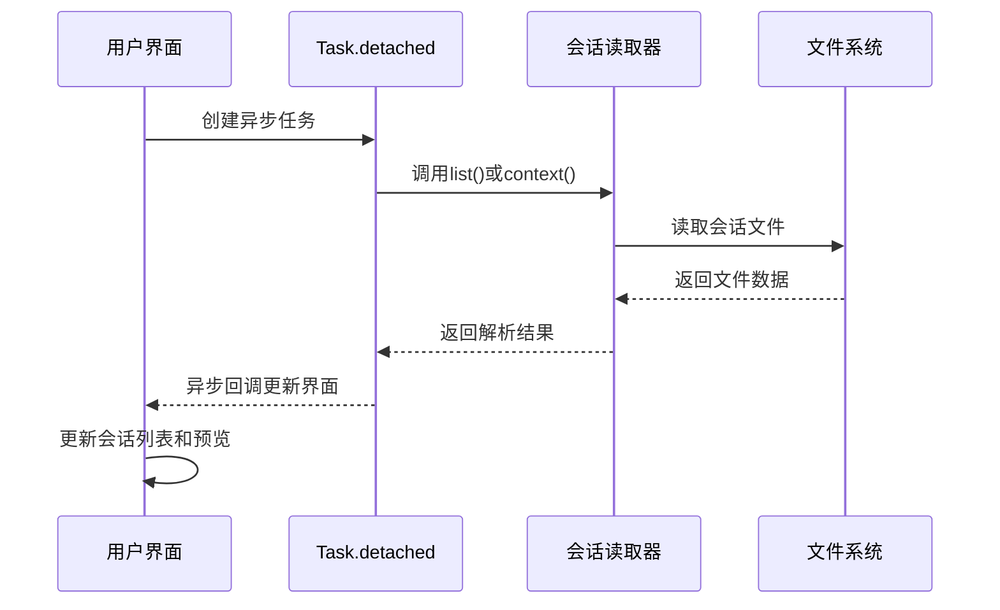

**图表来源**
- [App.swift:155-183](file://claude-ui/swift/Sources/App.swift#L155-L183)
- [SessionReader.swift:164-201](file://claude-ui/swift/Sources/SessionReader.swift#L164-L201)

异步处理的关键特性：

1. **主线程保护**：使用 Task.detached 避免阻塞用户界面
2. **并发处理**：支持同时处理多个会话请求
3. **错误隔离**：异步任务中的错误不会影响主应用程序
4. **资源管理**：自动管理异步任务的生命周期

**章节来源**
- [App.swift:155-183](file://claude-ui/swift/Sources/App.swift#L155-L183)

### 会话处理性能优化

**更新** Swift 实现引入了多项性能优化措施，显著提升大文件处理效率和内存使用效率。

#### 1MB 尾部读取优化

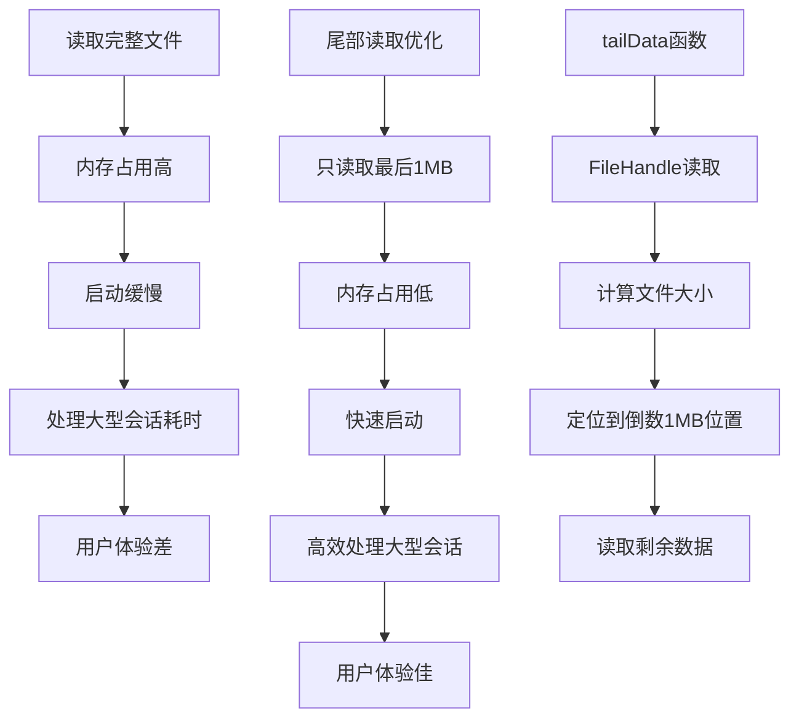

**图表来源**
- [SessionReader.swift:107-125](file://claude-ui/swift/Sources/SessionReader.swift#L107-L125)

性能优化效果：

1. **内存效率**：避免加载整个大型 JSONL 文件
2. **启动速度**：显著减少会话读取时间
3. **资源占用**：降低内存和 CPU 使用率
4. **用户体验**：提供更流畅的界面响应

#### 改进的 Unicode 路径解析

Swift 实现采用了更精确的 Unicode 路径解析策略：

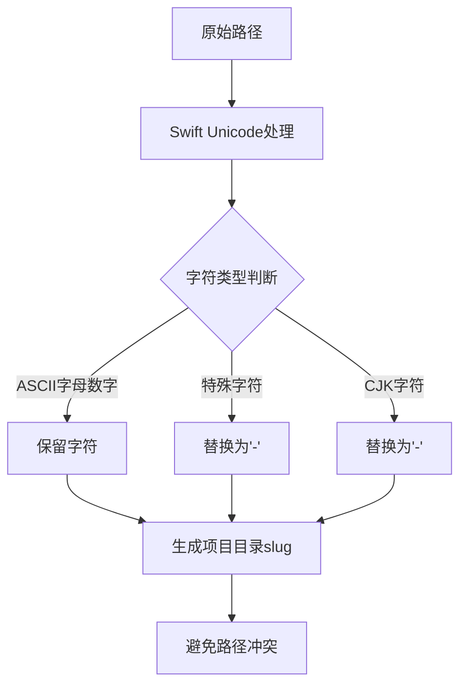

**图表来源**
- [SessionReader.swift:44-52](file://claude-ui/swift/Sources/SessionReader.swift#L44-L52)

Unicode 处理改进：

1. **ASCII 优先**：使用 `isASCII` 确保只处理 ASCII 字符
2. **精确匹配**：使用 `isLetter` 和 `isNumber` 过滤 ASCII 字母数字
3. **CJK 兼容**：避免将 CJK 字符转换为 `-`，保持项目名称可读性
4. **路径稳定性**：生成稳定的项目目录名称

**章节来源**
- [SessionReader.swift:107-125](file://claude-ui/swift/Sources/SessionReader.swift#L107-L125)
- [SessionReader.swift:44-52](file://claude-ui/swift/Sources/SessionReader.swift#L44-L52)

### Swift 原生会话读取器

**新增** Swift 原生会话读取器是系统的重要创新，提供了更好的性能和可靠性。

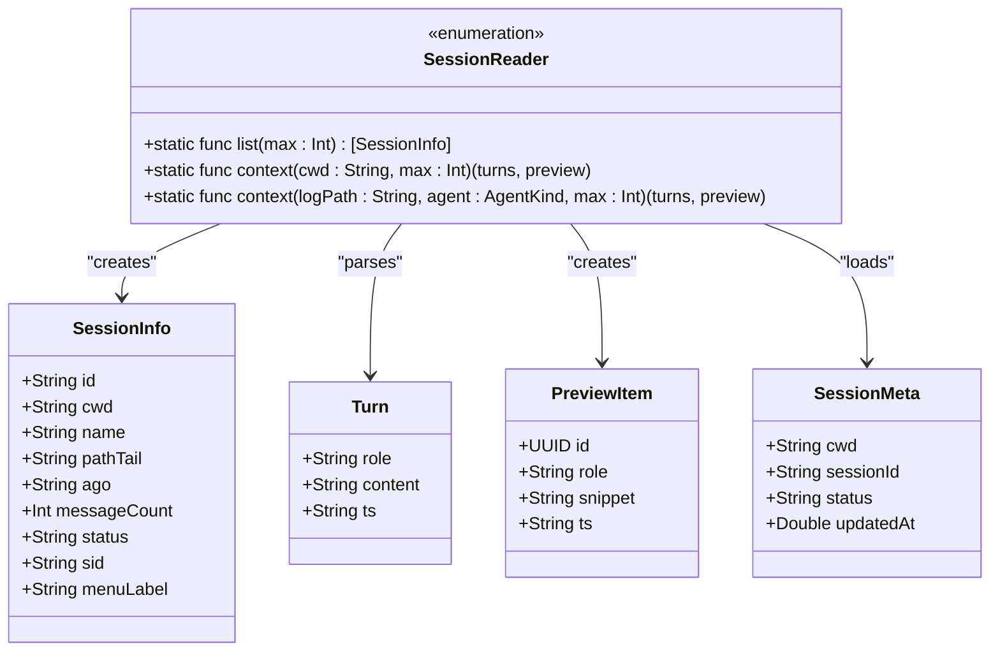

**图表来源**
- [SessionReader.swift:38-304](file://claude-ui/swift/Sources/SessionReader.swift#L38-L304)

Swift 实现的关键特性：

1. **原生性能**：直接使用 Swift Foundation 框架，无需进程间通信
2. **类型安全**：使用强类型结构体和枚举，提供编译时错误检查
3. **内存效率**：优化的内存管理和字符串处理
4. **异步处理**：支持并发操作，提高响应速度
5. **错误处理**：完善的错误处理和降级机制
6. **多代理支持**：原生支持 Claude、Codex 和 Qoder 会话管理

**章节来源**
- [SessionReader.swift:1-304](file://claude-ui/swift/Sources/SessionReader.swift#L1-L304)

### MCP 服务器组件分析

MCP 服务器实现了标准的 JSON-RPC 协议，为外部客户端提供统一的工具调用接口。

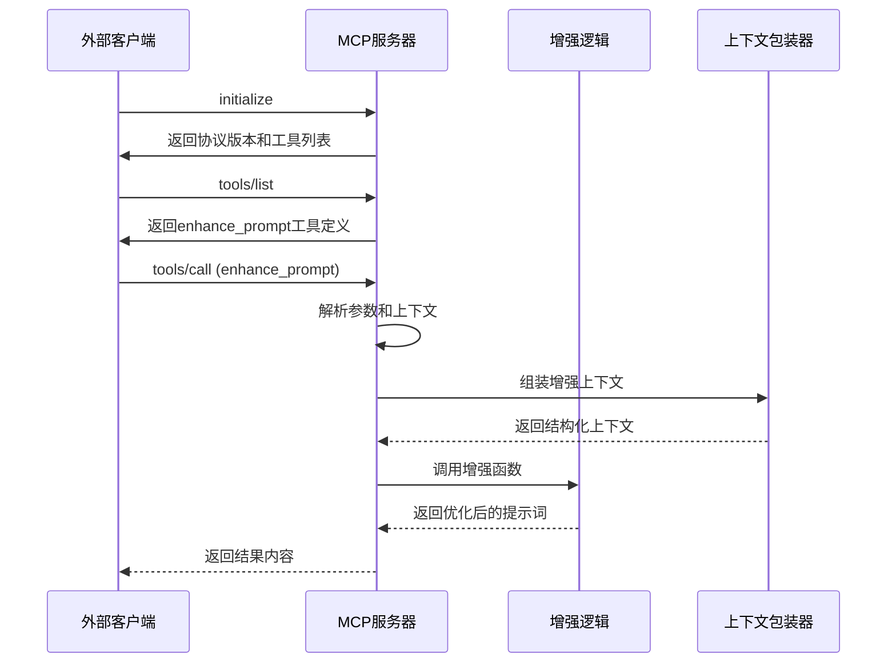

**图表来源**
- [server.py:111-261](file://mcp-server/server.py#L111-L261)
- [enhance.py:98-142](file://mcp-server/enhance.py#L98-L142)
- [context_packaging.py:91-136](file://mcp-server/context_packaging.py#L91-L136)

MCP 服务器的关键特性：

1. **协议兼容**：完全兼容标准的 JSON-RPC 协议
2. **工具注册**：动态注册和管理可用的工具
3. **参数验证**：严格的参数验证和错误处理
4. **结构化输出**：支持 JSON 格式的结构化输出

**章节来源**
- [server.py:73-110](file://mcp-server/server.py#L73-L110)

### 上下文包装器组件分析

上下文包装器是系统中最复杂的组件之一，负责将各种类型的上下文信息整合成适合增强器使用的格式。

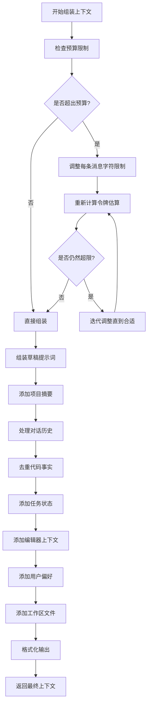

**图表来源**
- [context_packaging.py:91-136](file://mcp-server/context_packaging.py#L91-L136)
- [context_packaging.py:138-220](file://mcp-server/context_packaging.py#L138-L220)

上下文包装器的核心算法包括：

1. **智能截断**：保持消息开头和结尾内容，中间部分进行省略
2. **预算控制**：基于令牌估算的上下文大小控制
3. **去重合并**：合并相同文件路径的代码事实
4. **格式化输出**：生成结构化的文本格式

**章节来源**
- [context_packaging.py:43-136](file://mcp-server/context_packaging.py#L43-L136)

### 增强逻辑组件分析

增强逻辑组件实现了核心的提示词重写和优化算法，确保输出符合严格的要求。

```mermaid
classDiagram
class EnhanceLogic {
+str INSTRUCTION
+str MODEL
+_load_dashscope_key() str
+_call_dashscope_real(user_content, system_instruction) str
+clean(text) str
+enhance_prompt(text, context, generate_fn) str
+enhance_next_prompt(text, prompt_context, generate_fn) str
-_simple_fallback_enhance(text, context) str
}
class DashscopeAPI {
+str BASE_URL
+post(url, headers, payload) Response
+validate_status(response) bool
}
EnhanceLogic --> DashscopeAPI : "使用"
note for EnhanceLogic : "核心增强逻辑\n- 严格重写指令\n- 不执行任务\n- 清理输出格式\n- 支持降级机制"
```

**图表来源**
- [enhance.py:17-175](file://mcp-server/enhance.py#L17-L175)

增强逻辑的关键特性：

1. **严格指令**：确保只进行提示词重写，不执行任何操作
2. **多语言支持**：专门为中文优化的令牌估算算法
3. **降级机制**：在没有 API 密钥时提供简单的回退方案
4. **输出清理**：移除 Markdown 代码围栏和外层引号

**章节来源**
- [enhance.py:81-142](file://mcp-server/enhance.py#L81-L142)

### HTTP 服务器组件分析

HTTP 服务器为 Codex 等外部应用提供本地 API 接口，支持按钮形式的输入优化功能。

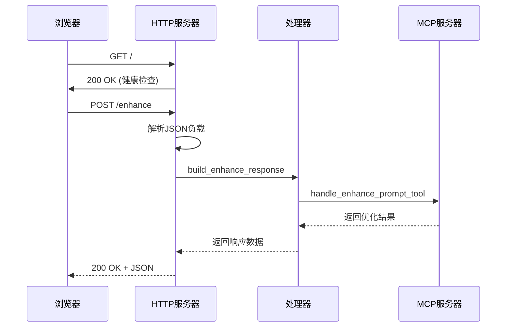

**图表来源**
- [http_server.py:39-112](file://mcp-server/http_server.py#L39-L112)
- [server.py:73-110](file://mcp-server/server.py#L73-L110)

HTTP 服务器的设计考虑：

1. **CORS 支持**：允许跨域请求，便于浏览器扩展使用
2. **错误处理**：完善的异常处理和错误响应
3. **健康检查**：提供简单的健康检查端点
4. **线程安全**：使用多线程 HTTP 服务器处理并发请求

**章节来源**
- [http_server.py:22-112](file://mcp-server/http_server.py#L22-L112)

## 多代理会话管理

**新增** 系统现已实现完整的多代理会话管理架构，支持 Claude Code、Codex 和 Qoder 会话的统一管理。

### AgentKind 枚举设计

```mermaid
classDiagram
class AgentKind {
<<enumeration>>
+claude : String
+codex : String
+qoder : String
}
note for AgentKind : "代理类型枚举\n- claude : Claude Code 会话\n- codex : Codex 会话\n- qoder : Qoder 会话\n- 用于会话识别和UI徽章显示"
```

**图表来源**
- [SessionReader.swift:5](file://claude-ui/swift/Sources/SessionReader.swift#L5)

AgentKind 枚举的关键特性：

1. **代理类型标识**：通过字符串值标识不同的代理类型
2. **UI徽章支持**：用于 Swift UI 中显示彩色徽章
3. **会话ID前缀**：为唯一会话ID提供代理前缀标识
4. **差异化处理**：支持针对不同代理类型的差异化处理策略

### SessionInfo 结构体扩展

**更新** SessionInfo 结构体已扩展以支持多代理会话管理：

```mermaid
classDiagram
class SessionInfo {
+String id
+AgentKind agent
+String cwd
+String name
+String pathTail
+String ago
+Int messageCount
+String status
+String logPath
+String sid
+menuLabel : String
}
note for SessionInfo : "扩展的会话信息结构体\n- id : 唯一会话ID包含代理前缀\n- agent : 代理类型标识\n- logPath : 会话日志文件路径\n- menuLabel : 菜单显示标签"
```

**图表来源**
- [SessionReader.swift:16](file://claude-ui/swift/Sources/SessionReader.swift#L16)

SessionInfo 结构体的扩展功能：

1. **唯一会话ID**：使用 "agent:id" 格式生成跨代理的唯一标识符
2. **代理识别**：包含 AgentKind 字段用于代理类型识别
3. **日志路径**：包含 logPath 字段用于会话上下文加载
4. **菜单标签**：menuLabel 属性结合代理状态和会话信息生成显示标签

### 多代理会话聚合

**更新** SessionReader 已完全重写以支持多代理会话聚合：

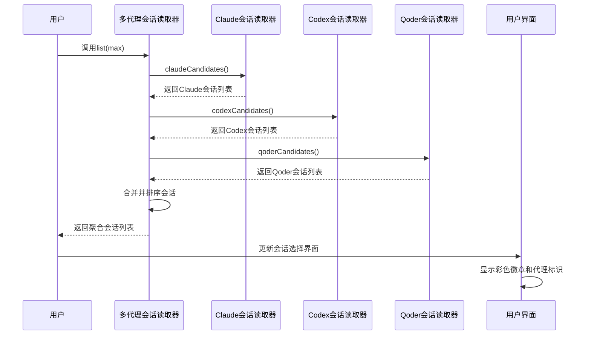

**图表来源**
- [SessionReader.swift:286](file://claude-ui/swift/Sources/SessionReader.swift#L286)
- [SessionReader.swift:287](file://claude-ui/swift/Sources/SessionReader.swift#L287)
- [SessionReader.swift:288](file://claude-ui/swift/Sources/SessionReader.swift#L288)

多代理会话聚合的关键特性：

1. **会话合并**：将 Claude、Codex 和 Qoder 会话合并到统一列表
2. **活动排序**：按最后更新时间对所有会话进行排序
3. **代理前缀**：为每个会话ID添加代理前缀确保唯一性
4. **差异化处理**：针对不同代理类型采用差异化的解析策略

### Swift UI 彩色徽章显示

**新增** Swift UI 中实现了彩色徽章显示不同代理类型的功能：

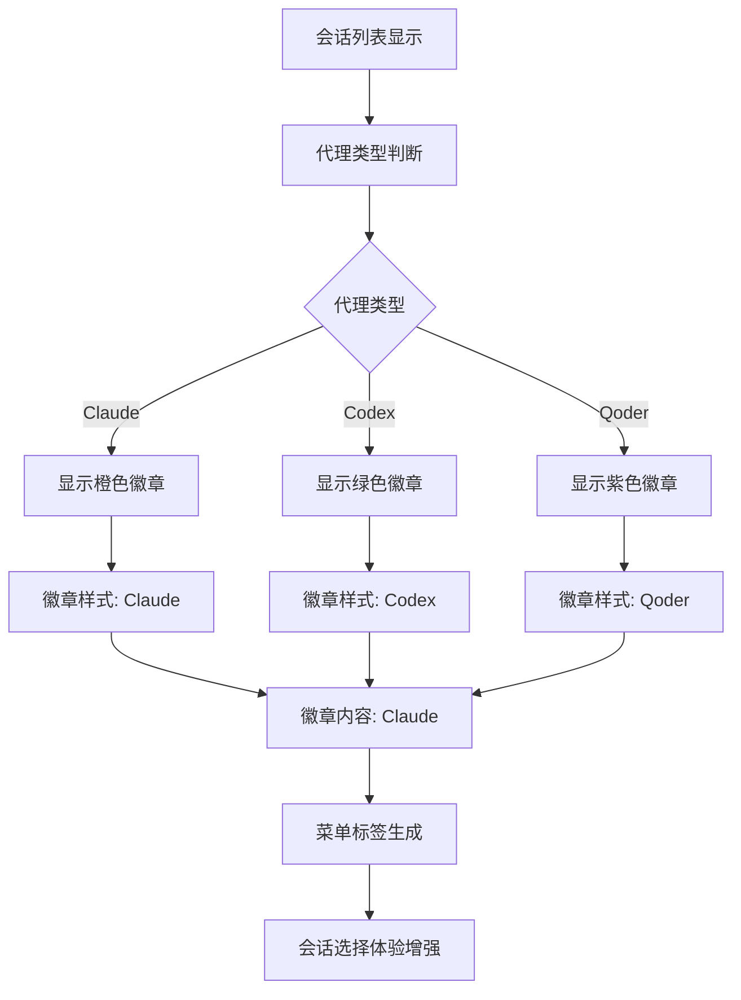

**图表来源**
- [IslandView.swift:208](file://claude-ui/swift/Sources/IslandView.swift#L208)
- [IslandView.swift:213](file://claude-ui/swift/Sources/IslandView.swift#L213)

彩色徽章的设计特点：

1. **视觉区分**：Claude 使用橙色（#FFBA60），Codex 使用绿色（#66D9A5），Qoder 使用紫色（#B294FF）
2. **徽章样式**：使用胶囊形状，半透明背景增强可读性
3. **字体设计**：8号粗体字体，确保小尺寸下的清晰显示
4. **动态生成**：根据代理类型动态生成徽章样式和颜色

**章节来源**
- [SessionReader.swift:1-304](file://claude-ui/swift/Sources/SessionReader.swift#L1-L304)
- [IslandView.swift:208-221](file://claude-ui/swift/Sources/IslandView.swift#L208-L221)

## Qoder 集成支持

**新增** 系统现已完整支持 Qoder 集成，提供与 Claude Code 类似的会话管理体验。

### Qoder 会话路径解析

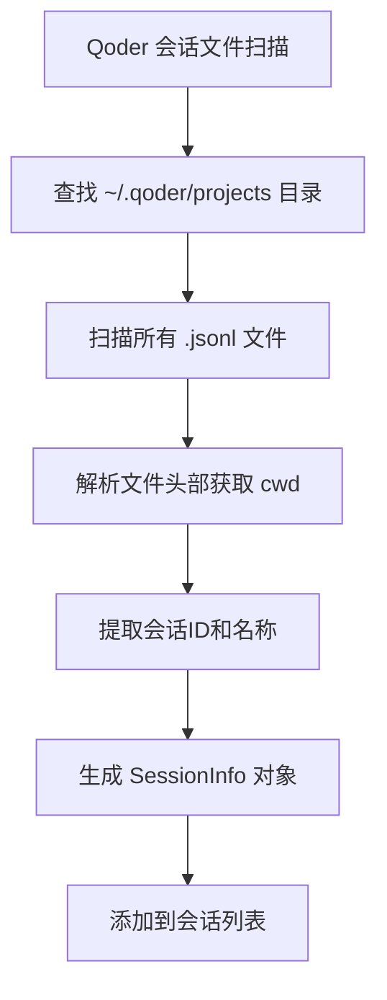

**图表来源**
- [SessionReader.swift:252](file://claude-ui/swift/Sources/SessionReader.swift#L252)
- [SessionReader.swift:264](file://claude-ui/swift/Sources/SessionReader.swift#L264)
- [SessionReader.swift:272](file://claude-ui/swift/Sources/SessionReader.swift#L272)

Qoder 会话解析的关键特性：

1. **路径定位**：通过 `~/.qoder/projects` 目录定位会话文件
2. **cwd 提取**：从文件头部解析工作目录信息
3. **会话ID生成**：使用文件名派生会话ID，去除 "task-" 前缀
4. **会话名称**：使用工作目录最后一级作为会话名称
5. **代理标识**：设置 agent 为 .qoder 类型

### Qoder UI 集成

**新增** Qoder 环境提供了专门的 UI 集成支持：

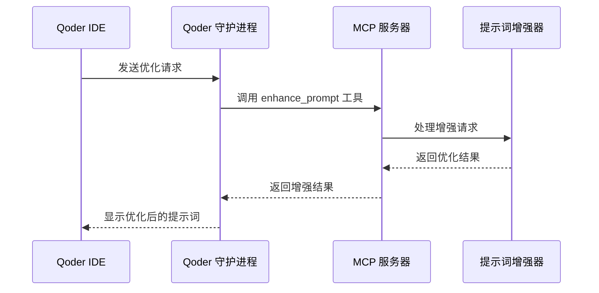

**图表来源**
- [qoder-optimize-input.js:9](file://qoder-ui/bin/qoder-optimize-input.js#L9)
- [qoder_paths.js:3](file://qoder-ui/src/qoder_paths.js#L3)

Qoder 集成的关键组件：

1. **守护进程**：运行 `qoder-optimize-input.js` 处理 Qoder 请求
2. **路径解析**：通过 `qoder_paths.js` 获取 Qoder 支持目录
3. **MCP 集成**：通过 MCP 协议与增强器通信
4. **会话管理**：支持 Qoder 环境的会话读取和管理

### Qoder 集成配置

**新增** Qoder 集成提供了完整的配置支持：

1. **MCP 配置**：在 `~/.qoder/mcp.json` 中配置 MCP 服务器
2. **守护进程安装**：通过 `install-agent` 命令安装 LaunchAgent
3. **环境变量**：支持 `QODER_SUPPORT_DIR` 环境变量自定义路径
4. **端口管理**：通过 `DevToolsActivePort` 文件管理调试端口

**章节来源**
- [SessionReader.swift:232-304](file://claude-ui/swift/Sources/SessionReader.swift#L232-L304)
- [qoder-integration.md:1-40](file://docs/qoder-integration.md#L1-L40)
- [qoder_paths.js:3-21](file://qoder-ui/src/qoder_paths.js#L3-L21)
- [qoder-optimize-input.js:9-28](file://qoder-ui/bin/qoder-optimize-input.js#L9-L28)

## 增强的上下文处理能力

**更新** 系统现已将上下文处理能力从 20 轮扩展到 40 轮，显著提升长对话的处理能力。

### 上下文轮次扩展

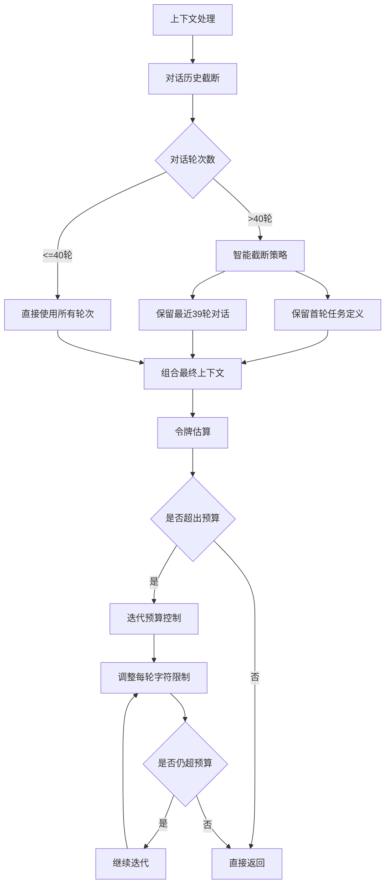

**图表来源**
- [SessionReader.swift:148](file://claude-ui/swift/Sources/SessionReader.swift#L148)
- [SessionReader.swift:225](file://claude-ui/swift/Sources/SessionReader.swift#L225)
- [SessionReader.swift:276](file://claude-ui/swift/Sources/SessionReader.swift#L276)

上下文处理能力的增强：

1. **轮次扩展**：从 20 轮扩展到 40 轮，支持更长的对话历史
2. **智能保留**：保留首轮任务定义，确保上下文完整性
3. **预算控制**：通过迭代算法精确控制上下文大小
4. **令牌估算**：使用中文优化的令牌估算算法
5. **硬截断兜底**：在极端情况下提供硬截断保护

### 上下文预算控制

**更新** 上下文预算控制机制得到了显著改进：

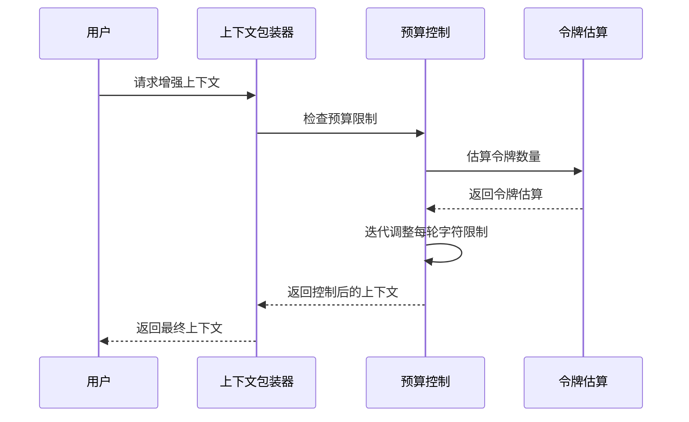

**图表来源**
- [context_packaging.py:112](file://mcp-server/context_packaging.py#L112)
- [context_packaging.py:120](file://mcp-server/context_packaging.py#L120)
- [context_packaging.py:132](file://mcp-server/context_packaging.py#L132)

预算控制的关键改进：

1. **智能截断**：保留对话开头和结尾，中间部分进行省略
2. **预算迭代**：最多迭代 4 次调整每轮字符限制
3. **硬截断保护**：当非对话内容超预算时提供硬截断
4. **中文优化**：使用专门的中文令牌估算算法

**章节来源**
- [SessionReader.swift:148-149](file://claude-ui/swift/Sources/SessionReader.swift#L148-L149)
- [SessionReader.swift:225-226](file://claude-ui/swift/Sources/SessionReader.swift#L225-L226)
- [SessionReader.swift:276](file://claude-ui/swift/Sources/SessionReader.swift#L276)
- [context_packaging.py:91-136](file://mcp-server/context_packaging.py#L91-L136)

## 会话 ID 显示增强

**更新** 会话 ID 显示功能得到了显著增强，通过多种信息维度来区分相似的会话，提升用户体验。

### 会话标识符设计

```mermaid
flowchart TD
A[会话标识符生成] --> B[代理前缀]
B --> C[会话ID]
C --> D[组合最终ID]
D --> E[显示在菜单中]
A --> F[路径尾部显示]
A --> G[相对时间戳]
A --> H[消息数量]
A --> I[短ID显示]
F --> E
G --> E
H --> E
I --> E
```

**图表来源**
- [SessionReader.swift:144](file://claude-ui/swift/Sources/SessionReader.swift#L144)
- [SessionReader.swift:221](file://claude-ui/swift/Sources/SessionReader.swift#L221)
- [SessionReader.swift:272](file://claude-ui/swift/Sources/SessionReader.swift#L272)

会话标识符的增强特性：

1. **代理前缀**：Claude 使用 "claude:"，Codex 使用 "codex:"，Qoder 使用 "qoder:"
2. **短ID显示**：显示会话ID的前8位字符
3. **路径尾部**：显示工作目录的最后两级路径
4. **相对时间**：显示会话更新的相对时间
5. **消息数量**：显示会话中的对话条数

### 会话列表格式优化

会话选项的显示格式经过精心设计，确保在有限的空间内提供最多的信息：

- **忙碌状态指示**：使用红色圆点 `🔴` 表示当前忙碌的会话
- **代理类型徽章**：使用彩色徽章显示会话所属的代理类型
- **项目名称**：显示工作目录的最后一级作为项目名称
- **路径尾部**：显示工作目录的最后两级路径，用于区分同名项目
- **相对时间**：显示会话更新的相对时间，如 "5分钟前"、"2小时前"
- **消息数量**：显示会话中的对话条数，帮助判断会话规模
- **短会话ID**：显示会话ID的前8位，用于快速识别

### 会话消歧算法

**更新** 会话消歧系统通过以下算法区分相似会话：

```mermaid
flowchart TD
A[会话比较] --> B[代理类型比较]
B --> |不同| C[直接区分]
B --> |相同| D[工作目录比较]
D --> |不同| C
D --> |相同| E[会话ID比较]
E --> |不同| C
E --> |相同| F[更新时间比较]
F --> |不同| C
F --> |相同| G[创建时间比较]
G --> |不同| C
G --> |相同| H[随机标识符]
H --> C
```

**图表来源**
- [floating_webview.py:348](file://claude-ui/src/floating_webview.py#L348)
- [floating_webview.py:352](file://claude-ui/src/floating_webview.py#L352)

会话消歧的关键策略：

1. **代理类型优先**：不同代理类型的会话优先区分
2. **工作目录次优**：相同代理类型下按工作目录区分
3. **会话ID第三**：相同工作目录下按会话ID区分
4. **时间戳第四**：相同会话ID下按时间戳区分
5. **随机标识**：完全相同的情况下添加随机标识符

**章节来源**
- [floating_webview.py:337-363](file://claude-ui/src/floating_webview.py#L337-L363)
- [floating_webview.py:348-354](file://claude-ui/src/floating_webview.py#L348-L354)
- [SessionReader.swift:286-289](file://claude-ui/swift/Sources/SessionReader.swift#L286-L289)

## Swift 异步Task.detached处理

**新增** Swift 应用程序使用 Task.detached 进行异步处理，这是性能优化的关键组成部分。

### 异步架构设计

```mermaid
graph TB
subgraph "Swift 异步处理架构"
A[用户界面] --> B[Task.detached]
B --> C[会话读取器]
C --> D[文件系统操作]
D --> E[数据解析]
E --> F[结果返回]
F --> G[主线程更新]
A --> H[EnhanceClient异步调用]
H --> I[网络请求]
I --> J[服务器响应]
J --> K[结果处理]
K --> L[用户界面更新]
end
```

**图表来源**
- [App.swift:155-201](file://claude-ui/swift/Sources/App.swift#L155-L201)
- [EnhanceClient.swift:24-50](file://claude-ui/swift/Sources/EnhanceClient.swift#L24-L50)

### 异步任务管理

Swift 应用程序中的异步任务管理策略：

1. **会话列表加载**：使用 `Task.detached { SessionReader.list() }` 异步加载会话
2. **会话上下文加载**：使用 `Task.detached { SessionReader.context(cwd: cwd) }` 异步加载对话
3. **增强请求处理**：使用 `async throws -> String` 方法处理增强请求
4. **主线程更新**：确保 UI 更新在主线程中进行

### 性能优化效果

异步处理带来的性能提升：

1. **界面响应性**：用户界面始终保持响应，不会因为文件读取而卡顿
2. **并发处理**：支持同时处理多个异步任务
3. **资源隔离**：异步任务中的错误不会影响主应用程序
4. **内存管理**：Swift 的 ARC 自动管理异步任务的内存使用

**章节来源**
- [App.swift:155-201](file://claude-ui/swift/Sources/App.swift#L155-L201)
- [EnhanceClient.swift:24-50](file://claude-ui/swift/Sources/EnhanceClient.swift#L24-L50)

## 会话处理性能优化

**更新** Swift 实现引入了多项性能优化措施，显著提升系统整体性能。

### 1MB 尾部读取优化

Swift 实现采用了智能的文件读取策略，避免加载整个大型会话文件：

```mermaid
sequenceDiagram
participant Reader as 会话读取器
participant FileHandle as 文件句柄
participant FileSystem as 文件系统
Reader->>FileHandle : 打开JSONL文件
FileHandle->>FileSystem : 获取文件大小
FileSystem-->>FileHandle : 返回文件大小
Reader->>FileHandle : 定位到倒数1MB位置
FileHandle->>FileSystem : 读取剩余数据
FileSystem-->>FileHandle : 返回数据
Reader->>Reader : 解析JSONL行
Reader-->>Caller : 返回对话历史
```

**图表来源**
- [SessionReader.swift:107-125](file://claude-ui/swift/Sources/SessionReader.swift#L107-L125)

优化策略细节：

1. **智能定位**：计算文件大小并定位到倒数1MB位置
2. **增量读取**：只读取文件末尾部分，避免全量加载
3. **数据完整性**：处理文件被截断的情况，丢弃不完整的首行
4. **内存效率**：限制最大读取字节数为1MB

### 改进的 Unicode 路径解析

Swift 实现采用了更精确的 Unicode 字符处理策略：

```mermaid
flowchart TD
A[工作目录路径] --> B[字符遍历]
B --> C{字符类型判断}
C --> |ASCII字母数字| D[保留字符]
C --> |ASCII标点符号| E[保留字符]
C --> |其他ASCII| F[替换为'-']
C --> |Unicode字符| G[替换为'-']
D --> H[生成slug]
E --> H
F --> H
G --> H
H --> I[项目目录名称]
```

**图表来源**
- [SessionReader.swift:44-52](file://claude-ui/swift/Sources/SessionReader.swift#L44-L52)

Unicode 处理改进：

1. **ASCII 优先**：使用 `isASCII` 确保只处理 ASCII 字符
2. **精确字符过滤**：使用 `isLetter` 和 `isNumber` 过滤允许的字符
3. **CJK 兼容性**：避免将 CJK 字符转换为 `-`，保持项目名称可读性
4. **路径稳定性**：生成稳定的项目目录名称，避免路径冲突

### 非ASCII项目路径支持

Swift 实现提供了更好的非ASCII字符支持：

1. **Unicode 字符处理**：正确处理 CJK、阿拉伯文、西里尔文等 Unicode 字符
2. **路径编码**：使用 UTF-8 编码处理国际化路径
3. **文件系统兼容**：确保生成的项目目录在不同操作系统上都能正常工作
4. **显示优化**：在用户界面中正确显示非ASCII字符

**章节来源**
- [SessionReader.swift:107-125](file://claude-ui/swift/Sources/SessionReader.swift#L107-L125)
- [SessionReader.swift:44-52](file://claude-ui/swift/Sources/SessionReader.swift#L44-L52)

## Swift 原生会话读取器

**新增** Swift 原生会话读取器是系统架构的重大升级，提供了更好的性能和可靠性。

### 核心架构设计

```mermaid
graph TB
subgraph "Swift SessionReader 架构"
A[SessionReader Enum] --> B[SessionInfo Struct]
A --> C[Turn Struct]
A --> D[PreviewItem Struct]
A --> E[SessionMeta Struct]
B --> F[菜单标签生成]
C --> G[对话消息解析]
D --> H[预览项创建]
E --> I[会话元数据管理]
A --> J[文件系统操作]
A --> K[JSON 解析]
A --> L[时间计算]
A --> M[异步处理]
A --> N[性能优化]
A --> O[多代理支持]
A --> P[AgentKind 枚举]
A --> Q[唯一会话ID]
A --> R[Qoder 集成]
end
```

**图表来源**
- [SessionReader.swift:38-304](file://claude-ui/swift/Sources/SessionReader.swift#L38-L304)

### 数据结构设计

Swift 实现采用了类型安全的数据结构设计：

1. **SessionInfo**：表示可选择的 Claude 会话，包含菜单标签生成逻辑
2. **Turn**：表示单个对话回合，与 Python 实现保持完全兼容
3. **PreviewItem**：表示压缩上下文预览项
4. **SessionMeta**：表示会话元数据，包含工作目录、会话ID、状态和更新时间

### 文件系统操作

Swift 实现直接使用 Foundation 框架进行文件系统操作：

```mermaid
sequenceDiagram
participant Swift as Swift SessionReader
participant FS as 文件系统
participant JSON as JSON 解析器
Swift->>FS : 读取 ~/.claude/sessions
FS-->>Swift : 返回会话文件列表
Swift->>JSON : 解析会话元数据
JSON-->>Swift : 返回会话信息
Swift->>FS : 查找对应的 .jsonl 文件
FS-->>Swift : 返回文件路径
Swift->>JSON : 解析对话历史
JSON-->>Swift : 返回对话消息
Swift-->>Caller : 返回结构化数据
```

**图表来源**
- [SessionReader.swift:61-105](file://claude-ui/swift/Sources/SessionReader.swift#L61-L105)

### 性能优化特性

Swift 实现相比 Python 实现有以下性能优势：

1. **零进程开销**：直接在内存中解析文件，无需子进程启动
2. **类型安全**：编译时类型检查，运行时更少的错误处理
3. **内存管理**：Swift 的 ARC 提供更高效的内存管理
4. **并发支持**：内置的并发编程支持，提高多任务处理能力
5. **字符串处理**：优化的 Unicode 和字符串处理算法
6. **异步处理**：使用 Task.detached 避免阻塞主线程
7. **内存优化**：1MB 尾部读取避免大文件全量加载
8. **Unicode 支持**：改进的路径解析支持非ASCII字符
9. **多代理支持**：原生支持多代理会话管理
10. **彩色徽章**：Swift UI 中的彩色徽章显示
11. **Qoder 集成**：完整的 Qoder 环境支持

**章节来源**
- [SessionReader.swift:1-304](file://claude-ui/swift/Sources/SessionReader.swift#L1-L304)

## 会话消歧系统

会话消歧系统是本次更新的重要功能增强，专门解决多会话环境下的选择困难问题。该系统通过多种信息维度来区分相似的会话，显著提升了用户体验。

### 核心功能特性

```mermaid
flowchart TD
A[会话列表显示] --> B[路径尾部显示]
A --> C[相对时间戳]
A --> D[缩短会话ID]
A --> E[状态指示器]
A --> F[代理类型徽章]
B --> G[显示最近两级目录]
C --> H[动态计算时间差]
D --> I[前8位会话ID]
E --> J[忙碌状态红色指示]
F --> K[彩色徽章显示]
```

**图表来源**
- [floating_webview.py:522-551](file://claude-ui/src/floating_webview.py#L522-L551)
- [floating_webview.py:348-354](file://claude-ui/src/floating_webview.py#L348-L354)
- [IslandView.swift:186](file://claude-ui/swift/Sources/IslandView.swift#L186)

### 会话列表格式设计

会话选项的显示格式经过精心设计，确保在有限的空间内提供最多的信息：

- **忙碌状态指示**：使用红色圆点 `🔴` 表示当前忙碌的会话
- **项目名称**：显示工作目录的最后一级作为项目名称
- **路径尾部**：显示工作目录的最后两级路径，用于区分同名项目
- **相对时间**：显示会话更新的相对时间，如 "5分钟前"、"2小时前"
- **消息数量**：显示会话中的对话条数，帮助判断会话规模
- **代理类型徽章**：使用彩色徽章显示会话所属的代理类型

### 时间戳处理机制

系统实现了智能的时间戳处理机制，提供人性化的时间显示：

```mermaid
sequenceDiagram
participant User as 用户
participant System as 会话系统
participant Time as 时间计算
User->>System : 刷新会话列表
System->>Time : 获取当前时间毫秒值
Time-->>System : 当前时间戳
System->>System : 计算会话更新时间差
System->>System : 格式化相对时间
System-->>User : 显示人性化时间
```

**图表来源**
- [floating_webview.py:66-75](file://claude-ui/src/floating_webview.py#L66-L75)

时间显示规则：
- 小于60秒：显示 "刚刚"
- 小于3600秒：显示 "X分钟前"
- 小于86400秒：显示 "X小时前"
- 其他：显示 "X天前"

### 路径尾部算法

为了有效区分同名项目，系统实现了智能的路径尾部提取算法：

```mermaid
flowchart TD
A[完整工作目录] --> B[分割路径段]
B --> C{路径段数量}
C --> |>=2| D[取最后两级路径]
C --> |<2| E[使用完整路径]
D --> F[组合显示路径]
E --> F
F --> G[显示在会话选项中]
```

**图表来源**
- [floating_webview.py:538-539](file://claude-ui/src/floating_webview.py#L538-L539)

### 会话ID缩短策略

为了在有限的显示空间内提供足够的识别信息，系统对会话ID进行了智能缩短：

- 显示会话ID的前8个字符
- 在悬停提示中显示完整会话ID
- 结合路径尾部和相对时间提供多重识别依据
- **新增** 多代理环境下显示代理前缀标识

**章节来源**
- [floating_webview.py:522-551](file://claude-ui/src/floating_webview.py#L522-L551)
- [floating_webview.py:348-354](file://claude-ui/src/floating_webview.py#L348-L354)

## 会话选择体验增强

会话选择体验的增强主要体现在自动选择和即时反馈两个方面，确保用户能够快速准确地切换到目标会话。

### 自动会话选择机制

系统实现了智能的会话选择逻辑，减少用户的操作步骤：

```mermaid
flowchart TD
A[刷新会话列表] --> B{是否有上次选择的会话}
B --> |是| C{会话仍然存在?}
B --> |否| D[选择第一个会话]
C --> |是| E[恢复上次选择]
C --> |否| D
D --> F[自动切换到新会话]
E --> G[保持当前选择]
F --> H[触发会话切换]
G --> H
H --> I[显示会话预览]
```

**图表来源**
- [floating_webview.py:356-361](file://claude-ui/src/floating_webview.py#L356-L361)

### 即时会话预览

当用户选择会话时，系统会立即显示会话的预览信息，帮助用户确认选择：

- **压缩的消息预览**：显示最近40条对话的摘要
- **角色标识**：使用 👤 和 🤖 符号区分用户和AI消息
- **时间戳显示**：显示每条消息的相对时间
- **加载状态**：在预览加载时显示进度指示
- **代理类型标识**：通过彩色徽章显示会话所属代理类型

### 会话切换流程

```mermaid
sequenceDiagram
participant User as 用户
participant UI as 用户界面
participant API as 会话API
participant Reader as 会话读取器
User->>UI : 选择会话
UI->>API : select_session(cwd)
API->>Reader : 解析会话数据
Reader-->>API : 返回对话预览
API-->>UI : 返回预览信息
UI->>UI : 显示预览列表
UI->>UI : 更新标题显示
```

**图表来源**
- [floating_webview.py:365-381](file://claude-ui/src/floating_webview.py#L365-L381)
- [floating_webview.py:553-576](file://claude-ui/src/floating_webview.py#L553-L576)

会话切换过程中的用户体验优化：

1. **即时状态反馈**：显示 "⏳ 正在压缩最近 40 条…" 提示
2. **预览信息展示**：显示压缩后的对话摘要
3. **标题更新**：在展开状态下显示项目名称
4. **错误处理**：优雅处理会话切换失败的情况
5. **代理类型显示**：通过彩色徽章提供代理类型视觉标识

**章节来源**
- [floating_webview.py:365-381](file://claude-ui/src/floating_webview.py#L365-L381)
- [floating_webview.py:553-576](file://claude-ui/src/floating_webview.py#L553-L576)

## 依赖关系分析

系统各组件之间的依赖关系清晰明确，形成了稳定的模块化架构：

```mermaid
graph TB
subgraph "外部依赖"
A[DASHSCOPE API]
B[JSON-RPC 协议]
C[HTTP 协议]
D[文件系统]
E[pywebview]
F[AppKit]
G[Foundation Framework]
H[Swift Concurrency]
I[Task.detached]
J[FileHandle]
K[UTF-8 编码]
L[Unicode 处理]
M[多代理支持]
N[彩色徽章显示]
O[AgentKind 枚举]
P[SessionInfo 扩展]
Q[Qoder 集成]
R[上下文轮次扩展]
S[会话ID显示增强]
end
subgraph "内部模块"
T[enhance.py]
U[context_packaging.py]
V[server.py]
W[http_server.py]
X[session_reader.py]
Y[SessionReader.swift]
Z[floating_webview.py]
AA[draggable_card.py]
BB[invoko_card.py]
CC[App.swift]
DD[IslandView.swift]
EE[EnhanceClient.swift]
FF[Selection.swift]
GG[build.sh]
HH[multi_round_smoke.py]
II[edge_round_smoke.py]
JJ[qoder-integration.md]
KK[qoder_paths.js]
LL[qoder-optimize-input.js]
MM[daemon.test.js]
NN[TECH_SCHEME.md]
end
subgraph "配置文件"
OO[.env 文件]
PP[package.json]
QQ[SKILL.md]
RR[build.sh]
SS[TECH_SCHEME.md]
TT[qoder-integration.md]
UU[daemon.test.js]
end
subgraph "性能优化"
VV[1MB 尾部读取]
WW[异步处理]
XX[Unicode 支持]
YY[内存优化]
ZZ[多代理支持]
AAA[彩色徽章]
BBB[AgentKind枚举]
CCC[SessionInfo扩展]
DDD[Qoder集成]
EEE[上下文轮次扩展]
FFF[会话ID显示增强]
end
subgraph "测试文件"
GGG[test_enhance.py]
HHH[test_context_packaging.py]
III[multi_round_smoke.py]
JJJ[edge_round_smoke.py]
KKK[daemon.test.js]
LLL[TECH_SCHEME.md]
MMM[qoder-integration.md]
```

**图表来源**
- [enhance.py:22-47](file://mcp-server/enhance.py#L22-L47)
- [server.py:35-41](file://mcp-server/server.py#L35-L41)
- [http_server.py:13-16](file://mcp-server/http_server.py#L13-L16)
- [session_reader.py:11-13](file://claude-ui/src/session_reader.py#L11-L13)
- [SessionReader.swift:1](file://claude-ui/swift/Sources/SessionReader.swift#L1)
- [floating_webview.py:17](file://claude-ui/src/floating_webview.py#L17)

依赖关系的特点：

1. **单向依赖**：依赖关系都是单向的，避免循环依赖
2. **抽象接口**：通过导入语句实现松耦合
3. **环境隔离**：外部 API 密钥通过环境变量管理
4. **配置驱动**：通过配置文件控制运行时行为
5. **UI框架集成**：pywebview 和 AppKit 提供原生界面支持
6. **Swift 原生支持**：Foundation 和 Swift Concurrency 提供高性能实现
7. **异步支持**：Task.detached 提供异步处理能力
8. **文件系统优化**：FileHandle 提供高效的文件操作
9. **Unicode 支持**：UTF-8 编码和 Unicode 处理确保国际化兼容性
10. **多代理支持**：AgentKind 枚举和 SessionInfo 扩展支持多代理会话管理
11. **彩色徽章显示**：Swift UI 中的彩色徽章提供代理类型视觉标识
12. **Qoder 集成**：完整的 Qoder 环境支持和 MCP 服务器配置
13. **上下文轮次扩展**：从 20 轮扩展到 40 轮的上下文处理能力
14. **会话ID显示增强**：多维度的会话标识符显示系统

**章节来源**
- [enhance.py:17-21](file://mcp-server/enhance.py#L17-L21)
- [server.py:35-41](file://mcp-server/server.py#L35-L41)

## 性能考虑

系统在设计时充分考虑了性能优化，采用了多种策略来确保高效的运行表现：

### 令牌估算优化
系统使用专门为中文优化的令牌估算算法，避免了传统 1:4 字符比例的高估问题。算法根据字符类型（CJK vs ASCII/code）采用不同的估算策略，提高了上下文大小控制的准确性。

### 智能截断策略
对于长对话历史，系统采用智能截断策略，同时保留消息的开头和结尾内容，确保不会丢失重要的上下文信息和结论。

### 迭代预算控制
系统实现了多轮迭代的预算控制机制，通过逐步调整每条消息的字符限制来精确控制总上下文大小。

### 缓存和去重
代码事实的去重机制避免了重复信息的多次传输，减少了不必要的计算开销。

### 会话列表优化
会话消歧系统通过以下优化提升性能：
- **限制会话数量**：最多显示12个会话，避免列表过长
- **延迟加载**：会话预览仅在需要时加载
- **智能缓存**：会话信息在一定时间内缓存
- **增量更新**：仅在会话变化时刷新列表
- **多代理聚合**：统一会话视图减少用户选择成本
- **会话ID增强**：代理前缀和短ID提供快速识别

### Swift 性能优势
**更新** Swift 实现相比 Python 有以下性能优势：

1. **启动时间**：Swift 应用启动更快，无需 Python 解释器
2. **内存使用**：更高效的内存分配和垃圾回收
3. **CPU 性能**：原生编译代码比解释执行更快
4. **并发处理**：内置的并发支持提高多任务处理能力
5. **文件 I/O**：优化的文件系统操作减少延迟
6. **异步处理**：Task.detached 避免阻塞主线程
7. **内存优化**：1MB 尾部读取避免大文件全量加载
8. **Unicode 支持**：改进的路径解析支持非ASCII字符
9. **多代理支持**：原生支持多代理会话管理
10. **彩色徽章**：Swift UI 中的彩色徽章提供视觉标识
11. **Qoder 集成**：完整的 Qoder 环境支持
12. **上下文轮次扩展**：从 20 轮扩展到 40 轮的处理能力

### 异步处理优化
**新增** Swift 应用程序使用 Task.detached 进行异步处理：

1. **主线程保护**：避免阻塞用户界面响应
2. **并发处理**：支持同时处理多个会话请求
3. **资源隔离**：异步任务中的错误不影响主应用程序
4. **内存管理**：Swift ARC 自动管理异步任务内存

### 文件读取优化
**新增** 1MB 尾部读取策略：

1. **智能定位**：计算文件大小并定位到倒数1MB位置
2. **增量读取**：只读取文件末尾部分
3. **数据完整性**：处理文件截断情况
4. **内存效率**：限制最大读取字节数

### 多代理会话优化
**新增** 多代理会话管理的性能优化：

1. **会话聚合**：统一会话列表减少用户选择成本
2. **差异化处理**：针对不同代理类型采用最优解析策略
3. **代理前缀**：确保会话ID唯一性避免冲突
4. **彩色徽章**：提供快速代理类型识别
5. **Qoder 集成**：完整的 Qoder 环境支持

**章节来源**
- [SessionReader.swift:107-125](file://claude-ui/swift/Sources/SessionReader.swift#L107-L125)
- [SessionReader.swift:44-52](file://claude-ui/swift/Sources/SessionReader.swift#L44-L52)
- [App.swift:155-183](file://claude-ui/swift/Sources/App.swift#L155-L183)

## 故障排除指南

### 常见问题及解决方案

**问题1：MCP 服务器无法启动**
- 检查 Python 环境和依赖安装
- 验证服务器脚本的可执行权限
- 查看系统日志获取详细错误信息

**问题2：Dashscope API 调用失败**
- 确认 DASHSCOPE_API_KEY 环境变量设置正确
- 检查网络连接和防火墙设置
- 验证 API 密钥的有效性和配额

**问题3：会话读取失败**
- 确认 ~/.claude、~/.codex 和 ~/.qoder 目录存在且可访问
- 检查会话文件的 JSONL 格式是否正确
- 验证文件权限设置

**问题4：HTTP API 无法访问**
- 检查端口占用情况
- 验证 CORS 设置
- 确认防火墙规则允许访问

**问题5：会话消歧功能异常**
- 检查会话文件是否存在且可读
- 验证会话ID格式是否正确
- 确认相对时间计算逻辑正常

**问题6：Swift 会话读取器异常**
- **症状**：Swift 应用启动失败或会话列表为空
- **解决方案**：检查 ~/.claude、~/.codex 和 ~/.qoder 目录权限，确认 Swift 编译成功，验证会话文件格式
- **验证方法**：运行 `./build.sh` 重新编译，检查 `/Users/用户名/.claude`、`/Users/用户名/.codex` 和 `/Users/用户名/.qoder` 目录访问权限

**问题7：异步处理问题**
- **症状**：用户界面无响应或会话加载缓慢
- **解决方案**：检查 Task.detached 是否正确使用，验证异步任务管理
- **验证方法**：确认异步任务在后台线程执行，主线程只负责UI更新

**问题8：Unicode 路径解析问题**
- **症状**：非ASCII项目路径显示异常或会话无法加载
- **解决方案**：检查路径中的Unicode字符编码，验证文件系统支持
- **验证方法**：确认使用 UTF-8 编码处理路径，验证文件系统兼容性

**问题9：多代理会话管理问题**
- **症状**：会话列表中缺少某些代理的会话
- **解决方案**：检查 ~/.codex 和 ~/.qoder 目录是否存在且可访问，验证会话文件格式
- **验证方法**：确认 ~/.codex 和 ~/.qoder 目录权限，检查 session_index.jsonl 和 .jsonl 文件格式

**问题10：彩色徽章显示异常**
- **症状**：会话列表中徽章颜色不正确或显示异常
- **解决方案**：检查 Swift UI 代码中的颜色定义，验证代理类型识别逻辑
- **验证方法**：确认 AgentKind 枚举值正确，检查 UIColor 初始化参数

**问题11：Qoder 集成问题**
- **症状**：Qoder 环境中无法找到会话或 MCP 服务器不可用
- **解决方案**：检查 Qoder 支持目录配置，验证 MCP 服务器路径，确认 Qoder 守护进程运行
- **验证方法**：确认 `QODER_SUPPORT_DIR` 环境变量设置正确，检查 `~/.qoder/mcp.json` 配置文件

**问题12：上下文处理超时**
- **症状**：长对话处理缓慢或超时
- **解决方案**：检查系统资源使用情况，验证上下文轮次设置
- **验证方法**：确认系统有足够的内存和CPU资源，检查上下文轮次配置

**章节来源**
- [enhance.py:27-47](file://mcp-server/enhance.py#L27-L47)
- [http_server.py:97-112](file://mcp-server/http_server.py#L97-L112)
- [build.sh:1-19](file://claude-ui/swift/build.sh#L1-L19)
- [App.swift:155-183](file://claude-ui/swift/Sources/App.swift#L155-L183)
- [SessionReader.swift:44-52](file://claude-ui/swift/Sources/SessionReader.swift#L44-L52)
- [qoder-integration.md:15-40](file://docs/qoder-integration.md#L15-L40)

## 结论

会话管理系统是一个设计精良、功能完整的上下文感知提示词增强系统。通过模块化的架构设计和严格的组件分离，系统实现了高度的可维护性和可扩展性。

**更新** 最新的 Swift 原生会话读取器显著提升了系统性能和可靠性，通过直接解析 Claude、Codex 和 Qoder 会话数据，避免了进程间通信开销。配合增强的会话选择体验、异步Task.detached处理、1MB尾部读取优化、改进的Unicode路径解析和更好的非ASCII项目路径支持，以及多代理会话管理功能，用户可以更快速、准确地管理和切换会话。

**新增** 系统现已完整支持 Qoder 集成，Qoder 是一个类似 Cursor/Claude Code 的 AI 编程 IDE，具有 MCP 支持。通过新增的 Qoder 代理支持，用户可以在 Qoder 环境中使用相同的提示词增强功能。

系统的主要优势包括：

1. **多代理支持**：支持 Claude Code、Codex 和 Qoder 三种代理类型的会话统一管理
2. **统一会话视图**：通过多代理会话聚合提供统一的会话选择体验
3. **代理识别机制**：通过 AgentKind 枚举和 SessionInfo 结构体实现代理识别
4. **差异化处理**：针对不同代理类型采用差异化的会话解析策略
5. **彩色视觉标识**：Swift UI 中使用彩色徽章区分不同代理类型
6. **三重实现架构**：支持 Python、Swift 和 Qoder 三种会话读取器实现，提供最佳性能选择
7. **多平台支持**：支持 Claude Code、Qoder、Codex 等多种开发环境
8. **灵活的集成方式**：提供 MCP、HTTP API、直接调用和 Qoder 集成等多种使用方式
9. **强大的上下文处理**：能够处理对话历史、代码事实、编辑器状态等多种上下文类型
10. **高质量的输出**：通过专业的令牌估算和截断算法确保输出质量
11. **完善的错误处理**：提供全面的错误处理和降级机制
12. **优秀的用户体验**：通过会话消歧系统和增强的选择体验，显著提升易用性
13. **原生性能优势**：Swift 实现提供更好的性能和可靠性
14. **异步处理优化**：使用 Task.detached 避免阻塞主线程
15. **内存优化策略**：1MB 尾部读取避免大文件全量加载
16. **Unicode 支持增强**：改进的路径解析支持非ASCII字符
17. **国际化兼容性**：更好的非ASCII项目路径支持
18. **视觉识别增强**：彩色徽章提供快速代理类型识别
19. **Qoder 集成完整**：完整的 Qoder 环境支持和 MCP 服务器配置
20. **上下文轮次扩展**：从 20 轮扩展到 40 轮的处理能力

未来的发展方向包括：

1. **Full MCP SDK 支持**：实现更完整的 MCP 协议兼容性
2. **CLI 工具**：提供命令行界面便于自动化集成
3. **性能基准测试**：建立系统的性能评估体系
4. **更多编辑器集成**：扩展对其他开发环境的支持
5. **会话历史管理**：提供更强大的会话搜索和过滤功能
6. **Swift 功能扩展**：利用 Swift 的现代特性进一步优化系统
7. **异步处理优化**：进一步提升并发处理能力和资源利用率
8. **多代理扩展**：支持更多代理类型的会话管理
9. **智能会话推荐**：基于使用模式提供智能会话推荐
10. **会话模板系统**：支持会话模板和快速切换功能

## 附录

### 使用示例

系统提供了丰富的使用示例，涵盖了从基本调用到复杂场景的各种用法：

**章节来源**
- [enhance-next-turn.py:1-55](file://examples/enhance-next-turn.py#L1-L55)
- [next-turn-context.json:1-33](file://examples/next-turn-context.json#L1-L33)

### 测试覆盖

系统包含了完整的单元测试，确保各个组件的功能正确性和稳定性：

**章节来源**
- [test_enhance.py:1-71](file://tests/test_enhance.py#L1-L71)
- [test_context_packaging.py:1-187](file://tests/test_context_packaging.py#L1-L187)
- [multi_round_smoke.py:1-204](file://tests/multi_round_smoke.py#L1-L204)
- [edge_round_smoke.py:1-31](file://tests/edge_round_smoke.py#L1-L31)
- [daemon.test.js:1-47](file://qoder-ui/test/daemon.test.js#L1-L47)

### 配置选项

系统支持多种配置方式，包括环境变量、配置文件和命令行参数：

**章节来源**
- [package.json:6-21](file://package.json#L6-L21)
- [TECH_SCHEME.md:144-166](file://docs/TECH_SCHEME.md#L144-L166)

### Swift 构建指南

**新增** Swift 应用的构建和部署指南：

1. **构建环境**：确保 macOS 系统和 Xcode 命令行工具已安装
2. **编译命令**：运行 `./build.sh` 脚本进行编译
3. **运行应用**：编译完成后运行 `./build/PromptCocoIsland`
4. **权限要求**：Swift 版本可能需要额外的系统权限
5. **调试模式**：可以通过环境变量控制调试输出

### Qoder 集成指南

**新增** Qoder 环境的集成和配置指南：

1. **MCP 配置**：在 `~/.qoder/mcp.json` 中配置 MCP 服务器
2. **守护进程安装**：运行 `qoder-optimize-input.js install-agent` 安装 LaunchAgent
3. **环境变量**：设置 `QODER_SUPPORT_DIR` 环境变量指向 Qoder 支持目录
4. **重启 Qoder**：编辑完配置文件后重启 Qoder 应用
5. **验证集成**：在 Qoder 中查找 MCP 工具，确认 `enhance_prompt` 出现

**章节来源**
- [build.sh:1-19](file://claude-ui/swift/build.sh#L1-L19)
- [qoder-integration.md:15-40](file://docs/qoder-integration.md#L15-L40)
- [qoder-optimize-input.js:9-28](file://qoder-ui/bin/qoder-optimize-input.js#L9-L28)
- [qoder_paths.js:3-21](file://qoder-ui/src/qoder_paths.js#L3-L21)