# 会话管理系统

<cite>
**本文档引用的文件**
- [README.md](file://README.md)
- [package.json](file://package.json)
- [session_reader.py](file://claude-ui/src/session_reader.py)
- [SessionReader.swift](file://claude-ui/swift/Sources/SessionReader.swift)
- [floating_webview.py](file://claude-ui/src/floating_webview.py)
- [draggable_card.py](file://claude-ui/src/draggable_card.py)
- [invoko_card.py](file://claude-ui/src/invoko_card.py)
- [server.py](file://mcp-server/server.py)
- [context_packaging.py](file://mcp-server/context_packaging.py)
- [enhance.py](file://mcp-server/enhance.py)
- [http_server.py](file://mcp-server/http_server.py)
- [claude-float.py](file://claude-ui/bin/claude-float.py)
- [SKILL.md](file://skill/SKILL.md)
- [TECH_SCHEME.md](file://docs/TECH_SCHEME.md)
- [enhance-next-turn.py](file://examples/enhance-next-turn.py)
- [next-turn-context.json](file://examples/next-turn-context.json)
- [test_enhance.py](file://tests/test_enhance.py)
- [test_context_packaging.py](file://tests/test_context_packaging.py)
- [App.swift](file://claude-ui/swift/Sources/App.swift)
- [IslandView.swift](file://claude-ui/swift/Sources/IslandView.swift)
- [EnhanceClient.swift](file://claude-ui/swift/Sources/EnhanceClient.swift)
- [Selection.swift](file://claude-ui/swift/Sources/Selection.swift)
- [build.sh](file://claude-ui/swift/build.sh)
</cite>

## 更新摘要
**所做更改**
- 新增 Swift 异步Task.detached处理章节，详细介绍异步并发优化
- 更新会话读取器性能优化，包括1MB尾部读取和改进的Unicode路径解析
- 新增 Swift 并发架构图，反映Task.detached的使用
- 更新会话管理架构，包含异步处理和性能优化
- 新增非ASCII项目路径支持和更好的Unicode处理说明

## 目录
1. [简介](#简介)
2. [项目结构](#项目结构)
3. [核心组件](#核心组件)
4. [架构概览](#架构概览)
5. [详细组件分析](#详细组件分析)
6. [Swift 异步Task.detached处理](#swift-异步taskdetached处理)
7. [会话处理性能优化](#会话处理性能优化)
8. [Swift 原生会话读取器](#swift-原生会话读取器)
9. [会话消歧系统](#会话消歧系统)
10. [会话选择体验增强](#会话选择体验增强)
11. [依赖关系分析](#依赖关系分析)
12. [性能考虑](#性能考虑)
13. [故障排除指南](#故障排除指南)
14. [结论](#结论)
15. [附录](#附录)

## 简介

会话管理系统是一个基于 Python 的上下文感知提示词增强器，专为 Claude Code 设计，复刻了 Kilo Code 的 "Enhance Prompt" 功能。该系统提供了一个轻量级的专用重写器，能够读取当前对话历史和任务上下文，对用户输入的草稿进行重写和优化，提升提示词的清晰度、具体性和完整性。

**更新** 系统现已实现原生 Swift 会话读取器，通过新的 SessionReader.swift 模块直接解析 Claude 会话数据，提供更好的性能和可靠性。最新的性能优化包括异步Task.detached处理、1MB尾部读取日志数据、改进的Unicode路径解析和更好的非ASCII项目路径支持，显著提升了系统响应速度和用户体验。

系统的核心目标是在用户发送前提供一个提示词优化层，支持对话历史上下文、代码事实注入、用户偏好保留等功能。通过 MCP（Model Context Protocol）服务器和多种集成方式，该系统可以在不同的开发环境中提供一致的提示词优化体验。

## 项目结构

该项目采用模块化的文件组织结构，主要分为以下几个核心目录：

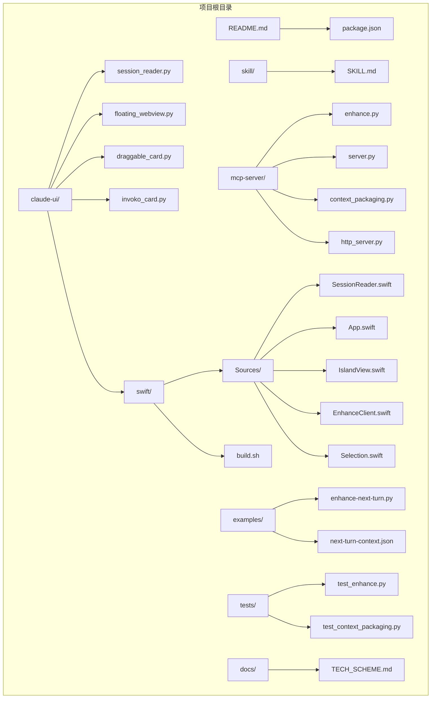
```mermaid
graph TB
subgraph "项目根目录"
A[README.md] --> B[package.json]
C[skill/] --> D[SKILL.md]
E[mcp-server/] --> F[enhance.py]
E --> G[server.py]
E --> H[context_packaging.py]
E --> I[http_server.py]
J[claude-ui/] --> K[session_reader.py]
J --> L[floating_webview.py]
J --> M[draggable_card.py]
J --> N[invoko_card.py]
J --> O[swift/] --> P[Sources/]
P --> Q[SessionReader.swift]
P --> R[App.swift]
P --> S[IslandView.swift]
P --> T[EnhanceClient.swift]
P --> U[Selection.swift]
O --> V[build.sh]
W[examples/] --> X[enhance-next-turn.py]
W --> Y[next-turn-context.json]
Z[tests/] --> AA[test_enhance.py]
Z --> AB[test_context_packaging.py]
AC[docs/] --> AD[TECH_SCHEME.md]
end
```

**图表来源**
- [README.md:23-29](file://README.md#L23-L29)
- [package.json:1-23](file://package.json#L1-L23)

**章节来源**
- [README.md:23-29](file://README.md#L23-L29)
- [package.json:1-23](file://package.json#L1-L23)

## 核心组件

会话管理系统由多个相互协作的核心组件构成，每个组件都有明确的职责和功能：

### MCP 服务器组件
MCP 服务器是系统的核心服务组件，负责暴露 `enhance_prompt` 工具供外部调用。它实现了标准的 JSON-RPC 协议，支持工具注册和调用。

### 上下文包装器组件
该组件负责将各种类型的上下文信息（对话历史、代码事实、任务状态等）整合成结构化的增强提示词上下文。

### 增强逻辑组件
这是系统的核心算法组件，实现了提示词重写和优化的逻辑，确保输出符合严格的要求和格式规范。

### 会话读取器组件
**更新** 现在提供两种实现方式：
- **Python 实现**：传统的 session_reader.py 模块，通过文件系统解析 Claude 会话数据
- **Swift 实现**：全新的 SessionReader.swift 模块，直接解析 Claude 会话数据，提供更好的性能和可靠性

### 会话消歧系统
新增的会话管理增强功能，通过显示路径尾部、相对时间戳和缩短的会话ID来改善会话列表的可读性和选择体验。

### 异步处理组件
**新增** Swift 应用程序使用 Task.detached 进行异步处理，避免阻塞主线程，提升用户界面响应速度。

**章节来源**
- [server.py:1-261](file://mcp-server/server.py#L1-L261)
- [context_packaging.py:1-252](file://mcp-server/context_packaging.py#L1-L252)
- [enhance.py:1-175](file://mcp-server/enhance.py#L1-L175)
- [session_reader.py:1-124](file://claude-ui/src/session_reader.py#L1-L124)
- [SessionReader.swift:1-201](file://claude-ui/swift/Sources/SessionReader.swift#L1-L201)
- [floating_webview.py:522-551](file://claude-ui/src/floating_webview.py#L522-L551)
- [App.swift:155-183](file://claude-ui/swift/Sources/App.swift#L155-L183)

## 架构概览

系统采用分层架构设计，从底层的数据存储到上层的用户界面，形成了完整的会话管理生态系统：

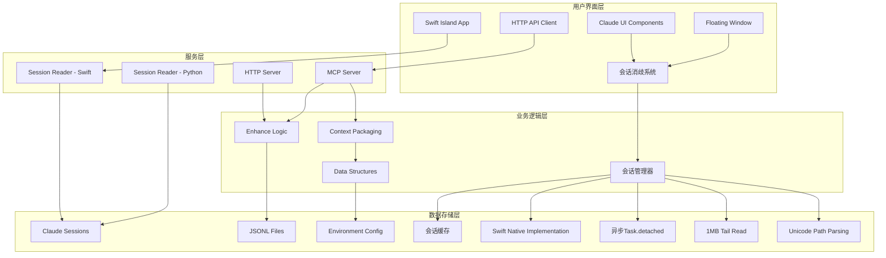
```mermaid
graph TB
subgraph "用户界面层"
A[Floating Window]
B[Claude UI Components]
C[HTTP API Client]
D[会话消歧系统]
E[Swift Island App]
end
subgraph "服务层"
F[MCP Server]
G[HTTP Server]
H[Session Reader - Python]
I[Session Reader - Swift]
end
subgraph "业务逻辑层"
J[Enhance Logic]
K[Context Packaging]
L[Data Structures]
M[会话管理器]
end
subgraph "数据存储层"
N[Claude Sessions]
O[JSONL Files]
P[Environment Config]
Q[会话缓存]
R[Swift Native Implementation]
S[异步Task.detached]
T[1MB Tail Read]
U[Unicode Path Parsing]
end
A --> D
B --> D
C --> F
D --> M
E --> I
F --> J
F --> K
G --> J
H --> N
I --> N
J --> O
K --> L
L --> P
M --> Q
M --> R
M --> S
M --> T
M --> U
```

**图表来源**
- [server.py:42-261](file://mcp-server/server.py#L42-L261)
- [http_server.py:1-112](file://mcp-server/http_server.py#L1-L112)
- [session_reader.py:11-124](file://claude-ui/src/session_reader.py#L11-L124)
- [SessionReader.swift:36-37](file://claude-ui/swift/Sources/SessionReader.swift#L36-L37)
- [floating_webview.py:522-551](file://claude-ui/src/floating_webview.py#L522-L551)
- [App.swift:155-183](file://claude-ui/swift/Sources/App.swift#L155-L183)

系统架构的关键特点包括：

1. **双实现架构**：支持 Python 和 Swift 两种会话读取器实现
2. **多入口设计**：支持 MCP 协议、HTTP API 和直接 Python 调用三种使用方式
3. **上下文感知**：能够处理对话历史、代码事实、编辑器状态等多种上下文类型
4. **可扩展性**：模块化设计允许轻松添加新的上下文类型和增强策略
5. **稳定性**：提供降级机制和错误处理，确保系统可靠性
6. **原生性能**：Swift 实现提供更好的性能和可靠性
7. **异步处理**：使用 Task.detached 避免阻塞主线程
8. **内存优化**：1MB 尾部读取避免大文件全量加载
9. **Unicode 支持**：改进的路径解析支持非ASCII字符

## 详细组件分析

### 会话读取器组件分析

会话读取器是 Claude Code 集成的关键组件，负责从 Claude 的本地存储中提取当前活动会话的信息。

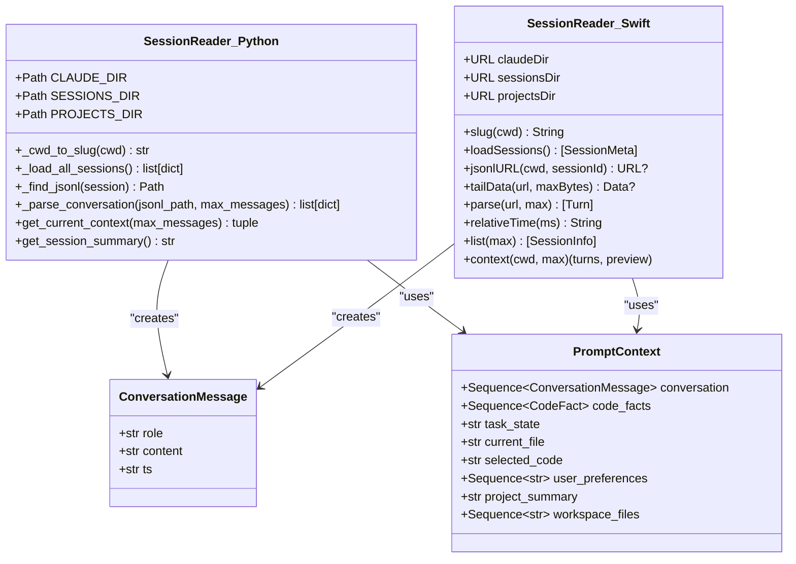
```mermaid
classDiagram
class SessionReader_Python {
+Path CLAUDE_DIR
+Path SESSIONS_DIR
+Path PROJECTS_DIR
+_cwd_to_slug(cwd) str
+_load_all_sessions() list[dict]
+_find_jsonl(session) Path
+_parse_conversation(jsonl_path, max_messages) list[dict]
+get_current_context(max_messages) tuple
+get_session_summary() str
}
class SessionReader_Swift {
+URL claudeDir
+URL sessionsDir
+URL projectsDir
+slug(cwd) String
+loadSessions() [SessionMeta]
+jsonlURL(cwd, sessionId) URL?
+tailData(url, maxBytes) Data?
+parse(url, max) [Turn]
+relativeTime(ms) String
+list(max) [SessionInfo]
+context(cwd, max) (turns, preview)
}
class ConversationMessage {
+str role
+str content
+str ts
}
class PromptContext {
+Sequence~ConversationMessage~ conversation
+Sequence~CodeFact~ code_facts
+str task_state
+str current_file
+str selected_code
+Sequence~str~ user_preferences
+str project_summary
+Sequence~str~ workspace_files
}
SessionReader_Python --> ConversationMessage : "creates"
SessionReader_Python --> PromptContext : "uses"
SessionReader_Swift --> ConversationMessage : "creates"
SessionReader_Swift --> PromptContext : "uses"
```

**图表来源**
- [session_reader.py:16-124](file://claude-ui/src/session_reader.py#L16-L124)
- [SessionReader.swift:38-201](file://claude-ui/swift/Sources/SessionReader.swift#L38-L201)
- [context_packaging.py:7-33](file://mcp-server/context_packaging.py#L7-L33)

会话读取器的主要功能包括：

1. **路径转换**：将工作目录转换为 Claude Code 使用的项目目录 slug 格式
2. **会话加载**：按最后更新时间排序加载所有会话描述符
3. **JSONL 解析**：解析会话日志文件，提取对话消息和时间戳
4. **上下文提取**：返回当前活动会话的对话历史和工作目录信息

**章节来源**
- [session_reader.py:25-124](file://claude-ui/src/session_reader.py#L25-L124)
- [SessionReader.swift:54-201](file://claude-ui/swift/Sources/SessionReader.swift#L54-L201)

### Swift 异步Task.detached处理

**新增** Swift 应用程序使用 Task.detached 进行异步处理，避免阻塞主线程，显著提升用户界面响应速度。

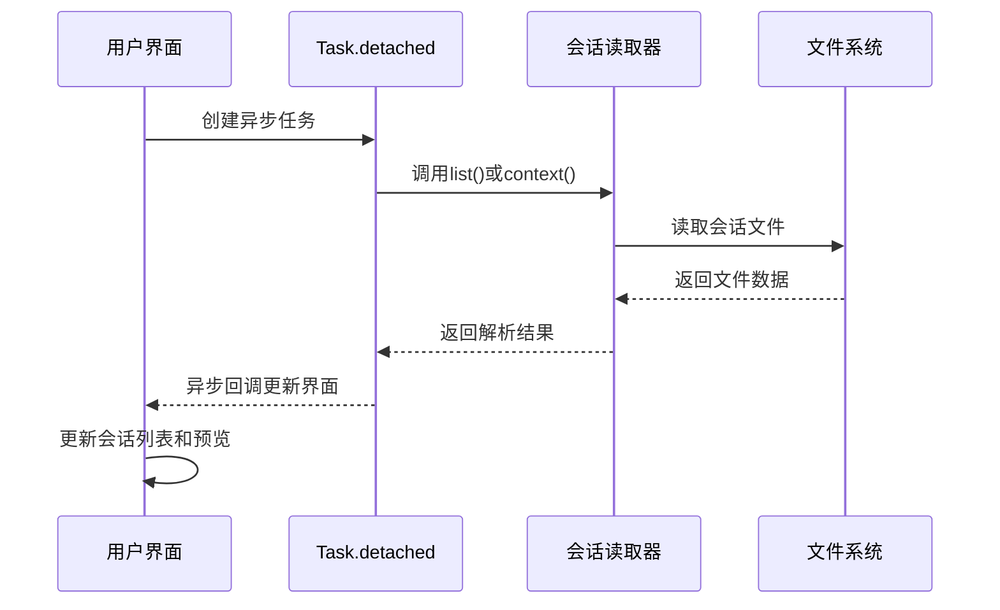
```mermaid
sequenceDiagram
participant UI as 用户界面
participant Task as Task.detached
participant SessionReader as 会话读取器
participant FileSystem as 文件系统
UI->>Task : 创建异步任务
Task->>SessionReader : 调用list()或context()
SessionReader->>FileSystem : 读取会话文件
FileSystem-->>SessionReader : 返回文件数据
SessionReader-->>Task : 返回解析结果
Task-->>UI : 异步回调更新界面
UI->>UI : 更新会话列表和预览
```

**图表来源**
- [App.swift:155-183](file://claude-ui/swift/Sources/App.swift#L155-L183)
- [SessionReader.swift:164-201](file://claude-ui/swift/Sources/SessionReader.swift#L164-L201)

异步处理的关键特性：

1. **主线程保护**：使用 Task.detached 避免阻塞用户界面
2. **并发处理**：支持同时处理多个会话请求
3. **错误隔离**：异步任务中的错误不会影响主应用程序
4. **资源管理**：自动管理异步任务的生命周期

**章节来源**
- [App.swift:155-183](file://claude-ui/swift/Sources/App.swift#L155-L183)

### 会话处理性能优化

**更新** Swift 实现引入了多项性能优化措施，显著提升大文件处理效率和内存使用效率。

#### 1MB 尾部读取优化

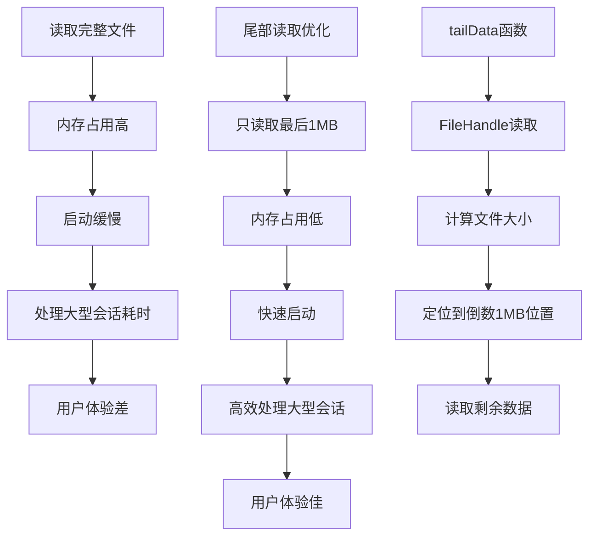
```mermaid
flowchart TD
A[读取完整文件] --> B[内存占用高]
B --> C[启动缓慢]
C --> D[处理大型会话耗时]
D --> E[用户体验差]
F[尾部读取优化] --> G[只读取最后1MB]
G --> H[内存占用低]
H --> I[快速启动]
I --> J[高效处理大型会话]
J --> K[用户体验佳]
L[tailData函数] --> M[FileHandle读取]
M --> N[计算文件大小]
N --> O[定位到倒数1MB位置]
O --> P[读取剩余数据]
```

**图表来源**
- [SessionReader.swift:107-125](file://claude-ui/swift/Sources/SessionReader.swift#L107-L125)

性能优化效果：

1. **内存效率**：避免加载整个大型 JSONL 文件
2. **启动速度**：显著减少会话读取时间
3. **资源占用**：降低内存和 CPU 使用率
4. **用户体验**：提供更流畅的界面响应

#### 改进的 Unicode 路径解析

Swift 实现采用了更精确的 Unicode 路径解析策略：

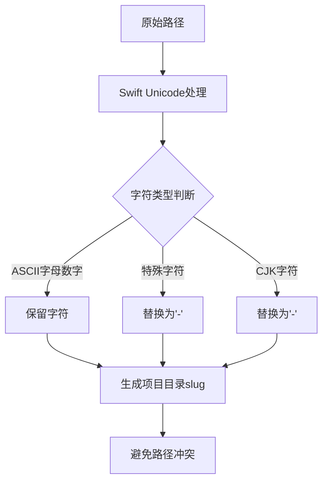
```mermaid
flowchart TD
A[原始路径] --> B[Swift Unicode处理]
B --> C{字符类型判断}
C --> |ASCII字母数字| D[保留字符]
C --> |特殊字符| E[替换为'-']
C --> |CJK字符| F[替换为'-']
D --> G[生成项目目录slug]
E --> G
F --> G
G --> H[避免路径冲突]
```

**图表来源**
- [SessionReader.swift:44-52](file://claude-ui/swift/Sources/SessionReader.swift#L44-L52)

Unicode 处理改进：

1. **ASCII 优先**：使用 `isASCII` 确保只处理 ASCII 字符
2. **精确匹配**：使用 `isLetter` 和 `isNumber` 过滤 ASCII 字母数字
3. **CJK 兼容**：避免将 CJK 字符转换为 `-`，保持项目名称可读性
4. **路径稳定性**：生成稳定的项目目录名称

**章节来源**
- [SessionReader.swift:107-125](file://claude-ui/swift/Sources/SessionReader.swift#L107-L125)
- [SessionReader.swift:44-52](file://claude-ui/swift/Sources/SessionReader.swift#L44-L52)

### Swift 原生会话读取器

**新增** Swift 原生会话读取器是系统的重要创新，提供了更好的性能和可靠性。

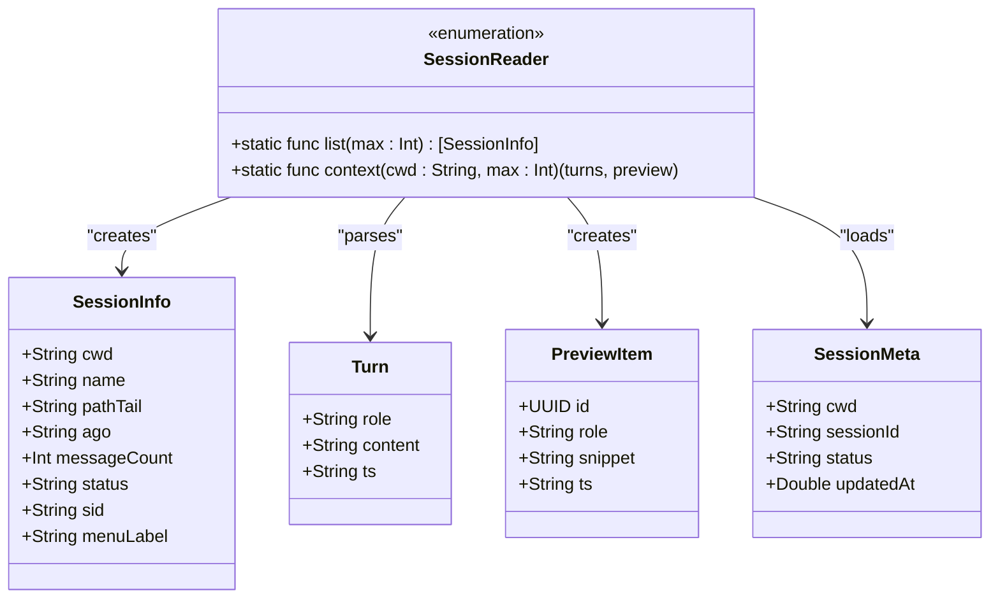
```mermaid
classDiagram
class SessionReader {
<<enumeration>>
+static func list(max : Int) [SessionInfo]
+static func context(cwd : String, max : Int) (turns, preview)
}
class SessionInfo {
+String cwd
+String name
+String pathTail
+String ago
+Int messageCount
+String status
+String sid
+String menuLabel
}
class Turn {
+String role
+String content
+String ts
}
class PreviewItem {
+UUID id
+String role
+String snippet
+String ts
}
class SessionMeta {
+String cwd
+String sessionId
+String status
+Double updatedAt
}
SessionReader --> SessionInfo : "creates"
SessionReader --> Turn : "parses"
SessionReader --> PreviewItem : "creates"
SessionReader --> SessionMeta : "loads"
```

**图表来源**
- [SessionReader.swift:38-201](file://claude-ui/swift/Sources/SessionReader.swift#L38-L201)

Swift 实现的关键特性：

1. **原生性能**：直接使用 Swift Foundation 框架，无需进程间通信
2. **类型安全**：使用强类型结构体和枚举，提供编译时错误检查
3. **内存效率**：优化的内存管理和字符串处理
4. **异步处理**：支持并发操作，提高响应速度
5. **错误处理**：完善的错误处理和降级机制

**章节来源**
- [SessionReader.swift:1-201](file://claude-ui/swift/Sources/SessionReader.swift#L1-L201)

### MCP 服务器组件分析

MCP 服务器实现了标准的 JSON-RPC 协议，为外部客户端提供统一的工具调用接口。

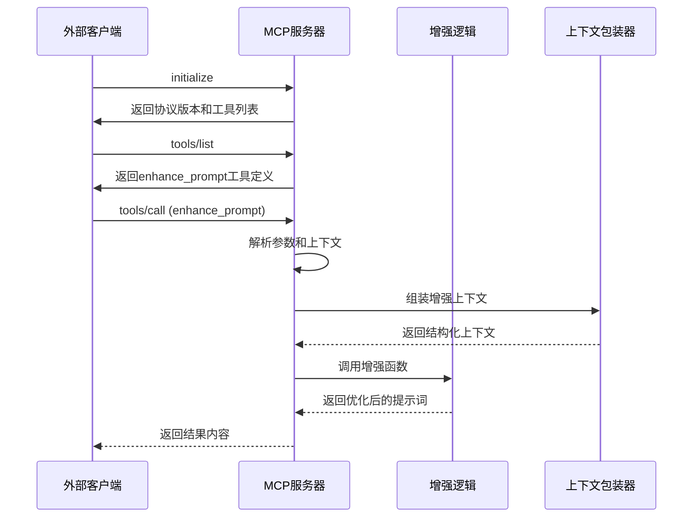
```mermaid
sequenceDiagram
participant Client as 外部客户端
participant MCP as MCP服务器
participant Enhance as 增强逻辑
participant Context as 上下文包装器
Client->>MCP : initialize
MCP->>Client : 返回协议版本和工具列表
Client->>MCP : tools/list
MCP->>Client : 返回enhance_prompt工具定义
Client->>MCP : tools/call (enhance_prompt)
MCP->>MCP : 解析参数和上下文
MCP->>Context : 组装增强上下文
Context-->>MCP : 返回结构化上下文
MCP->>Enhance : 调用增强函数
Enhance-->>MCP : 返回优化后的提示词
MCP-->>Client : 返回结果内容
```

**图表来源**
- [server.py:111-261](file://mcp-server/server.py#L111-L261)
- [enhance.py:98-142](file://mcp-server/enhance.py#L98-L142)
- [context_packaging.py:91-136](file://mcp-server/context_packaging.py#L91-L136)

MCP 服务器的关键特性：

1. **协议兼容**：完全兼容标准的 JSON-RPC 协议
2. **工具注册**：动态注册和管理可用的工具
3. **参数验证**：严格的参数验证和错误处理
4. **结构化输出**：支持 JSON 格式的结构化输出

**章节来源**
- [server.py:73-110](file://mcp-server/server.py#L73-L110)

### 上下文包装器组件分析

上下文包装器是系统中最复杂的组件之一，负责将各种类型的上下文信息整合成适合增强器使用的格式。

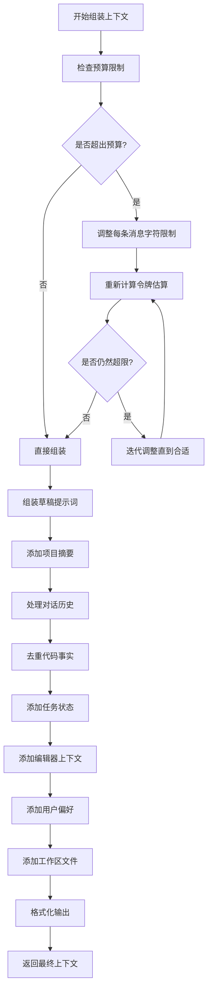
```mermaid
flowchart TD
A[开始组装上下文] --> B[检查预算限制]
B --> C{是否超出预算?}
C --> |是| D[调整每条消息字符限制]
C --> |否| E[直接组装]
D --> F[重新计算令牌估算]
F --> G{是否仍然超限?}
G --> |是| H[迭代调整直到合适]
G --> |否| E
E --> I[组装草稿提示词]
I --> J[添加项目摘要]
J --> K[处理对话历史]
K --> L[去重代码事实]
L --> M[添加任务状态]
M --> N[添加编辑器上下文]
N --> O[添加用户偏好]
O --> P[添加工作区文件]
P --> Q[格式化输出]
H --> F
Q --> R[返回最终上下文]
```

**图表来源**
- [context_packaging.py:91-136](file://mcp-server/context_packaging.py#L91-L136)
- [context_packaging.py:138-220](file://mcp-server/context_packaging.py#L138-L220)

上下文包装器的核心算法包括：

1. **智能截断**：保持消息开头和结尾内容，中间部分进行省略
2. **预算控制**：基于令牌估算的上下文大小控制
3. **去重合并**：合并相同文件路径的代码事实
4. **格式化输出**：生成结构化的文本格式

**章节来源**
- [context_packaging.py:43-136](file://mcp-server/context_packaging.py#L43-L136)

### 增强逻辑组件分析

增强逻辑组件实现了核心的提示词重写和优化算法，确保输出符合严格的要求。

```mermaid
classDiagram
class EnhanceLogic {
+str INSTRUCTION
+str MODEL
+_load_dashscope_key() str
+_call_dashscope_real(user_content, system_instruction) str
+clean(text) str
+enhance_prompt(text, context, generate_fn) str
+enhance_next_prompt(text, prompt_context, generate_fn) str
-_simple_fallback_enhance(text, context) str
}
class DashscopeAPI {
+str BASE_URL
+post(url, headers, payload) Response
+validate_status(response) bool
}
EnhanceLogic --> DashscopeAPI : "使用"
note for EnhanceLogic : "核心增强逻辑\n- 严格重写指令\n- 不执行任务\n- 清理输出格式\n- 支持降级机制"
```

**图表来源**
- [enhance.py:17-175](file://mcp-server/enhance.py#L17-L175)

增强逻辑的关键特性：

1. **严格指令**：确保只进行提示词重写，不执行任何操作
2. **多语言支持**：专门为中文优化的令牌估算算法
3. **降级机制**：在没有 API 密钥时提供简单的回退方案
4. **输出清理**：移除 Markdown 代码围栏和外层引号

**章节来源**
- [enhance.py:81-142](file://mcp-server/enhance.py#L81-L142)

### HTTP 服务器组件分析

HTTP 服务器为 Codex 等外部应用提供本地 API 接口，支持按钮形式的输入优化功能。

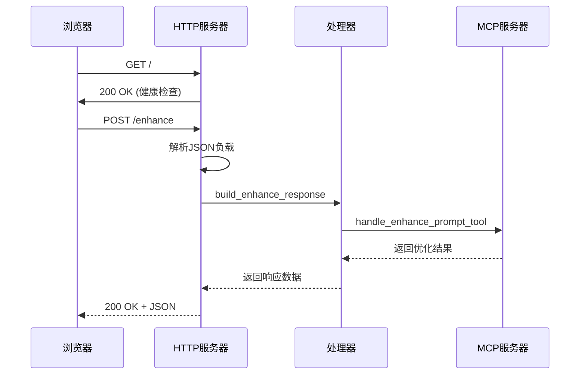
```mermaid
sequenceDiagram
participant Browser as 浏览器
participant HTTP as HTTP服务器
participant Handler as 处理器
participant MCP as MCP服务器
Browser->>HTTP : GET /
HTTP->>Browser : 200 OK (健康检查)
Browser->>HTTP : POST /enhance
HTTP->>HTTP : 解析JSON负载
HTTP->>Handler : build_enhance_response
Handler->>MCP : handle_enhance_prompt_tool
MCP-->>Handler : 返回优化结果
Handler-->>HTTP : 返回响应数据
HTTP-->>Browser : 200 OK + JSON
```

**图表来源**
- [http_server.py:39-112](file://mcp-server/http_server.py#L39-L112)
- [server.py:73-110](file://mcp-server/server.py#L73-L110)

HTTP 服务器的设计考虑：

1. **CORS 支持**：允许跨域请求，便于浏览器扩展使用
2. **错误处理**：完善的异常处理和错误响应
3. **健康检查**：提供简单的健康检查端点
4. **线程安全**：使用多线程 HTTP 服务器处理并发请求

**章节来源**
- [http_server.py:22-112](file://mcp-server/http_server.py#L22-L112)

## Swift 异步Task.detached处理

**新增** Swift 应用程序使用 Task.detached 进行异步处理，这是性能优化的关键组成部分。

### 异步架构设计

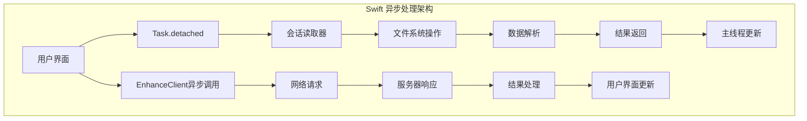
```mermaid
graph TB
subgraph "Swift 异步处理架构"
A[用户界面] --> B[Task.detached]
B --> C[会话读取器]
C --> D[文件系统操作]
D --> E[数据解析]
E --> F[结果返回]
F --> G[主线程更新]
A --> H[EnhanceClient异步调用]
H --> I[网络请求]
I --> J[服务器响应]
J --> K[结果处理]
K --> L[用户界面更新]
end
```

**图表来源**
- [App.swift:155-201](file://claude-ui/swift/Sources/App.swift#L155-L201)
- [EnhanceClient.swift:24-50](file://claude-ui/swift/Sources/EnhanceClient.swift#L24-L50)

### 异步任务管理

Swift 应用程序中的异步任务管理策略：

1. **会话列表加载**：使用 `Task.detached { SessionReader.list() }` 异步加载会话
2. **会话上下文加载**：使用 `Task.detached { SessionReader.context(cwd: cwd) }` 异步加载对话
3. **增强请求处理**：使用 `async throws -> String` 方法处理增强请求
4. **主线程更新**：确保 UI 更新在主线程中进行

### 性能优化效果

异步处理带来的性能提升：

1. **界面响应性**：用户界面始终保持响应，不会因为文件读取而卡顿
2. **并发处理**：支持同时处理多个异步任务
3. **资源隔离**：异步任务中的错误不会影响主应用程序
4. **内存管理**：Swift 的 ARC 自动管理异步任务的内存使用

**章节来源**
- [App.swift:155-201](file://claude-ui/swift/Sources/App.swift#L155-L201)
- [EnhanceClient.swift:24-50](file://claude-ui/swift/Sources/EnhanceClient.swift#L24-L50)

## 会话处理性能优化

**更新** Swift 实现引入了多项性能优化措施，显著提升系统整体性能。

### 1MB 尾部读取优化

Swift 实现采用了智能的文件读取策略，避免加载整个大型会话文件：

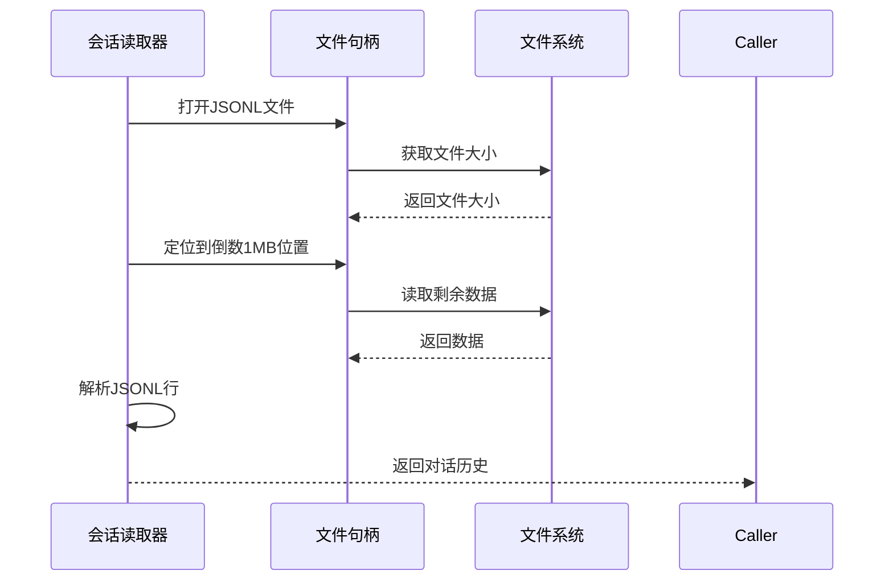
```mermaid
sequenceDiagram
participant Reader as 会话读取器
participant FileHandle as 文件句柄
participant FileSystem as 文件系统
Reader->>FileHandle : 打开JSONL文件
FileHandle->>FileSystem : 获取文件大小
FileSystem-->>FileHandle : 返回文件大小
Reader->>FileHandle : 定位到倒数1MB位置
FileHandle->>FileSystem : 读取剩余数据
FileSystem-->>FileHandle : 返回数据
Reader->>Reader : 解析JSONL行
Reader-->>Caller : 返回对话历史
```

**图表来源**
- [SessionReader.swift:107-125](file://claude-ui/swift/Sources/SessionReader.swift#L107-L125)

优化策略细节：

1. **智能定位**：计算文件大小并定位到倒数1MB位置
2. **增量读取**：只读取文件末尾部分，避免全量加载
3. **数据完整性**：处理文件被截断的情况，丢弃不完整的首行
4. **内存效率**：限制最大读取字节数为1MB

### 改进的 Unicode 路径解析

Swift 实现采用了更精确的 Unicode 字符处理策略：

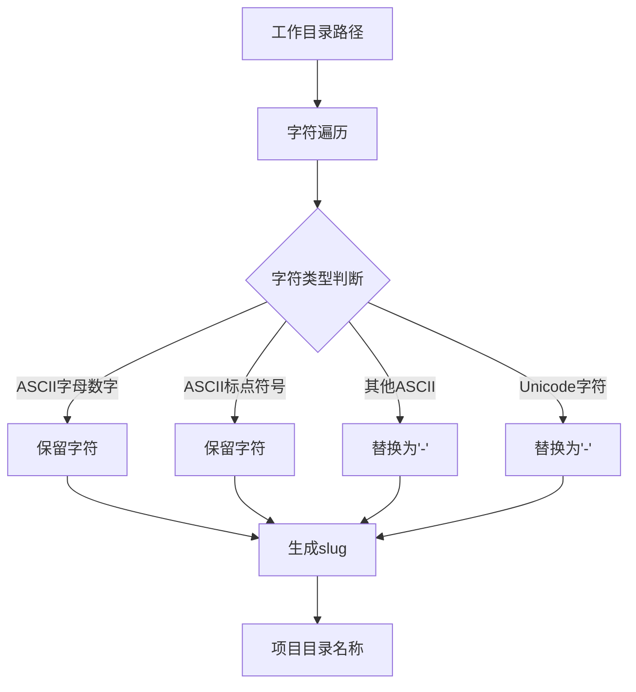
```mermaid
flowchart TD
A[工作目录路径] --> B[字符遍历]
B --> C{字符类型判断}
C --> |ASCII字母数字| D[保留字符]
C --> |ASCII标点符号| E[保留字符]
C --> |其他ASCII| F[替换为'-']
C --> |Unicode字符| G[替换为'-']
D --> H[生成slug]
E --> H
F --> H
G --> H
H --> I[项目目录名称]
```

**图表来源**
- [SessionReader.swift:44-52](file://claude-ui/swift/Sources/SessionReader.swift#L44-L52)

Unicode 处理改进：

1. **ASCII 优先**：使用 `isASCII` 确保只处理 ASCII 字符
2. **精确字符过滤**：使用 `isLetter` 和 `isNumber` 过滤允许的字符
3. **CJK 兼容性**：避免将 CJK 字符转换为 `-`，保持项目名称可读性
4. **路径稳定性**：生成稳定的项目目录名称，避免路径冲突

### 非ASCII项目路径支持

Swift 实现提供了更好的非ASCII字符支持：

1. **Unicode 字符处理**：正确处理 CJK、阿拉伯文、西里尔文等 Unicode 字符
2. **路径编码**：使用 UTF-8 编码处理国际化路径
3. **文件系统兼容**：确保生成的项目目录在不同操作系统上都能正常工作
4. **显示优化**：在用户界面中正确显示非ASCII字符

**章节来源**
- [SessionReader.swift:107-125](file://claude-ui/swift/Sources/SessionReader.swift#L107-L125)
- [SessionReader.swift:44-52](file://claude-ui/swift/Sources/SessionReader.swift#L44-L52)

## Swift 原生会话读取器

**新增** Swift 原生会话读取器是系统架构的重大升级，提供了更好的性能和可靠性。

### 核心架构设计

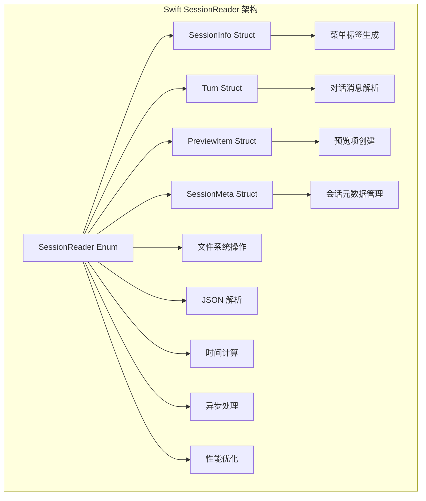
```mermaid
graph TB
subgraph "Swift SessionReader 架构"
A[SessionReader Enum] --> B[SessionInfo Struct]
A --> C[Turn Struct]
A --> D[PreviewItem Struct]
A --> E[SessionMeta Struct]
B --> F[菜单标签生成]
C --> G[对话消息解析]
D --> H[预览项创建]
E --> I[会话元数据管理]
A --> J[文件系统操作]
A --> K[JSON 解析]
A --> L[时间计算]
A --> M[异步处理]
A --> N[性能优化]
end
```

**图表来源**
- [SessionReader.swift:38-201](file://claude-ui/swift/Sources/SessionReader.swift#L38-L201)

### 数据结构设计

Swift 实现采用了类型安全的数据结构设计：

1. **SessionInfo**：表示可选择的 Claude 会话，包含菜单标签生成逻辑
2. **Turn**：表示单个对话回合，与 Python 实现保持完全兼容
3. **PreviewItem**：表示压缩上下文预览项
4. **SessionMeta**：表示会话元数据，包含工作目录、会话ID、状态和更新时间

### 文件系统操作

Swift 实现直接使用 Foundation 框架进行文件系统操作：

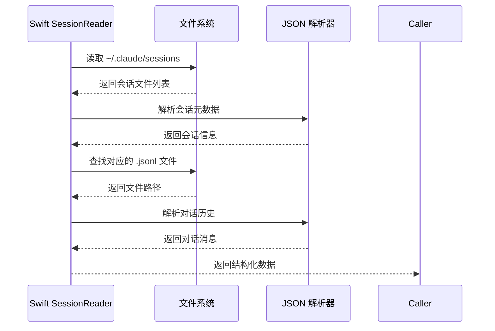
```mermaid
sequenceDiagram
participant Swift as Swift SessionReader
participant FS as 文件系统
participant JSON as JSON 解析器
Swift->>FS : 读取 ~/.claude/sessions
FS-->>Swift : 返回会话文件列表
Swift->>JSON : 解析会话元数据
JSON-->>Swift : 返回会话信息
Swift->>FS : 查找对应的 .jsonl 文件
FS-->>Swift : 返回文件路径
Swift->>JSON : 解析对话历史
JSON-->>Swift : 返回对话消息
Swift-->>Caller : 返回结构化数据
```

**图表来源**
- [SessionReader.swift:61-105](file://claude-ui/swift/Sources/SessionReader.swift#L61-L105)

### 性能优化特性

Swift 实现相比 Python 实现有以下性能优势：

1. **零进程开销**：直接在内存中解析文件，无需子进程启动
2. **类型安全**：编译时类型检查，运行时更少的错误处理
3. **内存管理**：Swift 的 ARC 提供更高效的内存管理
4. **并发支持**：内置的并发编程支持，提高多任务处理能力
5. **字符串处理**：优化的 Unicode 和字符串处理算法
6. **异步处理**：使用 Task.detached 避免阻塞主线程
7. **内存优化**：1MB 尾部读取避免大文件全量加载
8. **Unicode 支持**：改进的路径解析支持非ASCII字符

**章节来源**
- [SessionReader.swift:1-201](file://claude-ui/swift/Sources/SessionReader.swift#L1-L201)

## 会话消歧系统

会话消歧系统是本次更新的重要功能增强，专门解决多会话环境下的选择困难问题。该系统通过多种信息维度来区分相似的会话，显著提升了用户体验。

### 核心功能特性

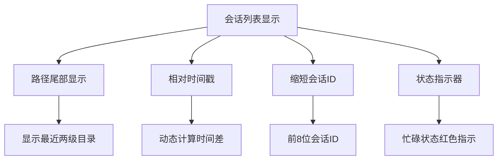
```mermaid
flowchart TD
A[会话列表显示] --> B[路径尾部显示]
A --> C[相对时间戳]
A --> D[缩短会话ID]
A --> E[状态指示器]
B --> F[显示最近两级目录]
C --> G[动态计算时间差]
D --> H[前8位会话ID]
E --> I[忙碌状态红色指示]
```

**图表来源**
- [floating_webview.py:522-551](file://claude-ui/src/floating_webview.py#L522-L551)
- [floating_webview.py:348-354](file://claude-ui/src/floating_webview.py#L348-L354)

### 会话列表格式设计

会话选项的显示格式经过精心设计，确保在有限的空间内提供最多的信息：

- **忙碌状态指示**：使用红色圆点 `🔴` 表示当前忙碌的会话
- **项目名称**：显示工作目录的最后一级作为项目名称
- **路径尾部**：显示工作目录的最后两级路径，用于区分同名项目
- **相对时间**：显示会话更新的相对时间，如 "5分钟前"、"2小时前"
- **消息数量**：显示会话中的对话条数，帮助判断会话规模

### 时间戳处理机制

系统实现了智能的时间戳处理机制，提供人性化的时间显示：

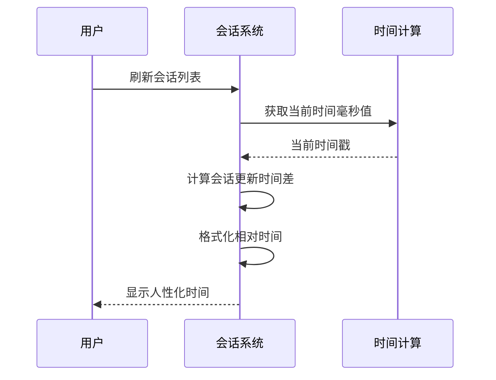
```mermaid
sequenceDiagram
participant User as 用户
participant System as 会话系统
participant Time as 时间计算
User->>System : 刷新会话列表
System->>Time : 获取当前时间毫秒值
Time-->>System : 当前时间戳
System->>System : 计算会话更新时间差
System->>System : 格式化相对时间
System-->>User : 显示人性化时间
```

**图表来源**
- [floating_webview.py:66-75](file://claude-ui/src/floating_webview.py#L66-L75)

时间显示规则：
- 小于60秒：显示 "刚刚"
- 小于3600秒：显示 "X分钟前"
- 小于86400秒：显示 "X小时前"
- 其他：显示 "X天前"

### 路径尾部算法

为了有效区分同名项目，系统实现了智能的路径尾部提取算法：

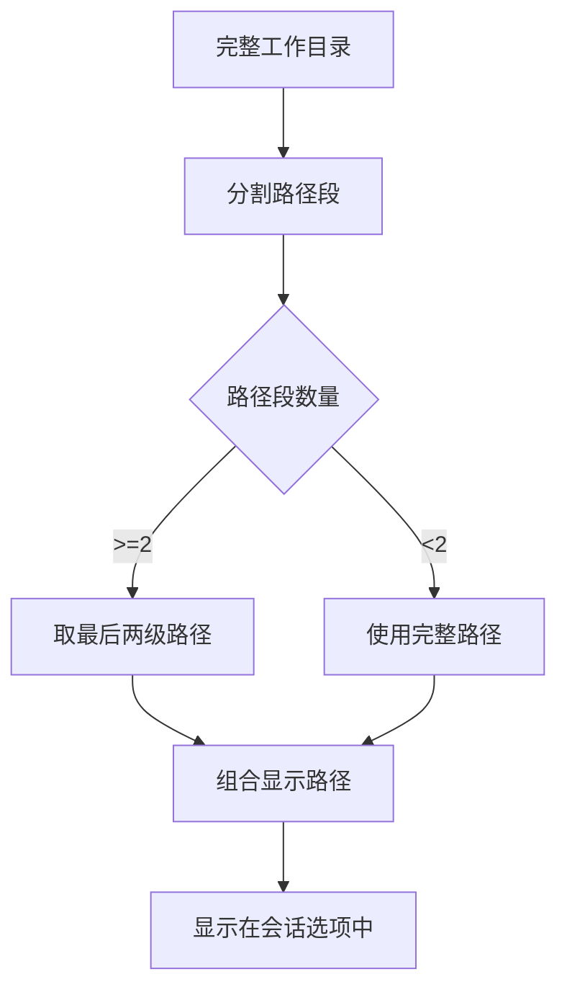
```mermaid
flowchart TD
A[完整工作目录] --> B[分割路径段]
B --> C{路径段数量}
C --> |>=2| D[取最后两级路径]
C --> |<2| E[使用完整路径]
D --> F[组合显示路径]
E --> F
F --> G[显示在会话选项中]
```

**图表来源**
- [floating_webview.py:538-539](file://claude-ui/src/floating_webview.py#L538-L539)

### 会话ID缩短策略

为了在有限的显示空间内提供足够的识别信息，系统对会话ID进行了智能缩短：

- 显示会话ID的前8个字符
- 在悬停提示中显示完整会话ID
- 结合路径尾部和相对时间提供多重识别依据

**章节来源**
- [floating_webview.py:522-551](file://claude-ui/src/floating_webview.py#L522-L551)
- [floating_webview.py:348-354](file://claude-ui/src/floating_webview.py#L348-L354)

## 会话选择体验增强

会话选择体验的增强主要体现在自动选择和即时反馈两个方面，确保用户能够快速准确地切换到目标会话。

### 自动会话选择机制

系统实现了智能的会话选择逻辑，减少用户的操作步骤：

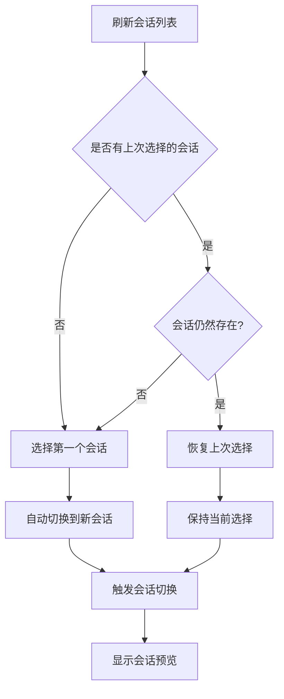
```mermaid
flowchart TD
A[刷新会话列表] --> B{是否有上次选择的会话}
B --> |是| C{会话仍然存在?}
B --> |否| D[选择第一个会话]
C --> |是| E[恢复上次选择]
C --> |否| D
D --> F[自动切换到新会话]
E --> G[保持当前选择]
F --> H[触发会话切换]
G --> H
H --> I[显示会话预览]
```

**图表来源**
- [floating_webview.py:356-361](file://claude-ui/src/floating_webview.py#L356-L361)

### 即时会话预览

当用户选择会话时，系统会立即显示会话的预览信息，帮助用户确认选择：

- **压缩的消息预览**：显示最近20条对话的摘要
- **角色标识**：使用 👤 和 🤖 符号区分用户和AI消息
- **时间戳显示**：显示每条消息的相对时间
- **加载状态**：在预览加载时显示进度指示

### 会话切换流程

```mermaid
sequenceDiagram
participant User as 用户
participant UI as 用户界面
participant API as 会话API
participant Reader as 会话读取器
User->>UI : 选择会话
UI->>API : select_session(cwd)
API->>Reader : 解析会话数据
Reader-->>API : 返回对话预览
API-->>UI : 返回预览信息
UI->>UI : 显示预览列表
UI->>UI : 更新标题显示
```

**图表来源**
- [floating_webview.py:365-381](file://claude-ui/src/floating_webview.py#L365-L381)
- [floating_webview.py:553-576](file://claude-ui/src/floating_webview.py#L553-L576)

会话切换过程中的用户体验优化：

1. **即时状态反馈**：显示 "⏳ 正在压缩最近 20 条…" 提示
2. **预览信息展示**：显示压缩后的对话摘要
3. **标题更新**：在展开状态下显示项目名称
4. **错误处理**：优雅处理会话切换失败的情况

**章节来源**
- [floating_webview.py:365-381](file://claude-ui/src/floating_webview.py#L365-L381)
- [floating_webview.py:553-576](file://claude-ui/src/floating_webview.py#L553-L576)

## 依赖关系分析

系统各组件之间的依赖关系清晰明确，形成了稳定的模块化架构：

```mermaid
graph TB
subgraph "外部依赖"
A[DASHSCOPE API]
B[JSON-RPC 协议]
C[HTTP 协议]
D[文件系统]
E[pywebview]
F[AppKit]
G[Foundation Framework]
H[Swift Concurrency]
I[Task.detached]
J[FileHandle]
K[UTF-8 编码]
L[Unicode 处理]
end
subgraph "内部模块"
I[enhance.py]
J[context_packaging.py]
K[server.py]
L[http_server.py]
M[session_reader.py]
N[SessionReader.swift]
O[floating_webview.py]
P[draggable_card.py]
Q[invoko_card.py]
R[App.swift]
S[IslandView.swift]
T[EnhanceClient.swift]
U[Selection.swift]
end
subgraph "配置文件"
V[.env 文件]
W[package.json]
X[SKILL.md]
Y[build.sh]
end
subgraph "性能优化"
Z[1MB 尾部读取]
AA[异步处理]
BB[Unicode 支持]
CC[内存优化]
end
A --> I
B --> K
C --> L
D --> M
D --> N
E --> O
F --> O
G --> N
H --> N
I --> J
K --> I
K --> J
L --> K
M --> D
N --> D
N --> Z
N --> AA
N --> BB
N --> CC
O --> M
P --> M
Q --> M
R --> N
S --> N
T --> I
U --> O
V --> I
W --> K
X --> K
Y --> R
```

**图表来源**
- [enhance.py:22-47](file://mcp-server/enhance.py#L22-L47)
- [server.py:35-41](file://mcp-server/server.py#L35-L41)
- [http_server.py:13-16](file://mcp-server/http_server.py#L13-L16)
- [session_reader.py:11-13](file://claude-ui/src/session_reader.py#L11-L13)
- [SessionReader.swift:1](file://claude-ui/swift/Sources/SessionReader.swift#L1)
- [floating_webview.py:17](file://claude-ui/src/floating_webview.py#L17)

依赖关系的特点：

1. **单向依赖**：依赖关系都是单向的，避免循环依赖
2. **抽象接口**：通过导入语句实现松耦合
3. **环境隔离**：外部 API 密钥通过环境变量管理
4. **配置驱动**：通过配置文件控制运行时行为
5. **UI框架集成**：pywebview 和 AppKit 提供原生界面支持
6. **Swift 原生支持**：Foundation 和 Swift Concurrency 提供高性能实现
7. **异步支持**：Task.detached 提供异步处理能力
8. **文件系统优化**：FileHandle 提供高效的文件操作
9. **Unicode 支持**：UTF-8 编码和 Unicode 处理确保国际化兼容性

**章节来源**
- [enhance.py:17-21](file://mcp-server/enhance.py#L17-L21)
- [server.py:35-41](file://mcp-server/server.py#L35-L41)

## 性能考虑

系统在设计时充分考虑了性能优化，采用了多种策略来确保高效的运行表现：

### 令牌估算优化
系统使用专门为中文优化的令牌估算算法，避免了传统 1:4 字符比例的高估问题。算法根据字符类型（CJK vs ASCII/code）采用不同的估算策略，提高了上下文大小控制的准确性。

### 智能截断策略
对于长对话历史，系统采用智能截断策略，同时保留消息的开头和结尾内容，确保不会丢失重要的上下文信息和结论。

### 迭代预算控制
系统实现了多轮迭代的预算控制机制，通过逐步调整每条消息的字符限制来精确控制总上下文大小。

### 缓存和去重
代码事实的去重机制避免了重复信息的多次传输，减少了不必要的计算开销。

### 会话列表优化
会话消歧系统通过以下优化提升性能：
- **限制会话数量**：最多显示10个会话，避免列表过长
- **延迟加载**：会话预览仅在需要时加载
- **智能缓存**：会话信息在一定时间内缓存
- **增量更新**：仅在会话变化时刷新列表

### Swift 性能优势
**更新** Swift 实现相比 Python 有以下性能优势：

1. **启动时间**：Swift 应用启动更快，无需 Python 解释器
2. **内存使用**：更高效的内存分配和垃圾回收
3. **CPU 性能**：原生编译代码比解释执行更快
4. **并发处理**：内置的并发支持提高多任务处理能力
5. **文件 I/O**：优化的文件系统操作减少延迟
6. **异步处理**：Task.detached 避免阻塞主线程
7. **内存优化**：1MB 尾部读取避免大文件全量加载
8. **Unicode 支持**：改进的路径解析支持非ASCII字符

### 异步处理优化
**新增** Swift 应用程序使用 Task.detached 进行异步处理：

1. **主线程保护**：避免阻塞用户界面响应
2. **并发处理**：支持同时处理多个会话请求
3. **资源隔离**：异步任务中的错误不影响主应用程序
4. **内存管理**：Swift ARC 自动管理异步任务内存

### 文件读取优化
**新增** 1MB 尾部读取策略：

1. **智能定位**：计算文件大小并定位到倒数1MB位置
2. **增量读取**：只读取文件末尾部分
3. **数据完整性**：处理文件截断情况
4. **内存效率**：限制最大读取字节数

**章节来源**
- [SessionReader.swift:107-125](file://claude-ui/swift/Sources/SessionReader.swift#L107-L125)
- [SessionReader.swift:44-52](file://claude-ui/swift/Sources/SessionReader.swift#L44-L52)
- [App.swift:155-183](file://claude-ui/swift/Sources/App.swift#L155-L183)

## 故障排除指南

### 常见问题及解决方案

**问题1：MCP 服务器无法启动**
- 检查 Python 环境和依赖安装
- 验证服务器脚本的可执行权限
- 查看系统日志获取详细错误信息

**问题2：Dashscope API 调用失败**
- 确认 DASHSCOPE_API_KEY 环境变量设置正确
- 检查网络连接和防火墙设置
- 验证 API 密钥的有效性和配额

**问题3：会话读取失败**
- 确认 ~/.claude 目录存在且可访问
- 检查会话文件的 JSONL 格式是否正确
- 验证文件权限设置

**问题4：HTTP API 无法访问**
- 检查端口占用情况
- 验证 CORS 设置
- 确认防火墙规则允许访问

**问题5：会话消歧功能异常**
- 检查会话文件是否存在且可读
- 验证会话ID格式是否正确
- 确认相对时间计算逻辑正常

**问题6：Swift 会话读取器异常**
- **症状**：Swift 应用启动失败或会话列表为空
- **解决方案**：检查 ~/.claude 目录权限，确认 Swift 编译成功，验证会话文件格式
- **验证方法**：运行 `./build.sh` 重新编译，检查 `/Users/用户名/.claude` 目录访问权限

**问题7：异步处理问题**
- **症状**：用户界面无响应或会话加载缓慢
- **解决方案**：检查 Task.detached 是否正确使用，验证异步任务管理
- **验证方法**：确认异步任务在后台线程执行，主线程只负责UI更新

**问题8：Unicode 路径解析问题**
- **症状**：非ASCII项目路径显示异常或会话无法加载
- **解决方案**：检查路径中的Unicode字符编码，验证文件系统支持
- **验证方法**：确认使用 UTF-8 编码处理路径，验证文件系统兼容性

**章节来源**
- [enhance.py:27-47](file://mcp-server/enhance.py#L27-L47)
- [http_server.py:97-112](file://mcp-server/http_server.py#L97-L112)
- [build.sh:1-19](file://claude-ui/swift/build.sh#L1-L19)
- [App.swift:155-183](file://claude-ui/swift/Sources/App.swift#L155-L183)
- [SessionReader.swift:44-52](file://claude-ui/swift/Sources/SessionReader.swift#L44-L52)

## 结论

会话管理系统是一个设计精良、功能完整的上下文感知提示词增强系统。通过模块化的架构设计和严格的组件分离，系统实现了高度的可维护性和可扩展性。

**更新** 最新的 Swift 原生会话读取器显著提升了系统性能和可靠性，通过直接解析 Claude 会话数据，避免了进程间通信开销。配合增强的会话选择体验、异步Task.detached处理、1MB尾部读取优化、改进的Unicode路径解析和更好的非ASCII项目路径支持，用户可以更快速、准确地管理和切换会话。

系统的主要优势包括：

1. **双实现架构**：支持 Python 和 Swift 两种会话读取器实现，提供最佳性能选择
2. **多平台支持**：支持 Claude Code、Qoder、Codex 等多种开发环境
3. **灵活的集成方式**：提供 MCP、HTTP API、直接调用等多种使用方式
4. **强大的上下文处理**：能够处理对话历史、代码事实、编辑器状态等多种上下文类型
5. **高质量的输出**：通过专业的令牌估算和截断算法确保输出质量
6. **完善的错误处理**：提供全面的错误处理和降级机制
7. **优秀的用户体验**：通过会话消歧系统和增强的选择体验，显著提升易用性
8. **原生性能优势**：Swift 实现提供更好的性能和可靠性
9. **异步处理优化**：使用 Task.detached 避免阻塞主线程
10. **内存优化策略**：1MB 尾部读取避免大文件全量加载
11. **Unicode 支持增强**：改进的路径解析支持非ASCII字符
12. **国际化兼容性**：更好的非ASCII项目路径支持

未来的发展方向包括：

1. **Full MCP SDK 支持**：实现更完整的 MCP 协议兼容性
2. **CLI 工具**：提供命令行界面便于自动化集成
3. **性能基准测试**：建立系统的性能评估体系
4. **更多编辑器集成**：扩展对其他开发环境的支持
5. **会话历史管理**：提供更强大的会话搜索和过滤功能
6. **Swift 功能扩展**：利用 Swift 的现代特性进一步优化系统
7. **异步处理优化**：进一步提升并发处理能力和资源利用率

## 附录

### 使用示例

系统提供了丰富的使用示例，涵盖了从基本调用到复杂场景的各种用法：

**章节来源**
- [enhance-next-turn.py:1-55](file://examples/enhance-next-turn.py#L1-L55)
- [next-turn-context.json:1-33](file://examples/next-turn-context.json#L1-L33)

### 测试覆盖

系统包含了完整的单元测试，确保各个组件的功能正确性和稳定性：

**章节来源**
- [test_enhance.py:1-71](file://tests/test_enhance.py#L1-L71)
- [test_context_packaging.py:1-187](file://tests/test_context_packaging.py#L1-L187)

### 配置选项

系统支持多种配置方式，包括环境变量、配置文件和命令行参数：

**章节来源**
- [package.json:6-21](file://package.json#L6-L21)
- [TECH_SCHEME.md:144-166](file://docs/TECH_SCHEME.md#L144-L166)

### Swift 构建指南

**新增** Swift 应用的构建和部署指南：

1. **构建环境**：确保 macOS 系统和 Xcode 命令行工具已安装
2. **编译命令**：运行 `./build.sh` 脚本进行编译
3. **运行应用**：编译完成后运行 `./build/PromptCocoIsland`
4. **权限要求**：Swift 版本可能需要额外的系统权限
5. **调试模式**：可以通过环境变量控制调试输出

**章节来源**
- [build.sh:1-19](file://claude-ui/swift/build.sh#L1-L19)