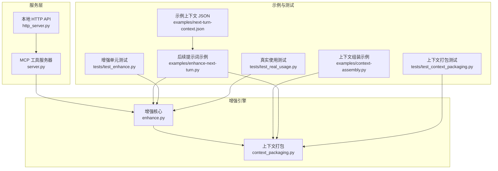
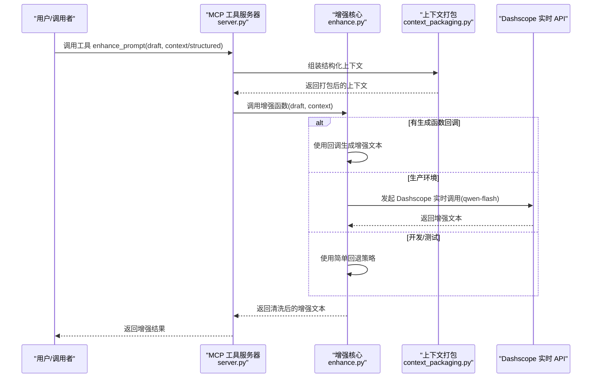
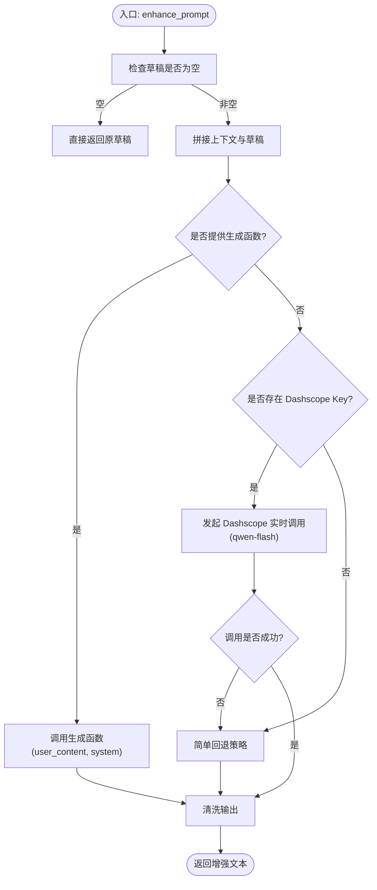
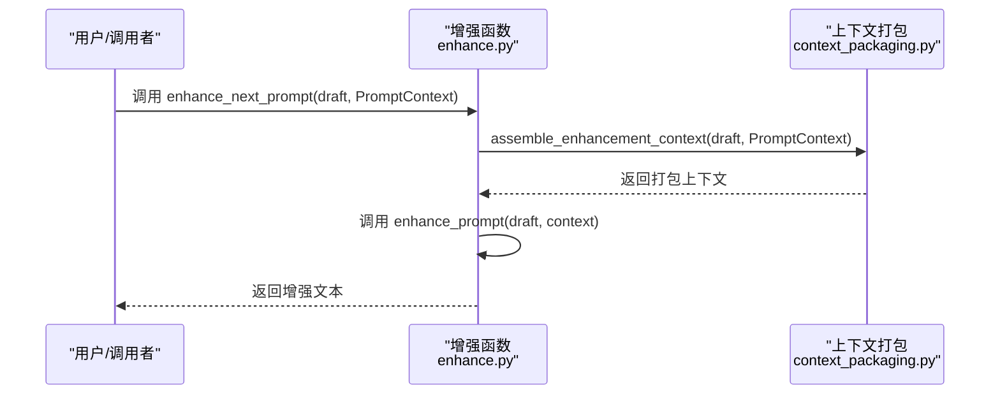
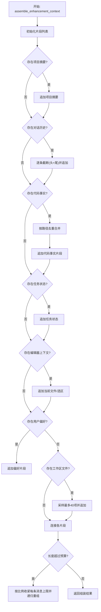
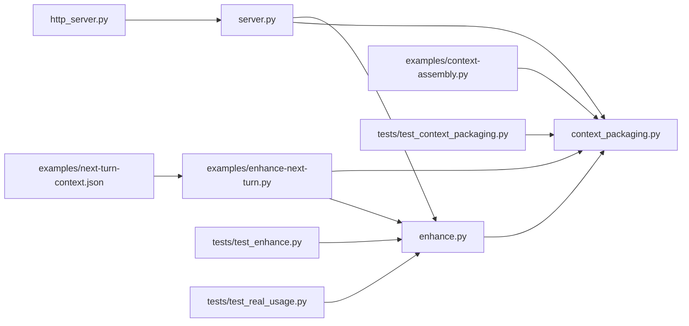
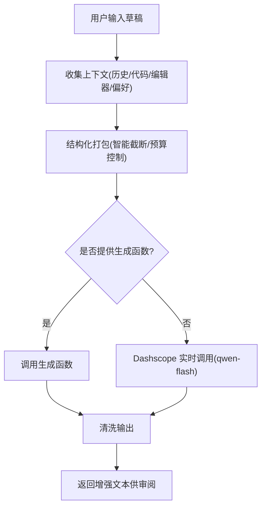

# 增强引擎

<cite>
**本文引用的文件**
- [mcp-server/enhance.py](file://mcp-server/enhance.py)
- [mcp-server/context_packaging.py](file://mcp-server/context_packaging.py)
- [mcp-server/server.py](file://mcp-server/server.py)
- [mcp-server/http_server.py](file://mcp-server/http_server.py)
- [examples/context-assembly.py](file://examples/context-assembly.py)
- [examples/enhance-next-turn.py](file://examples/enhance-next-turn.py)
- [examples/next-turn-context.json](file://examples/next-turn-context.json)
- [tests/test_enhance.py](file://tests/test_enhance.py)
- [tests/test_context_packaging.py](file://tests/test_context_packaging.py)
- [tests/test_real_usage.py](file://tests/test_real_usage.py)
- [docs/TECH_SCHEME.md](file://docs/TECH_SCHEME.md)
- [README.md](file://README.md)
- [skill/SKILL.md](file://skill/SKILL.md)
</cite>

## 更新摘要
**变更内容**
- 默认增强模型从 deepseek-v4-flash 更改为 qwen-flash，反映性能测试结果显示 qwen-flash 在中文重写质量上表现更优且速度约为 deepseek-v4-flash 的两倍
- 完全迁移到中文指令输出，从英文指令重构为中文格式
- 新增详细的结构化格式要求（编号标题、项目符号、段落组织）
- 强化可执行性要求（self-contained prompts）和明确的文件参与要求
- 精确的行为期望和清晰的成功标准
- 解决与Kilo Code集成的缺口，提供完整的中文增强体验
- 集成Dashscope实时API支持，使用qwen-flash模型提供更好的中文处理能力
- 改进API密钥加载机制，支持多层级环境变量配置

## 目录
1. [简介](#简介)
2. [项目结构](#项目结构)
3. [核心组件](#核心组件)
4. [架构总览](#架构总览)
5. [详细组件分析](#详细组件分析)
6. [依赖关系分析](#依赖关系分析)
7. [性能考量](#性能考量)
8. [故障排查指南](#故障排查指南)
9. [结论](#结论)
10. [附录](#附录)

## 简介
本文件面向 PromptCocoPilot 的增强引擎，系统性阐述其严格指令设计原则、重写规则、输出格式与安全限制；深入解析增强函数与后续提示词增强机制；说明回退策略与测试环境下的简化改进；解释实时 API 调用策略与模型选择考虑；并提供使用示例、最佳实践、性能优化技巧与错误处理方案。目标是帮助开发者与使用者以一致、可控且高效的方式集成与扩展该增强能力。

**更新** 增强引擎现已完全迁移到中文输出，并采用 qwen-flash 作为默认增强模型，提供更符合中文编程环境和用户习惯的增强体验，特别针对Kilo Code集成缺口进行了优化。新增Dashscope实时API集成，使用qwen-flash模型提供更好的中文处理能力。

## 项目结构
增强引擎由三层组成：
- 核心增强逻辑：负责严格指令、草稿提示词处理、上下文组装与增强算法。
- 上下文打包：将对话历史、代码事实、任务状态、编辑器上下文、用户偏好等结构化信息打包为可注入的增强输入。
- 服务暴露：通过 MCP 工具与本地 HTTP API 暴露增强能力，支持真实模型调用与回退策略。

**图表来源**
- [mcp-server/enhance.py:1-175](file://mcp-server/enhance.py#L1-L175)
- [mcp-server/context_packaging.py:1-252](file://mcp-server/context_packaging.py#L1-L252)
- [mcp-server/server.py:1-261](file://mcp-server/server.py#L1-L261)
- [mcp-server/http_server.py:1-112](file://mcp-server/http_server.py#L1-L112)
- [examples/context-assembly.py:1-93](file://examples/context-assembly.py#L1-L93)
- [examples/enhance-next-turn.py:1-55](file://examples/enhance-next-turn.py#L1-L55)
- [examples/next-turn-context.json:1-33](file://examples/next-turn-context.json#L1-L33)
- [tests/test_enhance.py:1-71](file://tests/test_enhance.py#L1-L71)
- [tests/test_context_packaging.py:1-187](file://tests/test_context_packaging.py#L1-L187)
- [tests/test_real_usage.py:1-206](file://tests/test_real_usage.py#L1-L206)

**章节来源**
- [README.md:23-30](file://README.md#L23-L30)
- [docs/TECH_SCHEME.md:7-19](file://docs/TECH_SCHEME.md#L7-L19)

## 核心组件
- 增强核心（enhance.py）
  - 严格指令与输出规范：仅重写草稿提示词，不回答、不执行、不讨论；输出必须干净、自包含、语言保持一致。
  - 增强函数：支持字符串上下文与生成函数回调；内置回退策略；生产环境默认通过 Dashscope 实时调用qwen-flash模型。
  - 后续提示词增强：将草稿与结构化上下文打包后复用增强函数。
  - Dashscope集成：支持多层级API密钥加载，包括环境变量、项目.env文件和Resume-Agent配置。
- 上下文打包（context_packaging.py）
  - 结构化数据类：对话消息、代码事实、提示词上下文载体。
  - 智能截断与预算控制：头尾保留、总字符预算、逐步收紧策略。
  - 去重合并：按文件路径去重合并代码事实，避免重复与冗余。
- 服务层（server.py、http_server.py）
  - MCP 工具注册与调用：支持结构化字段与自由文本上下文，返回纯文本或结构化结果。
  - 本地 HTTP API：为外部 UI（如 Codex 按钮）提供稳定端点，POST /enhance 返回增强结果。
- 示例与测试
  - 上下文组装示例：演示结构化与自由文本两种方式。
  - 后续提示词示例：展示如何将草稿与结构化上下文打包并调用增强。
  - 单元测试：验证清理、增强、指令严格性与上下文打包行为。
  - 真实用例测试：使用 Dashscope API 测试不同模型的效果。

**章节来源**
- [mcp-server/enhance.py:71-134](file://mcp-server/enhance.py#L71-L134)
- [mcp-server/context_packaging.py:7-33](file://mcp-server/context_packaging.py#L7-L33)
- [mcp-server/context_packaging.py:79-178](file://mcp-server/context_packaging.py#L79-L178)
- [mcp-server/server.py:49-80](file://mcp-server/server.py#L49-L80)
- [mcp-server/http_server.py:22-66](file://mcp-server/http_server.py#L22-L66)
- [examples/context-assembly.py:25-60](file://examples/context-assembly.py#L25-L60)
- [examples/enhance-next-turn.py:21-51](file://examples/enhance-next-turn.py#L21-L51)
- [tests/test_enhance.py:10-61](file://tests/test_enhance.py#L10-L61)
- [tests/test_context_packaging.py:19-146](file://tests/test_context_packaging.py#L19-L146)
- [tests/test_real_usage.py:34-34](file://tests/test_real_usage.py#L34-L34)

## 架构总览
增强引擎遵循"轻量重写器 + 上下文注入 + 透明审阅"的设计，核心逻辑与服务层解耦，便于在不同宿主（Claude Code、Qoder、其他 MCP 客户端）中复用。

**图表来源**
- [mcp-server/server.py:49-80](file://mcp-server/server.py#L49-L80)
- [mcp-server/enhance.py:90-134](file://mcp-server/enhance.py#L90-L134)
- [mcp-server/context_packaging.py:79-178](file://mcp-server/context_packaging.py#L79-L178)
- [mcp-server/enhance.py:41-68](file://mcp-server/enhance.py#L41-L68)

## 详细组件分析

### 严格指令设计原则与输出规范
- 重写职责边界：仅重写草稿提示词，不回答、不执行、不讨论。
- 输出格式要求：返回仅包含增强后的提示词文本；去除代码围栏与外层引号；语言与草稿保持一致。
- 安全限制：禁止包含对话、解释、引导语、占位符、Markdown 围栏、引号等；强调"可执行性"与"自包含"。

**更新** 指令已完全迁移到中文输出，确保与中文编程环境和用户习惯的契合度。

**章节来源**
- [mcp-server/enhance.py:71-83](file://mcp-server/enhance.py#L71-L83)
- [mcp-server/enhance.py:85-88](file://mcp-server/enhance.py#L85-L88)

### 增强函数实现逻辑（enhance_prompt）
- 输入装配：将草稿与可选上下文拼接为统一用户消息；若未提供生成函数，则进入回退或真实调用分支。
- 生成策略：
  - 生成函数回调：由调用方提供，适合集成宿主模型或自定义路由。
  - 生产实调：优先加载 Dashscope API Key，调用兼容 OpenAI 接口的qwen-flash模型，设置温度、最大令牌等参数，解析响应并清洗输出。
  - 回退策略：若实调失败或无 Key，则使用简单回退，保证开发/测试可用。
- 输出清洗：移除代码围栏与外层引号，确保整洁输出。

**图表来源**
- [mcp-server/enhance.py:90-134](file://mcp-server/enhance.py#L90-L134)
- [mcp-server/enhance.py:41-68](file://mcp-server/enhance.py#L41-L68)
- [mcp-server/enhance.py:150-159](file://mcp-server/enhance.py#L150-L159)

**章节来源**
- [mcp-server/enhance.py:90-134](file://mcp-server/enhance.py#L90-L134)

### 后续提示词增强机制（enhance_next_prompt）
- 目标：针对"下一轮问题"（如"那这个怎么改"）进行上下文打包与增强，使后续提问具备明确的文件、行为与成功标准。
- 流程：调用上下文打包函数生成结构化上下文，再复用增强函数完成重写。

**图表来源**
- [mcp-server/enhance.py:135-148](file://mcp-server/enhance.py#L135-L148)
- [mcp-server/context_packaging.py:79-178](file://mcp-server/context_packaging.py#L79-L178)

**章节来源**
- [mcp-server/enhance.py:135-148](file://mcp-server/enhance.py#L135-L148)

### 上下文组装与智能截断
- 数据结构：对话消息、代码事实、提示词上下文载体；支持项目摘要与工作区文件列表。
- 组装策略：
  - 智能截断：保留开头 60% 与结尾 40%，避免长回复结论丢失。
  - 总预算控制：默认约 6000 字符，超限时逐步收紧每条消息的截断上限。
  - 去重合并：同文件路径的事实合并摘要与符号集合，避免重复。
- 结构化字段：支持对话历史、代码事实、任务状态、当前文件/选区、用户偏好、项目摘要、工作区文件采样。

**图表来源**
- [mcp-server/context_packaging.py:79-178](file://mcp-server/context_packaging.py#L79-L178)
- [mcp-server/context_packaging.py:42-52](file://mcp-server/context_packaging.py#L42-L52)
- [mcp-server/context_packaging.py:60-76](file://mcp-server/context_packaging.py#L60-L76)

**章节来源**
- [mcp-server/context_packaging.py:79-178](file://mcp-server/context_packaging.py#L79-L178)

### 回退机制与测试环境策略
- 生产回退：Dashscope 实时调用失败时打印告警并切换到简单回退策略，保证可用性。
- 开发/测试回退：在无 Key 或显式提供生成函数回调时，返回结构化改进文本，便于调试与演示。
- 单元测试覆盖：验证清洗、增强返回值、指令严格性、后续提示词上下文传递等。

**章节来源**
- [mcp-server/enhance.py:118-129](file://mcp-server/enhance.py#L118-L129)
- [mcp-server/enhance.py:150-159](file://mcp-server/enhance.py#L150-L159)
- [tests/test_enhance.py:10-61](file://tests/test_enhance.py#L10-L61)

### 实时 API 调用策略与模型选择
- Dashscope 兼容端点：使用 OpenAI 兼容接口，设置温度、最大令牌、top_p 等参数，解析 choices[0].message.content。
- 模型选择：默认模型为qwen-flash，专为中文重写优化；可通过环境变量ENHANCE_MODEL覆盖。
- API密钥加载：支持多层级配置，优先级为环境变量 > 项目.env文件 > Resume-Agent配置文件。
- 错误处理：非 200 状态码抛出运行时异常；调用失败时触发回退。

**更新** 默认增强模型已从 deepseek-v4-flash 更改为 qwen-flash，这反映了性能测试结果显示 qwen-flash 在中文重写质量上表现更优且速度约为 deepseek-v4-flash 的两倍。qwen-flash 专为中文优化，提供更好的中文处理性能。

**章节来源**
- [mcp-server/enhance.py:22-25](file://mcp-server/enhance.py#L22-L25)
- [mcp-server/enhance.py:27-37](file://mcp-server/enhance.py#L27-L37)
- [mcp-server/enhance.py:41-68](file://mcp-server/enhance.py#L41-L68)

### 服务层与集成点
- MCP 工具服务器：注册工具、解析输入、组装上下文、调用增强函数、返回结果；支持结构化输出。
- 本地 HTTP API：提供 /enhance 端点，接收 draft 与上下文，返回增强结果，支持 CORS。
- 示例与技能：提供上下文组装与后续提示词示例；技能文件指导自动触发与最佳实践。

**章节来源**
- [mcp-server/server.py:49-80](file://mcp-server/server.py#L49-L80)
- [mcp-server/http_server.py:22-66](file://mcp-server/http_server.py#L22-L66)
- [examples/context-assembly.py:63-93](file://examples/context-assembly.py#L63-L93)
- [skill/SKILL.md:10-56](file://skill/SKILL.md#L10-L56)

## 依赖关系分析
- 模块内聚与耦合
  - 增强核心与上下文打包低耦合：增强核心仅依赖上下文字符串或生成函数，便于替换实现。
  - 服务层与核心解耦：MCP 与 HTTP 仅作为入口，核心逻辑独立于网络协议。
- 外部依赖
  - Dashscope API：用于生产实调；需正确配置 API Key。
  - JSON Schema：MCP 工具输入定义，确保调用方提供必要字段。
- 循环依赖：未发现循环导入。

**图表来源**
- [mcp-server/enhance.py:17-20](file://mcp-server/enhance.py#L17-L20)
- [mcp-server/server.py:35-40](file://mcp-server/server.py#L35-L40)
- [mcp-server/http_server.py:13-16](file://mcp-server/http_server.py#L13-L16)
- [examples/context-assembly.py:16-21](file://examples/context-assembly.py#L16-L21)
- [examples/enhance-next-turn.py:17-18](file://examples/enhance-next-turn.py#L17-L18)

## 性能考量
- 上下文预算控制：默认约 6000 字符，超限时逐步收紧每条消息截断上限，避免超出小模型上下文窗口。
- 智能截断：保留开头与结尾，避免长回复结论丢失，提升增强质量。
- 去重合并：减少重复文件与符号，降低上下文冗余。
- 实时调用参数：合理设置温度、top_p、max_tokens，平衡质量与延迟。
- 生成函数回调：在宿主侧路由到更快的小模型，减少跨进程/网络开销。
- 模型选择：qwen-flash专为中文优化，提供更好的中文处理性能。

**更新** 默认模型 qwen-flash 在性能测试中表现优异，中文重写质量更佳，速度约为 deepseek-v4-flash 的两倍，显著提升了整体用户体验。

**章节来源**
- [mcp-server/context_packaging.py:35-39](file://mcp-server/context_packaging.py#L35-L39)
- [mcp-server/context_packaging.py:42-52](file://mcp-server/context_packaging.py#L42-L52)
- [mcp-server/context_packaging.py:60-76](file://mcp-server/context_packaging.py#L60-L76)
- [mcp-server/enhance.py:57-60](file://mcp-server/enhance.py#L57-L60)

## 故障排查指南
- Dashscope API Key 缺失
  - 现象：抛出运行时异常，提示未找到 Key。
  - 处理：设置环境变量或在指定路径的 .env 文件中配置 Key。
- 实时调用失败
  - 现象：状态码非 200，抛出运行时异常。
  - 处理：检查网络、Key 有效性与模型可用性；触发回退策略。
- 输出格式异常
  - 现象：出现代码围栏或引号。
  - 处理：确认清洗函数被调用；检查生成函数是否返回干净文本。
- 上下文过长导致截断
  - 现象：对话片段被截断或缺失结论。
  - 处理：适当减少历史轮数或放宽预算；利用智能截断保留结论。
- 测试与调试
  - 使用示例脚本打印打包上下文，或启用增强调用进行对比。
  - 运行单元测试验证增强与上下文打包行为。

**章节来源**
- [mcp-server/enhance.py:43-44](file://mcp-server/enhance.py#L43-L44)
- [mcp-server/enhance.py:62-64](file://mcp-server/enhance.py#L62-L64)
- [mcp-server/enhance.py:85-88](file://mcp-server/enhance.py#L85-L88)
- [mcp-server/context_packaging.py:164-176](file://mcp-server/context_packaging.py#L164-L176)
- [examples/enhance-next-turn.py:21-51](file://examples/enhance-next-turn.py#L21-L51)
- [tests/test_enhance.py:10-61](file://tests/test_enhance.py#L10-L61)
- [tests/test_context_packaging.py:125-135](file://tests/test_context_packaging.py#L125-L135)

## 结论
增强引擎以严格指令与轻量实现为核心，结合结构化上下文与智能截断策略，在保证输出质量的同时兼顾性能与可维护性。通过 MCP 与本地 HTTP API 的多入口暴露，可在多种 IDE 与代理环境中复用。建议在生产中使用真实模型调用并配合合理的回退策略，同时在开发阶段充分利用示例与测试保障稳定性。

**更新** 中文指令重构显著提升了与中文编程环境的契合度，特别是针对Kilo Code集成缺口的解决，为用户提供更加自然和高效的增强体验。默认采用 qwen-flash 模型，该模型在性能测试中表现出色，中文重写质量更优且速度约为 deepseek-v4-flash 的两倍，进一步增强了系统的可靠性和用户体验。

## 附录

### 使用示例与最佳实践
- 自动触发与审阅
  - 对于模糊输入（如"修复认证"、"添加仪表盘"），自动调用增强工具，呈现增强前后对比，由用户审阅后再发送。
  - 参考技能文件的最佳实践与示例流程。
- 结构化上下文优先
  - 优先使用结构化字段（对话历史、代码事实、任务状态、当前文件/选区、用户偏好、项目摘要、工作区文件）；仅在不可用时使用自由文本。
- 后续提示词增强
  - 针对"那这个怎么改"等后续问题，将草稿与已收集的事实、历史与编辑器上下文打包，再调用增强函数。
- 本地 HTTP API 集成
  - 为外部 UI（如 Codex 按钮）提供 /enhance 端点，POST 当前输入与上下文，返回增强结果供用户审阅。

**章节来源**
- [skill/SKILL.md:41-56](file://skill/SKILL.md#L41-L56)
- [examples/context-assembly.py:63-93](file://examples/context-assembly.py#L63-L93)
- [examples/enhance-next-turn.py:21-51](file://examples/enhance-next-turn.py#L21-L51)
- [mcp-server/http_server.py:22-66](file://mcp-server/http_server.py#L22-L66)

### 关键流程图（概念性）

**更新** 中文指令重构后的流程图体现了更符合中文用户习惯的增强体验，特别是在结构化格式和可执行性方面的强化。默认采用 qwen-flash 模型的集成使得整个流程更加高效和可靠，性能测试显示其在中文重写质量上表现更优且速度约为 deepseek-v4-flash 的两倍。