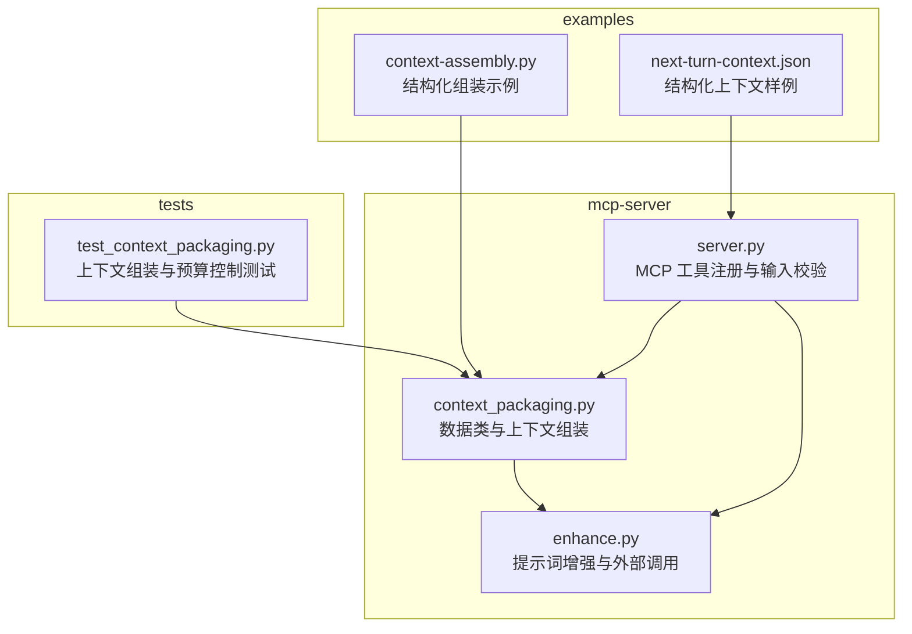
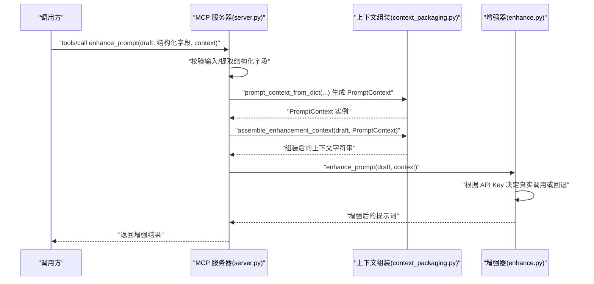
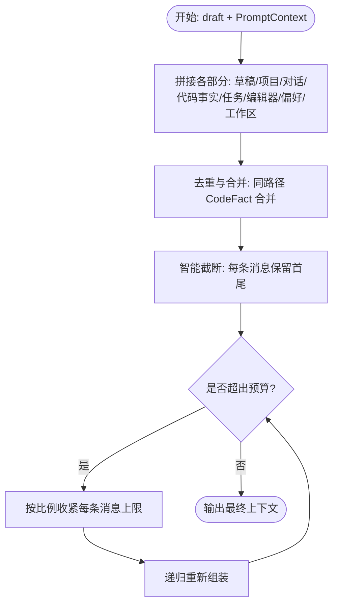
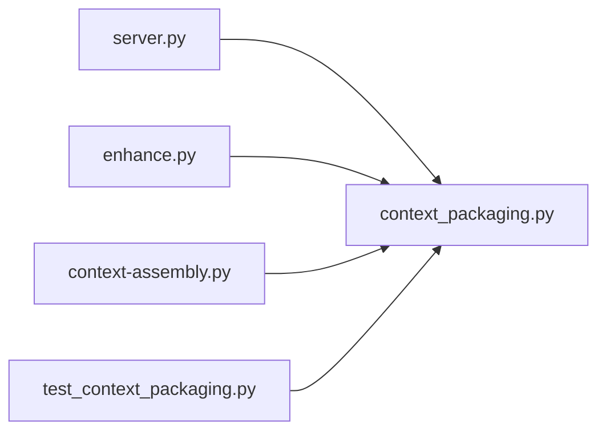

# 数据模型

<cite>
**本文引用的文件**
- [context_packaging.py](file://mcp-server/context_packaging.py)
- [enhance.py](file://mcp-server/enhance.py)
- [server.py](file://mcp-server/server.py)
- [context-assembly.py](file://examples/context-assembly.py)
- [next-turn-context.json](file://examples/next-turn-context.json)
- [test_context_packaging.py](file://tests/test_context_packaging.py)
- [README.md](file://README.md)
</cite>

## 目录
1. [简介](#简介)
2. [项目结构](#项目结构)
3. [核心数据结构](#核心数据结构)
4. [架构总览](#架构总览)
5. [组件详解](#组件详解)
6. [依赖关系分析](#依赖关系分析)
7. [性能考量](#性能考量)
8. [故障排查指南](#故障排查指南)
9. [结论](#结论)
10. [附录](#附录)

## 简介
本文件面向 PromptCocoPilot 的数据模型，聚焦于核心数据结构的定义、字段与约束、实体间关系映射、数据验证与业务规则、数据访问与缓存策略、数据生命周期管理以及数据安全与访问控制。通过对 mcp-server 中的数据类与处理流程进行系统性梳理，帮助开发者与使用者准确理解如何构建与消费结构化上下文，以获得更高质量的提示词增强结果。

## 项目结构
围绕数据模型的关键文件主要集中在 mcp-server 子目录，配合 examples 与 tests 提供使用示例与验证逻辑；README 提供整体背景与使用方式。

图表来源
- [context_packaging.py:1-211](file://mcp-server/context_packaging.py#L1-L211)
- [enhance.py:1-167](file://mcp-server/enhance.py#L1-L167)
- [server.py:1-232](file://mcp-server/server.py#L1-L232)
- [context-assembly.py:1-93](file://examples/context-assembly.py#L1-L93)
- [next-turn-context.json:1-32](file://examples/next-turn-context.json#L1-L32)
- [test_context_packaging.py:1-160](file://tests/test_context_packaging.py#L1-L160)

章节来源
- [README.md:23-30](file://README.md#L23-L30)

## 核心数据结构
本节定义 PromptCocoPilot 的核心数据结构及其字段、类型与约束。

- PromptContext（结构化上下文容器）
  - 字段
    - conversation: Sequence[ConversationMessage]（默认空序列）
    - code_facts: Sequence[CodeFact]（默认空序列）
    - task_state: str（默认空字符串）
    - current_file: str（默认空字符串）
    - selected_code: str（默认空字符串）
    - user_preferences: Sequence[str]（默认空序列）
    - project_summary: str（默认空字符串）
    - workspace_files: Sequence[str]（默认空序列）
  - 约束与语义
    - 用于承载“草稿 + 历史 + 已读代码事实 + 任务状态 + 编辑器上下文 + 用户偏好 + 项目概览 + 工作区文件清单”等信息。
    - 作为结构化输入的核心载体，驱动上下文打包与预算控制。
  - 复杂度
    - 序列字段长度影响组装成本与预算分配，需注意去重与截断策略。

- ConversationMessage（对话消息）
  - 字段
    - role: str（角色，如 user/assistant）
    - content: str（内容）
  - 约束与语义
    - 仅包含必要字段，便于统一处理与截断。
    - 由上游调用方提供，内部不做额外解析。

- CodeFact（代码事实）
  - 字段
    - path: str（文件路径）
    - summary: str（摘要）
    - symbols: Sequence[str]（符号集合，默认空序列）
  - 约束与语义
    - 用于表达“某文件已知的事实”，包含路径、摘要与符号列表。
    - 组装阶段会对相同 path 的事实进行合并与去重。

- 结构化输入 Schema（来自 MCP 工具注册）
  - draft: string（必填）
  - context: string（可选）
  - include_history: boolean（可选）
  - conversation: array(object)（可选）
    - items.properties: role(string), content(string)，且 content 为必填
  - code_facts: array(object)（可选）
    - items.properties: path(string), summary(string), symbols(array(string))
  - task_state: string（可选）
  - current_file: string（可选）
  - selected_code: string（可选）
  - user_preferences: array(string)（可选）
  - project_summary: string（可选）
  - workspace_files: array(string)（可选）
  - structured_output: boolean（可选）

章节来源
- [context_packaging.py:7-33](file://mcp-server/context_packaging.py#L7-L33)
- [server.py:117-191](file://mcp-server/server.py#L117-L191)

## 架构总览
数据模型在系统中的流转路径如下：调用方构造结构化上下文（或自由文本），MCP 服务器接收并校验输入，将结构化字段转换为 PromptContext，随后调用上下文组装函数生成最终增强输入，最后由增强器调用外部 LLM 接口完成改写。

图表来源
- [server.py:49-80](file://mcp-server/server.py#L49-L80)
- [context_packaging.py:181-211](file://mcp-server/context_packaging.py#L181-L211)
- [context_packaging.py:79-178](file://mcp-server/context_packaging.py#L79-L178)
- [enhance.py:90-134](file://mcp-server/enhance.py#L90-L134)

## 组件详解

### PromptContext 与上下文组装
- 组装流程要点
  - 拼接草稿、项目上下文、最近对话、代码事实、任务状态、编辑器上下文、用户偏好、工作区文件样本。
  - 对长文本采用“头+尾”智能截断，避免丢失结论。
  - 对相同 path 的 CodeFact 进行合并与符号去重。
  - 总预算控制：超过预算时按比例收紧每条消息的字符上限，递归尝试直到满足预算。
- 关键函数与职责
  - assemble_enhancement_context: 主流程入口，负责拼装与预算控制。
  - _truncate_smart: 智能截断，保留首尾。
  - _dedup_code_facts: 合并相同路径的事实，合并摘要并去重符号。
  - prompt_context_from_dict: 将 JSON 参数转换为 PromptContext。
- 示例与样例
  - examples/context-assembly.py 展示了结构化与自由文本两种方式。
  - examples/next-turn-context.json 提供了结构化上下文样例。

图表来源
- [context_packaging.py:79-178](file://mcp-server/context_packaging.py#L79-L178)
- [context_packaging.py:60-76](file://mcp-server/context_packaging.py#L60-L76)
- [context_packaging.py:42-52](file://mcp-server/context_packaging.py#L42-L52)

章节来源
- [context_packaging.py:79-178](file://mcp-server/context_packaging.py#L79-L178)
- [context_packaging.py:60-76](file://mcp-server/context_packaging.py#L60-L76)
- [context_packaging.py:42-52](file://mcp-server/context_packaging.py#L42-L52)
- [context-assembly.py:63-92](file://examples/context-assembly.py#L63-L92)
- [next-turn-context.json:1-32](file://examples/next-turn-context.json#L1-L32)

### ConversationMessage 与 CodeFact
- ConversationMessage
  - 仅包含 role 与 content，便于统一处理与截断。
  - 由上游调用方提供，内部不做额外解析。
- CodeFact
  - path 作为事实标识；summary 描述事实；symbols 表达相关符号。
  - 组装阶段对相同 path 的事实进行合并与去重，避免重复与冗余。

章节来源
- [context_packaging.py:7-33](file://mcp-server/context_packaging.py#L7-L33)
- [test_context_packaging.py:71-95](file://tests/test_context_packaging.py#L71-L95)

### MCP 工具输入与 Schema 校验
- 工具注册
  - server.py 在工具列表中声明输入 Schema，明确各字段类型与必填项。
  - draft 为必填；其余字段均为可选，支持结构化字段与自由文本 context。
- 输入处理
  - 若存在结构化字段，则优先组装为 PromptContext 并与自由文本 context 合并。
  - 支持 structured_output 返回 JSON 结构，便于调试与集成。

章节来源
- [server.py:117-191](file://mcp-server/server.py#L117-L191)
- [server.py:49-80](file://mcp-server/server.py#L49-L80)

### 增强器与外部调用
- 增强流程
  - enhance_prompt: 组合输入，决定使用真实 LLM 调用还是回退策略。
  - _call_dashscope_real: 使用 Dashscope 兼容接口进行真实增强。
  - _simple_fallback_enhance: 开发/测试场景下的简单回退。
- API Key 管理
  - 从环境变量或指定文件加载 API Key；若缺失则抛出错误或回退。

章节来源
- [enhance.py:90-134](file://mcp-server/enhance.py#L90-L134)
- [enhance.py:27-69](file://mcp-server/enhance.py#L27-L69)

## 依赖关系分析
- 组件耦合
  - server.py 依赖 context_packaging.py 的 PromptContext 与组装函数。
  - enhance.py 依赖 context_packaging.py 的 PromptContext 与组装函数。
  - examples 与 tests 通过导入 mcp-server 模块验证数据结构与行为。
- 关系图

图表来源
- [server.py:35-40](file://mcp-server/server.py#L35-L40)
- [enhance.py:17-21](file://mcp-server/enhance.py#L17-L21)
- [context-assembly.py:16-21](file://examples/context-assembly.py#L16-L21)
- [test_context_packaging.py:6-16](file://tests/test_context_packaging.py#L6-L16)

## 性能考量
- 上下文预算
  - 默认上下文预算约 6000 字符，用于限制传入增强器的上下文大小，保障小模型可用性。
  - 超预算时按比例收紧每条消息上限并递归尝试，确保最终长度在预算范围内。
- 截断策略
  - 智能截断保留前 60% 与后 40%，避免丢失结论。
- 去重与合并
  - 相同路径的 CodeFact 合并摘要并去重符号，减少冗余与重复信息。
- 工作区文件采样
  - 最多展示 40 个文件，避免过度膨胀上下文。

章节来源
- [context_packaging.py:35-39](file://mcp-server/context_packaging.py#L35-L39)
- [context_packaging.py:164-178](file://mcp-server/context_packaging.py#L164-L178)
- [context_packaging.py:156-160](file://mcp-server/context_packaging.py#L156-L160)
- [test_context_packaging.py:125-136](file://tests/test_context_packaging.py#L125-L136)

## 故障排查指南
- API Key 缺失
  - 现象：调用 Dashscope 时抛出错误或回退。
  - 处理：设置环境变量 DASHSCOPE_API_KEY，或在指定文件中提供。
- 输入为空或格式不正确
  - 现象：增强结果为空或异常。
  - 处理：确保 draft 非空；结构化字段符合 Schema；conversation 的 items 至少包含 role 与 content。
- 预算不足导致截断过度
  - 现象：对话被过度截断。
  - 处理：适当提高 context_budget 或减少单条消息长度；合理使用 include_history 控制历史规模。
- 符号重复与事实重复
  - 现象：符号列表出现重复或事实重复。
  - 处理：利用内置去重逻辑；确保传入的 symbols 与 code_facts 不重复。

章节来源
- [enhance.py:42-44](file://mcp-server/enhance.py#L42-L44)
- [server.py:132-142](file://mcp-server/server.py#L132-L142)
- [context_packaging.py:60-76](file://mcp-server/context_packaging.py#L60-L76)

## 结论
PromptCocoPilot 的数据模型以 PromptContext 为核心，结合 ConversationMessage 与 CodeFact，形成“草稿 + 历史 + 已读代码事实 + 任务状态 + 编辑器上下文 + 用户偏好 + 项目概览 + 工作区文件”的完整上下文视图。通过智能截断、去重合并与预算控制，系统在保证增强质量的同时兼顾性能与稳定性。MCP 工具注册与输入 Schema 明确了调用契约，增强了可维护性与可扩展性。

## 附录

### 字段与约束对照表
- PromptContext
  - conversation: Sequence[ConversationMessage]
  - code_facts: Sequence[CodeFact]
  - task_state: str
  - current_file: str
  - selected_code: str
  - user_preferences: Sequence[str]
  - project_summary: str
  - workspace_files: Sequence[str]
- ConversationMessage
  - role: str
  - content: str
- CodeFact
  - path: str
  - summary: str
  - symbols: Sequence[str]

章节来源
- [context_packaging.py:7-33](file://mcp-server/context_packaging.py#L7-L33)

### 数据访问与缓存策略
- 数据访问模式
  - 一次性组装：调用方将结构化上下文传入，服务端一次性组装并返回增强结果。
  - 流式/增量：当前实现为一次性组装，未提供流式或增量缓存。
- 缓存策略
  - 未实现持久化缓存；建议在上层调用方或代理层实现短期缓存以降低重复请求成本。

章节来源
- [context_packaging.py:79-178](file://mcp-server/context_packaging.py#L79-L178)
- [server.py:49-80](file://mcp-server/server.py#L49-L80)

### 数据生命周期管理
- 创建
  - 由调用方在发起增强请求前准备结构化上下文。
- 更新
  - 通过每次调用传入最新上下文字段进行更新。
- 删除/归档
  - 未实现持久化存储，无需删除/归档操作。
- 版本演进
  - 通过 MCP 工具注册的输入 Schema 变更进行版本管理。

章节来源
- [server.py:117-191](file://mcp-server/server.py#L117-L191)

### 数据安全与访问控制
- API Key 管理
  - 通过环境变量或指定文件加载，避免硬编码。
- 调用链路
  - MCP 服务器与外部 LLM 调用之间保持最小暴露面；错误处理与回退策略确保稳定性。
- 建议
  - 在生产环境中启用 HTTPS 代理与访问控制；限制工具调用来源与频率。

章节来源
- [enhance.py:27-37](file://mcp-server/enhance.py#L27-L37)
- [README.md:83-95](file://README.md#L83-L95)