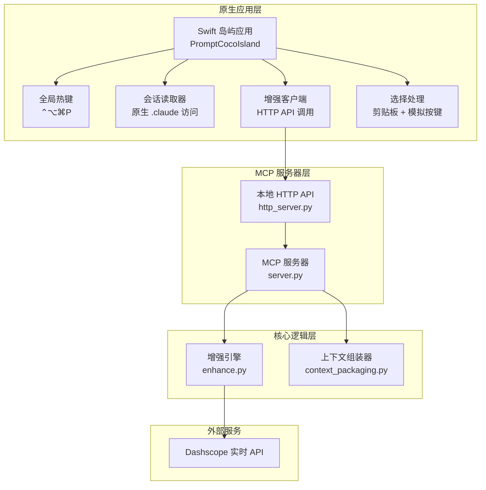
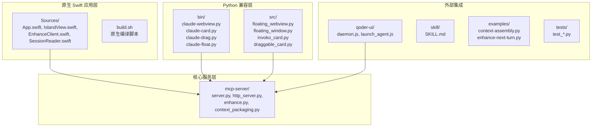
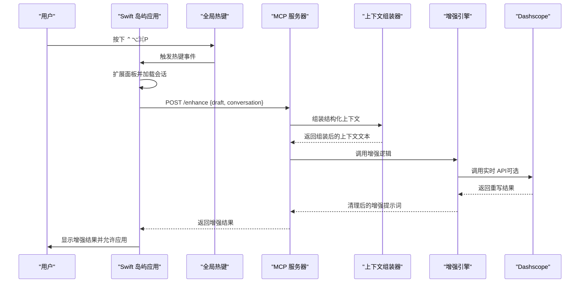
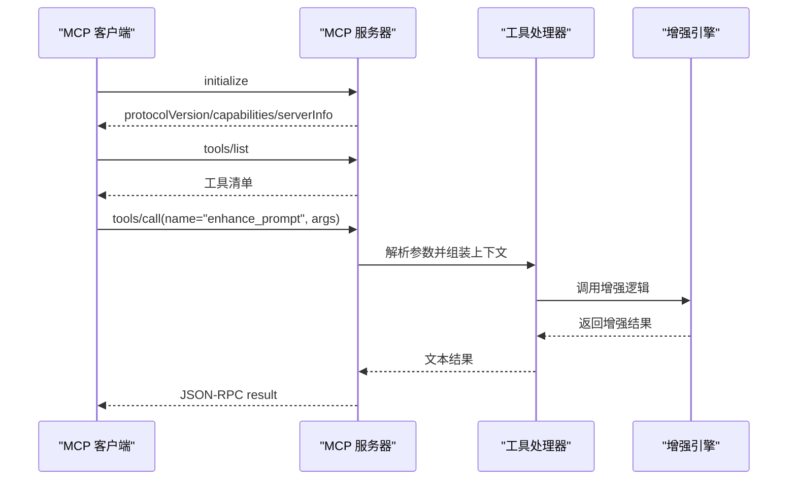
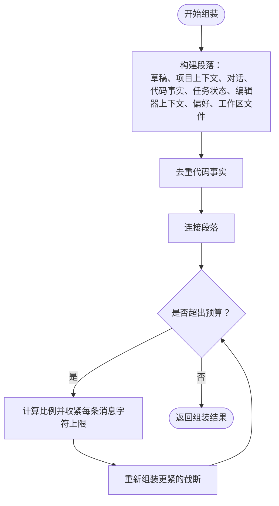
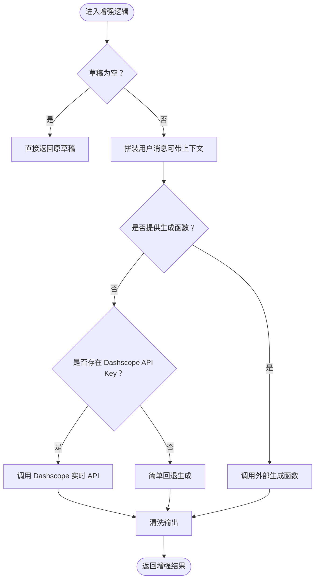
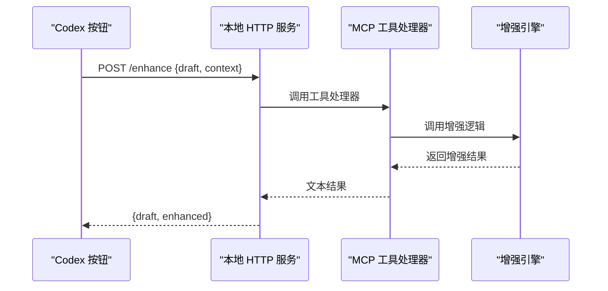
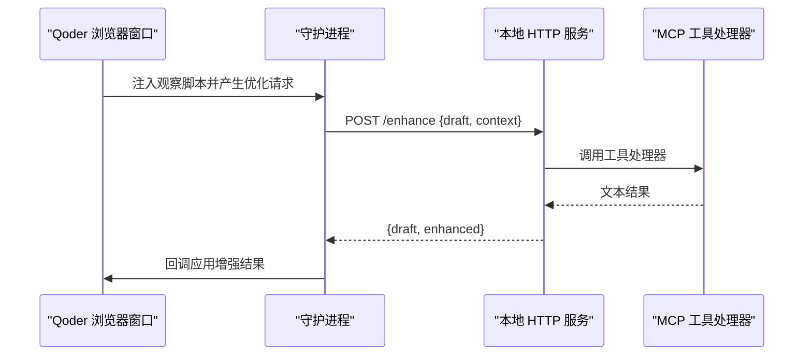
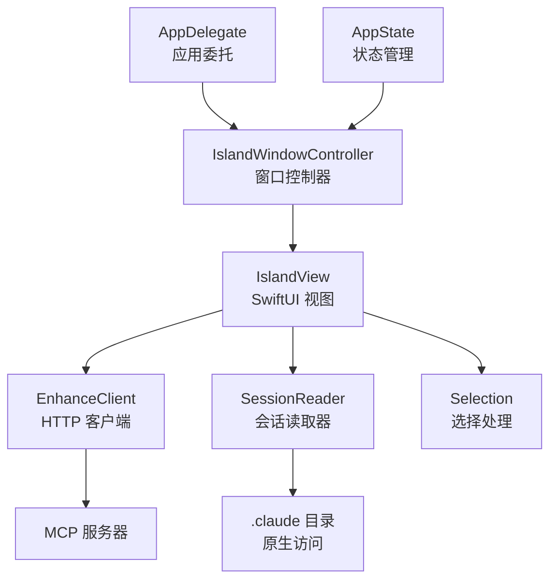
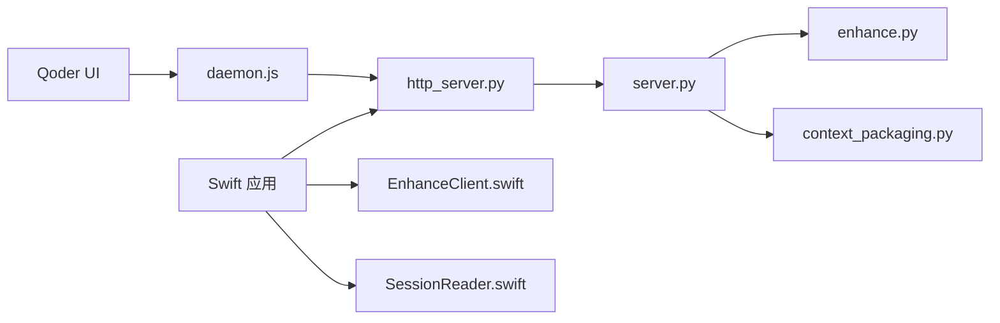

# 核心架构

<cite>
**本文引用的文件**
- [README.md](file://README.md)
- [docs/TECH_SCHEME.md](file://docs/TECH_SCHEME.md)
- [mcp-server/server.py](file://mcp-server/server.py)
- [mcp-server/enhance.py](file://mcp-server/enhance.py)
- [mcp-server/context_packaging.py](file://mcp-server/context_packaging.py)
- [mcp-server/http_server.py](file://mcp-server/http_server.py)
- [skill/SKILL.md](file://skill/SKILL.md)
- [examples/context-assembly.py](file://examples/context-assembly.py)
- [examples/enhance-next-turn.py](file://examples/enhance-next-turn.py)
- [tests/test_context_packaging.py](file://tests/test_context_packaging.py)
- [tests/test_enhance.py](file://tests/test_enhance.py)
- [qoder-ui/src/daemon.js](file://qoder-ui/src/daemon.js)
- [qoder-ui/src/launch_agent.js](file://qoder-ui/src/launch_agent.js)
- [package.json](file://package.json)
- [claude-ui/swift/Sources/App.swift](file://claude-ui/swift/Sources/App.swift)
- [claude-ui/swift/Sources/IslandView.swift](file://claude-ui/swift/Sources/IslandView.swift)
- [claude-ui/swift/Sources/EnhanceClient.swift](file://claude-ui/swift/Sources/EnhanceClient.swift)
- [claude-ui/swift/Sources/Selection.swift](file://claude-ui/swift/Sources/Selection.swift)
- [claude-ui/swift/Sources/SessionReader.swift](file://claude-ui/swift/Sources/SessionReader.swift)
- [claude-ui/swift/build.sh](file://claude-ui/swift/build.sh)
- [claude-ui/bin/claude-webview.py](file://claude-ui/bin/claude-webview.py)
- [claude-ui/bin/claude-card.py](file://claude-ui/bin/claude-card.py)
- [claude-ui/bin/claude-drag.py](file://claude-ui/bin/claude-drag.py)
- [claude-ui/bin/claude-float.py](file://claude-ui/bin/claude-float.py)
- [claude-ui/src/floating_webview.py](file://claude-ui/src/floating_webview.py)
- [claude-ui/src/floating_window.py](file://claude-ui/src/floating_window.py)
- [claude-ui/src/invoko_card.py](file://claude-ui/src/invoko_card.py)
- [claude-ui/src/draggable_card.py](file://claude-ui/src/draggable_card.py)
</cite>

## 更新摘要
**所做更改**
- 新增系统概览章节，详细说明从跨平台 pywebview 解决方案迁移到原生 Swift 实现的架构变更
- 更新架构总览图，展示新的 Swift 岛屿应用与现有 MCP 服务器的集成关系
- 新增 Swift 岛屿应用组件分析，包括原生窗口管理、热键处理和状态管理
- 更新组件关系图，反映新的本地应用与 MCP 服务器的通信模式
- 新增构建和部署章节，说明 Swift 应用的编译和运行方式

## 目录
1. [引言](#引言)
2. [系统概览](#系统概览)
3. [项目结构](#项目结构)
4. [核心组件](#核心组件)
5. [架构总览](#架构总览)
6. [详细组件分析](#详细组件分析)
7. [Swift 岛屿应用](#swift-岛屿应用)
8. [依赖分析](#依赖分析)
9. [性能考量](#性能考量)
10. [故障排除指南](#故障排除指南)
11. [结论](#结论)
12. [附录](#附录)

## 引言
本文件面向 PromptCocoPilot 的核心架构文档，聚焦于分层架构模式、组件交互关系与数据流。系统以 MCP 服务器为核心，提供上下文感知的提示词增强能力，支持 Claude Code 与 Qoder 等 MCP 兼容环境。**重要变更**：系统现已从跨平台 pywebview 解决方案迁移到原生 Swift 实现，提供更流畅的 macOS 体验和更好的系统集成。文档还解释了增强引擎的严格指令设计、回退机制与实时 API 调用策略，以及上下文组装器的数据结构、智能截断与预算控制机制。

## 系统概览
**重大架构变更**：系统现已从跨平台 pywebview 解决方案完全迁移到原生 Swift 实现，提供更优的 macOS 集成和用户体验。

### 新架构设计
- **原生 Swift 应用**：提供动态岛屿风格的浮动增强面板，支持 macOS 原生特性
- **MCP 服务器**：保持不变，继续提供增强服务
- **双向通信**：Swift 应用通过 HTTP API 调用 MCP 服务器，MCP 服务器通过本地端点提供增强功能
- **会话集成**：原生读取 Claude Code 会话数据，无需 Python 依赖

**图表来源**
- [claude-ui/swift/Sources/App.swift:8-418](file://claude-ui/swift/Sources/App.swift#L8-L418)
- [claude-ui/swift/Sources/EnhanceClient.swift:1-52](file://claude-ui/swift/Sources/EnhanceClient.swift#L1-L52)
- [mcp-server/server.py:42-232](file://mcp-server/server.py#L42-L232)

**章节来源**
- [claude-ui/swift/Sources/App.swift:8-418](file://claude-ui/swift/Sources/App.swift#L8-L418)
- [claude-ui/swift/Sources/EnhanceClient.swift:1-52](file://claude-ui/swift/Sources/EnhanceClient.swift#L1-L52)

## 项目结构
项目采用模块化分层组织，现已增加原生 Swift 应用层：
- **claude-ui/swift**：原生 Swift 岛屿应用，提供 macOS 原生增强界面
- **claude-ui/bin**：遗留的 Python 启动器脚本，用于兼容旧版本
- **claude-ui/src**：遗留的 Python Webview 实现，已停止维护
- **mcp-server**：MCP 服务器与核心增强逻辑，保持不变
- **skill**：技能定义文件，指导模型何时与如何调用增强工具
- **examples**：示例脚本，演示上下文组装与"下一轮问题"增强流程
- **tests**：单元测试，覆盖上下文组装与增强逻辑
- **qoder-ui**：Qoder IDE 的前端桥接与守护进程，用于在浏览器页面中注入观察脚本并调用本地 HTTP API
- **docs**：技术方案与集成文档

**图表来源**
- [claude-ui/swift/Sources/App.swift:1-418](file://claude-ui/swift/Sources/App.swift#L1-L418)
- [claude-ui/swift/build.sh:1-19](file://claude-ui/swift/build.sh#L1-L19)
- [claude-ui/bin/claude-webview.py:1-14](file://claude-ui/bin/claude-webview.py#L1-L14)
- [claude-ui/src/floating_webview.py:1-626](file://claude-ui/src/floating_webview.py#L1-L626)

**章节来源**
- [claude-ui/swift/Sources/App.swift:1-418](file://claude-ui/swift/Sources/App.swift#L1-L418)
- [claude-ui/swift/build.sh:1-19](file://claude-ui/swift/build.sh#L1-L19)
- [claude-ui/bin/claude-webview.py:1-14](file://claude-ui/bin/claude-webview.py#L1-L14)
- [claude-ui/src/floating_webview.py:1-626](file://claude-ui/src/floating_webview.py#L1-L626)

## 核心组件
- **Swift 岛屿应用**：原生 macOS 应用，提供动态岛屿风格的浮动增强面板，支持热键激活、会话管理和增强功能
- **MCP 服务器**：实现 JSON-RPC 兼容的 stdio 通道，注册并暴露增强工具，解析输入参数，组装上下文并调用增强引擎，返回文本结果
- **增强引擎**：严格指令驱动的轻量级重写器，支持真实 Dashscope 调用与回退策略，输出清理后的增强提示词
- **上下文组装器**：结构化数据模型与智能截断算法，按预算控制组装对话历史、代码事实、任务状态、编辑器上下文与用户偏好
- **本地 HTTP API**：为 Codex 提供"优化输入"按钮的本地 HTTP 端点，转发请求至 MCP 工具处理
- **技能定义**：指导模型在何时、如何调用增强工具，强调"预发送优化 + 人类审阅"的透明流程
- **Qoder 桥接**：通过 DevTools 注入观察脚本，监听输入优化请求并通过本地 HTTP API 获取增强结果

**章节来源**
- [claude-ui/swift/Sources/App.swift:19-418](file://claude-ui/swift/Sources/App.swift#L19-L418)
- [claude-ui/swift/Sources/IslandView.swift:21-327](file://claude-ui/swift/Sources/IslandView.swift#L21-L327)
- [claude-ui/swift/Sources/EnhanceClient.swift:5-52](file://claude-ui/swift/Sources/EnhanceClient.swift#L5-L52)
- [claude-ui/swift/Sources/SessionReader.swift:38-182](file://claude-ui/swift/Sources/SessionReader.swift#L38-L182)
- [mcp-server/server.py:42-232](file://mcp-server/server.py#L42-L232)
- [mcp-server/enhance.py:10-167](file://mcp-server/enhance.py#L10-L167)
- [mcp-server/context_packaging.py:7-211](file://mcp-server/context_packaging.py#L7-L211)
- [mcp-server/http_server.py:1-101](file://mcp-server/http_server.py#L1-L101)
- [skill/SKILL.md:1-105](file://skill/SKILL.md#L1-L105)
- [qoder-ui/src/daemon.js:1-165](file://qoder-ui/src/daemon.js#L1-L165)

## 架构总览
系统采用"原生应用 + 轻量增强器 + 结构化上下文 + 多入口暴露"的混合架构：
- **原生应用层**：Swift 岛屿应用提供 macOS 原生体验，支持动态岛屿效果、热键激活和系统集成功能
- **核心逻辑保持轻量**：避免代理循环与副作用，仅负责提示词重写
- **MCP 工具作为通用能力暴露**：Skill 作为使用规范与触发规则
- **上下文由调用方组装**：核心保持纯函数式与隐私友好
- **通过 Dashscope 实现实时增强**：同时保留开发/测试阶段的回退策略
- **本地 HTTP API 为 Codex 提供按钮式入口**：Qoder 通过 DevTools 注入脚本与本地 API 协作

**图表来源**
- [claude-ui/swift/Sources/App.swift:32-66](file://claude-ui/swift/Sources/App.swift#L32-L66)
- [claude-ui/swift/Sources/EnhanceClient.swift:24-50](file://claude-ui/swift/Sources/EnhanceClient.swift#L24-L50)
- [mcp-server/server.py:196-228](file://mcp-server/server.py#L196-L228)

## 详细组件分析

### MCP 服务器（JSON-RPC + 工具注册）
- **协议与握手**：兼容 JSON-RPC 2.0，支持 initialize 与 tools/list 方法，返回工具清单与服务器信息
- **工具注册**：声明 enhance_prompt 工具，定义输入模式（draft、context、结构化字段、布尔开关等）
- **工具调用**：tools/call 分发到 handle_enhance_prompt_tool，支持结构化上下文自动打包与字符串上下文拼接
- **输出格式**：返回 JSON-RPC result，content 为纯文本类型，便于宿主渲染
- **错误处理**：未知方法与工具缺失返回标准错误码，保证协议一致性

**图表来源**
- [mcp-server/server.py:82-232](file://mcp-server/server.py#L82-L232)

**章节来源**
- [mcp-server/server.py:42-232](file://mcp-server/server.py#L42-L232)
- [docs/TECH_SCHEME.md:48-54](file://docs/TECH_SCHEME.md#L48-L54)

### 上下文组装器（数据结构、智能截断与预算控制）
- **数据模型**
  - ConversationMessage：角色与内容
  - CodeFact：路径、摘要与符号集合
  - PromptContext：对话历史、代码事实、任务状态、当前文件、选中代码、用户偏好、项目概要、工作区文件列表
- **智能截断**
  - _truncate_smart：保留前 60% 与后 40%，中间以省略号替换，避免长回复结论丢失
  - _dedup_code_facts：按路径去重，合并摘要与符号，避免重复信息
- **预算控制**
  - DEFAULT_CONTEXT_BUDGET：上下文文本字符预算（约 6k），超过时逐步收紧每条消息的字符上限，优先保留对话尾部
- **组装流程**
  - 拼接草稿、项目上下文、近期对话、代码事实、任务状态、编辑器上下文、用户偏好与工作区文件采样
  - 最终以空行分隔的段落形式返回，便于增强引擎解析

**图表来源**
- [mcp-server/context_packaging.py:79-178](file://mcp-server/context_packaging.py#L79-L178)

**章节来源**
- [mcp-server/context_packaging.py:7-211](file://mcp-server/context_packaging.py#L7-L211)
- [tests/test_context_packaging.py:19-160](file://tests/test_context_packaging.py#L19-L160)

### 增强引擎（严格指令、回退机制与实时 API 策略）
- **严格指令**：明确仅重写提示词，不回答、不执行、不讨论；输出语言与草稿一致；必须自包含（包含具体文件、行为与成功标准）
- **输入拼装**：可选附加上下文，形成"草稿待重写"的用户消息
- **回退策略**：无 API Key 或调用失败时，使用简单结构化回退生成增强提示词，保证开发与测试可用性
- **实时 API**：默认通过 Dashscope OpenAI 兼容端点调用，支持超时与错误处理，返回内容经清洗去除代码围栏与外层引号
- **生成函数注入**：支持外部 generate_fn，便于与宿主模型路由或测试替身协作

**图表来源**
- [mcp-server/enhance.py:90-133](file://mcp-server/enhance.py#L90-L133)

**章节来源**
- [mcp-server/enhance.py:10-167](file://mcp-server/enhance.py#L10-L167)
- [tests/test_enhance.py:10-69](file://tests/test_enhance.py#L10-L69)

### 本地 HTTP API（Codex "优化输入"按钮）
- **端点**：/enhance，支持 OPTIONS/CORS，接收 draft 与 context，返回 {draft, enhanced}
- **调用链**：请求到达后交由 MCP 工具处理器，复用同一增强逻辑，确保与 MCP 版本一致
- **错误处理**：参数校验、JSON 解析与异常捕获，统一返回 4xx/5xx 与错误信息

**图表来源**
- [mcp-server/http_server.py:39-84](file://mcp-server/http_server.py#L39-L84)
- [mcp-server/server.py:49-80](file://mcp-server/server.py#L49-L80)

**章节来源**
- [mcp-server/http_server.py:1-101](file://mcp-server/http_server.py#L1-L101)
- [README.md:55-65](file://README.md#L55-L65)

### Qoder 桥接（DevTools 注入与守护进程）
- **守护进程**：通过 DevTools 连接 Qoder 浏览器窗口，注入观察脚本，轮询挂起的优化请求
- **请求处理**：向本地 HTTP API 发起 /enhance 请求，收到结果后回调页面应用增强结果
- **启停管理**：通过 LaunchAgent 在 macOS 上安装/卸载持久化守护进程，记录日志

**图表来源**
- [qoder-ui/src/daemon.js:100-126](file://qoder-ui/src/daemon.js#L100-L126)
- [mcp-server/http_server.py:39-84](file://mcp-server/http_server.py#L39-L84)

**章节来源**
- [qoder-ui/src/daemon.js:1-165](file://qoder-ui/src/daemon.js#L1-L165)
- [qoder-ui/src/launch_agent.js:1-90](file://qoder-ui/src/launch_agent.js#L1-L90)
- [package.json:6-12](file://package.json#L6-L12)

## Swift 岛屿应用
**新增**：原生 Swift 岛屿应用提供 macOS 原生体验，完全替代了之前的跨平台解决方案。

### 应用架构
- **AppDelegate**：应用委托，处理应用生命周期、菜单安装和全局热键注册
- **AppState**：共享状态管理，包含展开状态、会话列表、草稿、结果、状态等
- **IslandWindowController**：窗口控制器，管理原生 macOS 窗口、拖拽、停靠和尺寸调整
- **IslandView**：SwiftUI 视图层次，实现动态岛屿效果、主题样式和用户交互
- **EnhanceClient**：HTTP 客户端，与 MCP 服务器通信
- **SessionReader**：原生会话读取器，直接访问 ~/.claude 目录
- **Selection**：选择处理，管理剪贴板和模拟键盘输入

**图表来源**
- [claude-ui/swift/Sources/App.swift:19-418](file://claude-ui/swift/Sources/App.swift#L19-L418)
- [claude-ui/swift/Sources/IslandView.swift:21-327](file://claude-ui/swift/Sources/IslandView.swift#L21-L327)
- [claude-ui/swift/Sources/EnhanceClient.swift:5-52](file://claude-ui/swift/Sources/EnhanceClient.swift#L5-L52)
- [claude-ui/swift/Sources/SessionReader.swift:38-182](file://claude-ui/swift/Sources/SessionReader.swift#L38-L182)

### 动态岛屿效果
- **Notch 检测**：自动检测屏幕刘海区域，确保应用正确停靠
- **形状设计**：顶部方形、底部圆角的岛屿形状，支持展开/折叠动画
- **透明背景**：黑色半透明背景，完美融合到系统界面
- **阴影效果**：使用渐变阴影增强立体感

### 全局热键支持
- **热键注册**：使用 Carbon API 注册 ⌃⌥⌘P 全局热键，无需辅助功能权限
- **事件处理**：通过 EventHotKeyRef 系统 API 处理热键事件
- **多实例管理**：支持多个热键实例，使用唯一 ID 管理

### 会话管理系统
- **原生读取**：直接访问 ~/.claude 目录，无需 Python 依赖
- **会话解析**：解析 JSONL 对话文件，提取最近消息
- **预览生成**：生成压缩的上下文预览，支持时间格式化
- **排序逻辑**：基于最后活动时间排序，优先显示活跃会话

**章节来源**
- [claude-ui/swift/Sources/App.swift:19-418](file://claude-ui/swift/Sources/App.swift#L19-L418)
- [claude-ui/swift/Sources/IslandView.swift:21-327](file://claude-ui/swift/Sources/IslandView.swift#L21-L327)
- [claude-ui/swift/Sources/EnhanceClient.swift:5-52](file://claude-ui/swift/Sources/EnhanceClient.swift#L5-L52)
- [claude-ui/swift/Sources/SessionReader.swift:38-182](file://claude-ui/swift/Sources/SessionReader.swift#L38-L182)
- [claude-ui/swift/Sources/Selection.swift:1-36](file://claude-ui/swift/Sources/Selection.swift#L1-L36)

## 依赖分析
- **组件耦合**
  - server.py 依赖 enhance.py 与 context_packaging.py，形成"工具注册 → 上下文组装 → 增强引擎"的线性依赖
  - http_server.py 依赖 server.py 的工具处理器，实现本地 HTTP 入口
  - qoder-ui 通过本地 HTTP API 间接依赖 server.py 的工具处理能力
  - **新增**：Swift 应用通过 EnhanceClient 直接依赖本地 HTTP API
- **外部依赖**
  - Dashscope 实时 API：用于生产增强，受 API Key 控制
  - requests 库：HTTP 调用与错误处理
  - Node.js 生态：Qoder 守护进程依赖 DevTools 协议与 LaunchAgent
  - **新增**：macOS 原生框架：Cocoa、SwiftUI、Carbon
- **循环依赖**
  - 无直接循环导入；模块间通过函数调用解耦

**图表来源**
- [mcp-server/server.py:35-41](file://mcp-server/server.py#L35-L41)
- [mcp-server/http_server.py:13-16](file://mcp-server/http_server.py#L13-L16)
- [qoder-ui/src/daemon.js:1-5](file://qoder-ui/src/daemon.js#L1-L5)
- [claude-ui/swift/Sources/EnhanceClient.swift:5-52](file://claude-ui/swift/Sources/EnhanceClient.swift#L5-L52)
- [claude-ui/swift/Sources/SessionReader.swift:38-182](file://claude-ui/swift/Sources/SessionReader.swift#L38-L182)

**章节来源**
- [mcp-server/server.py:35-41](file://mcp-server/server.py#L35-L41)
- [mcp-server/http_server.py:13-16](file://mcp-server/http_server.py#L13-L16)
- [qoder-ui/src/daemon.js:1-5](file://qoder-ui/src/daemon.js#L1-L5)
- [claude-ui/swift/Sources/EnhanceClient.swift:5-52](file://claude-ui/swift/Sources/EnhanceClient.swift#L5-L52)
- [claude-ui/swift/Sources/SessionReader.swift:38-182](file://claude-ui/swift/Sources/SessionReader.swift#L38-L182)

## 性能考量
- **原生性能优势**：Swift 应用直接使用 macOS 原生 API，避免跨平台抽象层开销
- **内存管理**：Swift 的 ARC 自动内存管理，减少内存泄漏风险
- **轻量化增强器**：避免代理循环与工具调用，减少令牌与延迟
- **智能截断与预算控制**：限制上下文长度，优先保留结论，降低模型负担
- **小模型优先**：默认使用快速模型，兼顾速度与质量
- **本地 HTTP API**：避免网络抖动，适合高频调用场景
- **回退策略**：开发/测试阶段无需真实调用，保障可用性与稳定性
- ****新增**：原生编译优化**：使用 swiftc 直接编译，无运行时依赖，启动速度快

## 故障排除指南
- **MCP 工具未找到**
  - 确认 tools/list 是否正确返回工具清单；检查工具名称大小写与参数键名
- **Dashscope API Key 缺失**
  - 设置环境变量或在指定路径的 .env 文件中提供密钥；检查网络连通性与超时设置
- **上下文过长导致截断异常**
  - 调整 max_messages、max_chars_per_message 或 context_budget 参数；确认对话尾部结论是否被保留
- **本地 HTTP API 500 错误**
  - 检查请求体 JSON 格式与必填字段；查看守护进程日志与端口占用情况
- **Qoder 无法连接**
  - 确认 DevTools 端口读取成功；检查 LaunchAgent 安装状态与日志；验证本地 HTTP 服务已启动
- ****新增**：Swift 应用启动失败**
  - 检查 ENHANCE_ENDPOINT 环境变量；确认 MCP 服务器正在运行；验证端口 8765 可访问
- ****新增**：热键无响应**
  - 检查系统偏好设置中的辅助功能权限；确认 ⌃⌥⌘P 热键未被其他应用占用
- ****新增**：会话读取失败**
  - 检查 ~/.claude 目录权限；确认 Claude Code 已安装并有活跃会话

**章节来源**
- [mcp-server/server.py:215-228](file://mcp-server/server.py#L215-L228)
- [mcp-server/enhance.py:41-68](file://mcp-server/enhance.py#L41-L68)
- [mcp-server/context_packaging.py:164-177](file://mcp-server/context_packaging.py#L164-L177)
- [mcp-server/http_server.py:52-66](file://mcp-server/http_server.py#L52-L66)
- [qoder-ui/src/daemon.js:135-164](file://qoder-ui/src/daemon.js#L135-L164)
- [claude-ui/swift/Sources/EnhanceClient.swift:12-21](file://claude-ui/swift/Sources/EnhanceClient.swift#L12-L21)

## 结论
PromptCocoPilot 通过"原生应用 + 轻量增强器 + 结构化上下文 + 多入口暴露"的架构，实现了跨平台、可扩展且可维护的提示词优化能力。**重大升级**：系统现已完全迁移到原生 Swift 实现，提供更优的 macOS 集成、动态岛屿效果和系统级热键支持。MCP 服务器提供通用工具接口，增强引擎遵循严格指令，上下文组装器以智能截断与预算控制保障性能与稳定性，本地 HTTP API 与 Qoder 桥接进一步拓展了用户体验。该设计在性能、可扩展性与维护性之间取得平衡，满足持续编码对话中的"预发送优化 + 人类审阅"需求。

## 附录
- **技术方案与集成文档**：参见 docs/TECH_SCHEME.md 与 README.md 中的技术方案链接
- **示例与测试**：examples 与 tests 目录提供端到端验证与使用范式
- **基础设施与部署**
  - **MCP 服务器**：作为持久进程运行，由宿主客户端配置加载
  - **本地 HTTP API**：默认监听 127.0.0.1:8765，支持 CORS
  - **Qoder 守护进程**：通过 LaunchAgent 安装，记录日志于用户目录
  - **Swift 应用**：使用 build.sh 编译，直接运行 PromptCocoIsland 可执行文件
- **安全与监控**
  - API Key 管理：建议通过环境变量或安全存储管理 Dashscope 密钥
  - 日志与可观测性：本地 HTTP 与守护进程均输出关键事件与错误信息，便于排障
  - **新增**：Swift 应用日志：通过系统日志记录应用状态和错误
- **灾难恢复**
  - 回退机制：在无真实调用时仍可生成结构化增强提示词，保障基本可用
  - 本地 API：独立于 MCP，可单独启停与替换，降低整体风险
  - **新增**：Swift 应用备份：可重新编译或从源码重建，无需 Python 环境
- **构建与运行**
  - **Swift 编译**：./claude-ui/swift/build.sh 一键编译，生成 PromptCocoIsland 可执行文件
  - **运行方式**：./claude-ui/swift/build/PromptCocoIsland
  - **环境变量**：ENHANCE_ENDPOINT 可配置 MCP 服务器地址，默认 http://127.0.0.1:8765/enhance
  - **兼容性**：支持 macOS 10.15+，使用原生 Carbon API 和 SwiftUI 框架