# 浮动窗口系统

<cite>
**本文档引用的文件**
- [App.swift](file://claude-ui/swift/Sources/App.swift)
- [IslandView.swift](file://claude-ui/swift/Sources/IslandView.swift)
- [EnhanceClient.swift](file://claude-ui/swift/Sources/EnhanceClient.swift)
- [SessionReader.swift](file://claude-ui/swift/Sources/SessionReader.swift)
- [Selection.swift](file://claude-ui/swift/Sources/Selection.swift)
- [build.sh](file://claude-ui/swift/build.sh)
- [floating_window.py](file://claude-ui/src/floating_window.py)
- [floating_webview.py](file://claude-ui/src/floating_webview.py)
- [draggable_card.py](file://claude-ui/src/draggable_card.py)
- [session_reader.py](file://claude-ui/src/session_reader.py)
- [http_server.py](file://mcp-server/http_server.py)
- [server.py](file://mcp-server/server.py)
- [enhance.py](file://mcp-server/enhance.py)
- [context_packaging.py](file://mcp-server/context_packaging.py)
- [claude-float.py](file://claude-ui/bin/claude-float.py)
- [claude-webview.py](file://claude-ui/bin/claude-webview.py)
- [claude-drag.py](file://claude-ui/bin/claude-drag.py)
- [package.json](file://package.json)
- [README.md](file://README.md)
- [TECH_SCHEME.md](file://docs/TECH_SCHEME.md)
</cite>

## 更新摘要
**变更内容**
- 从 pywebview 卡片系统完全迁移到 Swift 原生 macOS 实现
- 新增 PromptCocoIsland 组件，包括完整的原生 macOS 应用架构
- 引入新的构建系统和交互模式，支持刘海屏停靠和全局热键
- 保持与现有 MCP 服务器的兼容性，确保向后兼容

## 目录
1. [简介](#简介)
2. [项目结构](#项目结构)
3. [核心组件](#核心组件)
4. [架构概览](#架构概览)
5. [详细组件分析](#详细组件分析)
6. [依赖关系分析](#依赖关系分析)
7. [性能考虑](#性能考虑)
8. [故障排除指南](#故障排除指南)
9. [结论](#结论)

## 简介

浮动窗口系统是一个专为 Claude Code 设计的上下文感知输入优化工具集，现已完全迁移到 Swift 原生 macOS 实现。系统提供了三种不同交互模式的浮动界面：传统按钮式、动态岛式和可拖拽卡片式。该系统的核心目标是在用户发送消息前提供智能的提示词优化，通过读取当前对话历史和任务上下文，对用户输入的草稿进行重写和优化，提升清晰度、具体性和完整性。

**更新** 系统现已采用全新的 Swift 原生架构，完全替代了原有的 pywebview 实现，提供了更流畅、更稳定的 macOS 原生体验。

系统采用混合架构设计，结合了 Swift 原生应用、MCP（Model Context Protocol）服务器和改进的会话读取机制，实现了轻量级专用重写器与多种用户界面的完美结合。最新版本在原有功能基础上进行了重大改进，包括完全重构的 Swift 原生实现、刘海屏停靠支持、全局热键功能，以及与现有 MCP 服务器的无缝集成。

## 项目结构

该项目采用模块化组织方式，主要分为以下几个核心目录：

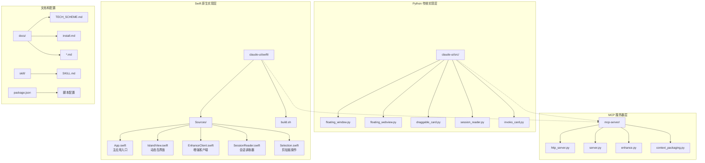

**图表来源**
- [App.swift:1-415](file://claude-ui/swift/Sources/App.swift#L1-L415)
- [floating_window.py:1-348](file://claude-ui/src/floating_window.py#L1-L348)
- [http_server.py:1-112](file://mcp-server/http_server.py#L1-L112)

**章节来源**
- [README.md:23-30](file://README.md#L23-L30)
- [package.json:1-23](file://package.json#L1-L23)

## 核心组件

浮动窗口系统现在提供两个主要的实现版本：Swift 原生实现和 Python 传统实现。

### Swift 原生实现组件

**更新** 全新 Swift 原生架构

1. **PromptCocoIsland (Swift 原生)**: 基于 SwiftUI 的原生 macOS 应用，支持刘海屏停靠和全局热键
2. **EnhanceClient**: Swift 原生增强客户端，与现有 MCP 服务器完全兼容
3. **SessionReader**: Swift 原生会话读取器，直接访问 Claude Code 数据存储
4. **Selection**: Swift 原生剪贴板操作，支持无障碍权限合成键盘事件

### Python 传统实现组件

1. **FloatingButton (传统按钮式)**: 基于 Tkinter 的经典浮动按钮界面，支持展开/折叠模式
2. **FloatingWebView (动态岛式)**: 基于 PyWebView 的现代化界面，现已支持macOS刘海屏停靠和压缩上下文查看器
3. **DraggableCard (可拖拽卡片式)**: 支持拖拽操作的增强卡片，提供自动应用功能
4. **MCP Server**: 提供本地 HTTP API 和 MCP 工具接口

### 组件特性对比

| 特性 | Swift 原生实现 | Python 传统实现 |
|------|----------------|-----------------|
| 平台支持 | macOS 原生应用 | 跨平台桌面应用 |
| 界面类型 | SwiftUI 动态岛 | Tkinter/PyWebView 界面 |
| 刘海屏停靠 | ✅ 完美支持 | ✅ 基础支持 |
| 全局热键 | ✅ ⌃⌥⌘P | ❌ 不支持 |
| 剪贴板操作 | ✅ 无障碍权限 | ✅ 剪贴板 API |
| 构建系统 | ✅ Swift 编译器 | ✅ Python 包管理 |
| 错误处理 | ✅ 原生异常处理 | ✅ urllib.error |
| 性能表现 | ✅ 更流畅稳定 | ✅ 足够稳定 |
| 系统集成 | ✅ 深度集成 | ✅ 基础集成 |

**更新** Swift 原生实现提供了更优秀的性能和系统集成体验

**章节来源**
- [App.swift:9-66](file://claude-ui/swift/Sources/App.swift#L9-L66)
- [floating_window.py:77-348](file://claude-ui/src/floating_window.py#L77-L348)
- [floating_webview.py:280-376](file://claude-ui/src/floating_webview.py#L280-L376)
- [draggable_card.py:271-350](file://claude-ui/src/draggable_card.py#L271-L350)

## 架构概览

系统采用分层架构设计，实现了 UI 界面与业务逻辑的分离，现已完全迁移到 Swift 原生架构：

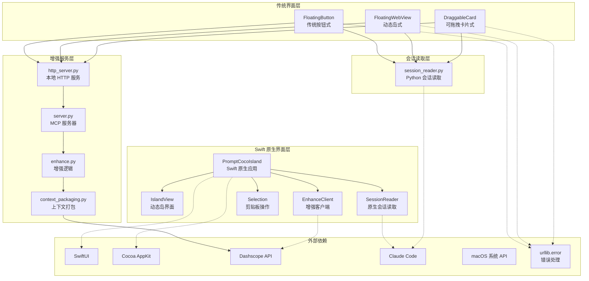

**更新** 新增 Swift 原生架构和组件

**图表来源**
- [App.swift:19-221](file://claude-ui/swift/Sources/App.swift#L19-L221)
- [EnhanceClient.swift:3-51](file://claude-ui/swift/Sources/EnhanceClient.swift#L3-L51)
- [SessionReader.swift:36-173](file://claude-ui/swift/Sources/SessionReader.swift#L36-L173)
- [http_server.py:13-17](file://mcp-server/http_server.py#L13-L17)

## 详细组件分析

### PromptCocoIsland (Swift 原生实现)

**更新** 全新 Swift 原生架构

PromptCocoIsland 是系统的核心原生应用组件，基于 SwiftUI 构建，提供了 macOS 原生的动态岛体验。

#### 应用架构图

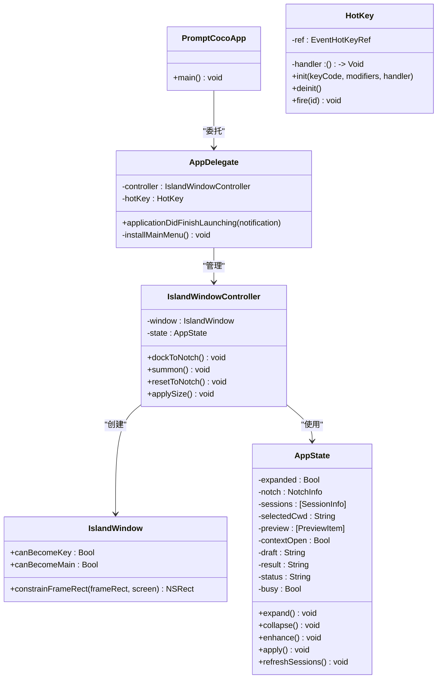

**图表来源**
- [App.swift:8-415](file://claude-ui/swift/Sources/App.swift#L8-L415)

#### 核心功能流程

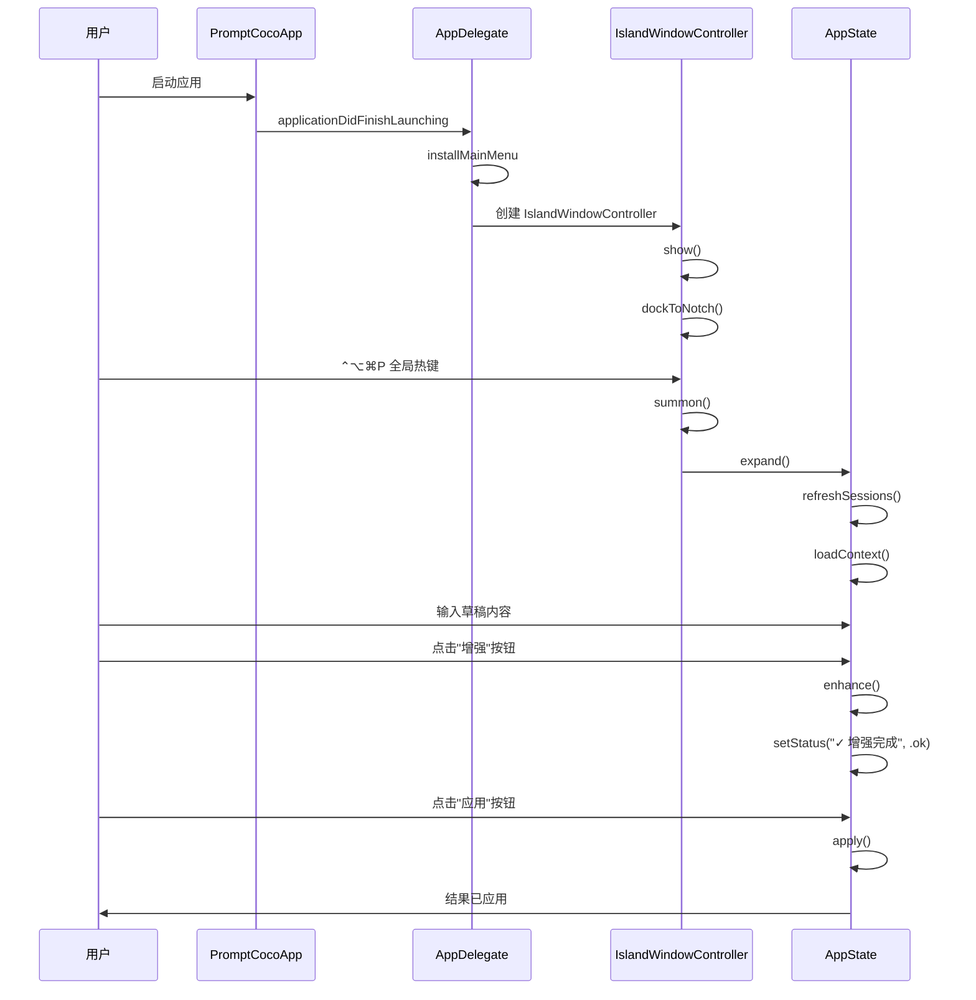

**图表来源**
- [App.swift:24-36](file://claude-ui/swift/Sources/App.swift#L24-L36)
- [App.swift:342-346](file://claude-ui/swift/Sources/App.swift#L342-L346)
- [App.swift:182-221](file://claude-ui/swift/Sources/App.swift#L182-L221)

#### 刘海屏停靠机制

**更新** 新增刘海屏停靠支持

系统现在能够智能检测 macOS 刘海屏并自动停靠：

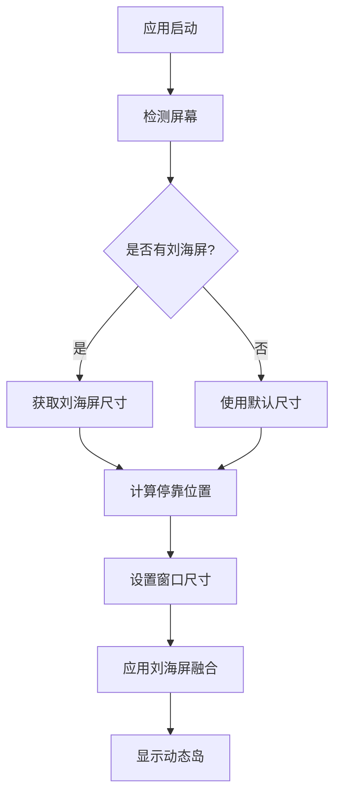

**图表来源**
- [App.swift:328-336](file://claude-ui/swift/Sources/App.swift#L328-L336)
- [App.swift:72-87](file://claude-ui/swift/Sources/App.swift#L72-L87)

#### 全局热键支持

**更新** 新增全局热键功能

系统支持 ⌃⌥⌘P 全局热键，可以在任何应用程序中快速召唤动态岛：

| 热键组合 | 功能描述 | 实现方式 |
|----------|----------|----------|
| ⌃⌥⌘P | 召唤/隐藏动态岛 | Carbon EventHotKey |
| ⌘V | 粘贴增强结果 | Accessibility 权限合成事件 |
| ⌘A/C/V/X/Z | 文本编辑快捷键 | 标准菜单项 |
| ESC | 折叠动态岛 | 窗口焦点管理 |

**章节来源**
- [App.swift:32-35](file://claude-ui/swift/Sources/App.swift#L32-L35)
- [App.swift:376-415](file://claude-ui/swift/Sources/App.swift#L376-L415)

### IslandView (Swift 原生界面)

**更新** 全新的 SwiftUI 界面实现

IslandView 提供了 macOS 原生的动态岛界面，基于 SwiftUI 构建，支持刘海屏融合和流畅动画。

#### 界面设计特点

| 设计元素 | 描述 | 实现方式 |
|----------|------|----------|
| 动态岛形状 | 纯黑背景，顶部平直，底部圆角 | UnevenRoundedRectangle |
| 刘海屏融合 | 黑色背景完全融入刘海屏 | NoInsetHostingView |
| 毛玻璃效果 | 半透明背景，模糊滤镜 | LinearGradient |
| 拖拽区域 | 整个界面可拖拽 | simultaneousGesture |
| 状态指示 | 绿色/红色点表示服务状态 | Circle().fill() |
| 响应式布局 | 自适应不同屏幕尺寸 | VStack/HStack |
| 压缩上下文查看器 | 可展开的消息预览列表 | ScrollView |
| 交互式清除 | 悬停显示的清除按钮 | ButtonStyle |

#### 压缩上下文查看器

**更新** 新增压缩上下文查看器功能

系统现在提供了一个完整的压缩上下文查看器，允许用户实时预览会话中的最近消息：

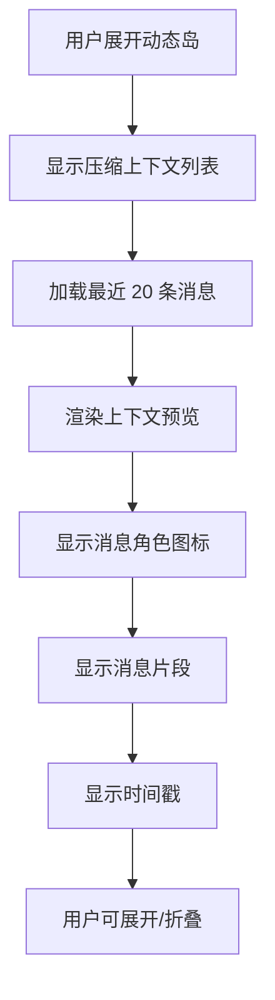

**图表来源**
- [IslandView.swift:182-232](file://claude-ui/swift/Sources/IslandView.swift#L182-L232)
- [IslandView.swift:234-242](file://claude-ui/swift/Sources/IslandView.swift#L234-L242)

#### 剪贴板操作

**更新** 新增原生剪贴板支持

系统现在提供原生的剪贴板操作，支持无障碍权限合成键盘事件：

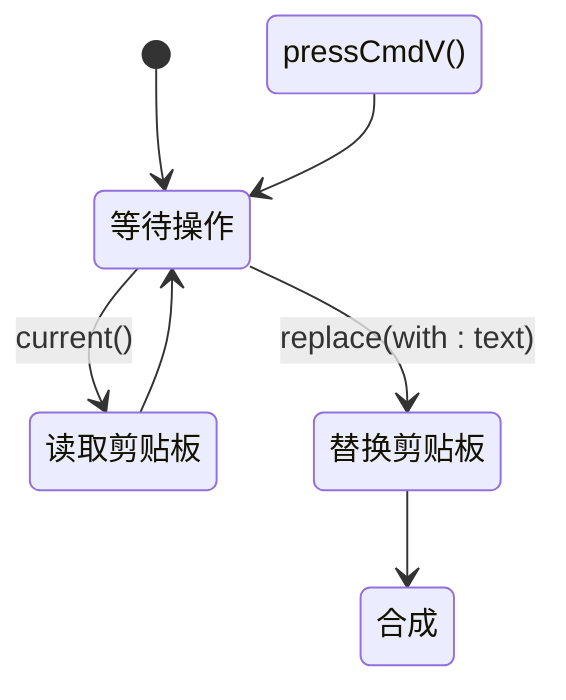

**图表来源**
- [Selection.swift:17-35](file://claude-ui/swift/Sources/Selection.swift#L17-L35)

**章节来源**
- [IslandView.swift:21-328](file://claude-ui/swift/Sources/IslandView.swift#L21-L328)
- [Selection.swift:1-36](file://claude-ui/swift/Sources/Selection.swift#L1-L36)

### EnhanceClient (Swift 原生增强客户端)

**更新** 全新的 Swift 增强客户端

EnhanceClient 是 Swift 原生的增强客户端，与现有的 Python MCP 服务器完全兼容。

#### API 接口设计

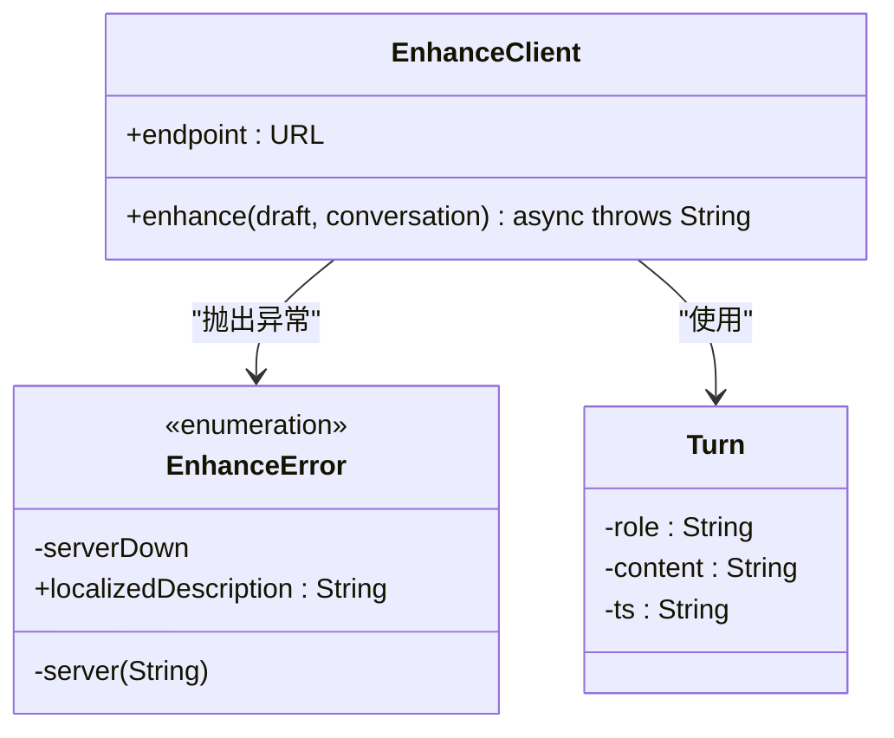

**图表来源**
- [EnhanceClient.swift:5-51](file://claude-ui/swift/Sources/EnhanceClient.swift#L5-L51)

#### 错误处理机制

**更新** 新增 Swift 原生错误处理

系统现在具有完善的错误处理机制：

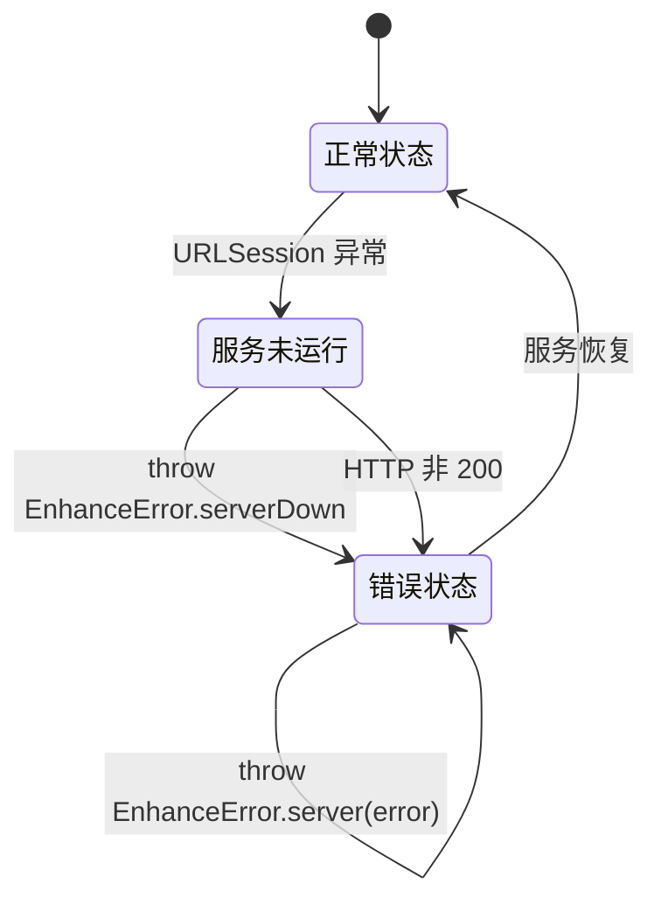

**图表来源**
- [EnhanceClient.swift:42-49](file://claude-ui/swift/Sources/EnhanceClient.swift#L42-L49)

#### 网络请求优化

**更新** 新增 Swift 原生网络优化

系统采用 Swift 原生的 URLSession 进行网络请求，支持：

| 特性 | 描述 | 实现方式 |
|------|------|----------|
| 超时控制 | 60 秒超时 | timeoutInterval |
| JSON 序列化 | Swift 原生 | JSONSerialization |
| 错误处理 | 原生异常 | do-catch 语法 |
| 异步处理 | async/await | Swift 并发模型 |
| 环境变量 | 可配置端点 | ProcessInfo.env |

**章节来源**
- [EnhanceClient.swift:24-51](file://claude-ui/swift/Sources/EnhanceClient.swift#L24-L51)

### SessionReader (Swift 原生会话读取器)

**更新** 全新的 Swift 原生会话读取器

SessionReader 是 Swift 原生的会话读取器，直接访问 Claude Code 的数据存储，无需调用 Python。

#### 数据结构解析

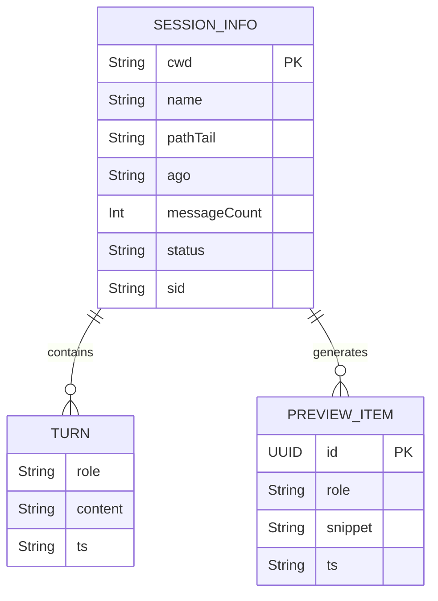

**图表来源**
- [SessionReader.swift:12-34](file://claude-ui/swift/Sources/SessionReader.swift#L12-L34)

#### 文件系统访问

**更新** 新增 Swift 原生文件系统访问

系统直接访问 ~/.claude 目录，无需 Python 子进程：

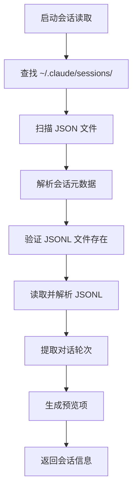

**图表来源**
- [SessionReader.swift:58-86](file://claude-ui/swift/Sources/SessionReader.swift#L58-L86)
- [SessionReader.swift:96-123](file://claude-ui/swift/Sources/SessionReader.swift#L96-L123)

#### 消息压缩算法

**更新** 新增 Swift 原生消息压缩

系统现在支持更大的消息压缩容量：

| 参数 | 默认值 | 新值 | 说明 |
|------|--------|------|------|
| max_messages | 12 | 20 | 增加消息压缩容量 |
| max_chars_per_message | 600 | 600 | 保持不变 |
| max_selected_code_chars | 1200 | 1200 | 保持不变 |

**章节来源**
- [SessionReader.swift:137-173](file://claude-ui/swift/Sources/SessionReader.swift#L137-L173)

### 传统组件兼容性

**更新** 保持与现有组件的兼容性

尽管架构已完全迁移至 Swift，系统仍保持与传统 Python 组件的兼容性：

#### 构建系统对比

| 特性 | Swift 原生 | Python 传统 |
|------|------------|-------------|
| 构建方式 | swiftc 直接编译 | pip 包管理 |
| 依赖管理 | 系统框架 | 第三方库 |
| 运行时 | Swift 运行时 | Python 解释器 |
| 性能 | 更快启动 | 足够性能 |
| 资源占用 | 更少内存 | 正常内存 |
| 部署 | 单文件可执行 | 多文件包 |

**更新** Swift 原生构建系统提供了更简洁的部署方式

**章节来源**
- [build.sh:8-13](file://claude-ui/swift/build.sh#L8-L13)
- [floating_window.py:1-348](file://claude-ui/src/floating_window.py#L1-L348)

## 依赖关系分析

系统各组件之间的依赖关系体现了清晰的分层架构，现已完全迁移到 Swift 原生架构：

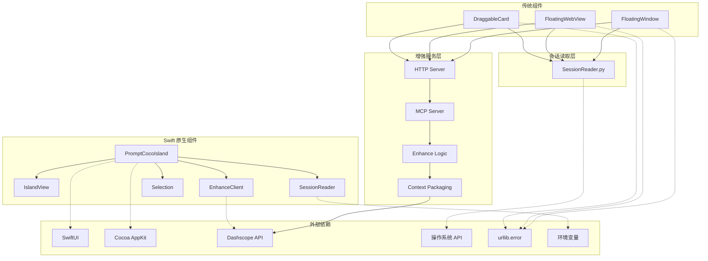

**更新** 新增 Swift 原生组件和依赖关系

**图表来源**
- [App.swift:19-221](file://claude-ui/swift/Sources/App.swift#L19-L221)
- [EnhanceClient.swift:3-51](file://claude-ui/swift/Sources/EnhanceClient.swift#L3-L51)
- [SessionReader.swift:36-173](file://claude-ui/swift/Sources/SessionReader.swift#L36-L173)

### 关键依赖关系

1. **Swift 原生依赖**: PromptCocoIsland 依赖 SwiftUI 和 Cocoa 框架
2. **会话读取依赖**: SessionReader 直接依赖文件系统 API
3. **增强服务依赖**: EnhanceClient 依赖网络请求和环境变量
4. **剪贴板依赖**: Selection 依赖无障碍权限和系统事件
5. **传统组件依赖**: Python 组件依赖 urllib.error 进行异常处理
6. **外部 API 依赖**: 增强逻辑依赖 Dashscope API 进行实际的文本重写

**更新** 新增 Swift 原生依赖和组件间关系

**章节来源**
- [App.swift:1-415](file://claude-ui/swift/Sources/App.swift#L1-L415)
- [EnhanceClient.swift:6-10](file://claude-ui/swift/Sources/EnhanceClient.swift#L6-L10)
- [SessionReader.swift:39-42](file://claude-ui/swift/Sources/SessionReader.swift#L39-L42)

## 性能考虑

### Swift 原生性能优化

**更新** 全新的 Swift 原生性能优化

系统采用了 Swift 原生架构来确保最佳性能：

1. **直接编译**: 使用 swiftc 直接编译为原生二进制文件
2. **内存管理**: Swift 的 ARC 自动内存管理减少内存泄漏风险
3. **并发模型**: 使用 async/await 提供更好的异步处理
4. **系统集成**: 深度集成 macOS 系统 API，减少中间层开销

### 网络性能

1. **连接池**: URLSession 提供内置连接复用
2. **超时控制**: 60 秒合理的超时时间
3. **重试机制**: 增强服务不可用时提供自动重试功能

### UI 性能优化

1. **SwiftUI 渲染**: SwiftUI 的声明式渲染提升界面响应性
2. **懒加载**: 界面元素按需加载，减少初始启动时间
3. **动画优化**: 原生 SwiftUI 动画性能优异
4. **刘海屏融合**: 直接绘制到刘海屏区域，避免额外渲染

### 会话读取性能

**更新** Swift 原生文件系统访问优化

1. **直接文件访问**: 直接读取 JSONL 文件，无需 Python 子进程
2. **缓存策略**: 会话信息和增强结果都有适当的缓存机制
3. **异步处理**: 使用 Task.detached 进行后台处理
4. **内存优化**: Swift 的内存管理减少内存占用

### macOS平台优化

**更新** 新增 macOS 原生平台优化

1. **屏幕尺寸检测**: 使用 AppKit 框架高效检测屏幕尺寸
2. **刘海屏停靠**: 自动计算屏幕中心位置，确保界面停靠在正确位置
3. **原生拖拽**: 利用 macOS 系统原生拖拽支持
4. **系统集成**: 与 macOS 系统设置深度集成
5. **全局热键**: 使用 Carbon EventHotKey 实现系统级热键

**章节来源**
- [build.sh:8-13](file://claude-ui/swift/build.sh#L8-L13)
- [App.swift:364-371](file://claude-ui/swift/Sources/App.swift#L364-L371)

## 故障排除指南

### Swift 原生应用问题

#### 1. 应用无法启动

**症状**: 启动时崩溃或无法显示界面

**诊断步骤**:
1. 检查系统版本兼容性 (macOS 12.0+)
2. 验证应用权限 (Accessibility 权限)
3. 检查系统完整性保护 (SIP) 设置
4. 查看系统日志

**解决方法**:
```bash
# 检查应用权限
sudo spctl --master-disable

# 重新签名应用
codesign --force --deep --sign - build/PromptCocoIsland

# 重新启动应用
./build/PromptCocoIsland
```

#### 2. 刘海屏停靠异常

**症状**: 动态岛无法正确停靠或显示位置错误

**可能原因**:
1. 多显示器环境下屏幕检测异常
2. 刘海屏尺寸检测失败
3. 窗口层级设置问题

**解决方法**:
```bash
# 检查屏幕配置
osascript -e 'tell application "System Events" to tell every desktop picture to get name'

# 重置窗口位置
killall PromptCocoIsland
sleep 1
./build/PromptCocoIsland
```

#### 3. 全局热键失效

**症状**: ⌃⌥⌘P 热键无法响应

**可能原因**:
1. Accessibility 权限未授予
2. 热键注册失败
3. 系统热键冲突

**解决方法**:
```bash
# 检查 Accessibility 权限
sudo sqlite3 /Library/Application\ Support/com.apple.TCC/TCC.db "SELECT * FROM access WHERE service='kTCCServiceAccessibility';"

# 重新启动应用
pkill -f PromptCocoIsland
./build/PromptCocoIsland
```

### 传统组件兼容性问题

#### 1. 增强服务未启动

**症状**: 浮动窗口显示红色状态指示器

**诊断步骤**:
1. 检查本地 HTTP 服务是否运行
2. 验证端口 8765 是否被占用
3. 查看服务日志文件

**解决方法**:
```bash
# 手动启动增强服务
python3 mcp-server/http_server.py --host 127.0.0.1 --port 8765

# 或者通过 UI 自动启动
python3 claude-ui/bin/claude-float.py
```

#### 2. 会话信息读取失败

**症状**: 会话标签显示"未检测到活跃会话"

**可能原因**:
1. ~/.claude 目录不存在或权限不足
2. 会话文件格式异常
3. JSONL 文件损坏

**解决方法**:
```bash
# 检查会话目录
ls -la ~/.claude/sessions/

# 验证会话文件
cat ~/.claude/sessions/*.json

# 清理缓存重新加载
python3 claude-ui/bin/claude-float.py session
```

#### 3. UI 界面显示异常

**症状**: 界面元素错位或无法拖拽

**解决方法**:
1. 检查系统版本兼容性
2. 重新安装依赖包
3. 清理临时文件

#### 4. 增强结果为空

**症状**: 点击增强按钮后没有返回结果

**诊断步骤**:
1. 检查 Dashscope API 密钥配置
2. 验证网络连接
3. 查看增强逻辑日志

**解决方法**:
```bash
# 设置 API 密钥
export DASHSCOPE_API_KEY=your_api_key_here

# 或在 .env 文件中配置
echo "DASHSCOPE_API_KEY=your_api_key_here" > mcp-server/.env
```

**章节来源**
- [App.swift:28-309](file://claude-ui/swift/Sources/App.swift#L28-L309)
- [EnhanceClient.swift:12-21](file://claude-ui/swift/Sources/EnhanceClient.swift#L12-L21)
- [floating_window.py:23-30](file://claude-ui/src/floating_window.py#L23-L30)

## 结论

浮动窗口系统经过重大架构迁移，现已完全采用 Swift 原生实现，为用户提供了更优秀、更稳定的 macOS 原生体验。系统的主要优势包括：

1. **完全原生实现**: 基于 SwiftUI 和 Cocoa 框架，提供 macOS 原生的流畅体验
2. **刘海屏完美支持**: 智能检测和适配 macOS 刘海屏，实现无缝融合
3. **全局热键功能**: 支持 ⌃⌥⌘P 全局热键，可在任何应用中快速召唤
4. **剪贴板深度集成**: 支持无障碍权限，实现精准的文本操作
5. **Swift 原生性能**: 直接编译为原生二进制，启动更快、内存占用更少
6. **向后兼容性**: 保持与现有 Python 组件和 MCP 服务器的完全兼容
7. **现代化界面**: 基于 SwiftUI 的现代设计语言，支持流畅动画和响应式布局
8. **系统级集成**: 深度集成 macOS 系统 API，提供原生的应用体验

**更新** 新版本显著提升了性能、稳定性和用户体验，同时保持了与现有生态系统的兼容性

未来的发展方向包括：
- 进一步优化 Swift 原生性能和内存使用
- 扩展对其他编程语言和编辑器的支持
- 集成更多的 AI 增强功能
- 提供更丰富的会话管理和历史记录功能
- 增强错误处理和故障恢复能力
- 支持更多 macOS 特有的原生功能

该系统为开发者提供了一个优秀的参考实现，展示了如何构建高质量的 AI 辅助工具，同时保持了良好的用户体验和系统性能。Swift 原生架构的引入使其成为 macOS 平台上开发原生应用的理想选择，为用户提供了真正意义上的原生体验。