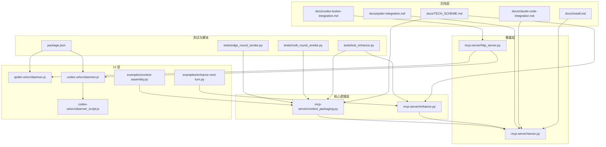
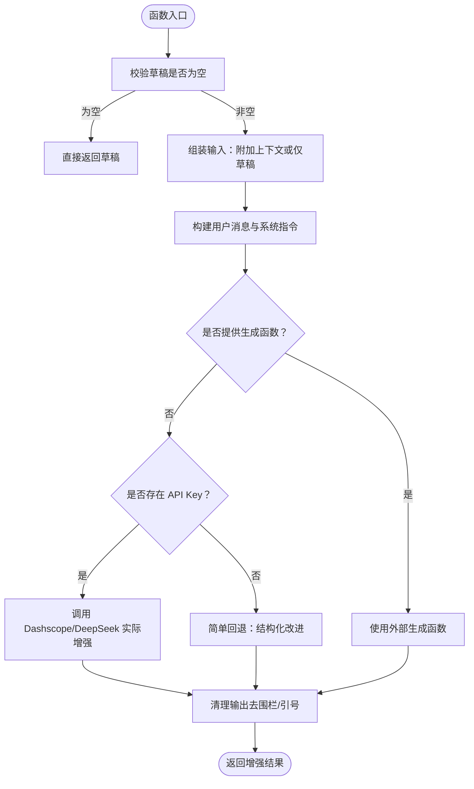
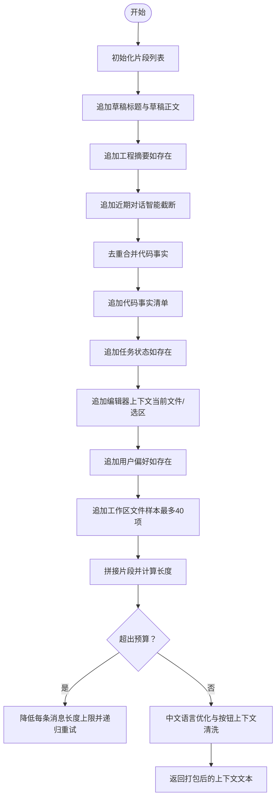
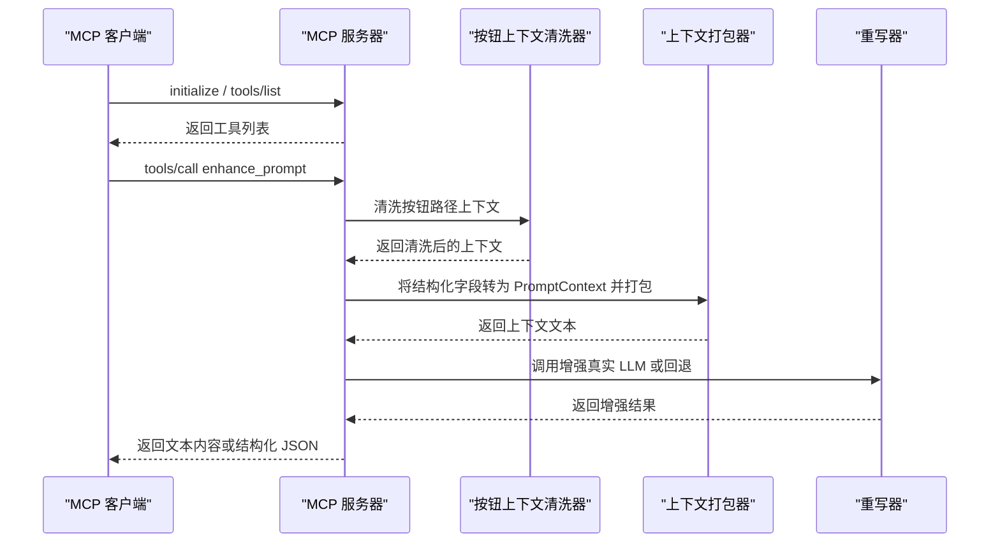
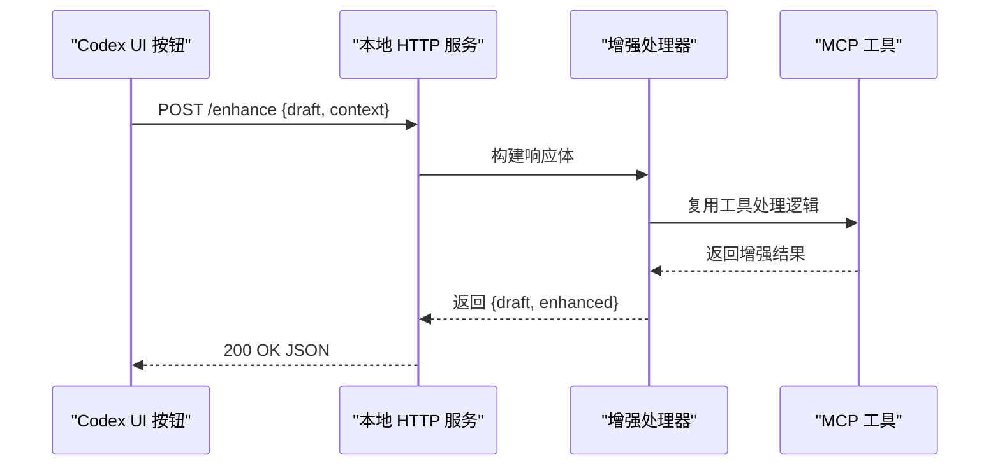
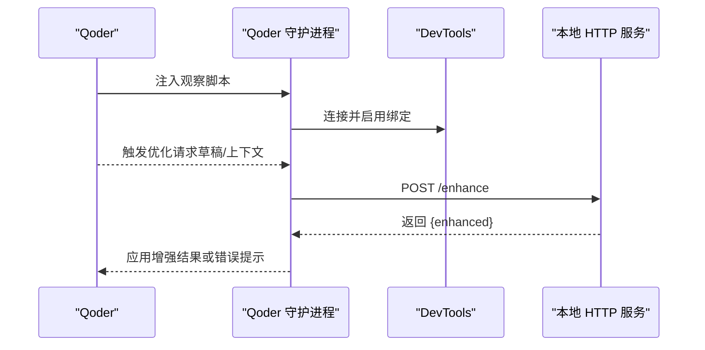
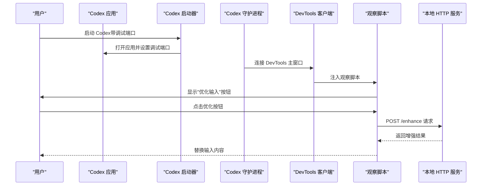
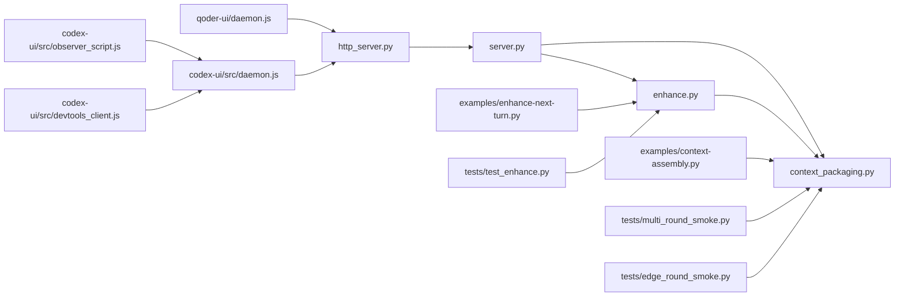

# 系统概览

<cite>
**本文引用的文件**
- [README.md](file://README.md)
- [docs/TECH_SCHEME.md](file://docs/TECH_SCHEME.md)
- [docs/claude-code-integration.md](file://docs/claude-code-integration.md)
- [docs/install.md](file://docs/install.md)
- [docs/codex-button-integration.md](file://docs/codex-button-integration.md)
- [docs/qoder-integration.md](file://docs/qoder-integration.md)
- [package.json](file://package.json)
- [mcp-server/server.py](file://mcp-server/server.py)
- [mcp-server/enhance.py](file://mcp-server/enhance.py)
- [mcp-server/context_packaging.py](file://mcp-server/context_packaging.py)
- [mcp-server/http_server.py](file://mcp-server/http_server.py)
- [examples/context-assembly.py](file://examples/context-assembly.py)
- [examples/enhance-next-turn.py](file://examples/enhance-next-turn.py)
- [tests/test_enhance.py](file://tests/test_enhance.py)
- [qoder-ui/src/daemon.js](file://qoder-ui/src/daemon.js)
- [codex-ui/bin/codex-optimize-input.js](file://codex-ui/bin/codex-optimize-input.js)
- [codex-ui/src/codex_launcher.js](file://codex-ui/src/codex_launcher.js)
- [codex-ui/src/daemon.js](file://codex-ui/src/daemon.js)
- [codex-ui/src/devtools_client.js](file://codex-ui/src/devtools_client.js)
- [codex-ui/src/observer_script.js](file://codex-ui/src/observer_script.js)
- [codex-ui/src/codex_paths.js](file://codex-ui/src/codex_paths.js)
- [codex-ui/src/launch_agent.js](file://codex-ui/src/launch_agent.js)
- [tests/multi_round_smoke.py](file://tests/multi_round_smoke.py)
- [tests/edge_round_smoke.py](file://tests/edge_round_smoke.py)
</cite>

## 更新摘要
**所做更改**
- 新增 Codex 集成套件章节，详细介绍 Codex UI 按钮优化路径
- 更新上下文打包机制章节，重点说明中文语言支持和按钮路径上下文清洗
- 新增 Codex 观察脚本和 DevTools 集成章节
- 更新系统架构图，反映新增的 Codex 集成组件
- 增强多平台集成和语言适配的技术说明

## 目录
1. [引言](#引言)
2. [项目结构](#项目结构)
3. [核心组件](#核心组件)
4. [架构总览](#架构总览)
5. [详细组件分析](#详细组件分析)
6. [依赖关系分析](#依赖关系分析)
7. [性能考量](#性能考量)
8. [故障排除指南](#故障排除指南)
9. [结论](#结论)
10. [附录](#附录)

## 引言
本项目旨在为 Claude Code 用户提供"发送前"的上下文感知输入优化能力，复刻 Kilo Code 的"增强提示词"体验。系统采用混合方法：轻量级专用重写器 + MCP 工具 + UI 层（Codex/Qoder/VS Code 插件等薄客户端），形成"原始输入 → 上下文补全 → 重写 → 人类审阅 → 发送"的闭环。核心目标是通过严格的提示词重写指令与结构化上下文注入，提升模糊、简短或不完整输入的清晰度、具体性与可执行性。

**更新** 新增对 Codex 集成套件的支持，包括完整的 UI 按钮优化路径和增强的中文语言适配机制。

## 项目结构
项目采用按职责分层的组织方式：
- 文档层：TECH_SCHEME.md、安装与集成文档，提供技术方案、安装指引与平台集成说明
- 核心逻辑层：mcp-server/enhance.py（提示词重写）、mcp-server/context_packaging.py（上下文打包）
- 暴露层：mcp-server/server.py（MCP 工具服务）、mcp-server/http_server.py（本地 HTTP API）
- UI 层：qoder-ui（Qoder DevTools 绑定与观察脚本）、codex-ui（Codex 按钮集成套件）、examples（上下文装配示例）
- 测试与脚本：tests/test_enhance.py、tests/multi_round_smoke.py、tests/edge_round_smoke.py、package.json（Node 测试与脚本）



**图表来源**
- [docs/TECH_SCHEME.md:1-166](file://docs/TECH_SCHEME.md#L1-L166)
- [docs/install.md:1-81](file://docs/install.md#L1-L81)
- [docs/claude-code-integration.md:1-200](file://docs/claude-code-integration.md#L1-L200)
- [docs/qoder-integration.md:1-101](file://docs/qoder-integration.md#L1-L101)
- [docs/codex-button-integration.md:1-104](file://docs/codex-button-integration.md#L1-L104)
- [mcp-server/server.py:1-232](file://mcp-server/server.py#L1-L232)
- [mcp-server/enhance.py:1-175](file://mcp-server/enhance.py#L1-L175)
- [mcp-server/context_packaging.py:1-252](file://mcp-server/context_packaging.py#L1-L252)
- [mcp-server/http_server.py:1-101](file://mcp-server/http_server.py#L1-L101)
- [qoder-ui/src/daemon.js:1-165](file://qoder-ui/src/daemon.js#L1-L165)
- [codex-ui/src/daemon.js:1-193](file://codex-ui/src/daemon.js#L1-L193)
- [codex-ui/src/observer_script.js:1-370](file://codex-ui/src/observer_script.js#L1-L370)
- [examples/context-assembly.py:1-93](file://examples/context-assembly.py#L1-L93)
- [examples/enhance-next-turn.py:1-55](file://examples/enhance-next-turn.py#L1-L55)
- [tests/test_enhance.py:1-37](file://tests/test_enhance.py#L1-L37)
- [tests/multi_round_smoke.py:1-118](file://tests/multi_round_smoke.py#L1-L118)
- [tests/edge_round_smoke.py:1-141](file://tests/edge_round_smoke.py#L1-L141)
- [package.json:1-13](file://package.json#L1-L13)

**章节来源**
- [README.md:1-181](file://README.md#L1-L181)
- [docs/TECH_SCHEME.md:1-166](file://docs/TECH_SCHEME.md#L1-L166)

## 核心组件
- 轻量级专用重写器（enhance.py）
  - 严格系统指令：仅重写提示词，不回答、不执行、不讨论，始终用中文输出
  - 支持真实 LLM（Dashscope/DeepSeek）与降级回退
  - 输出清理：去除代码围栏与外层引号，保持简洁
- 上下文打包器（context_packaging.py）
  - 结构化载体 PromptContext：对话、代码事实、任务状态、编辑器上下文、用户偏好、工程摘要与工作区文件
  - 智能截断与预算控制：头尾截断保留结论，总上下文字符预算限制
  - 去重合并：同文件路径的代码事实合并汇总
  - **新增** 中文语言优化：改进的中文 token 估算算法，确保中文内容在预算控制中得到准确计数
  - **新增** 按钮路径上下文清洗：专门针对 UI 按钮优化场景的噪声过滤和格式化
- MCP 工具服务（server.py）
  - 注册工具 enhance_prompt，支持结构化字段与自由文本上下文
  - JSON-RPC 兼容 STDIO 实现，最小可用但覆盖主流客户端
  - **新增** 按钮上下文清洗功能：集成 _clean_button_context 函数处理 UI 按钮传入的上下文
- 本地 HTTP API（http_server.py）
  - 为 Codex 等 UI 提供"优化输入"按钮的稳定本地端点
  - 跨域支持与错误处理，返回 {draft, enhanced}
- UI 与薄客户端（qoder-ui/daemon.js、codex-ui/daemon.js、examples/*）
  - Qoder DevTools 绑定与观察脚本，监听输入优化请求并调用本地 HTTP API
  - **新增** Codex 集成套件：完整的 UI 按钮优化路径，包括 DevTools 连接、观察脚本注入和结果应用
  - 示例脚本演示结构化上下文装配与"下一轮问题"增强流程

**章节来源**
- [mcp-server/enhance.py:1-175](file://mcp-server/enhance.py#L1-L175)
- [mcp-server/context_packaging.py:1-252](file://mcp-server/context_packaging.py#L1-L252)
- [mcp-server/server.py:1-232](file://mcp-server/server.py#L1-L232)
- [mcp-server/http_server.py:1-101](file://mcp-server/http_server.py#L1-L101)
- [qoder-ui/src/daemon.js:1-165](file://qoder-ui/src/daemon.js#L1-L165)
- [codex-ui/src/daemon.js:1-193](file://codex-ui/src/daemon.js#L1-L193)
- [examples/context-assembly.py:1-93](file://examples/context-assembly.py#L1-L93)
- [examples/enhance-next-turn.py:1-55](file://examples/enhance-next-turn.py#L1-L55)

## 架构总览
系统采用"混合方法"分层架构：
- 核心逻辑层：专注提示词重写，保持轻量与纯净，避免副作用
- 暴露层：MCP 工具与本地 HTTP API，统一对外能力入口
- UI 层：薄客户端负责上下文采集与审阅 UX，保证隐私与可控
- 上下文来源层：对话历史、编辑器状态、已读代码事实、用户偏好、工程摘要与工作区文件

**更新** 新增 Codex 集成套件，提供完整的 UI 按钮优化路径，包括 DevTools 连接、观察脚本注入和结果应用。

系统边界与数据流：
- 原始输入（模糊/简短）由 UI 层收集上下文并调用工具
- 工具将草稿与上下文打包，交由核心重写器生成优化提示词
- 返回值仅包含优化后的提示词，供用户审阅与二次编辑
- 通过 MCP 或本地 HTTP API 与 Claude Code、Qoder、Codex 等宿主集成

```mermaid
graph TB
UI["UI 层<br/>Codex/Qoder/VS Code 插件"] --> API["暴露层<br/>MCP 工具/本地 HTTP API"]
API --> CORE["核心逻辑层<br/>提示词重写器"]
CORE --> OUT["输出优化提示词"]
subgraph "上下文来源层"
CHAT["对话历史"]
EDITOR["编辑器上下文<br/>当前文件/选区"]
CODE["代码事实<br/>已读文件/符号/摘要"]
PREF["用户偏好"]
WORKSPACE["工程摘要/工作区文件"]
BUTTON["按钮路径上下文<br/>UI Chrome 噪声清洗"]
END
CHAT --> API
EDITOR --> API
CODE --> API
PREF --> API
WORKSPACE --> API
BUTTON --> API
API --> CORE
```

**图表来源**
- [docs/TECH_SCHEME.md:7-20](file://docs/TECH_SCHEME.md#L7-L20)
- [mcp-server/server.py:49-80](file://mcp-server/server.py#L49-L80)
- [mcp-server/enhance.py:90-134](file://mcp-server/enhance.py#L90-L134)
- [mcp-server/context_packaging.py:21-33](file://mcp-server/context_packaging.py#L21-L33)

**章节来源**
- [docs/TECH_SCHEME.md:7-20](file://docs/TECH_SCHEME.md#L7-L20)
- [README.md:5-22](file://README.md#L5-L22)

## 详细组件分析

### 组件 A：提示词重写器（enhance.py）
职责与交互：
- 接收草稿与可选上下文，组装为"待增强提示词"的用户消息
- 通过真实 LLM（Dashscope/DeepSeek）或降级回退生成增强结果
- 清理输出，确保干净、可直接发送的提示词



**图表来源**
- [mcp-server/enhance.py:90-134](file://mcp-server/enhance.py#L90-L134)
- [mcp-server/enhance.py:41-68](file://mcp-server/enhance.py#L41-L68)
- [mcp-server/enhance.py:150-159](file://mcp-server/enhance.py#L150-L159)

**章节来源**
- [mcp-server/enhance.py:1-175](file://mcp-server/enhance.py#L1-L175)

### 组件 B：上下文打包器（context_packaging.py）
职责与交互：
- 将结构化上下文（对话、代码事实、任务状态、编辑器上下文、偏好、工程摘要、工作区文件）整合为可被重写器消费的文本
- 智能预算控制：超过预算时逐步收紧每条消息长度，优先保留结论
- 去重合并：同文件路径的代码事实合并摘要与符号列表
- **新增** 中文语言优化：改进的中文 token 估算算法，确保中文内容在预算控制中得到准确计数
- **新增** 按钮路径上下文清洗：专门针对 UI 按钮优化场景的噪声过滤和格式化



**图表来源**
- [mcp-server/context_packaging.py:79-178](file://mcp-server/context_packaging.py#L79-L178)
- [mcp-server/context_packaging.py:60-77](file://mcp-server/context_packaging.py#L60-L77)
- [mcp-server/context_packaging.py:42-53](file://mcp-server/context_packaging.py#L42-L53)

**章节来源**
- [mcp-server/context_packaging.py:1-252](file://mcp-server/context_packaging.py#L1-L252)

### 组件 C：MCP 工具服务（server.py）
职责与交互：
- 初始化 JSON-RPC 协议，注册工具 enhance_prompt
- 解析调用参数（草稿、上下文、结构化字段、是否结构化输出）
- 将结构化字段转换为 PromptContext 并打包，调用增强逻辑
- 返回纯文本或结构化 JSON（包含原始与增强提示词及是否使用上下文）
- **新增** 按钮上下文清洗：集成 _clean_button_context 函数处理 UI 按钮传入的上下文



**图表来源**
- [mcp-server/server.py:82-232](file://mcp-server/server.py#L82-L232)
- [mcp-server/context_packaging.py:181-211](file://mcp-server/context_packaging.py#L181-L211)
- [mcp-server/enhance.py:90-134](file://mcp-server/enhance.py#L90-L134)

**章节来源**
- [mcp-server/server.py:1-232](file://mcp-server/server.py#L1-L232)

### 组件 D：本地 HTTP API（http_server.py）
职责与交互：
- 提供 /enhance 端点，接收草稿与上下文，返回 {draft, enhanced}
- 支持跨域与错误处理，供 Codex 等 UI 按钮调用
- 与 MCP 工具共享增强处理逻辑



**图表来源**
- [mcp-server/http_server.py:22-67](file://mcp-server/http_server.py#L22-L67)
- [mcp-server/server.py:49-80](file://mcp-server/server.py#L49-L80)

**章节来源**
- [mcp-server/http_server.py:1-101](file://mcp-server/http_server.py#L1-L101)

### 组件 E：Qoder 薄客户端（daemon.js）
职责与交互：
- 通过 DevTools 连接到 Qoder Agents 窗口，注入观察脚本
- 监听窗口中的优化请求队列，调用本地 HTTP API 获取增强结果
- 将结果应用回输入框，支持错误兜底提示



**图表来源**
- [qoder-ui/src/daemon.js:100-126](file://qoder-ui/src/daemon.js#L100-L126)
- [mcp-server/http_server.py:22-67](file://mcp-server/http_server.py#L22-L67)

**章节来源**
- [qoder-ui/src/daemon.js:1-165](file://qoder-ui/src/daemon.js#L1-L165)

### 组件 F：Codex 集成套件（新增）
职责与交互：
- **Codex 启动器**：管理 Codex 应用的调试端口，支持自动发现和等待 DevTools 端口
- **DevTools 客户端**：建立与 Codex 主窗口的 WebSocket 连接，处理绑定调用和脚本注入
- **观察脚本**：动态注入优化按钮，监控输入变化，收集可见上下文并处理优化请求
- **守护进程**：持续监控 Codex 连接状态，自动重连和处理请求队列



**图表来源**
- [codex-ui/src/codex_launcher.js:37-53](file://codex-ui/src/codex_launcher.js#L37-L53)
- [codex-ui/src/daemon.js:55-97](file://codex-ui/src/daemon.js#L55-L97)
- [codex-ui/src/devtools_client.js:9-46](file://codex-ui/src/devtools_client.js#L9-L46)
- [codex-ui/src/observer_script.js:112-369](file://codex-ui/src/observer_script.js#L112-L369)

**章节来源**
- [codex-ui/bin/codex-optimize-input.js:1-52](file://codex-ui/bin/codex-optimize-input.js#L1-L52)
- [codex-ui/src/codex_launcher.js:1-135](file://codex-ui/src/codex_launcher.js#L1-L135)
- [codex-ui/src/daemon.js:1-193](file://codex-ui/src/daemon.js#L1-L193)
- [codex-ui/src/devtools_client.js:1-47](file://codex-ui/src/devtools_client.js#L1-L47)
- [codex-ui/src/observer_script.js:1-370](file://codex-ui/src/observer_script.js#L1-L370)
- [codex-ui/src/codex_paths.js:1-35](file://codex-ui/src/codex_paths.js#L1-L35)
- [codex-ui/src/launch_agent.js:1-90](file://codex-ui/src/launch_agent.js#L1-L90)

## 依赖关系分析
- 组件耦合与内聚
  - 核心重写器与上下文打包器高内聚、低耦合：通过明确的数据结构（PromptContext）传递，便于替换生成函数
  - MCP 服务与 HTTP 服务共享增强处理逻辑，减少重复实现
  - UI 层仅负责上下文采集与调用，不参与核心逻辑，保持隐私与可控
  - **新增** Codex 集成套件与核心服务解耦：通过标准 HTTP API 与本地服务通信
- 外部依赖与集成点
  - Dashscope/DeepSeek：用于真实增强（可选，支持回退）
  - MCP 客户端：Claude Code、Qoder 等支持 MCP 的宿主
  - DevTools：Qoder 和 Codex 客户端通过 DevTools 注入与通信
  - **新增** Electron 应用：Codex 作为基于 Electron 的桌面应用
- 潜在循环依赖
  - 通过模块导入与相对路径避免循环依赖；工具服务与 HTTP 服务复用增强处理逻辑



**图表来源**
- [mcp-server/http_server.py:13-16](file://mcp-server/http_server.py#L13-L16)
- [mcp-server/server.py:35-41](file://mcp-server/server.py#L35-L41)
- [mcp-server/enhance.py:17-21](file://mcp-server/enhance.py#L17-L21)
- [qoder-ui/src/daemon.js:100-126](file://qoder-ui/src/daemon.js#L100-L126)
- [codex-ui/src/daemon.js:55-97](file://codex-ui/src/daemon.js#L55-L97)
- [codex-ui/src/observer_script.js:112-369](file://codex-ui/src/observer_script.js#L112-L369)
- [codex-ui/src/devtools_client.js:9-46](file://codex-ui/src/devtools_client.js#L9-L46)
- [examples/context-assembly.py:16-22](file://examples/context-assembly.py#L16-L22)
- [examples/enhance-next-turn.py:17-18](file://examples/enhance-next-turn.py#L17-L18)
- [tests/test_enhance.py:7-8](file://tests/test_enhance.py#L7-L8)
- [tests/multi_round_smoke.py:19:19](file://tests/multi_round_smoke.py#L19)
- [tests/edge_round_smoke.py:15:15](file://tests/edge_round_smoke.py#L15)

**章节来源**
- [mcp-server/server.py:1-232](file://mcp-server/server.py#L1-L232)
- [mcp-server/enhance.py:1-175](file://mcp-server/enhance.py#L1-L175)
- [mcp-server/context_packaging.py:1-252](file://mcp-server/context_packaging.py#L1-L252)
- [mcp-server/http_server.py:1-101](file://mcp-server/http_server.py#L1-L101)
- [qoder-ui/src/daemon.js:1-165](file://qoder-ui/src/daemon.js#L1-L165)
- [codex-ui/src/daemon.js:1-193](file://codex-ui/src/daemon.js#L1-L193)
- [codex-ui/src/observer_script.js:1-370](file://codex-ui/src/observer_script.js#L1-L370)
- [codex-ui/src/devtools_client.js:1-47](file://codex-ui/src/devtools_client.js#L1-L47)
- [examples/context-assembly.py:1-93](file://examples/context-assembly.py#L1-L93)
- [examples/enhance-next-turn.py:1-55](file://examples/enhance-next-turn.py#L1-L55)
- [tests/test_enhance.py:1-37](file://tests/test_enhance.py#L1-L37)
- [tests/multi_round_smoke.py:1-118](file://tests/multi_round_smoke.py#L1-L118)
- [tests/edge_round_smoke.py:1-141](file://tests/edge_round_smoke.py#L1-L141)

## 性能考量
- 轻量化与低延迟
  - 重写器仅执行提示词改写，避免工具调用与代理循环，显著降低 token 与延迟
  - 默认使用小而快的模型（如 deepseek-v4-flash via Dashscope），适合增强步骤
- 上下文预算与截断
  - 通过智能截断（头+尾）与总预算控制，防止长回复结论丢失，同时维持小模型上下文安全
  - **新增** 改进的中文 token 估算：确保中文内容在预算控制中得到准确计数，避免过度截断或预算超限
- 并发与稳定性
  - HTTP 服务采用多线程处理；MCP 服务为 STDIO 实现，兼容多数客户端
  - 回退机制保障开发与测试阶段可用性
- **新增** Codex 集成性能优化
  - DevTools 连接采用 WebSocket 长连接，减少频繁建立连接的开销
  - 观察脚本使用定时器轮询，避免阻塞主线程
  - 自动重连机制确保连接稳定性

## 故障排除指南
- MCP 工具不可用
  - 检查配置文件路径与命令可执行性；重启宿主应用后生效
  - 参考安装与集成文档中的配置示例与验证步骤
- 增强效果不佳
  - 确认已配置 DASHSCOPE_API_KEY；否则将使用简单回退逻辑
  - 在技能中强调结构化上下文（对话、代码事实、任务状态、编辑器上下文、用户偏好）
  - **新增** 检查中文语言支持：确认中文 token 估算正常工作
- HTTP API 无法访问
  - 确认本地服务已启动并监听指定端口；检查 CORS 与 JSON 解析错误
  - 使用示例脚本验证端点行为
- Qoder 无法注入
  - 确认 DevTools 端口与目标页面；守护进程会自动重连并轮询请求队列
- **新增** Codex 集成问题
  - 确认 Codex 已通过调试端口启动：使用 `npm run codex:launch` 命令
  - 检查 DevTools 端口发现：Codex 需要手动启用远程调试端口
  - 验证观察脚本注入：确认按钮已正确显示在输入框附近
  - 查看日志文件：Codex 集成的日志位于 `~/Library/Logs/prompt-coco-codex/`

**章节来源**
- [docs/install.md:35-81](file://docs/install.md#L35-L81)
- [docs/claude-code-integration.md:145-177](file://docs/claude-code-integration.md#L145-L177)
- [docs/codex-button-integration.md:22-104](file://docs/codex-button-integration.md#L22-L104)
- [docs/qoder-integration.md:15-101](file://docs/qoder-integration.md#L15-L101)
- [mcp-server/http_server.py:47-67](file://mcp-server/http_server.py#L47-L67)
- [qoder-ui/src/daemon.js:135-165](file://qoder-ui/src/daemon.js#L135-L165)
- [codex-ui/src/codex_launcher.js:37-53](file://codex-ui/src/codex_launcher.js#L37-L53)
- [codex-ui/src/daemon.js:163-193](file://codex-ui/src/daemon.js#L163-L193)

## 结论
本系统通过"轻量级重写器 + MCP 工具 + UI 层"的混合架构，实现了面向 Claude Code 与 Qoder 等 IDE 的上下文感知输入优化。其设计强调：
- 性能：小模型与纯重写，低 token、低延迟
- 可扩展：MCP 工具与结构化上下文，适配多宿主与未来薄客户端
- 隐私与可控：上下文由调用方决定，核心逻辑不自动抓取，增强结果需人工审阅
- 易用性：提供安装、集成与示例脚本，快速落地

**更新** 新增的 Codex 集成套件进一步扩展了系统的多平台支持能力，提供了完整的 UI 按钮优化路径和增强的中文语言适配机制。通过改进的上下文打包机制和按钮路径上下文清洗，系统在多平台集成和语言适配方面取得了重要进展。

## 附录
- 快速测试与使用
  - 安装与配置：参考安装文档与平台集成文档
  - 示例脚本：使用 examples/* 验证上下文装配与"下一轮问题"增强流程
  - 测试脚本：运行单元测试确保核心逻辑稳定
  - **新增** Codex 集成测试：使用 codex-ui/test/* 验证 DevTools 连接和观察脚本功能

**章节来源**
- [docs/install.md:35-81](file://docs/install.md#L35-L81)
- [docs/TECH_SCHEME.md:109-135](file://docs/TECH_SCHEME.md#L109-L135)
- [examples/context-assembly.py:63-93](file://examples/context-assembly.py#L63-L93)
- [examples/enhance-next-turn.py:21-55](file://examples/enhance-next-turn.py#L21-L55)
- [tests/test_enhance.py:1-37](file://tests/test_enhance.py#L1-L37)
- [tests/multi_round_smoke.py:1-118](file://tests/multi_round_smoke.py#L1-L118)
- [tests/edge_round_smoke.py:1-141](file://tests/edge_round_smoke.py#L1-L141)
- [package.json:6-12](file://package.json#L6-L12)