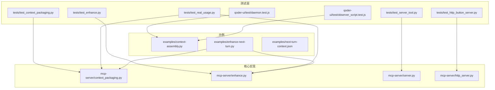
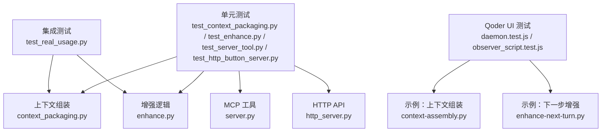
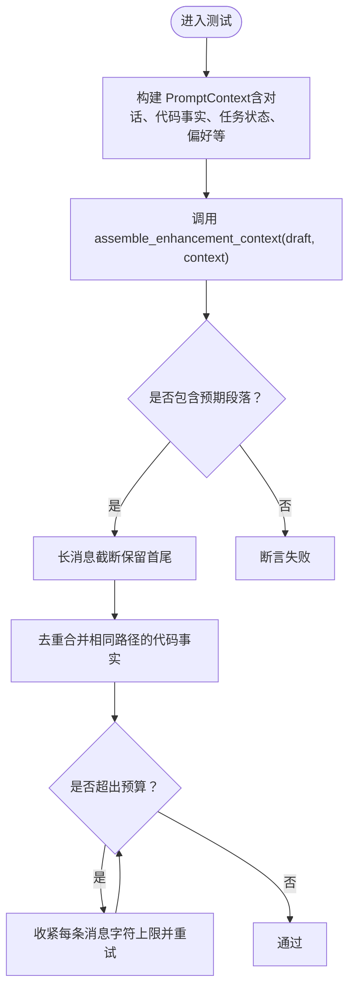
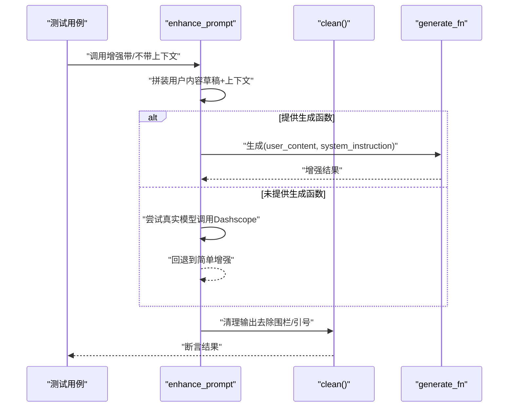
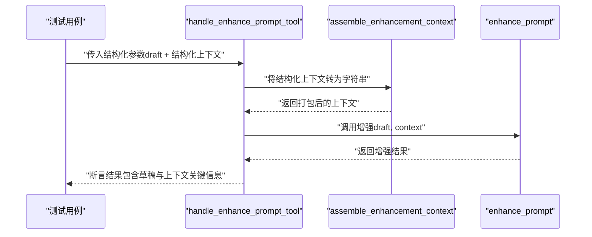
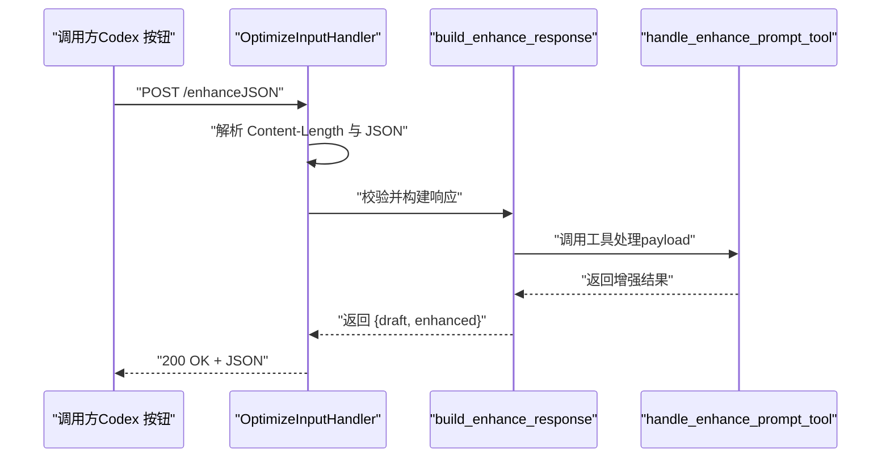
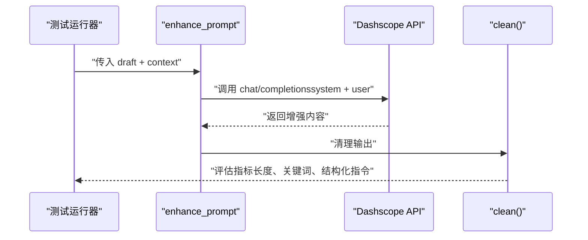
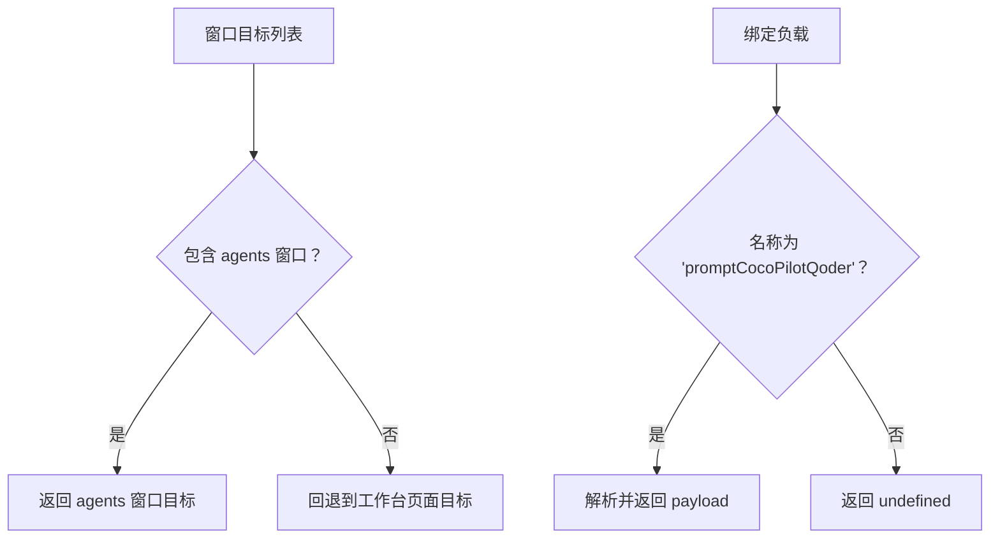
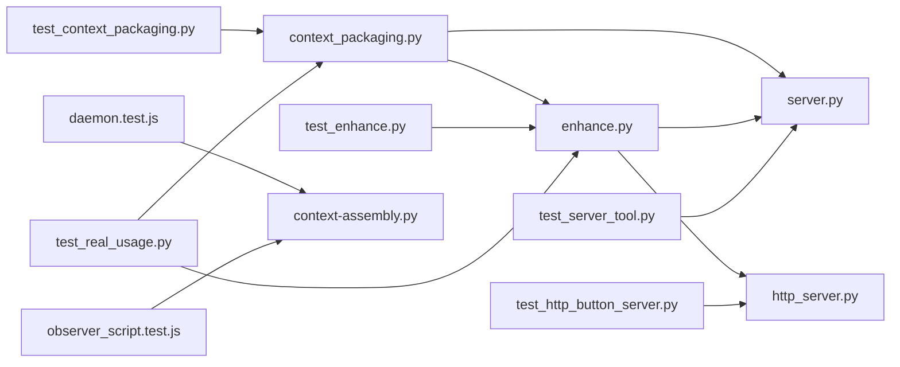

# 测试与验证

<cite>
**本文引用的文件**
- [README.md](file://README.md)
- [package.json](file://package.json)
- [tests/test_context_packaging.py](file://tests/test_context_packaging.py)
- [tests/test_enhance.py](file://tests/test_enhance.py)
- [tests/test_http_button_server.py](file://tests/test_http_button_server.py)
- [tests/test_real_usage.py](file://tests/test_real_usage.py)
- [tests/test_server_tool.py](file://tests/test_server_tool.py)
- [mcp-server/context_packaging.py](file://mcp-server/context_packaging.py)
- [mcp-server/enhance.py](file://mcp-server/enhance.py)
- [mcp-server/http_server.py](file://mcp-server/http_server.py)
- [mcp-server/server.py](file://mcp-server/server.py)
- [qoder-ui/test/daemon.test.js](file://qoder-ui/test/daemon.test.js)
- [qoder-ui/test/observer_script.test.js](file://qoder-ui/test/observer_script.test.js)
- [examples/context-assembly.py](file://examples/context-assembly.py)
- [examples/enhance-next-turn.py](file://examples/enhance-next-turn.py)
- [examples/next-turn-context.json](file://examples/next-turn-context.json)
</cite>

## 目录
1. [引言](#引言)
2. [项目结构](#项目结构)
3. [核心组件](#核心组件)
4. [架构总览](#架构总览)
5. [详细组件分析](#详细组件分析)
6. [依赖关系分析](#依赖关系分析)
7. [性能考虑](#性能考虑)
8. [故障排查指南](#故障排查指南)
9. [结论](#结论)
10. [附录](#附录)

## 引言
本文件面向 PromptCocoPilot 的测试与验证，系统性阐述测试策略、测试套件结构与运行方法，覆盖单元测试、集成测试与真实使用场景测试。文档同时提供测试环境搭建、依赖要求、覆盖率与质量标准建议、性能与压力测试方法，以及持续集成与自动化测试配置建议，帮助开发者与使用者高效验证系统在增强逻辑、上下文组装、MCP 工具、HTTP API 与真实使用场景下的正确性与稳定性。

## 项目结构
项目采用按功能域分层的组织方式：
- mcp-server：MCP 服务器、增强逻辑与上下文组装的核心实现
- tests：Python 单元与集成测试
- qoder-ui：Qoder 相关前端与 Node 测试
- examples：使用示例与上下文打包演示
- docs：技术方案与集成文档
- skill：Claude Code Skill 相关说明

图表来源
- [tests/test_context_packaging.py:1-160](file://tests/test_context_packaging.py#L1-L160)
- [tests/test_enhance.py:1-69](file://tests/test_enhance.py#L1-L69)
- [tests/test_server_tool.py:1-48](file://tests/test_server_tool.py#L1-L48)
- [tests/test_http_button_server.py:1-53](file://tests/test_http_button_server.py#L1-L53)
- [tests/test_real_usage.py:1-206](file://tests/test_real_usage.py#L1-L206)
- [mcp-server/context_packaging.py:1-211](file://mcp-server/context_packaging.py#L1-L211)
- [mcp-server/enhance.py:1-167](file://mcp-server/enhance.py#L1-L167)
- [mcp-server/server.py:1-232](file://mcp-server/server.py#L1-L232)
- [mcp-server/http_server.py:1-101](file://mcp-server/http_server.py#L1-L101)
- [examples/context-assembly.py:1-93](file://examples/context-assembly.py#L1-L93)
- [examples/enhance-next-turn.py:1-55](file://examples/enhance-next-turn.py#L1-L55)
- [examples/next-turn-context.json:1-33](file://examples/next-turn-context.json#L1-L33)

章节来源
- [README.md:23-29](file://README.md#L23-L29)
- [package.json:1-13](file://package.json#L1-L13)

## 核心组件
- 上下文组装（context_packaging）：负责将对话历史、代码事实、任务状态、编辑器上下文、用户偏好、项目概要与工作区文件等结构化信息智能拼装与截断，形成稳定、安全的上下文预算。
- 增强逻辑（enhance）：严格遵循“只改写、不执行”的原则，提供清理输出、占位生成与真实模型调用（Dashscope）的能力，并支持下一步提示词增强。
- MCP 工具（server）：以 MCP 标准协议暴露 enhance_prompt 工具，支持结构化上下文与可选结构化输出。
- HTTP API（http_server）：为外部应用（如 Codex 优化输入按钮）提供本地 HTTP 接口，接收 JSON 草稿与上下文，返回增强结果。
- 真实使用场景（test_real_usage）：通过 Dashscope 实际调用模型，对多种模糊与复杂场景进行端到端评估。

章节来源
- [mcp-server/context_packaging.py:1-211](file://mcp-server/context_packaging.py#L1-L211)
- [mcp-server/enhance.py:1-167](file://mcp-server/enhance.py#L1-L167)
- [mcp-server/server.py:1-232](file://mcp-server/server.py#L1-L232)
- [mcp-server/http_server.py:1-101](file://mcp-server/http_server.py#L1-L101)
- [tests/test_real_usage.py:1-206](file://tests/test_real_usage.py#L1-L206)

## 架构总览
下图展示了测试与验证视角下的系统交互：测试驱动各模块，分别覆盖核心逻辑、工具参数处理、HTTP 接口与真实模型调用。

图表来源
- [tests/test_context_packaging.py:1-160](file://tests/test_context_packaging.py#L1-L160)
- [tests/test_enhance.py:1-69](file://tests/test_enhance.py#L1-L69)
- [tests/test_server_tool.py:1-48](file://tests/test_server_tool.py#L1-L48)
- [tests/test_http_button_server.py:1-53](file://tests/test_http_button_server.py#L1-L53)
- [tests/test_real_usage.py:1-206](file://tests/test_real_usage.py#L1-L206)
- [qoder-ui/test/daemon.test.js:1-48](file://qoder-ui/test/daemon.test.js#L1-L48)
- [qoder-ui/test/observer_script.test.js:1-24](file://qoder-ui/test/observer_script.test.js#L1-L24)
- [mcp-server/context_packaging.py:1-211](file://mcp-server/context_packaging.py#L1-L211)
- [mcp-server/enhance.py:1-167](file://mcp-server/enhance.py#L1-L167)
- [mcp-server/server.py:1-232](file://mcp-server/server.py#L1-L232)
- [mcp-server/http_server.py:1-101](file://mcp-server/http_server.py#L1-L101)
- [examples/context-assembly.py:1-93](file://examples/context-assembly.py#L1-L93)
- [examples/enhance-next-turn.py:1-55](file://examples/enhance-next-turn.py#L1-L55)

## 详细组件分析

### 上下文组装测试（单元测试）
- 测试重点
  - 结构化上下文打包：校验草稿、对话历史、代码事实、任务状态、编辑器上下文、用户偏好、项目概要与工作区文件的拼装完整性与格式。
  - 智能截断：长文本保留首尾，避免结论丢失。
  - 去重合并：相同路径的代码事实合并摘要与符号集合，去重符号。
  - 预算控制：超过默认上下文预算时，逐步收紧每条消息的字符上限以保证整体长度在预算范围内。
- 关键断言
  - 包裹字符串包含“草稿”、“最近对话”、“代码事实”、“任务状态”、“用户偏好”等标题段落。
  - 长消息截断后包含省略标记且保留首尾。
  - 相同路径的事实被合并，符号集合无重复。
  - 工作区文件最多展示 40 项并提示剩余数量。
  - 超预算时最终长度小于预算上限两倍。

图表来源
- [tests/test_context_packaging.py:19-160](file://tests/test_context_packaging.py#L19-L160)
- [mcp-server/context_packaging.py:79-178](file://mcp-server/context_packaging.py#L79-L178)

章节来源
- [tests/test_context_packaging.py:1-160](file://tests/test_context_packaging.py#L1-L160)
- [mcp-server/context_packaging.py:1-211](file://mcp-server/context_packaging.py#L1-L211)

### 增强逻辑测试（单元测试）
- 测试重点
  - 输出清理：去除代码围栏与外层引号。
  - 基础增强：在提供生成函数时返回非空字符串，包含草稿或上下文关键词。
  - 指令严格性：系统指令明确“只改写、不回答/执行”，禁止列出、占位与围栏。
  - 下一步增强：将打包后的上下文作为用户内容传入重写器，系统指令保持一致。
- 关键断言
  - 清理函数对代码围栏与引号的处理。
  - 增强结果类型与长度。
  - 指令文本包含“改写”“不要回答”等关键词。
  - 下一步增强时捕获的用户内容与系统指令符合预期。

图表来源
- [tests/test_enhance.py:10-61](file://tests/test_enhance.py#L10-L61)
- [mcp-server/enhance.py:90-134](file://mcp-server/enhance.py#L90-L134)
- [mcp-server/enhance.py:85-88](file://mcp-server/enhance.py#L85-L88)

章节来源
- [tests/test_enhance.py:1-69](file://tests/test_enhance.py#L1-L69)
- [mcp-server/enhance.py:1-167](file://mcp-server/enhance.py#L1-L167)

### MCP 工具测试（集成测试）
- 测试重点
  - 参数解析与结构化上下文打包：当传入 conversation、code_facts、task_state 等结构化字段时，应由工具内部组装为上下文字符串并传入增强逻辑。
  - 返回值一致性：增强结果包含草稿与上下文的关键信息。
  - 结构化输出：开启 structured_output 时返回 JSON，包含 original、enhanced、context_used。
- 关键断言
  - 草稿与上下文字段均被正确传递。
  - 组装后的上下文包含路径与数值关键字。
  - 结构化输出字段齐全。

图表来源
- [tests/test_server_tool.py:11-43](file://tests/test_server_tool.py#L11-L43)
- [mcp-server/server.py:49-80](file://mcp-server/server.py#L49-L80)
- [mcp-server/context_packaging.py:79-178](file://mcp-server/context_packaging.py#L79-L178)
- [mcp-server/enhance.py:90-134](file://mcp-server/enhance.py#L90-L134)

章节来源
- [tests/test_server_tool.py:1-48](file://tests/test_server_tool.py#L1-L48)
- [mcp-server/server.py:1-232](file://mcp-server/server.py#L1-L232)
- [mcp-server/context_packaging.py:1-211](file://mcp-server/context_packaging.py#L1-L211)
- [mcp-server/enhance.py:1-167](file://mcp-server/enhance.py#L1-L167)

### HTTP API 测试（集成测试）
- 测试重点
  - 请求体校验：必须包含 draft，否则抛出错误。
  - 响应结构：返回原始草稿与增强结果。
  - 错误处理：JSON 解析错误、方法不存在、跨域头设置。
- 关键断言
  - build_enhance_response 返回包含 draft 与 enhanced 的字典。
  - 缺失 draft 时抛出异常并被上层捕获。
  - HTTP 层正确设置 CORS 头与响应码。

图表来源
- [tests/test_http_button_server.py:11-38](file://tests/test_http_button_server.py#L11-L38)
- [mcp-server/http_server.py:22-66](file://mcp-server/http_server.py#L22-L66)
- [mcp-server/server.py:49-80](file://mcp-server/server.py#L49-L80)

章节来源
- [tests/test_http_button_server.py:1-53](file://tests/test_http_button_server.py#L1-L53)
- [mcp-server/http_server.py:1-101](file://mcp-server/http_server.py#L1-L101)
- [mcp-server/server.py:1-232](file://mcp-server/server.py#L1-L232)

### 真实使用场景测试（端到端测试）
- 测试重点
  - 使用 Dashscope 兼容端点调用真实模型，评估增强效果。
  - 场景覆盖：简单模糊任务+代码上下文、产品需求+历史对话、纯模糊指令、带多轮历史的复杂任务。
  - 自动评估指标：长度变化、关键词吸收、结构化指令出现、改写充分性。
- 关键断言
  - 增强后长度显著增加（阈值 1.5 倍）。
  - 吸收上下文关键词（如 login、auth、PDF、dashboard、Chinese、font）。
  - 出现“请”“步骤”“提供”等结构化指令。
  - 总体改写充分性达到阈值（如 70% 以上案例明显更详细）。

图表来源
- [tests/test_real_usage.py:132-172](file://tests/test_real_usage.py#L132-L172)
- [mcp-server/enhance.py:41-68](file://mcp-server/enhance.py#L41-L68)
- [mcp-server/enhance.py:85-88](file://mcp-server/enhance.py#L85-L88)

章节来源
- [tests/test_real_usage.py:1-206](file://tests/test_real_usage.py#L1-L206)
- [mcp-server/enhance.py:1-167](file://mcp-server/enhance.py#L1-L167)

### Qoder UI 测试（端到端测试）
- 测试重点
  - 窗口目标查找：优先匹配 agents 窗口，否则回退到工作台页面。
  - 绑定负载解析：仅解析特定绑定名称，正确提取优化请求的 draft 与上下文。
  - 观察脚本注入：生成的脚本包含优化按钮、输入框选择器、绑定通道与请求队列标识。
- 关键断言
  - findAgentsWindowTarget 返回正确的 WebSocket 调试目标。
  - parseBindingPayload 正确解析指定绑定并忽略其他绑定。
  - createOptimizeInputObserverScript 注入的脚本包含预期标识与正则匹配片段。

图表来源
- [qoder-ui/test/daemon.test.js:5-24](file://qoder-ui/test/daemon.test.js#L5-L24)
- [qoder-ui/test/observer_script.test.js:5-15](file://qoder-ui/test/observer_script.test.js#L5-L15)

章节来源
- [qoder-ui/test/daemon.test.js:1-48](file://qoder-ui/test/daemon.test.js#L1-L48)
- [qoder-ui/test/observer_script.test.js:1-24](file://qoder-ui/test/observer_script.test.js#L1-L24)

## 依赖关系分析
- 组件内聚与耦合
  - 上下文组装与增强逻辑紧密耦合：增强逻辑依赖上下文组装的结果；二者共同构成“打包+改写”的核心闭环。
  - MCP 工具与 HTTP API 分别面向不同集成场景，共享上下文组装与增强逻辑，降低重复实现。
  - 真实使用场景测试依赖增强逻辑与 Dashscope API，形成端到端验证链路。
- 外部依赖
  - Dashscope API（兼容 OpenAI 端点）用于真实增强调用。
  - Node 测试依赖 Node 内置测试框架与断言模块。
- 循环依赖
  - 未发现循环导入；模块间通过函数调用与参数传递解耦。

图表来源
- [mcp-server/context_packaging.py:1-211](file://mcp-server/context_packaging.py#L1-L211)
- [mcp-server/enhance.py:1-167](file://mcp-server/enhance.py#L1-L167)
- [mcp-server/server.py:1-232](file://mcp-server/server.py#L1-L232)
- [mcp-server/http_server.py:1-101](file://mcp-server/http_server.py#L1-L101)
- [tests/test_context_packaging.py:1-160](file://tests/test_context_packaging.py#L1-L160)
- [tests/test_enhance.py:1-69](file://tests/test_enhance.py#L1-L69)
- [tests/test_server_tool.py:1-48](file://tests/test_server_tool.py#L1-L48)
- [tests/test_http_button_server.py:1-53](file://tests/test_http_button_server.py#L1-L53)
- [tests/test_real_usage.py:1-206](file://tests/test_real_usage.py#L1-L206)
- [qoder-ui/test/daemon.test.js:1-48](file://qoder-ui/test/daemon.test.js#L1-L48)
- [qoder-ui/test/observer_script.test.js:1-24](file://qoder-ui/test/observer_script.test.js#L1-L24)
- [examples/context-assembly.py:1-93](file://examples/context-assembly.py#L1-L93)

章节来源
- [mcp-server/context_packaging.py:1-211](file://mcp-server/context_packaging.py#L1-L211)
- [mcp-server/enhance.py:1-167](file://mcp-server/enhance.py#L1-L167)
- [mcp-server/server.py:1-232](file://mcp-server/server.py#L1-L232)
- [mcp-server/http_server.py:1-101](file://mcp-server/http_server.py#L1-L101)
- [tests/test_context_packaging.py:1-160](file://tests/test_context_packaging.py#L1-L160)
- [tests/test_enhance.py:1-69](file://tests/test_enhance.py#L1-L69)
- [tests/test_server_tool.py:1-48](file://tests/test_server_tool.py#L1-L48)
- [tests/test_http_button_server.py:1-53](file://tests/test_http_button_server.py#L1-L53)
- [tests/test_real_usage.py:1-206](file://tests/test_real_usage.py#L1-L206)
- [qoder-ui/test/daemon.test.js:1-48](file://qoder-ui/test/daemon.test.js#L1-L48)
- [qoder-ui/test/observer_script.test.js:1-24](file://qoder-ui/test/observer_script.test.js#L1-L24)
- [examples/context-assembly.py:1-93](file://examples/context-assembly.py#L1-L93)

## 性能考虑
- 上下文预算与截断
  - 默认上下文预算约 6000 字符，结合智能截断（保留首尾）与逐步收紧每条消息字符上限，确保在小模型上下文窗口内稳定运行。
- 模型调用
  - 增强逻辑默认使用快速模型（如 deepseek-v4-flash），温度较低，提高稳定性；真实使用场景测试可切换更高质量模型以评估改写质量。
- HTTP API
  - 使用线程化 HTTP 服务器，支持并发请求；注意在高并发场景下限制连接数与超时时间，避免资源耗尽。
- 测试性能
  - 单元测试与集成测试应尽量使用轻量生成函数或回退逻辑，减少对外部 API 的依赖；真实使用场景测试仅在必要时启用网络调用。

## 故障排查指南
- 缺少 DASHSCOPE_API_KEY
  - 现象：真实模型调用失败并回退到简单增强。
  - 处理：设置环境变量或在指定路径的 .env 文件中提供密钥。
- HTTP 请求错误
  - 现象：HTTP API 返回 400/500 或 JSON 解析错误。
  - 处理：检查 draft 是否存在、JSON 格式是否正确、CORS 头是否设置。
- MCP 工具参数缺失
  - 现象：工具调用失败或返回空结果。
  - 处理：确保传入 draft；如使用结构化上下文，确保字段完整。
- 真实使用场景评估不佳
  - 现象：增强后长度未显著增加或关键词吸收不足。
  - 处理：调整 INSTRUCTION、改进上下文拼装逻辑或更换模型。

章节来源
- [mcp-server/enhance.py:27-37](file://mcp-server/enhance.py#L27-L37)
- [mcp-server/http_server.py:52-66](file://mcp-server/http_server.py#L52-L66)
- [tests/test_http_button_server.py:40-46](file://tests/test_http_button_server.py#L40-L46)
- [tests/test_real_usage.py:155-162](file://tests/test_real_usage.py#L155-L162)

## 结论
本测试体系覆盖了从核心逻辑到工具与 API 的全链路验证，并通过真实使用场景测试评估实际改写质量。建议在持续集成中固定运行单元与集成测试，按需运行真实使用场景测试，并结合性能与压力测试保障系统在高负载下的稳定性。

## 附录

### 测试环境搭建与依赖要求
- Python 依赖
  - 运行测试：无需额外安装，使用 Python 标准库即可。
  - 真实使用场景测试：需要 Dashscope API 密钥与网络访问权限。
- Node 依赖
  - 运行 Qoder UI 测试：Node.js 测试框架与断言模块。
- 示例运行
  - 上下文组装示例：运行示例脚本查看结构化与自由形式上下文差异。
  - 下一步增强示例：读取 JSON 上下文并打印打包结果或调用增强。

章节来源
- [tests/test_real_usage.py:36-50](file://tests/test_real_usage.py#L36-L50)
- [package.json:6-11](file://package.json#L6-L11)
- [examples/context-assembly.py:65-92](file://examples/context-assembly.py#L65-L92)
- [examples/enhance-next-turn.py:21-51](file://examples/enhance-next-turn.py#L21-L51)

### 如何运行测试套件
- Python 单元与集成测试
  - 进入项目根目录，执行相应测试文件以运行各模块测试。
- Node 测试（Qoder UI）
  - 使用 npm 脚本运行 Node 测试。
- HTTP API 测试
  - 启动本地 HTTP 服务后，向 /enhance 发送 POST 请求进行验证。
- 真实使用场景测试
  - 设置 Dashscope API 密钥后运行测试脚本，观察增强结果与自动评估指标。

章节来源
- [tests/test_context_packaging.py:148-160](file://tests/test_context_packaging.py#L148-L160)
- [tests/test_enhance.py:62-69](file://tests/test_enhance.py#L62-L69)
- [tests/test_server_tool.py:45-48](file://tests/test_server_tool.py#L45-L48)
- [tests/test_http_button_server.py:49-53](file://tests/test_http_button_server.py#L49-L53)
- [package.json:7](file://package.json#L7)
- [mcp-server/http_server.py:86-96](file://mcp-server/http_server.py#L86-L96)
- [tests/test_real_usage.py:173-206](file://tests/test_real_usage.py#L173-L206)

### 解读测试结果
- 单元测试：关注断言通过情况与边界条件（截断、去重、预算）。
- 集成测试：关注工具参数解析、HTTP 接口行为与错误处理。
- 真实使用场景：关注增强后长度变化、关键词吸收与结构化指令出现频率。

章节来源
- [tests/test_context_packaging.py:46-63](file://tests/test_context_packaging.py#L46-L63)
- [tests/test_enhance.py:15-20](file://tests/test_enhance.py#L15-L20)
- [tests/test_server_tool.py:38-43](file://tests/test_server_tool.py#L38-L43)
- [tests/test_http_button_server.py:35-37](file://tests/test_http_button_server.py#L35-L37)
- [tests/test_real_usage.py:154-164](file://tests/test_real_usage.py#L154-L164)

### 测试覆盖率与质量标准（建议）
- 覆盖率目标
  - 关键函数与分支覆盖率不低于 80%，核心逻辑（上下文组装、增强指令、HTTP 错误处理）接近 100%。
- 质量标准
  - 增强后提示词长度较原提示词增长至少 1.3 倍。
  - 关键词吸收率（在增强结果中出现的上下文关键词）≥ 70%。
  - 结构化指令出现率（包含“请”“步骤”“提供”等）≥ 60%。
  - 错误处理完备，HTTP 与 MCP 接口返回明确错误码与错误信息。

### 性能测试与压力测试（建议）
- 性能测试
  - 使用上下文预算与消息字符上限的边界值进行性能压测，观察在不同预算下的吞吐与延迟。
- 压力测试
  - 模拟高并发 HTTP 请求与 MCP 工具调用，监控 CPU、内存与网络带宽使用情况，识别瓶颈并优化。

### 持续集成与自动化测试（建议）
- CI 配置要点
  - 分阶段执行：先运行单元测试，再运行集成测试，最后运行真实使用场景测试。
  - 环境变量：在 CI 中配置 Dashscope API 密钥与模型参数，确保真实测试可用。
  - 缓存与并行：缓存依赖安装，利用并行作业加速测试执行。
- 自动化建议
  - 将测试脚本纳入 CI 流水线，失败即阻断发布。
  - 对真实使用场景测试设置阈值告警，异常时通知维护者。