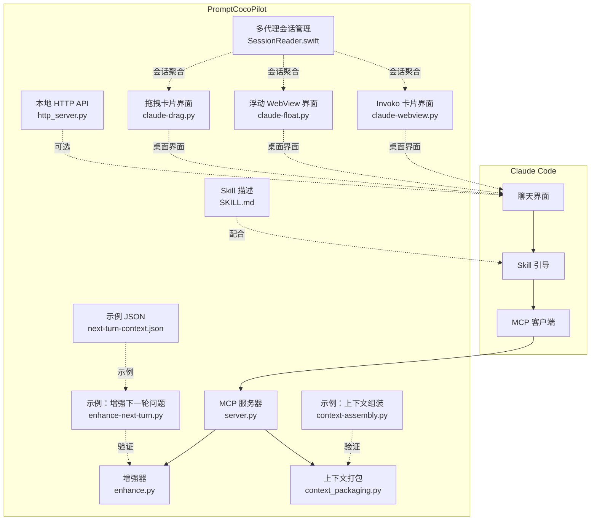
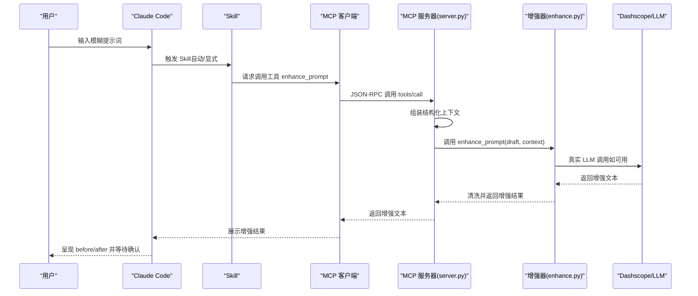
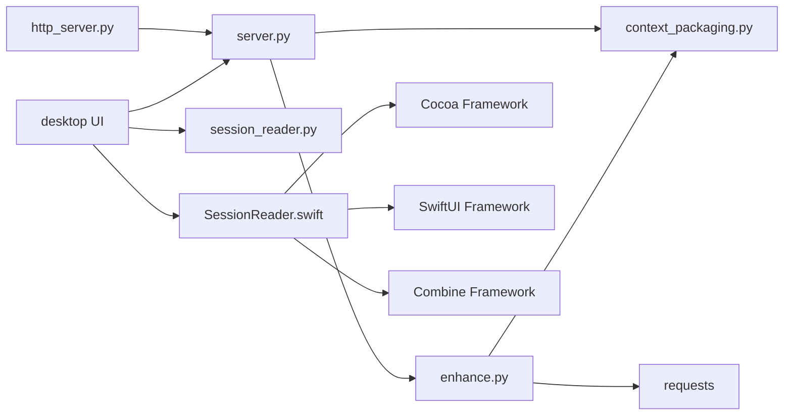

# Claude Code 集成

<cite>
**本文引用的文件**
- [README.md](file://README.md)
- [docs/claude-code-integration.md](file://docs/claude-code-integration.md)
- [docs/install.md](file://docs/install.md)
- [docs/TECH_SCHEME.md](file://docs/TECH_SCHEME.md)
- [docs/qoder-integration.md](file://docs/qoder-integration.md)
- [mcp-server/server.py](file://mcp-server/server.py)
- [mcp-server/enhance.py](file://mcp-server/enhance.py)
- [mcp-server/context_packaging.py](file://mcp-server/context_packaging.py)
- [mcp-server/http_server.py](file://mcp-server/http_server.py)
- [skill/SKILL.md](file://skill/SKILL.md)
- [examples/enhance-next-turn.py](file://examples/enhance-next-turn.py)
- [examples/context-assembly.py](file://examples/context-assembly.py)
- [examples/next-turn-context.json](file://examples/next-turn-context.json)
- [tests/test_enhance.py](file://tests/test_enhance.py)
- [tests/test_context_packaging.py](file://tests/test_context_packaging.py)
- [package.json](file://package.json)
- [claude-ui/bin/claude-drag.py](file://claude-ui/bin/claude-drag.py)
- [claude-ui/bin/claude-float.py](file://claude-ui/bin/claude-float.py)
- [claude-ui/bin/claude-webview.py](file://claude-ui/bin/claude-webview.py)
- [claude-ui/src/draggable_card.py](file://claude-ui/src/draggable_card.py)
- [claude-ui/src/floating_webview.py](file://claude-ui/src/floating_webview.py)
- [claude-ui/src/invoko_card.py](file://claude-ui/src/invoko_card.py)
- [claude-ui/src/session_reader.py](file://claude-ui/src/session_reader.py)
- [claude-ui/swift/Sources/App.swift](file://claude-ui/swift/Sources/App.swift)
- [claude-ui/swift/Sources/IslandView.swift](file://claude-ui/swift/Sources/IslandView.swift)
- [claude-ui/swift/Sources/SessionReader.swift](file://claude-ui/swift/Sources/SessionReader.swift)
- [claude-ui/swift/build.sh](file://claude-ui/swift/build.sh)
</cite>

## 更新摘要
**变更内容**
- 新增多代理会话管理功能，支持 Claude Code、Codex 和 Qoder 三种代理
- 增强会话聚合功能，提供统一的会话列表和差异化处理
- 实现多代理会话 ID 前缀机制，确保会话唯一性
- 添加代理识别和颜色标识系统，提升用户体验

## 目录
1. [简介](#简介)
2. [项目结构](#项目结构)
3. [核心组件](#核心组件)
4. [架构总览](#架构总览)
5. [组件详解](#组件详解)
6. [多代理会话管理](#多代理会话管理)
7. [桌面界面选项](#桌面界面选项)
8. [依赖关系分析](#依赖关系分析)
9. [性能考量](#性能考量)
10. [故障排除指南](#故障排除指南)
11. [结论](#结论)
12. [附录](#附录)

## 简介
本文件面向希望在 Claude Code 开发环境中集成 PromptCocoPilot 的工程师与使用者，系统讲解如何将 MCP 服务器与 Skill 集成到 Claude Code，涵盖 MCP Server 的配置步骤、环境变量与命令参数设置、Skill 的安装与目录结构、三种使用方式（自动触发、显式调用、结构化上下文传递）、**新增的多代理会话管理功能**（支持 Claude Code、Codex、Qoder 三种代理的统一会话聚合）、**新增的三种桌面界面选项**（拖拽卡片界面、浮动 WebView 界面、Invoko 卡片界面）、当前实现的局限性与推荐改进方案，以及常见问题的诊断与解决思路。

## 项目结构
该项目围绕"MCP 工具 + Skill + 桌面界面 + 多代理会话管理"的四轨集成展开，核心模块包括：
- mcp-server：提供 MCP 工具"enhance_prompt"，内置真实 LLM 调用（Dashscope/DeepSeek）与上下文打包能力
- skill：提供 Claude Code 的 Skill 描述文件，定义何时调用工具、如何传递上下文
- **新增** claude-ui：提供三种桌面界面选项，包括拖拽卡片、浮动 WebView 和 Invoko 卡片，支持多代理会话管理
- examples：演示如何组装上下文、如何调用工具、如何验证增强效果
- tests：覆盖核心增强逻辑与上下文打包的单元测试
- docs：集成与安装说明、技术方案与 Claude Code 集成指南

**图表来源**
- [mcp-server/server.py:1-232](file://mcp-server/server.py#L1-L232)
- [mcp-server/enhance.py:1-167](file://mcp-server/enhance.py#L1-L167)
- [mcp-server/context_packaging.py:1-211](file://mcp-server/context_packaging.py#L1-L211)
- [mcp-server/http_server.py:1-101](file://mcp-server/http_server.py#L1-L101)
- [skill/SKILL.md:1-105](file://skill/SKILL.md#L1-L105)
- [claude-ui/bin/claude-drag.py:1-34](file://claude-ui/bin/claude-drag.py#L1-L34)
- [claude-ui/bin/claude-float.py:1-30](file://claude-ui/bin/claude-float.py#L1-L30)
- [claude-ui/bin/claude-webview.py:1-14](file://claude-ui/bin/claude-webview.py#L1-L14)
- [claude-ui/swift/Sources/SessionReader.swift:1-304](file://claude-ui/swift/Sources/SessionReader.swift#L1-L304)

**章节来源**
- [README.md:23-29](file://README.md#L23-L29)
- [docs/install.md:1-81](file://docs/install.md#L1-L81)

## 核心组件
- MCP 服务器（server.py）
  - 暴露 JSON-RPC 接口，注册工具"enhance_prompt"
  - 支持结构化上下文参数（conversation、code_facts、task_state、current_file、selected_code、user_preferences、project_summary、workspace_files）
  - 默认通过 Dashscope 实际调用 LLM 进行增强（可通过环境变量启用）
- 增强器（enhance.py）
  - 严格遵循"只改写提示词，不回答或执行"的原则
  - 支持真实 Dashscope 调用与回退逻辑
  - 提供"下一轮问题增强"入口，将草稿与打包上下文合并生成增强提示词
- 上下文打包（context_packaging.py）
  - 定义数据类：ConversationMessage、CodeFact、PromptContext
  - 提供智能截断、去重、预算控制与格式化输出
- Skill（SKILL.md）
  - 指导 Claude 在模糊输入时自动触发增强工具
  - 明确结构化参数的传递方式与最佳实践
- 本地 HTTP API（http_server.py）
  - 为 Codex 风格"优化输入"按钮提供本地 HTTP 端点
  - 用于外部薄客户端或扩展将输入草稿与上下文 POST 至本地端点
- **新增** 多代理会话管理（SessionReader.swift）
  - 支持 Claude Code、Codex、Qoder 三种代理的统一会话聚合
  - 实现会话 ID 前缀机制，确保跨代理会话唯一性
  - 提供代理识别和差异化处理，包括颜色标识和会话状态管理
- **新增** 桌面界面（claude-ui）
  - 提供三种直观的桌面界面选项，替代传统的命令行和 HTTP API
  - 支持多代理会话检测、上下文自动填充和一键增强功能

**章节来源**
- [mcp-server/server.py:49-80](file://mcp-server/server.py#L49-L80)
- [mcp-server/enhance.py:90-148](file://mcp-server/enhance.py#L90-L148)
- [mcp-server/context_packaging.py:7-33](file://mcp-server/context_packaging.py#L7-L33)
- [skill/SKILL.md:1-105](file://skill/SKILL.md#L1-L105)
- [mcp-server/http_server.py:22-36](file://mcp-server/http_server.py#L22-L36)
- [claude-ui/swift/Sources/SessionReader.swift:3-5](file://claude-ui/swift/Sources/SessionReader.swift#L3-L5)

## 架构总览
下图展示了 Claude Code 与 PromptCocoPilot 的交互路径：Claude 通过 MCP 发现工具；Skill 决定何时调用工具并如何传递上下文；MCP 服务器内部调用增强器，结合真实 LLM 生成增强提示词；最终返回给 Claude 供用户审阅与发送。**新增的多代理会话管理和桌面界面提供了更直观和高效的用户体验**。

**图表来源**
- [docs/claude-code-integration.md:100-142](file://docs/claude-code-integration.md#L100-L142)
- [mcp-server/server.py:196-214](file://mcp-server/server.py#L196-L214)
- [mcp-server/enhance.py:118-133](file://mcp-server/enhance.py#L118-L133)

## 组件详解

### MCP 服务器配置与工具参数
- 配置文件位置与格式
  - macOS 常见路径：~/Library/Application Support/Claude/claude_desktop_config.json
  - 配置项包含 mcpServers.prompt-enhancer：command、args、env
- 命令参数
  - command：python3（需确保系统 PATH 可用）
  - args：指向 server.py 的绝对路径
- 环境变量
  - DASHSCOPE_API_KEY：启用真实 LLM 增强
  - DEEPSEEK_BASE_URL：兼容模式基础地址（可选）
  - ENHANCE_MODEL：增强使用的模型名称（默认 deepseek-v4-flash）
- 工具参数（enhance_prompt）
  - draft：草稿提示词
  - context：自由格式上下文字符串（可选）
  - include_history：是否包含对话历史（可选）
  - conversation：最近对话消息数组（可选）
  - code_facts：已读代码事实（可选）
  - task_state：当前任务状态（可选）
  - current_file / selected_code：编辑器上下文（可选）
  - user_preferences：用户偏好（可选）
  - project_summary / workspace_files：项目级上下文（可选）
  - structured_output：是否返回 JSON 结构（可选）

**章节来源**
- [docs/claude-code-integration.md:35-61](file://docs/claude-code-integration.md#L35-L61)
- [docs/install.md:11-25](file://docs/install.md#L11-L25)
- [mcp-server/server.py:117-191](file://mcp-server/server.py#L117-L191)

### 增强器与回退机制
- 真实 LLM 调用
  - 若检测到 DASHSCOPE_API_KEY 或存在特定 .env 文件，则通过 Dashscope 兼容端点调用真实模型
  - 使用固定系统指令（INSTRUCTION），保证输出严格为"改写后的提示词"
- 回退逻辑
  - 无 API Key 时使用简单回退（字符串拼接），仅用于开发与测试
  - 真实调用失败时自动回退到简单回退，避免中断流程
- 输出清洗
  - 移除代码块与外层引号，确保输出整洁

**章节来源**
- [mcp-server/enhance.py:27-37](file://mcp-server/enhance.py#L27-L37)
- [mcp-server/enhance.py:41-68](file://mcp-server/enhance.py#L41-L68)
- [mcp-server/enhance.py:118-133](file://mcp-server/enhance.py#L118-L133)
- [mcp-server/enhance.py:150-159](file://mcp-server/enhance.py#L150-L159)

### 上下文打包与预算控制
- 数据结构
  - ConversationMessage：role/content
  - CodeFact：path/summary/symbols
  - PromptContext：聚合上述字段及项目级信息
- 智能截断
  - 保留消息头与尾，避免丢失结论
- 去重与合并
  - 同路径代码事实合并摘要与符号集合
- 预算控制
  - 总上下文字符预算约 6000，超限时逐步收紧每条消息长度
- 输出格式
  - 统一标题分段与换行，便于增强器处理

**章节来源**
- [mcp-server/context_packaging.py:7-33](file://mcp-server/context_packaging.py#L7-L33)
- [mcp-server/context_packaging.py:42-52](file://mcp-server/context_packaging.py#L42-L52)
- [mcp-server/context_packaging.py:60-76](file://mcp-server/context_packaging.py#L60-L76)
- [mcp-server/context_packaging.py:79-178](file://mcp-server/context_packaging.py#L79-L178)

### Skill 安装与使用
- 安装路径
  - 在工作区根目录创建 .claude/skills/prompt-enhancer，并复制 SKILL.md
- 使用方式
  - 自动触发：对模糊输入自动调用增强工具
  - 显式调用：直接要求 Claude 使用工具
  - 结构化上下文：将最近对话、代码事实、任务状态、编辑器上下文与用户偏好一并传入
- 最佳实践
  - 保持 before/after 对比与改动说明
  - 不直接执行原始模糊提示
  - 优先使用结构化字段

**章节来源**
- [docs/claude-code-integration.md:69-98](file://docs/claude-code-integration.md#L69-L98)
- [skill/SKILL.md:18-96](file://skill/SKILL.md#L18-L96)

### 三种使用方式
- 自动触发（推荐）
  - Claude 在检测到模糊输入时自动调用工具，收集上下文并展示增强前后对比
- 显式调用
  - 用户明确要求先优化提示词再执行
- 结构化上下文传递（效果最佳）
  - 将"下一轮问题 + 已读代码事实 + 最近对话 + 任务状态 + 编辑器上下文 + 用户偏好"打包传入工具

**章节来源**
- [docs/claude-code-integration.md:100-142](file://docs/claude-code-integration.md#L100-L142)
- [skill/SKILL.md:58-72](file://skill/SKILL.md#L58-L72)

### 本地 HTTP API（Codex 风格"优化输入"按钮）
- 作用
  - 为外部薄客户端提供本地 HTTP 端点，接收草稿与上下文，返回增强结果
- 端点
  - POST /enhance：返回 {draft, enhanced}
- CORS 与错误处理
  - 支持 OPTIONS 预检，统一 JSON 响应与错误码

**章节来源**
- [mcp-server/http_server.py:22-36](file://mcp-server/http_server.py#L22-L36)
- [mcp-server/http_server.py:47-66](file://mcp-server/http_server.py#L47-L66)

### 示例与验证
- 增强下一轮问题
  - 通过 examples/enhance-next-turn.py 读取 JSON，打印打包上下文或直接调用增强
- 上下文组装
  - examples/context-assembly.py 展示结构化与自由格式两种组装方式
- 测试
  - tests/test_enhance.py 与 tests/test_context_packaging.py 验证增强与上下文打包行为

**章节来源**
- [examples/enhance-next-turn.py:21-51](file://examples/enhance-next-turn.py#L21-L51)
- [examples/context-assembly.py:25-60](file://examples/context-assembly.py#L25-L60)
- [examples/context-assembly.py:65-92](file://examples/context-assembly.py#L65-L92)
- [tests/test_enhance.py:10-60](file://tests/test_enhance.py#L10-L60)
- [tests/test_context_packaging.py:19-146](file://tests/test_context_packaging.py#L19-L146)

## 多代理会话管理

### 概述
**新增**的多代理会话管理功能是 PromptCocoPilot 的重要增强，它实现了对 Claude Code、Codex 和 Qoder 三种 AI 代理的统一会话聚合与管理。该功能通过会话 ID 前缀机制确保跨代理会话的唯一性，并提供代理识别和差异化处理，显著提升了用户的多会话管理体验。

### 会话聚合架构
多代理会话管理的核心是 `SessionReader` 类，它负责从不同代理的存储位置读取会话数据，并将其聚合到一个统一的列表中。

- **支持的代理类型**
  - Claude Code：存储在 `~/.claude/sessions/` 和 `~/.claude/projects/`
  - Codex：存储在 `~/.codex/sessions/` 和 `~/.codex/session_index.jsonl`
  - Qoder：存储在 `~/.qoder/projects/`（与 Claude 类似但有特殊处理）

- **会话 ID 前缀机制**
  - Claude Code：`claude:sessionId`
  - Codex：`codex:sessionId`
  - Qoder：`qoder:sessionName`
  - 这种机制确保即使不同代理使用相同的会话 ID，也能在聚合列表中唯一标识

**章节来源**
- [claude-ui/swift/Sources/SessionReader.swift:42-43](file://claude-ui/swift/Sources/SessionReader.swift#L42-L43)
- [claude-ui/swift/Sources/SessionReader.swift:144-150](file://claude-ui/swift/Sources/SessionReader.swift#L144-L150)
- [claude-ui/swift/Sources/SessionReader.swift:221-226](file://claude-ui/swift/Sources/SessionReader.swift#L221-L226)
- [claude-ui/swift/Sources/SessionReader.swift:272-277](file://claude-ui/swift/Sources/SessionReader.swift#L272-L277)

### 代理识别与差异化处理
系统通过 `AgentKind` 枚举来识别不同的代理类型，并为每种代理提供独特的视觉标识和处理逻辑。

- **代理枚举定义**
  - `claude = "Claude"`：橙色标识，代表 Claude Code
  - `codex = "Codex"`：绿色标识，代表 Codex
  - `qoder = "Qoder"`：紫色标识，代表 Qoder

- **差异化处理特性**
  - **颜色标识**：每种代理都有独特的颜色标签，便于用户快速识别
  - **状态管理**：Claude Code 会显示忙碌状态（红色指示灯），其他代理显示空闲状态
  - **会话名称**：根据代理类型提供友好的会话名称显示
  - **会话 ID 截断**：为每种代理提供适当的会话 ID 显示策略

**章节来源**
- [claude-ui/swift/Sources/SessionReader.swift:3-5](file://claude-ui/swift/Sources/SessionReader.swift#L3-L5)
- [claude-ui/swift/Sources/IslandView.swift:208-221](file://claude-ui/swift/Sources/IslandView.swift#L208-L221)
- [claude-ui/swift/Sources/SessionReader.swift:28-31](file://claude-ui/swift/Sources/SessionReader.swift#L28-L31)

### 会话读取与上下文管理
多代理会话管理不仅提供会话聚合，还支持不同代理的上下文读取和处理。

- **会话候选者扫描**
  - Claude Code：扫描 `~/.claude/sessions/` 目录下的 JSON 描述文件
  - Codex：扫描 `~/.codex/sessions/` 目录下的 JSONL 文件
  - Qoder：扫描 `~/.qoder/projects/` 目录下的 JSONL 文件

- **上下文解析差异**
  - **Claude Code**：解析 JSONL 格式的对话日志，提取用户和助手的消息
  - **Codex**：解析特殊的会话元数据格式，支持线程名称映射
  - **Qoder**：解析与 Claude 相似的 JSONL 格式，但需要从文件内容中提取 cwd 信息

- **活动时间计算**
  - 基于会话日志文件的最后修改时间计算会话活跃度
  - 支持相对时间显示（如"刚刚"、"几分钟前"、"几小时前"等）

**章节来源**
- [claude-ui/swift/Sources/SessionReader.swift:131-154](file://claude-ui/swift/Sources/SessionReader.swift#L131-L154)
- [claude-ui/swift/Sources/SessionReader.swift:200-230](file://claude-ui/swift/Sources/SessionReader.swift#L200-L230)
- [claude-ui/swift/Sources/SessionReader.swift:252-281](file://claude-ui/swift/Sources/SessionReader.swift#L252-L281)
- [claude-ui/swift/Sources/SessionReader.swift:60-67](file://claude-ui/swift/Sources/SessionReader.swift#L60-L67)

### 会话列表与用户界面
多代理会话管理通过 SwiftUI 界面为用户提供直观的会话选择体验。

- **会话列表显示**
  - **会话名称**：显示项目名称和路径尾部信息
  - **活跃度信息**：显示会话创建时间和消息数量
  - **代理标识**：显示代理类型的彩色徽章
  - **会话 ID**：显示截断后的会话 ID，便于区分同名会话

- **交互功能**
  - **会话切换**：点击会话项即可切换到对应的会话
  - **刷新功能**：支持手动刷新会话列表
  - **状态指示**：忙碌状态的会话会显示红色指示灯

**章节来源**
- [claude-ui/swift/Sources/IslandView.swift:249-291](file://claude-ui/swift/Sources/IslandView.swift#L249-L291)
- [claude-ui/swift/Sources/SessionReader.swift:285-289](file://claude-ui/swift/Sources/SessionReader.swift#L285-L289)

## 桌面界面选项

### 概述
**新增**的三种桌面界面选项为用户提供更加直观和便捷的使用体验，替代传统的命令行和 HTTP API 方式。这些界面都集成了多代理会话管理功能，能够自动检测和管理来自 Claude Code、Codex 和 Qoder 的会话。

### 拖拽卡片界面（Draggable Card）
- 特点
  - macOS 原生拖拽体验，支持从屏幕边缘拖出
  - 支持 Fn+F1 快捷键快速唤起
  - 自动应用增强结果到当前选中文本
  - 岛屿式折叠设计，节省空间
  - **新增**：支持多代理会话选择和上下文读取
- 适用场景
  - 需要快速增强当前选中文本的开发者
  - 偏好 macOS 原生界面的用户
  - 需要在多个应用间切换时保持高效的工作流
- 快捷键支持
  - Fn+F1：显示增强卡片并自动填充当前选中文本
  - 支持快捷键安装和卸载脚本

**章节来源**
- [claude-ui/bin/claude-drag.py:1-34](file://claude-ui/bin/claude-drag.py#L1-L34)
- [claude-ui/src/draggable_card.py:1-396](file://claude-ui/src/draggable_card.py#L1-L396)

### 浮动 WebView 界面（Floating WebView）
- 特点
  - 动态岛风格设计，类似 iOS 的动态岛体验
  - 支持多代理会话列表切换，可选择不同的 Claude Code、Codex 或 Qoder 会话
  - 自动检测并填充剪贴板内容
  - 支持复制增强结果到剪贴板
  - **新增**：会话列表中显示代理类型和颜色标识
- 适用场景
  - 需要同时管理多个项目会话的高级用户
  - 偏好现代化 UI 设计的用户
  - 需要更多上下文控制的复杂场景
- 会话管理
  - 自动刷新可用会话列表，支持三种代理的统一管理
  - 支持手动切换不同项目会话
  - 实时显示每个会话的消息数量和代理类型

**章节来源**
- [claude-ui/bin/claude-float.py:1-30](file://claude-ui/bin/claude-float.py#L1-L30)
- [claude-ui/src/floating_webview.py:1-422](file://claude-ui/src/floating_webview.py#L1-L422)

### Invoko 卡片界面（Invoko Card）
- 特点
  - 极简设计，专注于核心功能
  - 无独立窗口，直接作为卡片叠加在当前应用上
  - 支持热键唤起（默认 Fn 键）
  - 纯卡片式交互，无多余装饰
  - **新增**：支持多代理会话的快速切换和上下文读取
- 适用场景
  - 追求极简主义的用户
  - 需要最小化干扰的专注工作场景
  - 偏好轻量级工具的开发者
- 交互设计
  - 一键增强，一键应用
  - 自动从系统选区或剪贴板获取内容
  - 增强完成后自动关闭

**章节来源**
- [claude-ui/bin/claude-webview.py:1-14](file://claude-ui/bin/claude-webview.py#L1-L14)
- [claude-ui/src/invoko_card.py:1-300](file://claude-ui/src/invoko_card.py#L1-L300)

### 会话读取与上下文管理
所有桌面界面都集成了多代理会话读取功能，能够自动检测当前活跃的 Claude Code、Codex 或 Qoder 会话并提取对话上下文。

- **会话检测**
  - 读取 ~/.claude/sessions/、~/.codex/sessions/ 和 ~/.qoder/projects/ 目录下的会话描述文件
  - 支持按活跃度和时间排序，自动解析 JSONL 格式的对话历史
  - **新增**：支持三种代理的统一会话聚合和差异化处理
- **上下文提取**
  - 支持提取最近 N 条消息
  - 自动过滤非文本内容
  - 保持对话角色信息（user/assistant）
  - **新增**：支持不同代理的消息格式解析和上下文压缩
- **跨平台支持**
  - macOS 原生支持系统选区和剪贴板
  - 通过 pbcopy/pbpaste 实现跨应用内容交换
  - 支持热键配置和快捷键管理
  - **新增**：支持多代理会话 ID 前缀机制，确保会话唯一性

**章节来源**
- [claude-ui/src/session_reader.py:1-124](file://claude-ui/src/session_reader.py#L1-L124)
- [claude-ui/swift/Sources/SessionReader.swift:42-289](file://claude-ui/swift/Sources/SessionReader.swift#L42-L289)

## 依赖关系分析
- 组件耦合
  - server.py 依赖 enhance.py 与 context_packaging.py
  - enhance.py 依赖 context_packaging.py（PromptContext）
  - http_server.py 依赖 server.py 的工具处理函数
  - **新增** desktop UI 组件依赖 session_reader.py 和 SessionReader.swift 进行多代理会话管理
- 外部依赖
  - requests（HTTP 调用 Dashscope）
  - mcp（可选，官方 SDK；当前 server.py 为最小 stdio 实现）
  - **新增** pywebview（桌面界面渲染）
  - **新增** osascript（macOS 系统交互）
  - **新增** Cocoa、SwiftUI、Combine（多代理会话管理的 Swift 组件）
- 环境变量
  - DASHSCOPE_API_KEY：真实增强的关键开关
  - ENHANCE_MODEL：增强模型选择
  - DEEPSEEK_BASE_URL：兼容模式基础地址
  - **新增** ENHANCE_ENDPOINT：自定义增强服务端点

**图表来源**
- [mcp-server/server.py:35-40](file://mcp-server/server.py#L35-L40)
- [mcp-server/enhance.py:17-20](file://mcp-server/enhance.py#L17-L20)
- [mcp-server/http_server.py:13-16](file://mcp-server/http_server.py#L13-L16)
- [claude-ui/src/session_reader.py:1-124](file://claude-ui/src/session_reader.py#L1-L124)
- [claude-ui/swift/Sources/SessionReader.swift:1-304](file://claude-ui/swift/Sources/SessionReader.swift#L1-L304)

**章节来源**
- [mcp-server/server.py:35-40](file://mcp-server/server.py#L35-L40)
- [mcp-server/enhance.py:17-20](file://mcp-server/enhance.py#L17-L20)
- [mcp-server/http_server.py:13-16](file://mcp-server/http_server.py#L13-L16)

## 性能考量
- 上下文预算
  - 默认上下文预算约 6000 字符，超限时动态收紧消息长度，避免超出小模型上下文窗口
- 智能截断
  - 保留消息头与尾，确保结论不被截断
- 去重与合并
  - 同路径代码事实合并摘要与符号，减少冗余
- 模型选择
  - 默认使用快速模型（如 deepseek-v4-flash），降低延迟与 Token 消耗
- I/O 与并发
  - HTTP API 使用多线程服务器，适合轻量集成场景
- **新增** 多代理会话管理性能
  - Swift 实现的会话读取优化，支持文件尾部读取和内存映射
  - 会话列表缓存机制，避免频繁文件系统访问
  - 多代理会话聚合的增量更新，减少不必要的重新扫描
  - **新增**：会话 ID 前缀机制减少会话冲突和重复处理
- **新增** 桌面界面性能
  - pywebview 窗口渲染优化，支持透明背景和无边框设计
  - 会话读取缓存机制，避免频繁文件系统访问
  - 快捷键响应优化，提供流畅的用户体验

**章节来源**
- [mcp-server/context_packaging.py:35-39](file://mcp-server/context_packaging.py#L35-L39)
- [mcp-server/context_packaging.py:42-52](file://mcp-server/context_packaging.py#L42-L52)
- [mcp-server/context_packaging.py:60-76](file://mcp-server/context_packaging.py#L60-L76)
- [mcp-server/enhance.py:25](file://mcp-server/enhance.py#L25)
- [claude-ui/swift/Sources/SessionReader.swift:75-83](file://claude-ui/swift/Sources/SessionReader.swift#L75-L83)

## 故障排除指南
- 重启后看不到工具
  - 检查配置文件路径与 JSON 格式
  - 确认 python3 可用（可通过 which python3 检查）
  - 在终端手动运行 server.py，观察是否有异常
- 增强效果一般
  - 当前为回退逻辑，需配置 DASHSCOPE_API_KEY 以启用真实 LLM 增强
- 想实现"✨ 按钮"
  - Claude Code 主要是通过工具调用 + Skill 引导；如需按钮，可编写薄客户端（如 VS Code 扩展）拦截输入框内容，调用本地 HTTP API，再将结果写回输入框
- 环境变量未生效
  - 确认 DASHSCOPE_API_KEY 已设置，或 .env 文件存在且包含该键值
- 结构化参数未被识别
  - 确保传入的字段类型与 server.py 的 inputSchema 一致
- **新增** 多代理会话管理问题
  - 会话列表为空：检查 ~/.claude、~/.codex、~/.qoder 目录是否存在和权限
  - 代理识别错误：确认会话文件格式符合预期，特别是 Qoder 的 cwd 提取
  - 会话 ID 冲突：检查是否使用了相同的会话 ID，系统会自动通过前缀区分
  - Swift 组件编译失败：确保已安装 Swift 命令行工具和必要的框架
- **新增** 桌面界面问题
  - pywebview 未安装：`pip install pywebview`
  - macOS 权限问题：检查系统设置中的辅助功能权限
  - 快捷键无效：确认 Fn+F1 在系统设置中已正确配置
  - 会话检测失败：检查 ~/.claude 目录权限和文件完整性

**章节来源**
- [docs/claude-code-integration.md:180-190](file://docs/claude-code-integration.md#L180-L190)
- [docs/install.md:35-41](file://docs/install.md#L35-L41)
- [mcp-server/enhance.py:27-37](file://mcp-server/enhance.py#L27-L37)
- [claude-ui/swift/Sources/SessionReader.swift:42-289](file://claude-ui/swift/Sources/SessionReader.swift#L42-L289)

## 结论
通过 MCP 服务器与 Skill 的协同，PromptCocoPilot 能够在 Claude Code 中实现"上下文感知的提示词增强"。**新增的多代理会话管理功能进一步提升了用户体验，支持 Claude Code、Codex 和 Qoder 三种代理的统一会话聚合与管理**，并通过会话 ID 前缀机制确保跨代理会话的唯一性。**新增的三种桌面界面选项（拖拽卡片、浮动 WebView、Invoko 卡片）提供了比传统命令行和 HTTP API 更直观的操作方式**，结合多代理会话管理功能，使得用户能够在不同 AI 代理之间无缝切换和管理会话。当前实现已支持真实 LLM 增强（Dashscope/DeepSeek），并通过结构化上下文与智能截断显著提升增强质量。建议在生产环境中配置 API Key 与合适的模型，以获得更接近 Kilo Code 的体验；同时可结合本地 HTTP API 为 Codex 场景提供"优化输入"按钮能力。**多代理会话管理的引入使得 PromptCocoPilot 成为真正意义上的多代理会话管理工具，大大增强了其在现代 AI 开发环境中的实用性**。

## 附录

### MCP Server 配置示例（claude_desktop_config.json）
- 关键字段
  - mcpServers.prompt-enhancer.command：python3
  - mcpServers.prompt-enhancer.args：指向 server.py 的绝对路径
  - mcpServers.prompt-enhancer.env：DASHSCOPE_API_KEY、DEEPSEEK_BASE_URL、ENHANCE_MODEL（可选）
- 重启客户端后生效

**章节来源**
- [docs/claude-code-integration.md:43-61](file://docs/claude-code-integration.md#L43-L61)
- [docs/install.md:13-25](file://docs/install.md#L13-L25)

### Skill 安装步骤
- 在工作区根目录创建 .claude/skills/prompt-enhancer
- 复制 SKILL.md 到该目录
- 重启 Claude Code，验证工具可用

**章节来源**
- [docs/claude-code-integration.md:69-98](file://docs/claude-code-integration.md#L69-L98)

### 三种使用方式对照
- 自动触发：模糊输入时由 Skill 引导调用工具
- 显式调用：用户明确要求先优化再执行
- 结构化上下文：将最近对话、代码事实、任务状态、编辑器上下文与用户偏好一并传入

**章节来源**
- [docs/claude-code-integration.md:100-142](file://docs/claude-code-integration.md#L100-L142)
- [skill/SKILL.md:58-72](file://skill/SKILL.md#L58-L72)

### 本地 HTTP API 使用
- 启动：python3 mcp-server/http_server.py --host 127.0.0.1 --port 8765
- 调用：POST http://127.0.0.1:8765/enhance
- 返回：{draft, enhanced}

**章节来源**
- [mcp-server/http_server.py:86-96](file://mcp-server/http_server.py#L86-L96)

### 多代理会话管理使用指南

#### 会话聚合功能
- **统一会话列表**：系统会自动扫描 ~/.claude、~/.codex、~/.qoder 目录，将三个代理的会话聚合到一个列表中
- **会话 ID 前缀**：Claude Code 会话以 "claude:" 前缀标识，Codex 会话以 "codex:" 前缀标识，Qoder 会话以 "qoder:" 前缀标识
- **代理识别**：会话列表中显示彩色徽章标识代理类型，Claude（橙色）、Codex（绿色）、Qoder（紫色）

#### 会话切换操作
- **桌面界面**：在浮动 WebView 界面中，点击会话选择器可以看到所有代理的会话列表
- **状态显示**：Claude Code 会话如果处于忙碌状态会显示红色指示灯
- **会话详情**：鼠标悬停可以看到会话的完整信息，包括项目路径、消息数量和会话 ID

#### 上下文读取
- **自动上下文**：选择会话后，系统会自动读取该会话的对话历史作为增强上下文
- **消息数量限制**：默认读取最近 40 条消息，可根据需要调整
- **格式兼容**：支持不同代理的消息格式解析，确保上下文准确性

**章节来源**
- [claude-ui/swift/Sources/SessionReader.swift:42-289](file://claude-ui/swift/Sources/SessionReader.swift#L42-L289)
- [claude-ui/swift/Sources/IslandView.swift:249-291](file://claude-ui/swift/Sources/IslandView.swift#L249-L291)

### 桌面界面使用指南

#### 拖拽卡片界面使用
- 启动：`npm run claude:drag`
- 快捷键：Fn+F1 唤起卡片并自动填充选中文本
- 安装快捷键：`npm run claude:drag:install`
- 卸载快捷键：`npm run claude:drag:uninstall`

#### 浮动 WebView 界面使用
- 启动：`npm run claude:ui`
- 会话管理：点击右上角按钮刷新会话列表
- 增强流程：输入草稿 → 点击"增强" → 复制结果
- **新增**：会话列表支持多代理会话切换，显示代理类型和颜色标识

#### Invoko 卡片界面使用
- 启动：`npm run claude:card`
- 热键：按住 Fn 键显示卡片
- 应用：点击"应用并关闭"将增强结果复制到剪贴板

#### 通用功能
- 会话检测：自动检测当前活跃的 Claude Code、Codex 或 Qoder 会话
- 上下文填充：从系统选区或剪贴板自动获取内容
- 一键增强：简化复杂的增强流程
- 多种样式：根据个人偏好选择不同的界面风格
- **新增**：多代理会话管理：支持三种代理的统一会话聚合和切换

**章节来源**
- [claude-ui/bin/claude-drag.py:1-34](file://claude-ui/bin/claude-drag.py#L1-L34)
- [claude-ui/bin/claude-float.py:1-30](file://claude-ui/bin/claude-float.py#L1-L30)
- [claude-ui/bin/claude-webview.py:1-14](file://claude-ui/bin/claude-webview.py#L1-L14)
- [package.json:16-23](file://package.json#L16-L23)

### 示例 JSON（下一轮问题上下文）
- draft、conversation、code_facts、task_state、current_file、selected_code、user_preferences
- 可作为调用工具时的结构化参数

**章节来源**
- [examples/next-turn-context.json:1-33](file://examples/next-turn-context.json#L1-L33)

### 多代理会话管理技术细节

#### 会话 ID 前缀机制
- **Claude Code**：`claude:sessionId` - 使用原始会话 ID，前缀为 "claude:"
- **Codex**：`codex:sessionId` - 使用会话 ID 或文件名，前缀为 "codex:"
- **Qoder**：`qoder:sessionName` - 使用文件名作为会话 ID，前缀为 "qoder:"
- **唯一性保证**：通过前缀机制确保不同代理间的会话 ID 冲突不会发生

#### 代理识别系统
- **AgentKind 枚举**：定义三种代理类型及其对应的显示名称
- **颜色标识**：每种代理使用独特的颜色徽章，便于视觉识别
- **状态管理**：Claude Code 会显示忙碌状态，其他代理显示空闲状态
- **会话名称映射**：Codex 支持从 session_index.jsonl 中获取更好的会话名称

#### 上下文解析差异
- **Claude Code**：解析标准 JSONL 格式，提取 user/assistant 消息
- **Codex**：解析特殊的会话元数据格式，支持线程名称映射
- **Qoder**：解析与 Claude 相似的 JSONL 格式，但需要从文件内容中提取 cwd 信息
- **消息压缩**：将多条消息压缩为预览列表，便于用户快速浏览

**章节来源**
- [claude-ui/swift/Sources/SessionReader.swift:3-5](file://claude-ui/swift/Sources/SessionReader.swift#L3-L5)
- [claude-ui/swift/Sources/SessionReader.swift:144-150](file://claude-ui/swift/Sources/SessionReader.swift#L144-L150)
- [claude-ui/swift/Sources/SessionReader.swift:221-226](file://claude-ui/swift/Sources/SessionReader.swift#L221-L226)
- [claude-ui/swift/Sources/SessionReader.swift:272-277](file://claude-ui/swift/Sources/SessionReader.swift#L272-L277)