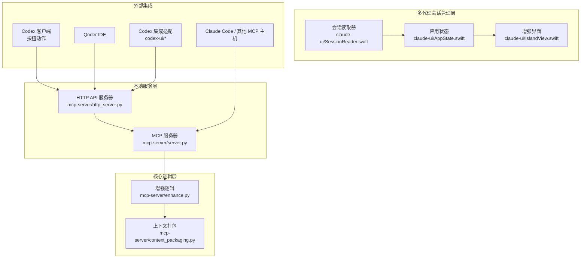
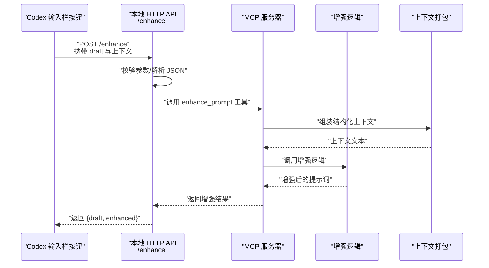
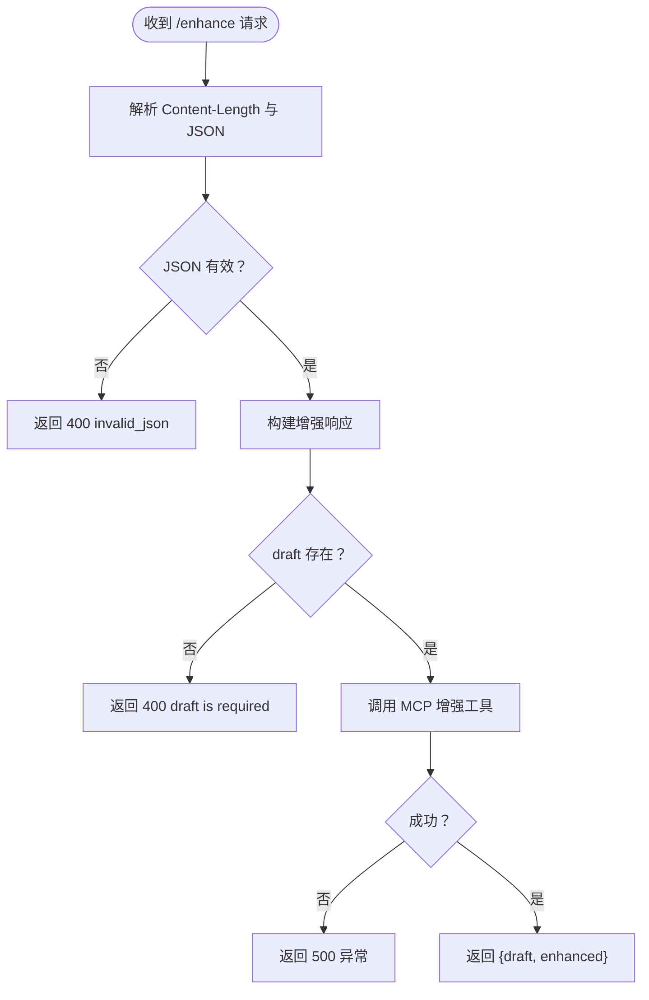
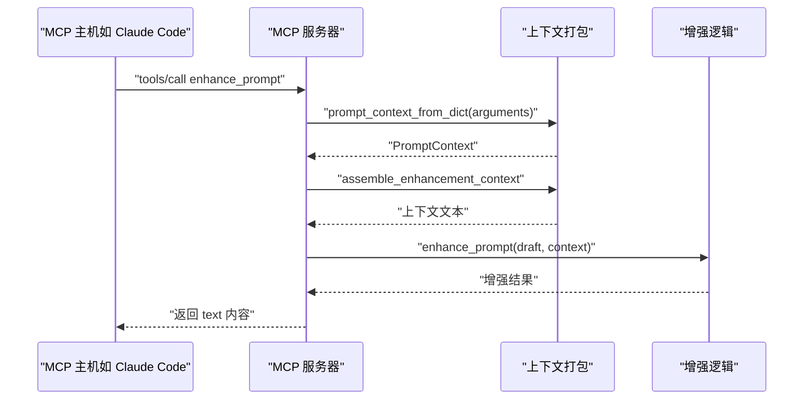
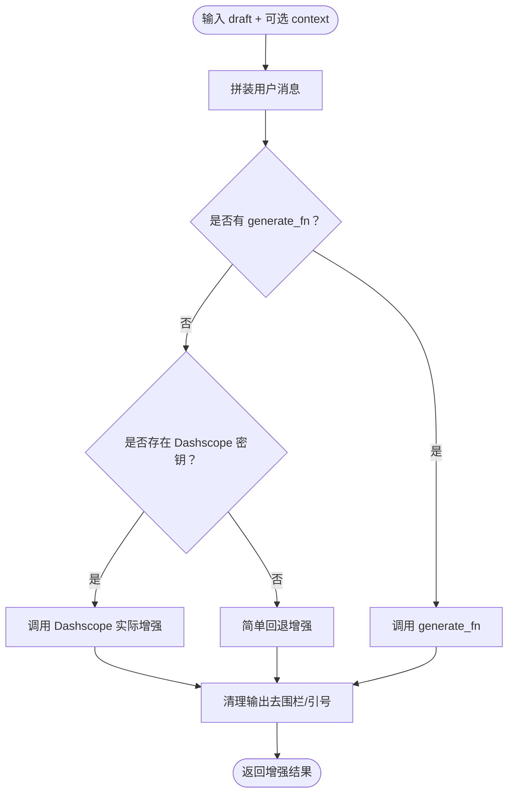
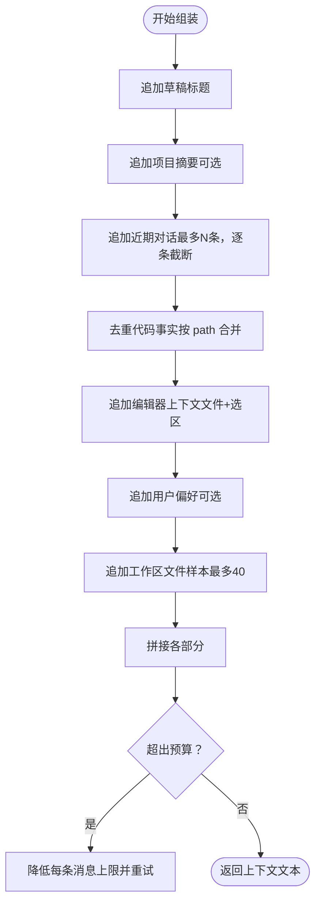
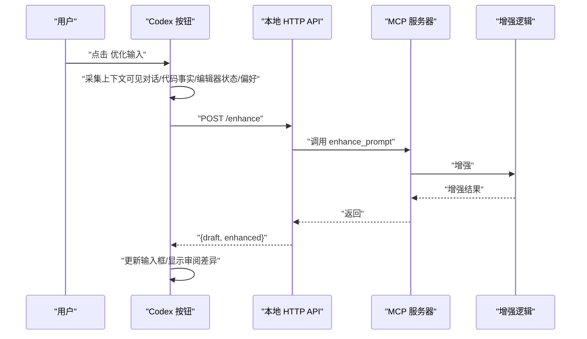
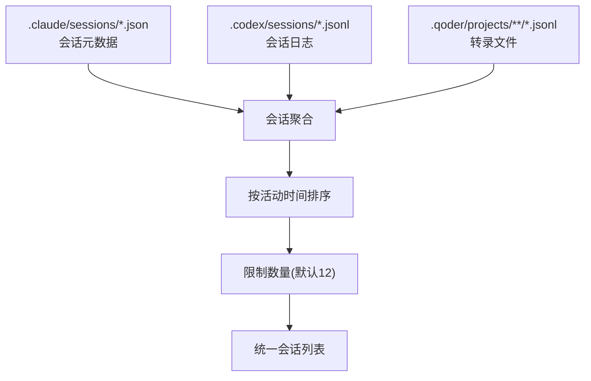
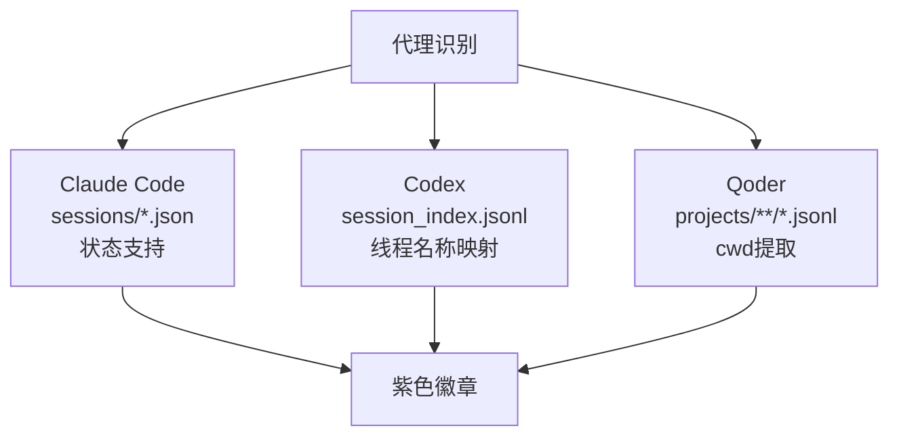
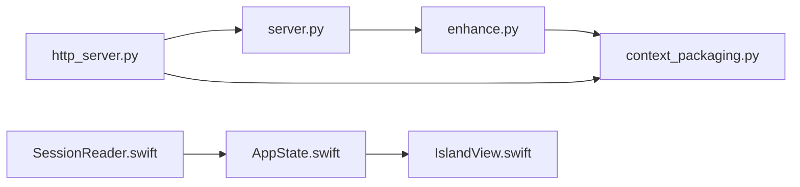

# Codex 集成

<cite>
**本文引用的文件**
- [README.md](file://README.md)
- [codex-button-integration.md](file://docs/codex-button-integration.md)
- [TECH_SCHEME.md](file://docs/TECH_SCHEME.md)
- [http_server.py](file://mcp-server/http_server.py)
- [server.py](file://mcp-server/server.py)
- [enhance.py](file://mcp-server/enhance.py)
- [context_packaging.py](file://mcp-server/context_packaging.py)
- [test_http_button_server.py](file://tests/test_http_button_server.py)
- [test_enhance.py](file://tests/test_enhance.py)
- [test_context_packaging.py](file://tests/test_context_packaging.py)
- [enhance-next-turn.py](file://examples/enhance-next-turn.py)
- [context-assembly.py](file://examples/context-assembly.py)
- [package.json](file://package.json)
- [SessionReader.swift](file://claude-ui/swift/Sources/SessionReader.swift)
- [IslandView.swift](file://claude-ui/swift/Sources/IslandView.swift)
- [AppState.swift](file://claude-ui/swift/Sources/App.swift)
- [EnhanceClient.swift](file://claude-ui/swift/Sources/EnhanceClient.swift)
- [floating_webview.py](file://claude-ui/src/floating_webview.py)
- [codex_paths.js](file://codex-ui/src/codex_paths.js)
- [codex-optimize-input.js](file://codex-ui/bin/codex-optimize-input.js)
- [daemon.js](file://codex-ui/src/daemon.js)
</cite>

## 目录
1. [简介](#简介)
2. [项目结构](#项目结构)
3. [核心组件](#核心组件)
4. [架构总览](#架构总览)
5. [详细组件分析](#详细组件分析)
6. [多代理会话管理增强](#多代理会话管理增强)
7. [依赖关系分析](#依赖关系分析)
8. [性能考虑](#性能考虑)
9. [故障排除指南](#故障排除指南)
10. [结论](#结论)
11. [附录](#附录)

## 简介
本文件面向希望在 Codex 环境中集成 PromptCocoPilot 的开发者，系统性说明如何通过"按钮式优化输入"接口将 PromptCocoPilot 集成到 Codex 的输入栏动作中；同时解释本地 HTTP API 的实现原理、请求处理与响应格式，以及按钮触发后从请求发送到结果返回与界面更新的完整工作流。此外，文档还涵盖与 MCP 服务器的协作关系、工具调用与上下文传递、错误处理机制、性能优化建议与最佳实践，并提供可直接参考的集成步骤与示例路径。

**更新** 本次更新重点反映了多代理会话管理的增强功能，包括会话聚合、多代理会话 ID 前缀机制和代理识别差异化处理。

## 项目结构
该项目采用分层与职责分离的设计：
- mcp-server：提供 MCP 工具与本地 HTTP API，核心增强逻辑与上下文打包在此实现
- docs：技术方案与集成文档
- examples：上下文组装与增强下一回合提示词的示例
- tests：针对增强逻辑、上下文打包与 HTTP API 的单元测试
- qoder-ui：与 Qoder 相关的前端/代理脚本（与 Codex 集成关系较弱，但展示了本地 HTTP API 的使用思路）
- claude-ui：多代理会话管理与增强界面，支持 Claude Code、Codex、Qoder 会话聚合
- codex-ui：Codex 特定的集成适配层，提供按钮式优化输入的前端实现

**图表来源**
- [http_server.py:1-112](file://mcp-server/http_server.py#L1-L112)
- [server.py:1-261](file://mcp-server/server.py#L1-L261)
- [SessionReader.swift:42-304](file://claude-ui/swift/Sources/SessionReader.swift#L42-L304)
- [AppState.swift:91-233](file://claude-ui/swift/Sources/App.swift#L91-L233)
- [IslandView.swift:167-291](file://claude-ui/swift/Sources/IslandView.swift#L167-L291)

**章节来源**
- [README.md:23-30](file://README.md#L23-L30)
- [TECH_SCHEME.md:7-10](file://docs/TECH_SCHEME.md#L7-L10)

## 核心组件
- HTTP API 服务器：提供本地 /enhance 端点，用于 Codex 按钮动作调用，负责解析请求、校验参数、调用 MCP 增强工具并返回标准化响应。
- MCP 服务器：以 stdio JSON-RPC 协议暴露 enhance_prompt 工具，支持结构化上下文与可选的结构化输出。
- 增强逻辑：严格遵循"仅重写提示词"的原则，支持真实 Dashscope 调用与降级回退，保证输出整洁、可执行且符合语言一致性。
- 上下文打包：将对话历史、代码事实、任务状态、编辑器上下文、用户偏好等结构化信息智能拼装，控制总上下文预算与截断策略。
- 多代理会话管理：统一聚合 Claude Code、Codex、Qoder 三个代理的会话，提供会话 ID 前缀机制和代理识别功能。

**章节来源**
- [http_server.py:19-84](file://mcp-server/http_server.py#L19-L84)
- [server.py:49-80](file://mcp-server/server.py#L49-L80)
- [enhance.py:90-133](file://mcp-server/enhance.py#L90-L133)
- [context_packaging.py:79-178](file://mcp-server/context_packaging.py#L79-L178)
- [SessionReader.swift:42-289](file://claude-ui/swift/Sources/SessionReader.swift#L42-L289)

## 架构总览
Codex 通过输入栏按钮触发本地 HTTP 请求，请求体包含草稿与上下文；HTTP 服务器解析请求后委托 MCP 工具完成增强；MCP 工具将结构化上下文打包并调用增强逻辑，最终返回增强后的提示词供用户审阅。多代理会话管理提供统一的会话聚合与识别功能。

**图表来源**
- [codex-button-integration.md:37-72](file://docs/codex-button-integration.md#L37-L72)
- [http_server.py:47-66](file://mcp-server/http_server.py#L47-L66)
- [server.py:49-80](file://mcp-server/server.py#L49-L80)
- [context_packaging.py:79-178](file://mcp-server/context_packaging.py#L79-L178)
- [enhance.py:90-133](file://mcp-server/enhance.py#L90-L133)

## 详细组件分析

### HTTP API 服务（本地端点）
- 端点与协议
  - 方法：POST
  - 路径：/enhance
  - Content-Type：application/json
  - 跨域：允许任意来源、POST/OPTIONS、Content-Type 头
- 请求体字段
  - draft：必填，用户当前输入草稿
  - conversation：可选，最近对话消息数组
  - code_facts：可选，代码事实数组（path、summary、symbols）
  - task_state：可选，当前任务状态
  - current_file：可选，当前文件路径
  - selected_code：可选，选中的代码片段
  - user_preferences：可选，用户偏好数组
- 响应体字段
  - draft：原始草稿
  - enhanced：增强后的提示词
- 错误处理
  - 缺少 draft：400，错误信息包含"draft is required"
  - JSON 解析失败：400，错误信息为 invalid_json
  - 其他异常：500，错误信息为异常字符串
- 启动方式
  - 命令行参数：--host 与 --port，默认监听 127.0.0.1:8765

**图表来源**
- [http_server.py:47-66](file://mcp-server/http_server.py#L47-L66)
- [http_server.py:22-36](file://mcp-server/http_server.py#L22-L36)

**章节来源**
- [codex-button-integration.md:30-72](file://docs/codex-button-integration.md#L30-L72)
- [http_server.py:86-101](file://mcp-server/http_server.py#L86-L101)

### MCP 工具与上下文传递
- 工具名称：enhance_prompt
- 输入参数
  - draft：必填，原始提示词
  - context：可选，自由格式上下文字符串
  - include_history：可选，是否包含对话历史（当未直接提供 context 时）
  - 结构化上下文字段：conversation、code_facts、task_state、current_file、selected_code、user_preferences、project_summary、workspace_files
  - structured_output：可选，为真时返回 JSON {original, enhanced, context_used}
- 输出
  - 默认：纯文本增强结果
  - structured_output=true：JSON 文本，包含 original、enhanced、context_used
- 上下文组装
  - 若存在结构化字段，先通过 prompt_context_from_dict 转换为 PromptContext，再调用 assemble_enhancement_context 组装为文本上下文
  - 将组装后的上下文与可选的 context 字段合并，作为增强逻辑的输入

**图表来源**
- [server.py:108-228](file://mcp-server/server.py#L108-L228)
- [context_packaging.py:181-210](file://mcp-server/context_packaging.py#L181-L210)
- [context_packaging.py:79-178](file://mcp-server/context_packaging.py#L79-L178)
- [enhance.py:90-133](file://mcp-server/enhance.py#L90-L133)

**章节来源**
- [server.py:49-80](file://mcp-server/server.py#L49-L80)
- [context_packaging.py:79-178](file://mcp-server/context_packaging.py#L79-L178)
- [enhance.py:90-133](file://mcp-server/enhance.py#L90-L133)

### 增强逻辑与输出规范
- 系统指令（INSTRUCTION）严格限定增强范围：仅重写提示词，不回答、不执行、不讨论
- 输出清理：去除代码块围栏与外层引号，保持语言一致性
- 生成函数
  - 生产环境：优先使用 Dashscope 实际调用，失败时回退到简单增强
  - 测试/开发：可通过 generate_fn 注入自定义生成函数
- 下一回合增强：enhance_next_prompt 将结构化上下文打包后交给增强逻辑

**图表来源**
- [enhance.py:90-133](file://mcp-server/enhance.py#L90-L133)
- [enhance.py:41-68](file://mcp-server/enhance.py#L41-L68)
- [enhance.py:150-159](file://mcp-server/enhance.py#L150-L159)

**章节来源**
- [enhance.py:71-83](file://mcp-server/enhance.py#L71-L83)
- [enhance.py:90-133](file://mcp-server/enhance.py#L90-L133)

### 上下文打包与预算控制
- 数据结构
  - PromptContext：包含 conversation、code_facts、task_state、current_file、selected_code、user_preferences、project_summary、workspace_files
  - CodeFact：path、summary、symbols
  - ConversationMessage：role、content
- 智能截断与去重
  - 对长消息采用头+尾截断策略，保留结论
  - 同一文件的 code_facts 合并，符号去重
  - 总上下文预算默认约 6000 字符，超限时逐步收紧每条消息长度
- Workspace 文件限制：最多展示 40 个文件，其余以"… and N more"表示

**图表来源**
- [context_packaging.py:79-178](file://mcp-server/context_packaging.py#L79-L178)
- [context_packaging.py:42-52](file://mcp-server/context_packaging.py#L42-L52)
- [context_packaging.py:60-76](file://mcp-server/context_packaging.py#L60-L76)

**章节来源**
- [context_packaging.py:79-178](file://mcp-server/context_packaging.py#L79-L178)
- [context_packaging.py:42-52](file://mcp-server/context_packaging.py#L42-L52)

### 按钮式优化工作流程（Codex）
- 触发时机：用户点击"优化输入"按钮
- 上下文采集：从可见对话、已收集代码事实、当前文件、选中代码、任务状态、用户偏好等来源收集
- 请求发送：POST 至 http://127.0.0.1:8765/enhance，Content-Type: application/json
- 结果接收：解析响应 {draft, enhanced}
- 界面更新：将 enhanced 写回输入框，或在审阅界面展示差异后再替换

**图表来源**
- [codex-button-integration.md:11-21](file://docs/codex-button-integration.md#L11-L21)
- [codex-button-integration.md:37-72](file://docs/codex-button-integration.md#L37-L72)

**章节来源**
- [codex-button-integration.md:55-65](file://docs/codex-button-integration.md#L55-L65)

## 多代理会话管理增强

### 会话聚合功能
多代理会话管理通过 SessionReader 统一聚合来自不同代理的会话信息，支持 Claude Code、Codex、Qoder 三种代理的会话列表合并：

- 会话来源
  - Claude Code：从 ~/.claude/sessions/*.json 读取会话元数据
  - Codex：从 ~/.codex/sessions/*.jsonl 读取会话日志
  - Qoder：从 ~/.qoder/projects/**/* 读取转录文件
- 聚合策略
  - 按最后修改时间排序，最新活动优先
  - 限制显示数量，默认最多 12 个会话
  - 统一的 SessionInfo 结构，包含代理标识和会话详情

**图表来源**
- [SessionReader.swift:131-289](file://claude-ui/swift/Sources/SessionReader.swift#L131-L289)

### 多代理会话 ID 前缀机制
为了区分不同代理的会话，系统采用会话 ID 前缀机制：

- 会话 ID 格式
  - Claude：claude:sessionId
  - Codex：codex:sessionId  
  - Qoder：qoder:sessionId
- 优势
  - 避免会话 ID 冲突
  - 支持跨代理会话切换
  - 保持会话选择的唯一性

### 代理识别和差异化处理
系统通过 AgentKind 枚举进行代理识别，并提供相应的差异化处理：

- 代理类型
  - Claude：橙色徽章，支持忙碌状态指示
  - Codex：绿色徽章，标准会话处理
  - Qoder：紫色徽章，兼容 Claude 格式的转录
- 差异化处理
  - Claude：从 sessions/*.json 读取元数据，支持状态字段
  - Codex：从 session_index.jsonl 获取线程名称映射
  - Qoder：直接扫描转录文件提取 cwd 信息

**图表来源**
- [SessionReader.swift:5-32](file://claude-ui/swift/Sources/SessionReader.swift#L5-L32)
- [IslandView.swift:208-221](file://claude-ui/swift/Sources/IslandView.swift#L208-L221)

### 应用状态管理
AppState 负责管理会话状态和用户交互：

- 状态属性
  - sessions：聚合的会话列表
  - selectedId：当前选中的会话 ID（带代理前缀）
  - conversation：当前会话的对话内容
  - preview：压缩的上下文预览
- 功能方法
  - refreshSessions：刷新会话列表
  - selectSession：切换会话
  - loadContext：加载会话上下文
  - enhance：调用增强 API

**章节来源**
- [SessionReader.swift:42-289](file://claude-ui/swift/Sources/SessionReader.swift#L42-L289)
- [AppState.swift:91-233](file://claude-ui/swift/Sources/App.swift#L91-L233)
- [IslandView.swift:167-291](file://claude-ui/swift/Sources/IslandView.swift#L167-L291)

## 依赖关系分析
- 组件耦合
  - HTTP 服务器依赖 MCP 工具（handle_enhance_prompt_tool），通过导入实现解耦
  - MCP 服务器依赖增强逻辑与上下文打包模块
  - 增强逻辑依赖上下文打包模块，形成清晰的单向依赖链
  - 多代理会话管理独立于核心增强逻辑，通过 SessionReader 提供统一接口
- 外部依赖
  - Dashscope API（生产环境可选）
  - Python 标准库（http.server、json、argparse 等）
  - macOS 系统 API（多代理会话管理依赖文件系统访问）
- 可能的循环依赖
  - 通过相对导入与模块路径插入避免循环导入

**图表来源**
- [http_server.py:13-16](file://mcp-server/http_server.py#L13-L16)
- [server.py:35-40](file://mcp-server/server.py#L35-L40)
- [enhance.py:17-20](file://mcp-server/enhance.py#L17-L20)
- [SessionReader.swift:42-47](file://claude-ui/swift/Sources/SessionReader.swift#L42-L47)
- [AppState.swift:290](file://claude-ui/swift/Sources/App.swift#L290)

**章节来源**
- [http_server.py:13-16](file://mcp-server/http_server.py#L13-L16)
- [server.py:35-40](file://mcp-server/server.py#L35-L40)
- [enhance.py:17-20](file://mcp-server/enhance.py#L17-L20)

## 性能考虑
- 上下文预算控制
  - 默认上下文预算约 6000 字符，超限时通过逐步收紧每条消息长度重试，确保小模型上下文安全
- 智能截断
  - 采用头+尾截断策略，避免丢失长消息结论
- 去重与采样
  - 同文件代码事实合并，符号去重；工作区文件最多展示 40 个
- 生成函数选择
  - 生产环境优先 Dashscope 实际调用；测试/开发可注入轻量生成函数
- 端口与并发
  - HTTP 服务器使用线程化 HTTP 服务，适合本地按钮触发场景
- 多代理会话管理性能
  - 会话列表异步加载，避免阻塞界面响应
  - 文件系统访问采用延迟加载策略
  - 会话预览只加载最近的消息，控制内存使用

**章节来源**
- [context_packaging.py:35-39](file://mcp-server/context_packaging.py#L35-L39)
- [context_packaging.py:42-52](file://mcp-server/context_packaging.py#L42-L52)
- [context_packaging.py:60-76](file://mcp-server/context_packaging.py#L60-L76)
- [context_packaging.py:156-160](file://mcp-server/context_packaging.py#L156-L160)
- [http_server.py:94-96](file://mcp-server/http_server.py#L94-L96)
- [AppState.swift:162-172](file://claude-ui/swift/Sources/App.swift#L162-L172)

## 故障排除指南
- 常见错误与处理
  - 缺少 draft：返回 400，错误信息包含"draft is required"，检查前端是否正确传入 draft
  - JSON 解析失败：返回 400，错误信息为 invalid_json，检查 Content-Type 与请求体格式
  - 其他异常：返回 500，错误信息为异常字符串，检查 MCP 工具日志与 Dashscope 密钥配置
- 多代理会话管理问题
  - 会话列表为空：检查 ~/.claude、~/.codex、~/.qoder 目录权限
  - 会话切换无效：确认会话 ID 格式（agent:sessionId）
  - 代理识别错误：验证会话元数据格式和文件完整性
- 测试验证
  - 单元测试覆盖了 HTTP API 行为、增强逻辑与上下文打包的关键路径，可作为回归检查依据
- 日志与调试
  - HTTP 服务器关闭默认日志输出，便于生产环境静默运行；如需调试可在本地临时开启

**章节来源**
- [http_server.py:56-64](file://mcp-server/http_server.py#L56-L64)
- [test_http_button_server.py:11-47](file://tests/test_http_button_server.py#L11-L47)
- [test_enhance.py:10-20](file://tests/test_enhance.py#L10-L20)
- [test_context_packaging.py:19-55](file://tests/test_context_packaging.py#L19-L55)

## 结论
通过本地 HTTP API 与 MCP 工具的协同，PromptCocoPilot 为 Codex 提供了稳定、可审计的"优化输入"能力。HTTP 层负责按钮触发与参数校验，MCP 层负责上下文组装与增强逻辑，二者配合实现了从草稿到增强提示词的透明流程。结合智能截断、预算控制与结构化输出选项，该方案在保证性能的同时兼顾了用户体验与隐私边界。

**更新** 多代理会话管理的增强进一步提升了系统的通用性和实用性，通过会话聚合、ID 前缀机制和代理识别功能，使得用户可以在多个 AI 代理之间无缝切换，享受一致的增强体验。

## 附录

### 集成步骤（Codex）
- 启动本地 HTTP API
  - 运行命令：python3 mcp-server/http_server.py --host 127.0.0.1 --port 8765
  - 端点：POST http://127.0.0.1:8765/enhance
- 前端按钮实现要点
  - 读取当前输入草稿与可见对话、代码事实、当前文件、选中代码、任务状态、用户偏好
  - 发送 POST 请求，Content-Type: application/json
  - 解析响应 {draft, enhanced}，将 enhanced 写回输入框或展示审阅差异
- MCP 服务器（可选）
  - 若需要在 Claude Code 或其他 MCP 主机中直接调用工具，可启动 mcp-server/server.py 并在主机配置中注册
  - 工具名称：enhance_prompt；支持结构化输出与历史开关
- 多代理会话管理（可选）
  - 启动增强界面：swift run（需要安装 Xcode 开发工具）
  - 支持 Claude Code、Codex、Qoder 会话聚合
  - 通过会话选择器在不同代理间切换

**章节来源**
- [README.md:55-65](file://README.md#L55-L65)
- [codex-button-integration.md:24-28](file://docs/codex-button-integration.md#L24-L28)
- [codex-button-integration.md:74-99](file://docs/codex-button-integration.md#L74-L99)
- [server.py:8-26](file://mcp-server/server.py#L8-L26)
- [SessionReader.swift:285-289](file://claude-ui/swift/Sources/SessionReader.swift#L285-L289)

### 示例与参考路径
- 本地 HTTP API 行为测试
  - [test_http_button_server.py:11-47](file://tests/test_http_button_server.py#L11-L47)
- 增强逻辑与指令测试
  - [test_enhance.py:10-61](file://tests/test_enhance.py#L10-L61)
- 上下文打包与预算控制测试
  - [test_context_packaging.py:19-159](file://tests/test_context_packaging.py#L19-L159)
- 增强下一回合提示词示例
  - [enhance-next-turn.py:21-51](file://examples/enhance-next-turn.py#L21-L51)
- 上下文组装示例
  - [context-assembly.py:63-92](file://examples/context-assembly.py#L63-L92)
- 多代理会话管理示例
  - [SessionReader.swift:42-304](file://claude-ui/swift/Sources/SessionReader.swift#L42-L304)
  - [AppState.swift:91-233](file://claude-ui/swift/Sources/App.swift#L91-L233)
  - [IslandView.swift:167-291](file://claude-ui/swift/Sources/IslandView.swift#L167-L291)
- Qoder 相关脚本（参考本地 HTTP API 使用）
  - [package.json:6-11](file://package.json#L6-L11)
- Codex 集成适配
  - [codex_paths.js:1-34](file://codex-ui/src/codex_paths.js#L1-L34)
  - [codex-optimize-input.js:8-51](file://codex-ui/bin/codex-optimize-input.js#L8-L51)
  - [daemon.js:1-33](file://codex-ui/src/daemon.js#L1-L33)