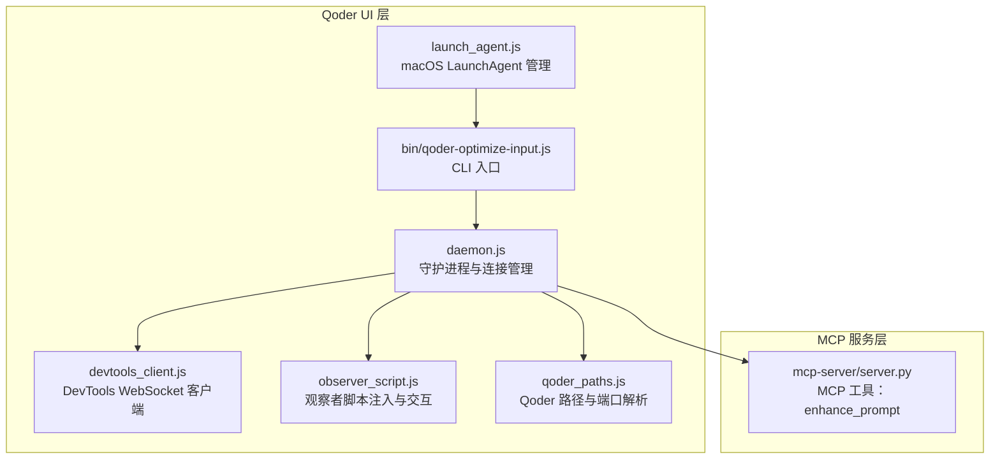
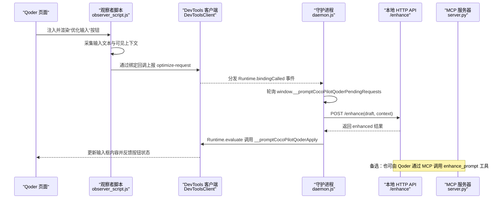
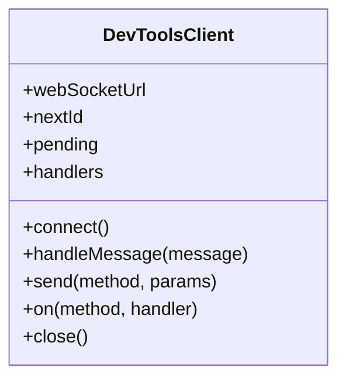
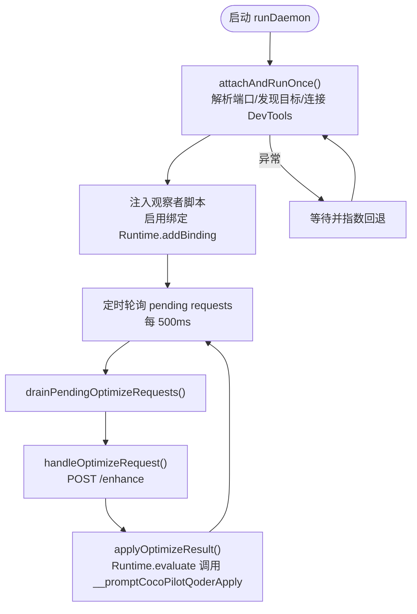
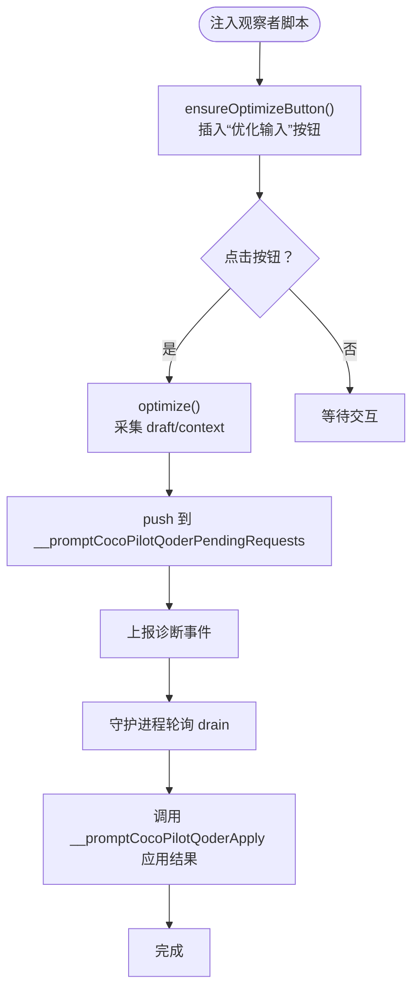

# Qoder IDE 集成

<cite>
**本文引用的文件**
- [README.md](file://README.md)
- [docs/qoder-integration.md](file://docs/qoder-integration.md)
- [docs/TECH_SCHEME.md](file://docs/TECH_SCHEME.md)
- [docs/install.md](file://docs/install.md)
- [package.json](file://package.json)
- [qoder-ui/src/daemon.js](file://qoder-ui/src/daemon.js)
- [qoder-ui/src/devtools_client.js](file://qoder-ui/src/devtools_client.js)
- [qoder-ui/src/observer_script.js](file://qoder-ui/src/observer_script.js)
- [qoder-ui/src/qoder_paths.js](file://qoder-ui/src/qoder_paths.js)
- [qoder-ui/src/launch_agent.js](file://qoder-ui/src/launch_agent.js)
- [qoder-ui/bin/qoder-optimize-input.js](file://qoder-ui/bin/qoder-optimize-input.js)
- [qoder-ui/test/daemon.test.js](file://qoder-ui/test/daemon.test.js)
- [qoder-ui/test/observer_script.test.js](file://qoder-ui/test/observer_script.test.js)
- [mcp-server/server.py](file://mcp-server/server.py)
</cite>

## 目录
1. [简介](#简介)
2. [项目结构](#项目结构)
3. [核心组件](#核心组件)
4. [架构总览](#架构总览)
5. [详细组件分析](#详细组件分析)
6. [依赖关系分析](#依赖关系分析)
7. [性能考量](#性能考量)
8. [故障排除指南](#故障排除指南)
9. [结论](#结论)
10. [附录](#附录)

## 简介
本文件面向在 Qoder IDE 中集成 PromptCocoPilot 的开发者，系统性说明如何将增强提示词能力嵌入 Qoder 的开发环境。重点覆盖以下方面：
- DevTools 客户端的实现原理与事件处理机制
- daemon.js 的 WebSocket 连接管理（建立、心跳与自动重连）
- observer_script.js 的 DOM 监听与请求队列管理、结果应用与用户交互
- 完整集成步骤：DevTools 端口发现、WebSocket 连接配置、观察者脚本注入
- Qoder 配置路径的自动发现机制与环境变量处理
- 故障排除：连接问题诊断、权限配置与性能优化建议

## 项目结构
该仓库采用按功能域划分的目录结构，其中与 Qoder 集成最相关的是 qoder-ui 子树与 mcp-server。整体组织如下：
- qoder-ui：包含 DevTools 客户端、观察者脚本、守护进程与启动代理等前端注入与连接管理逻辑
- mcp-server：提供增强提示词的 MCP 工具实现，供 Qoder 通过 MCP 协议调用
- docs：技术方案与 Qoder 集成说明
- package.json：脚本入口，提供安装/卸载 LaunchAgent 与运行优化输入脚本的能力



图表来源
- [qoder-ui/src/daemon.js:1-165](file://qoder-ui/src/daemon.js#L1-L165)
- [qoder-ui/src/devtools_client.js:1-47](file://qoder-ui/src/devtools_client.js#L1-L47)
- [qoder-ui/src/observer_script.js:1-179](file://qoder-ui/src/observer_script.js#L1-L179)
- [qoder-ui/src/qoder_paths.js:1-21](file://qoder-ui/src/qoder_paths.js#L1-L21)
- [qoder-ui/src/launch_agent.js:1-90](file://qoder-ui/src/launch_agent.js#L1-L90)
- [qoder-ui/bin/qoder-optimize-input.js:1-28](file://qoder-ui/bin/qoder-optimize-input.js#L1-L28)
- [mcp-server/server.py:1-232](file://mcp-server/server.py#L1-L232)

章节来源
- [README.md:77-108](file://README.md#L77-L108)
- [docs/qoder-integration.md:15-41](file://docs/qoder-integration.md#L15-L41)
- [package.json:6-11](file://package.json#L6-L11)

## 核心组件
- DevTools 客户端（DevToolsClient）：封装 WebSocket 连接、消息编解码、请求-响应配对与事件订阅
- 守护进程（daemon.js）：负责发现 Qoder DevTools 端口、选择目标页面、注入观察者脚本、轮询待处理请求并调用本地 HTTP API 获取增强结果
- 观察者脚本（observer_script.js）：在 Qoder 页面内注入“优化输入”按钮，采集可见上下文，收集用户输入，将请求推入全局队列并通过绑定回调上报
- Qoder 路径解析（qoder_paths.js）：解析 Qoder 支持目录与 DevToolsActivePort 文件，提取调试端口
- LaunchAgent（launch_agent.js）：在 macOS 上以持久方式运行守护进程，设置日志与环境变量
- CLI 入口（bin/qoder-optimize-input.js）：提供安装/卸载 LaunchAgent 与直接运行守护进程的命令
- MCP 服务器（mcp-server/server.py）：提供增强提示词工具，供 Qoder 通过 MCP 协议调用

章节来源
- [qoder-ui/src/devtools_client.js:1-47](file://qoder-ui/src/devtools_client.js#L1-L47)
- [qoder-ui/src/daemon.js:1-165](file://qoder-ui/src/daemon.js#L1-L165)
- [qoder-ui/src/observer_script.js:1-179](file://qoder-ui/src/observer_script.js#L1-L179)
- [qoder-ui/src/qoder_paths.js:1-21](file://qoder-ui/src/qoder_paths.js#L1-L21)
- [qoder-ui/src/launch_agent.js:1-90](file://qoder-ui/src/launch_agent.js#L1-L90)
- [qoder-ui/bin/qoder-optimize-input.js:1-28](file://qoder-ui/bin/qoder-optimize-input.js#L1-L28)
- [mcp-server/server.py:1-232](file://mcp-server/server.py#L1-L232)

## 架构总览
下图展示了从 Qoder 页面到本地增强服务的整体链路，以及各组件之间的交互关系。



图表来源
- [qoder-ui/src/observer_script.js:1-179](file://qoder-ui/src/observer_script.js#L1-L179)
- [qoder-ui/src/devtools_client.js:1-47](file://qoder-ui/src/devtools_client.js#L1-L47)
- [qoder-ui/src/daemon.js:1-165](file://qoder-ui/src/daemon.js#L1-L165)
- [mcp-server/server.py:1-232](file://mcp-server/server.py#L1-L232)

## 详细组件分析

### DevTools 客户端（DevToolsClient）
- 连接管理：构造函数保存 WebSocket 地址；connect() 建立连接并注册消息处理器；on() 注册事件监听；send() 发送消息并维护 id->Promise 映射；close() 关闭连接
- 消息分发：handleMessage() 根据 id 解析响应或分派到事件监听器
- 用途：在 daemon.js 中用于与 Qoder DevTools 协议通信，启用绑定、注入脚本、轮询请求与应用结果



图表来源
- [qoder-ui/src/devtools_client.js:1-47](file://qoder-ui/src/devtools_client.js#L1-L47)

章节来源
- [qoder-ui/src/devtools_client.js:1-47](file://qoder-ui/src/devtools_client.js#L1-L47)

### 守护进程（daemon.js）
- 目标发现：通过 DevTools 端口列出 targets，优先匹配 agents 窗口，否则回退到 workbench 页面
- 端口解析：优先使用环境变量 QODER_DEVTOOLS_PORT；否则读取 DevToolsActivePort 文件首行作为端口
- 连接与注入：建立 DevToolsClient 连接，启用 Runtime、添加绑定、注入观察者脚本（两种方式：onNewDocument 与即时 evaluate）
- 请求轮询：每 500ms 从页面读取 window.__promptCocoPilotQoderPendingRequests，过滤 optimize-request 并处理
- 结果应用：调用本地 HTTP API 获取增强结果，通过 Runtime.evaluate 调用窗口上的 __promptCocoPilotQoderApply 应用结果
- 自动重连：runDaemon 循环尝试 attachAndRunOnce，断开后指数回退延迟（上限 15 秒）



图表来源
- [qoder-ui/src/daemon.js:1-165](file://qoder-ui/src/daemon.js#L1-L165)

章节来源
- [qoder-ui/src/daemon.js:38-80](file://qoder-ui/src/daemon.js#L38-L80)
- [qoder-ui/src/daemon.js:82-98](file://qoder-ui/src/daemon.js#L82-L98)
- [qoder-ui/src/daemon.js:100-133](file://qoder-ui/src/daemon.js#L100-L133)
- [qoder-ui/src/daemon.js:135-165](file://qoder-ui/src/daemon.js#L135-L165)

### 观察者脚本（observer_script.js）
- 注入策略：生成带版本号的自执行脚本，确保重复注入时替换旧版本；在 Qoder 的“Prompt Enhance”按钮旁插入“优化输入”按钮
- DOM 采集：inputElement/inputText 采集输入框内容；visibleContext 截取页面可见文本作为上下文
- 请求队列：将请求对象 push 到 window.__promptCocoPilotQoderPendingRequests，并上报诊断事件
- 结果应用：__promptCocoPilotQoderApply 接收 requestId 与 payload，成功则写回输入框并更新按钮文案，失败则显示错误文案
- 用户交互：按钮点击触发 optimize 流程，包含忙态、错误提示与恢复文案



图表来源
- [qoder-ui/src/observer_script.js:1-179](file://qoder-ui/src/observer_script.js#L1-L179)

章节来源
- [qoder-ui/src/observer_script.js:1-179](file://qoder-ui/src/observer_script.js#L1-L179)

### Qoder 路径与端口解析（qoder_paths.js）
- getQoderPaths：解析 Qoder 支持目录，默认从环境变量 QODER_SUPPORT_DIR 或用户主目录下的 Application Support/Qoder
- readDevToolsPort：从 DevToolsActivePort 文件首行读取端口，校验为正整数

章节来源
- [qoder-ui/src/qoder_paths.js:1-21](file://qoder-ui/src/qoder_paths.js#L1-L21)

### LaunchAgent（launch_agent.js）
- 路径与配置：生成 LaunchAgent plist，包含程序参数、环境变量（如 QODER_SUPPORT_DIR）、日志路径
- 安装/卸载：通过 launchctl bootout/bootstrap/enable 管理加载状态
- 作用：在系统层面保持守护进程常驻，自动跟随 Qoder 启动

章节来源
- [qoder-ui/src/launch_agent.js:1-90](file://qoder-ui/src/launch_agent.js#L1-L90)

### CLI 入口（bin/qoder-optimize-input.js）
- install-agent/uninstall-agent：调用 launch_agent.js 安装/卸载 LaunchAgent
- runDaemon：直接运行守护进程

章节来源
- [qoder-ui/bin/qoder-optimize-input.js:1-28](file://qoder-ui/bin/qoder-optimize-input.js#L1-L28)

### MCP 服务器（mcp-server/server.py）
- 工具注册：tools/list 返回 enhance_prompt 工具定义，支持 draft、context、结构化上下文字段与结构化输出开关
- 工具调用：tools/call 调用 handle_enhance_prompt_tool，组装上下文并调用核心增强逻辑
- 输出：返回纯文本增强结果或结构化 JSON（可选）

章节来源
- [mcp-server/server.py:49-81](file://mcp-server/server.py#L49-L81)
- [mcp-server/server.py:108-229](file://mcp-server/server.py#L108-L229)

## 依赖关系分析
- 守护进程依赖 DevTools 客户端与观察者脚本，通过 DevTools 协议与页面交互
- 观察者脚本依赖页面 DOM 结构与绑定回调，向守护进程上报请求
- 守护进程依赖本地 HTTP API（/enhance）获取增强结果，亦可由 Qoder 通过 MCP 工具调用
- LaunchAgent 为守护进程提供系统级生命周期保障
- Qoder 路径解析为 DevTools 端口发现提供基础

```mermaid
graph LR
LA["launch_agent.js"] --> BIN["bin/qoder-optimize-input.js"]
BIN --> DA["daemon.js"]
DA --> DTC["devtools_client.js"]
DA --> OBS["observer_script.js"]
DA --> API["本地 HTTP API /enhance"]
DA --> PATHS["qoder_paths.js"]
Q["Qoder 页面"] <- --> OBS
DTC <- --> Q
API -.-> MCPS["mcp-server/server.py"]
```

图表来源
- [qoder-ui/src/launch_agent.js:1-90](file://qoder-ui/src/launch_agent.js#L1-L90)
- [qoder-ui/bin/qoder-optimize-input.js:1-28](file://qoder-ui/bin/qoder-optimize-input.js#L1-L28)
- [qoder-ui/src/daemon.js:1-165](file://qoder-ui/src/daemon.js#L1-L165)
- [qoder-ui/src/devtools_client.js:1-47](file://qoder-ui/src/devtools_client.js#L1-L47)
- [qoder-ui/src/observer_script.js:1-179](file://qoder-ui/src/observer_script.js#L1-L179)
- [qoder-ui/src/qoder_paths.js:1-21](file://qoder-ui/src/qoder_paths.js#L1-L21)
- [mcp-server/server.py:1-232](file://mcp-server/server.py#L1-L232)

章节来源
- [package.json:6-11](file://package.json#L6-L11)

## 性能考量
- 轮询频率：守护进程每 500ms 轮询一次待处理请求，平衡实时性与资源占用
- 连接重试：断线后指数回退（最大 15 秒），避免频繁重连造成压力
- 请求批处理：通过一次性读取 window.__promptCocoPilotQoderPendingRequests，减少多次跨协议往返
- 本地 API：/enhance 仅在需要时调用，避免不必要的网络开销
- 观察者脚本：按钮与样式注入带版本控制，避免重复注入带来的内存与渲染负担

## 故障排除指南
- DevTools 端口无法发现
  - 检查 QODER_DEVTOOLS_PORT 环境变量是否设置为正整数
  - 确认 DevToolsActivePort 文件存在且首行可解析为端口
  - 若端口无效，守护进程会抛出异常并重试
- 页面未注入观察者脚本
  - 确认已成功调用 Page.addScriptToEvaluateOnNewDocument 与 Runtime.evaluate 注入
  - 检查绑定名称一致（BINDING_NAME）与页面 URL 是否匹配 agents 窗口或 workbench
- 请求未被处理
  - 检查 window.__promptCocoPilotQoderPendingRequests 是否正确 push 请求对象
  - 确认守护进程轮询逻辑正常执行
- 本地 HTTP API 不可用
  - 确认本地 HTTP 服务已启动并监听 127.0.0.1:8765
  - 检查 /enhance 接口返回 JSON 结构与 HTTP 状态码
- MCP 工具不可用
  - 确认 Qoder 已正确加载 mcp-server/server.py 并注册 enhance_prompt 工具
  - 检查 MCP 配置文件位置与内容（~/.qoder/mcp.json 或插件目录）
- 权限与日志
  - macOS 上可通过 LaunchAgent 日志定位问题：StandardOutPath/StandardErrorPath
  - 确保 QODER_SUPPORT_DIR 指向正确的 Qoder 支持目录
- 性能优化
  - 减少不必要的轮询频率（谨慎调整轮询间隔）
  - 控制可见上下文大小，避免过长 context 影响响应时间
  - 使用结构化上下文字段，减少冗余拼接

章节来源
- [qoder-ui/src/daemon.js:44-50](file://qoder-ui/src/daemon.js#L44-L50)
- [qoder-ui/src/qoder_paths.js:13-20](file://qoder-ui/src/qoder_paths.js#L13-L20)
- [docs/install.md:43-53](file://docs/install.md#L43-L53)
- [docs/qoder-integration.md:15-41](file://docs/qoder-integration.md#L15-L41)
- [qoder-ui/src/launch_agent.js:50-56](file://qoder-ui/src/launch_agent.js#L50-L56)

## 结论
通过 DevTools 协议与观察者脚本注入，PromptCocoPilot 能够在 Qoder 中无缝集成“优化输入”能力。守护进程负责连接管理、请求轮询与结果应用，同时提供自动重连与指数回退机制。配合本地 HTTP API 与 MCP 工具，用户可以在 Qoder 中获得上下文感知的提示词增强体验。借助 LaunchAgent，该能力可在系统层面稳定运行，提升开发效率与一致性。

## 附录

### 集成步骤（DevTools 端口发现、WebSocket 连接、观察者脚本注入）
- 确认 Qoder 支持目录与 DevToolsActivePort 文件存在
- 设置 QODER_DEVTOOLS_PORT 或读取 DevToolsActivePort 获取端口
- 通过 DevToolsClient 连接目标页面（agents 窗口或 workbench）
- 注入观察者脚本（onNewDocument 与即时 evaluate 两种方式）
- 启动守护进程循环，轮询并处理 optimize-request

章节来源
- [qoder-ui/src/daemon.js:44-80](file://qoder-ui/src/daemon.js#L44-L80)
- [qoder-ui/src/qoder_paths.js:3-11](file://qoder-ui/src/qoder_paths.js#L3-L11)

### Qoder 配置路径与环境变量
- QODER_SUPPORT_DIR：Qoder 支持目录（默认 ~/Library/Application Support/Qoder）
- DevToolsActivePort：包含 DevTools 端口的文件
- QODER_DEVTOOLS_PORT：可选的强制端口覆盖

章节来源
- [qoder-ui/src/qoder_paths.js:3-11](file://qoder-ui/src/qoder_paths.js#L3-L11)
- [qoder-ui/src/launch_agent.js:18-19](file://qoder-ui/src/launch_agent.js#L18-L19)

### DevTools 事件与消息格式
- 事件类型
  - Runtime.bindingCalled：来自观察者脚本的绑定回调，携带 payload（包含 type、requestId、draft、context、beforeLength 等）
- 消息格式
  - DevToolsClient.send(method, params)：发送 JSON-RPC 风格消息，带 id 与响应解析
  - parseBindingPayload：解析绑定回调中的 payload，过滤非目标绑定

章节来源
- [qoder-ui/src/daemon.js:25-36](file://qoder-ui/src/daemon.js#L25-L36)
- [qoder-ui/src/devtools_client.js:29-35](file://qoder-ui/src/devtools_client.js#L29-L35)

### 观察者脚本关键行为
- 注入按钮与样式，确保唯一性与版本控制
- 采集输入文本与可见上下文，构建请求对象
- 将请求 push 至全局队列并通过绑定回调上报
- 通过 __promptCocoPilotQoderApply 应用增强结果并更新 UI

章节来源
- [qoder-ui/src/observer_script.js:94-107](file://qoder-ui/src/observer_script.js#L94-L107)
- [qoder-ui/src/observer_script.js:109-136](file://qoder-ui/src/observer_script.js#L109-L136)

### 测试验证点
- 目标页面选择：优先 agents 窗口，回退 workbench
- 绑定负载解析：仅处理目标绑定，解析 optimize-request 等字段
- 观察者脚本注入：包含按钮、输入元素选择器、绑定调用与请求队列

章节来源
- [qoder-ui/test/daemon.test.js:5-24](file://qoder-ui/test/daemon.test.js#L5-L24)
- [qoder-ui/test/daemon.test.js:26-47](file://qoder-ui/test/daemon.test.js#L26-L47)
- [qoder-ui/test/observer_script.test.js:5-15](file://qoder-ui/test/observer_script.test.js#L5-L15)
- [qoder-ui/test/observer_script.test.js:17-23](file://qoder-ui/test/observer_script.test.js#L17-L23)