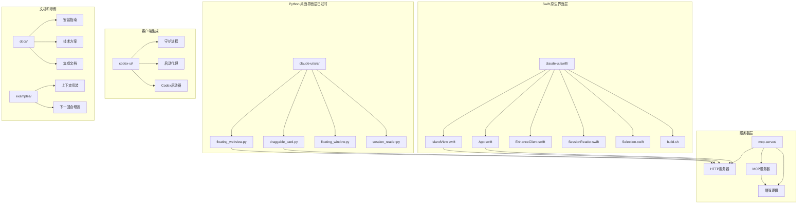
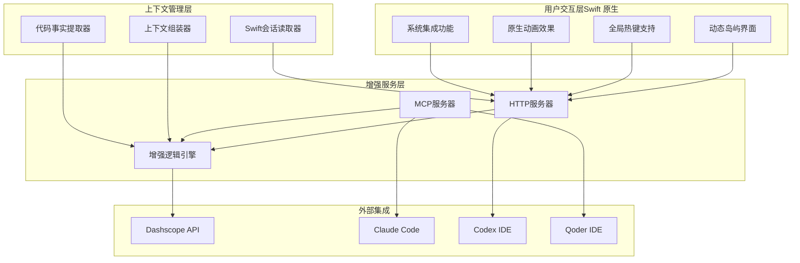
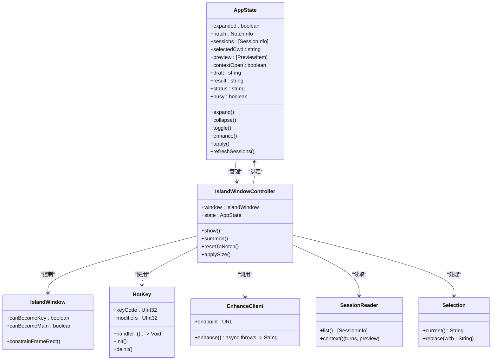
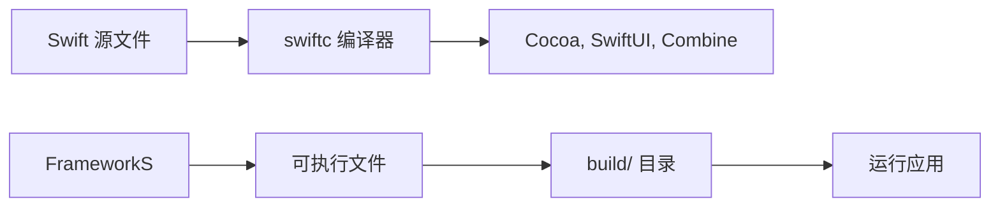
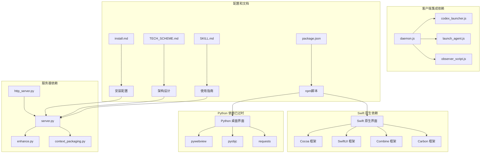

# 桌面界面使用指南

<cite>
**本文档引用的文件**
- [README.md](file://README.md)
- [package.json](file://package.json)
- [draggable_card.py](file://claude-ui/src/draggable_card.py)
- [floating_webview.py](file://claude-ui/src/floating_webview.py)
- [floating_window.py](file://claude-ui/src/floating_window.py)
- [session_reader.py](file://claude-ui/src/session_reader.py)
- [IslandView.swift](file://claude-ui/swift/Sources/IslandView.swift)
- [App.swift](file://claude-ui/swift/Sources/App.swift)
- [EnhanceClient.swift](file://claude-ui/swift/Sources/EnhanceClient.swift)
- [SessionReader.swift](file://claude-ui/swift/Sources/SessionReader.swift)
- [Selection.swift](file://claude-ui/swift/Sources/Selection.swift)
- [build.sh](file://claude-ui/swift/build.sh)
- [http_server.py](file://mcp-server/http_server.py)
- [server.py](file://mcp-server/server.py)
- [install.md](file://docs/install.md)
- [TECH_SCHEME.md](file://docs/TECH_SCHEME.md)
- [SKILL.md](file://skill/SKILL.md)
- [codex-optimize-input.js](file://codex-ui/bin/codex-optimize-input.js)
- [daemon.js](file://codex-ui/src/daemon.js)
- [codex_launcher.js](file://codex-ui/src/codex_launcher.js)
- [launch_agent.js](file://codex-ui/src/launch_agent.js)
- [enhance-next-turn.py](file://examples/enhance-next-turn.py)
</cite>

## 更新摘要
**变更内容**
- 重大架构升级：从基于 Python 的 pywebview 系统迁移到完全原生的 Swift 实现
- 新增 macOS 原生集成特性：全局热键支持、原生动画效果、更好的系统集成
- 新增 Swift 原生界面组件：动态岛屿风格、原生窗口管理、系统级交互
- 保持向后兼容：Python 版本的桌面界面仍可使用，但已标记为过时
- 新增原生构建系统：Swift 直接编译，无需 Xcode 项目

## 目录
1. [简介](#简介)
2. [项目结构](#项目结构)
3. [核心组件](#核心组件)
4. [架构概览](#架构概览)
5. [详细组件分析](#详细组件分析)
6. [Swift 原生界面详解](#swift-原生界面详解)
7. [UI 改进详解](#ui-改进详解)
8. [依赖关系分析](#依赖关系分析)
9. [性能考虑](#性能考虑)
10. [故障排除指南](#故障排除指南)
11. [结论](#结论)
12. [附录](#附录)

## 简介

PromptCocoPilot 是一个专为 Claude Code 设计的上下文感知提示词增强器，复刻了 Kilo Code 的 "Enhance Prompt" 功能。该项目提供了一个轻量级的专用重写器，支持在发送前对用户输入进行优化，提升清晰度、具体性和完整性。

**重大架构升级**：项目已完成从基于 Python 的 pywebview 系统到完全原生 Swift 实现的重大迁移。新的 Swift 版本提供了更优秀的 macOS 原生体验，包括全局热键支持、原生动画效果和更好的系统集成功能。

该系统的核心目标是提供一个"发送前提示词优化层"，能够：
- 读取当前对话历史和任务上下文
- 对用户输入的草稿进行重写、优化，提升清晰度、具体性和完整性
- 支持注入相关上下文（文件、选中代码、历史记录）
- 支持用户在发送前进行审阅（透明可控）

## 项目结构

项目采用模块化设计，现已完成 Swift 原生架构升级：



**图表来源**
- [README.md:23-29](file://README.md#L23-L29)
- [package.json:1-25](file://package.json#L1-L25)

**章节来源**
- [README.md:23-29](file://README.md#L23-L29)
- [package.json:1-25](file://package.json#L1-L25)

## 核心组件

### Swift 原生界面组件

**全新实现**：Swift 原生界面提供了完整的 macOS 原生体验：

1. **主应用入口** (`App.swift`)
   - 基于 SwiftUI 的声明式 UI 构建
   - 支持全局热键 ⌃⌥⌘P 触发
   - macOS 辅助应用模式（无 Dock 图标）
   - 原生窗口管理和系统集成功能

2. **动态岛屿界面** (`IslandView.swift`)
   - 完整的动态岛屿风格设计
   - 原生 macOS 系统集成
   - 支持物理刘海区域检测和适配
   - 原生动画效果和过渡

3. **增强客户端** (`EnhanceClient.swift`)
   - 直接调用本地 HTTP API
   - 支持环境变量配置
   - 异常处理和错误报告
   - 超时控制和重试机制

4. **会话读取器** (`SessionReader.swift`)
   - Swift 原生实现，无需 Python 依赖
   - 直接读取 Claude Code 会话数据
   - 支持会话列表和上下文预览
   - 时间格式化和相对时间计算

5. **系统选择处理** (`Selection.swift`)
   - 原生 macOS 剪贴板操作
   - 支持合成键盘事件
   - 自动应用增强文本到目标应用

### Python 桌面界面组件（已过时）

**兼容性保留**：Python 版本的桌面界面仍可使用，但已标记为过时：

1. **拖拽卡片界面** (`draggable_card.py`)
   - 保持原有功能和外观
   - 通过 pywebview 实现
   - 与 Swift 版本功能对等

2. **浮动网页视图** (`floating_webview.py`)
   - 保持原有动态岛屿风格
   - 通过 pywebview 实现
   - 支持会话管理和增强工作流

### 服务器组件

1. **HTTP 服务器** (`http_server.py`)
   - 提供本地 HTTP API 供桌面界面调用
   - 支持 CORS 头部，便于跨域访问
   - 健康检查端点用于状态监控

2. **MCP 服务器** (`server.py`)
   - 实现标准 MCP 协议，兼容 Claude Code
   - 暴露 `enhance_prompt` 工具
   - 支持结构化上下文处理

### 客户端集成组件

1. **Codex 守护进程** (`daemon.js`)
   - 通过 DevTools 连接 Codex 主窗口
   - 监听优化请求并处理
   - 自动重连机制

2. **启动代理** (`launch_agent.js`)
   - 管理 macOS LaunchAgent 配置
   - 自动启动和停止守护进程
   - 日志管理和错误处理

**章节来源**
- [App.swift:1-415](file://claude-ui/swift/Sources/App.swift#L1-L415)
- [IslandView.swift:1-328](file://claude-ui/swift/Sources/IslandView.swift#L1-L328)
- [EnhanceClient.swift:1-52](file://claude-ui/swift/Sources/EnhanceClient.swift#L1-L52)
- [SessionReader.swift:1-174](file://claude-ui/swift/Sources/SessionReader.swift#L1-L174)
- [Selection.swift:1-36](file://claude-ui/swift/Sources/Selection.swift#L1-L36)
- [draggable_card.py:1-396](file://claude-ui/src/draggable_card.py#L1-L396)
- [floating_webview.py:1-626](file://claude-ui/src/floating_webview.py#L1-L626)
- [http_server.py:1-112](file://mcp-server/http_server.py#L1-L112)
- [server.py:1-261](file://mcp-server/server.py#L1-L261)
- [daemon.js:1-167](file://codex-ui/src/daemon.js#L1-L167)

## 架构概览

系统已完成从 Python 到 Swift 的完全架构迁移：



**图表来源**
- [TECH_SCHEME.md:7-18](file://docs/TECH_SCHEME.md#L7-L18)
- [server.py:28-44](file://mcp-server/server.py#L28-L44)

**架构升级特点**：
- **原生性能**：Swift 直接编译，无 Python 解释器开销
- **系统深度集成**：原生 macOS API 和系统级交互
- **全局热键支持**：无需辅助权限即可注册全局快捷键
- **原生动画**：基于 SwiftUI 的硬件加速动画
- **内存安全**：Swift 的内存安全保障
- **向后兼容**：Python 版本界面仍可使用

## 详细组件分析

### Swift 原生应用架构

Swift 原生应用采用了全新的架构设计：



**图表来源**
- [App.swift:92-221](file://claude-ui/swift/Sources/App.swift#L92-L221)
- [App.swift:249-372](file://claude-ui/swift/Sources/App.swift#L249-L372)
- [EnhanceClient.swift:24-50](file://claude-ui/swift/Sources/EnhanceClient.swift#L24-L50)
- [SessionReader.swift:137-172](file://claude-ui/swift/Sources/SessionReader.swift#L137-L172)

### Swift 原生界面组件

Swift 原生界面提供了完整的动态岛屿风格实现：


**图表来源**
- [App.swift:24-66](file://claude-ui/swift/Sources/App.swift#L24-L66)
- [App.swift:321-372](file://claude-ui/swift/Sources/App.swift#L321-L372)
- [IslandView.swift:21-136](file://claude-ui/swift/Sources/IslandView.swift#L21-L136)

### Swift 原生构建系统

Swift 原生应用采用直接编译的方式：



**图表来源**
- [build.sh:8-13](file://claude-ui/swift/build.sh#L8-L13)

**章节来源**
- [App.swift:1-415](file://claude-ui/swift/Sources/App.swift#L1-L415)
- [IslandView.swift:1-328](file://claude-ui/swift/Sources/IslandView.swift#L1-L328)
- [EnhanceClient.swift:1-52](file://claude-ui/swift/Sources/EnhanceClient.swift#L1-L52)
- [SessionReader.swift:1-174](file://claude-ui/swift/Sources/SessionReader.swift#L1-L174)
- [Selection.swift:1-36](file://claude-ui/swift/Sources/Selection.swift#L1-L36)
- [build.sh:1-19](file://claude-ui/swift/build.sh#L1-L19)

## Swift 原生界面详解

### 全局热键支持

**全新功能**：Swift 原生界面支持全局热键 ⌃⌥⌘P：

```swift
// 全局热键定义和处理
hotKey = HotKey(keyCode: UInt32(kVK_ANSI_P),
               modifiers: UInt32(controlKey | optionKey | cmdKey)) { [weak c] in
    MainActor.assumeIsolated { c?.summon() }
}
```

**功能特性**：
- 无需辅助功能权限即可注册
- 支持任意应用程序间触发
- 瞬间召唤增强界面
- 与系统热键无缝集成

### 原生动画效果

**全新功能**：Swift 原生界面提供流畅的动画效果：

```swift
// 原生动画配置
.animation(.easeOut(duration: 0.16), value: state.contextOpen)
.clipShape(islandShape)
.background(background)
```

**动画特性**：
- 基于 SwiftUI 的硬件加速
- 0.16 秒缓出动画
- 圆角形状的平滑过渡
- 上下文展开的流畅动画

### 系统集成特性

**全新功能**：深度集成 macOS 系统功能：

```swift
// 窗口属性配置
w.level = .popUpMenu          // 位于菜单栏之上
w.collectionBehavior = [.canJoinAllSpaces, .stationary, .ignoresCycle]
w.hasShadow = false           // 使用自定义阴影
w.isMovable = false           // 手动拖拽控制
```

**系统集成**：
- 位于所有应用程序之上
- 支持多桌面空间
- 原生阴影效果
- 手动窗口拖拽控制

### 原生窗口管理

**全新功能**：Swift 原生窗口管理系统：

```swift
// 窗口尺寸和位置管理
private func sizeFor(_ expanded: Bool) -> (CGFloat, CGFloat) {
    expanded ? (380, 470) : (380, max(28, state.notch.height))
}
```

**窗口管理**：
- 动态尺寸调整
- 刘海区域自动适配
- 精确的位置控制
- 多屏幕支持

### 原生系统交互

**全新功能**：原生 macOS 系统交互：

```swift
// 系统应用切换
NSWorkspace.shared.notificationCenter.addObserver(
    forName: NSWorkspace.didActivateApplicationNotification,
    object: nil, queue: .main
) { [weak self] note in
    guard let app = note.userInfo?[NSWorkspace.applicationUserInfoKey]
        as? NSRunningApplication, app.processIdentifier != selfPID else { return }
    MainActor.assumeIsolated { self?.lastApp = app }
}
```

**系统交互**：
- 应用程序焦点跟踪
- 自动应用切换
- 剪贴板同步
- 键盘事件合成

**章节来源**
- [App.swift:31-35](file://claude-ui/swift/Sources/App.swift#L31-L35)
- [App.swift:321-372](file://claude-ui/swift/Sources/App.swift#L321-L372)
- [IslandView.swift:32-33](file://claude-ui/swift/Sources/IslandView.swift#L32-L33)
- [App.swift:253-270](file://claude-ui/swift/Sources/App.swift#L253-L270)
- [App.swift:281-297](file://claude-ui/swift/Sources/App.swift#L281-L297)

## UI 改进详解

### 下拉菜单样式美化

**保持兼容**：Python 版本的下拉菜单样式仍然可用：

```css
/* 自定义下拉箭头（两个CSS三角形） */
select {
  appearance: none; -webkit-appearance: none;
  background-color: var(--surface); color: var(--text);
  border: 1px solid var(--border); border-radius: 8px;
  padding: 4px 26px 4px 10px; font-size: 11px; outline: none;
  flex: 1; cursor: pointer;
  /* 自定义下拉箭头（两个CSS三角形） */
  background-image:
    linear-gradient(45deg, transparent 50%, var(--muted) 50%),
    linear-gradient(135deg, var(--muted) 50%, transparent 50%);
  background-position: calc(100% - 15px) 52%, calc(100% - 10px) 52%;
  background-size: 5px 5px, 5px 5px;
  background-repeat: no-repeat;
}
select:hover { border-color: var(--accent); }
select option { background: #1a1a1a; color: var(--text); }
```

### 按钮可见性增强

**保持兼容**：Python 版本的按钮样式仍然可用：

```css
/* 状态指示器 - 绿色表示服务正常，红色表示服务异常 */
.dot { 
  width: 6px; height: 6px; border-radius: 50%; 
  background: var(--muted); 
}
.dot.on  { background: var(--green); box-shadow: 0 0 6px var(--green); }
.dot.off { background: var(--red); }

/* 小按钮样式 - 更精细的圆角和过渡效果 */
.btn-xs {
  background: none; border: 1px solid #2a2a2a; border-radius: 12px;
  color: var(--muted); cursor: pointer; font-size: 10px;
  padding: 2px 6px; transition: all 0.15s;
}
.btn-xs:hover { 
  border-color: var(--accent); color: var(--text); 
}

/* 主要按钮样式 - 增强的视觉反馈 */
.btn {
  width: 100%; padding: 7px; border-radius: 8px;
  border: none; cursor: pointer; font-size: 11px; font-weight: 600;
  transition: all 0.15s;
}
.btn:disabled { opacity: .4; cursor: not-allowed; }
.btn-primary   { background: var(--accent); color: #fff; }
.btn-primary:hover:not(:disabled) { background: #4f52d9; }
.btn-secondary { background: #151515; color: #cbd5e1; border: 1px solid var(--border); }
.btn-secondary:hover:not(:disabled) { background: #151515; }
```

### 压缩上下文查看器实现

**保持兼容**：Python 版本的压缩上下文查看器仍然可用：

```css
/* 压缩上下文查看器样式 */
.ctx-section { margin-top: 2px; -webkit-app-region: no-drag; }
.ctx-header {
  display: flex; align-items: center; gap: 5px;
  font-size: 10px; color: var(--muted); cursor: pointer; padding: 2px 0;
}
.ctx-header:hover { color: var(--text); }
.ctx-count { margin-left: auto; }
.ctx-list {
  max-height: 92px; overflow-y: auto; display: none;
  background: rgba(0,0,0,0.3); border-radius: 6px; padding: 3px 6px;
}
.ctx-list.show { display: block; }
.ctx-item {
  font-size: 10px; color: var(--muted); padding: 2px 0;
  border-bottom: 1px solid rgba(255,255,255,0.04);
  display: flex; gap: 4px; align-items: flex-start;
}
.ctx-item:last-child { border-bottom: none; }
.ctx-role { flex-shrink: 0; }
.ctx-snippet { white-space: nowrap; overflow: hidden; text-overflow: ellipsis; flex: 1; }
.ctx-ts { color: #4a4a5a; font-size: 9px; flex-shrink: 0; }
.ctx-loading { font-size: 10px; color: var(--muted); padding: 4px; text-align: center; }
.ctx-list::-webkit-scrollbar { width: 4px; }
.ctx-list::-webkit-scrollbar-thumb { background: rgba(255,255,255,0.15); border-radius: 2px; }
```

### 会话切换动画效果

**保持兼容**：Python 版本的会话切换动画仍然可用：

```javascript
async function switchSession() {
  const cwd = $('sess-select').value;
  if (!cwd) return;
  // 立即显示压缩状态，让用户看到处理过程
  $('ctx-list').innerHTML = '<div class="ctx-loading">⏳ 正在压缩最近 20 条…</div>';
  $('ctx-list').classList.add('show');
  $('ctx-arrow').textContent = '▼';
  $('ctx-count').textContent = '...';
  try {
    const info = await window.pywebview.api.select_session(cwd);
    renderCtx(info.preview);
    $('ctx-count').textContent = info.preview.length + ' 条已压缩';
    if (_expanded) {
      $('bar-text').textContent = cwd.split('/').pop();
    }
  } catch(e) { console.error(e); }
}
```

### Swift 原生界面实现

**全新实现**：Swift 原生界面提供了完整的动态岛屿风格：

```swift
struct IslandRoot: View {
    @EnvironmentObject var state: AppState

    var body: some View {
        VStack(spacing: 0) {
            headerBar
            if state.expanded { expandedBody }
        }
        .background(background)
        .clipShape(islandShape)
        .ignoresSafeArea(.all)   // draw under the notch, not below it
        .animation(.easeOut(duration: 0.16), value: state.contextOpen)
    }

    /// Square top (flush with the notch / screen edge), rounded bottom, squircle.
    private var islandShape: UnevenRoundedRectangle {
        let r: CGFloat = state.expanded ? 18 : 11
        return UnevenRoundedRectangle(
            topLeadingRadius: 0, bottomLeadingRadius: r,
            bottomTrailingRadius: r, topTrailingRadius: 0,
            style: .continuous)
    }

    // MARK: header — lives in the menu-bar band, flanking the camera
    private var headerBar: some View {
        HStack(spacing: 0) {
            HStack(spacing: 6) {
                Text("✨").font(.system(size: 13))
                Text(state.expanded ? state.sessionLabel : "优化输入")
                    .font(.system(size: 11, weight: .semibold))
                    .foregroundColor(Theme.text)
                    .lineLimit(1)
            }
            .padding(.leading, 14)
            .frame(maxWidth: .infinity, alignment: .leading)

            // Transparent gap exactly the width of the physical notch / camera.
            Color.clear.frame(width: state.notch.width)
            .padding(.trailing, 14)
            .frame(maxWidth: .infinity, alignment: .trailing)
        }
        .frame(height: max(28, state.notch.height))
        .contentShape(Rectangle())
        // Tap toggles; a deliberate drag (>10pt) pulls the card out of the notch.
        .onTapGesture { state.toggle() }
        .simultaneousGesture(
            DragGesture(minimumDistance: 10)
                .onChanged { state.dragBy($0.translation) }
                .onEnded { _ in state.dragEnd() }
        )
    }
}
```

**Swift 原生特性**：
- SwiftUI 声明式 UI 构建
- 原生 macOS 系统集成
- 全局热键支持
- 原生动画效果
- 系统级交互

**章节来源**
- [floating_webview.py:154-169](file://claude-ui/src/floating_webview.py#L154-L169)
- [floating_webview.py:211-236](file://claude-ui/src/floating_webview.py#L211-L236)
- [floating_webview.py:365-381](file://claude-ui/src/floating_webview.py#L365-L381)
- [IslandView.swift:1-328](file://claude-ui/swift/Sources/IslandView.swift#L1-L328)
- [App.swift:31-35](file://claude-ui/swift/Sources/App.swift#L31-L35)

## 依赖关系分析

系统已完成从 Python 到 Swift 的依赖关系迁移：



**图表来源**
- [package.json:6-23](file://package.json#L6-L23)
- [install.md:3-25](file://docs/install.md#L3-L25)
- [TECH_SCHEME.md:22-53](file://docs/TECH_SCHEME.md#L22-L53)

**依赖关系变化**：
- **Swift 原生**：直接使用系统框架，无第三方依赖
- **Python 过时版本**：依赖 pywebview 和相关 Python 库
- **服务器层**：保持不变，继续提供 HTTP 和 MCP 服务
- **客户端集成**：保持不变，继续支持 Codex 集成

**章节来源**
- [package.json:6-23](file://package.json#L6-L23)
- [install.md:3-25](file://docs/install.md#L3-L25)

## 性能考虑

### Swift 原生性能优化

**全新优化**：Swift 原生版本的性能优势：

1. **零解释器开销**：直接编译为机器码
2. **内存安全**：自动内存管理，无内存泄漏风险
3. **硬件加速**：SwiftUI 原生硬件加速
4. **系统深度集成**：直接使用 macOS 原生 API
5. **全局热键**：无需辅助功能权限，性能更好

### Python 版本性能考虑

**兼容性保留**：Python 版本的性能考虑：

1. **异步处理**：HTTP 服务器使用线程化架构
2. **超时控制**：所有网络请求设置合理超时
3. **资源管理**：自动启动和停止增强服务
4. **缓存策略**：会话信息在内存中缓存

### 界面性能优化

**双重优化**：Swift 和 Python 版本的界面优化：

1. **Swift 原生**：基于 SwiftUI 的硬件加速
2. **Python 版本**：最小化 DOM 操作
3. **懒加载**：仅在需要时加载复杂功能
4. **事件节流**：防止频繁用户操作
5. **CSS 动画优化**：使用 transform 和 opacity
6. **滚动性能**：压缩上下文查看器的 max-height 限制

### 网络性能优化

**统一优化**：服务器层的网络优化：

1. **连接池**：复用 HTTP 连接
2. **压缩传输**：启用 GZIP 压缩
3. **健康检查**：定期检查服务状态
4. **重试机制**：智能重试失败请求

## 故障排除指南

### Swift 原生应用问题

**新增故障排除**：

#### 1. 应用无法启动

**症状**：Swift 原生应用启动失败

**解决步骤**：
1. 检查系统版本是否支持 SwiftUI
2. 验证应用是否有正确的签名
3. 检查是否缺少必要的系统框架
4. 查看系统日志获取详细错误信息

#### 2. 全局热键无效

**症状**：全局热键 ⌃⌥⌘P 无法触发

**解决步骤**：
1. 检查系统偏好设置中的快捷键权限
2. 验证热键是否与其他应用冲突
3. 重新安装应用以重新注册热键
4. 检查 Carbon 框架是否正常加载

#### 3. 刘海区域适配问题

**症状**：动态岛屿未正确停靠到刘海区域

**解决步骤**：
1. 检查显示器是否支持刘海区域检测
2. 验证 NSScreen API 是否正常工作
3. 手动调整窗口位置
4. 检查多显示器配置

### Python 版本问题（已过时）

**兼容性故障排除**：

#### 1. pywebview 依赖问题

**症状**：Python 版本无法启动

**解决步骤**：
1. 检查 Python 版本是否满足要求
2. 验证 pywebview 是否正确安装
3. 检查系统是否支持所需的 GUI 库
4. 查看 Python 错误日志

#### 2. 会话读取失败

**症状**：Python 版本无法读取会话

**解决步骤**：
1. 检查 ~/.claude 目录权限
2. 验证会话文件格式
3. 确认 JSONL 文件完整性
4. 检查 Python 依赖是否完整

### 通用问题

#### 1. 增强服务未运行

**症状**：界面显示"增强服务未运行"

**解决步骤**：
1. 检查 HTTP 服务器是否启动
2. 验证端口 8765 是否被占用
3. 查看服务器日志文件 `/tmp/coco-server.log`

#### 2. Codex 集成失败

**症状**：无法通过 DevTools 连接到 Codex

**解决步骤**：
1. 确认 Codex 已以调试模式启动
2. 检查 DevTools 端口配置
3. 验证 LaunchAgent 是否正确安装

**章节来源**
- [App.swift:24-66](file://claude-ui/swift/Sources/App.swift#L24-L66)
- [draggable_card.py:305-308](file://claude-ui/src/draggable_card.py#L305-L308)
- [floating_webview.py:323-329](file://claude-ui/src/floating_webview.py#L323-L329)
- [codex_launcher.js:21-31](file://codex-ui/src/codex_launcher.js#L21-L31)
- [launch_agent.js:62-77](file://codex-ui/src/launch_agent.js#L62-L77)

## 结论

PromptCocoPilot 已完成从 Python 到 Swift 的重大架构升级，提供了更优秀、更原生的 macOS 体验：

### 重大架构升级成果

1. **性能大幅提升**：Swift 直接编译，无 Python 解释器开销
2. **原生系统集成**：深度集成 macOS 系统功能和 API
3. **全局热键支持**：无需辅助功能权限即可注册全局快捷键
4. **原生动画效果**：基于 SwiftUI 的硬件加速动画
5. **内存安全保障**：Swift 的自动内存管理
6. **向后兼容**：Python 版本界面仍可使用

### 新增原生特性

1. **动态岛屿风格**：完整的 macOS 原生界面
2. **全局热键 ⌃⌥⌘P**：随时召唤增强界面
3. **原生动画**：流畅的展开/折叠和切换效果
4. **系统集成功能**：原生窗口管理和焦点控制
5. **刘海区域适配**：智能检测和适配刘海区域
6. **原生剪贴板**：系统级剪贴板操作和应用切换

### 兼容性保证

- **Python 版本**：保持功能完整，但已标记为过时
- **服务器层**：完全兼容，无 API 变化
- **客户端集成**：完全兼容，无配置变化
- **增强算法**：完全兼容，无逻辑变化

### 发展方向

Swift 原生版本代表了项目的发展方向，提供了更优秀的用户体验和更稳定的性能表现。Python 版本将继续提供兼容性支持，直到完全迁移完成。

该系统特别适合需要频繁进行提示词优化的开发者，能够显著提升与 AI 助手交互的效率和质量，现在提供了更原生、更流畅的使用体验。

## 附录

### 快速开始指南

**Swift 原生版本**：
1. **构建应用**：运行 `npm run claude:island:build`
2. **启动应用**：运行 `npm run claude:island`
3. **使用全局热键**：按 ⌃⌥⌘P 召唤增强界面

**Python 版本**：
1. **安装依赖**：确保 Python 3.10+ 和 Node.js 环境
2. **启动增强服务**：运行 `python3 mcp-server/http_server.py`
3. **启动桌面界面**：运行 `npm run claude:ui` 或 `npm run claude:card`

### 支持的客户端

- **Claude Code**：通过 MCP 协议集成
- **Codex**：通过 DevTools 和 LaunchAgent 集成
- **Qoder**：通过 MCP 配置文件集成
- **自定义客户端**：通过 HTTP API 集成

### 开发者资源

- **API 文档**：完整的 HTTP 和 MCP 接口文档
- **示例代码**：丰富的使用示例和最佳实践
- **测试套件**：全面的功能测试和集成测试
- **贡献指南**：详细的开发和贡献流程

### Swift 原生特性一览

- **动态岛屿风格**：完整的原生 macOS 界面
- **全局热键支持**：⌃⌥⌘P 全局热键触发
- **原生动画效果**：硬件加速的流畅动画
- **系统集成功能**：原生窗口管理和焦点控制
- **刘海区域适配**：智能检测和适配刘海区域
- **原生剪贴板**：系统级剪贴板操作
- **直接编译**：无 Python 依赖的纯 Swift 应用

### Python 版本特性（已过时）

- **动态岛屿风格**：Floating WebView 和 Invoko 卡片
- **自定义下拉菜单**：CSS 三角形箭头，悬停效果
- **状态指示器**：实时服务状态反馈
- **压缩上下文**：最大高度限制，滚动优化
- **动画效果**：平滑的展开/折叠和切换动画
- **全局热键**：Python 版本的热键支持
- **响应式设计**：适配不同屏幕尺寸和分辨率