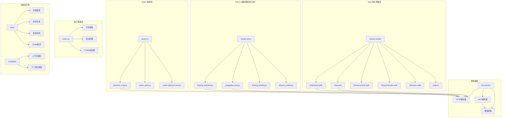
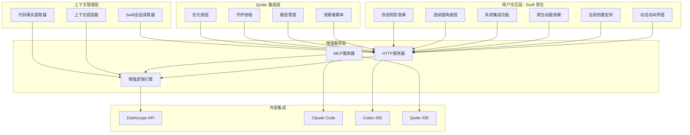
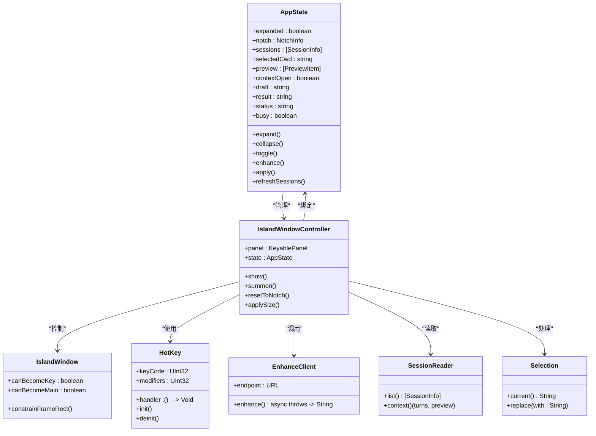
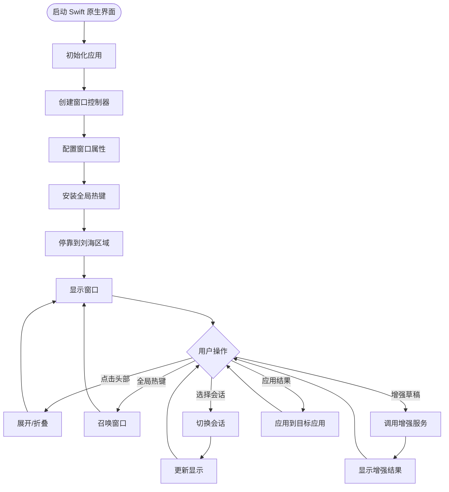
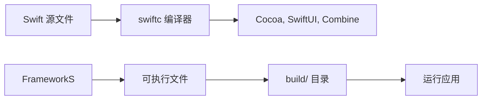
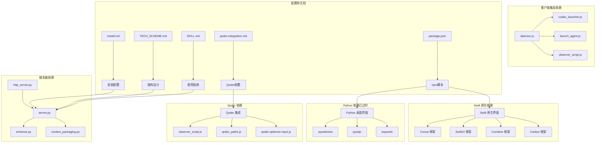

# 桌面界面使用指南

<cite>
**本文档引用的文件**
- [README.md](file://README.md)
- [package.json](file://package.json)
- [App.swift](file://claude-ui/swift/Sources/App.swift)
- [IslandView.swift](file://claude-ui/swift/Sources/IslandView.swift)
- [EnhanceClient.swift](file://claude-ui/swift/Sources/EnhanceClient.swift)
- [SessionReader.swift](file://claude-ui/swift/Sources/SessionReader.swift)
- [Selection.swift](file://claude-ui/swift/Sources/Selection.swift)
- [build.sh](file://claude-ui/swift/build.sh)
- [draggable_card.py](file://claude-ui/src/draggable_card.py)
- [floating_webview.py](file://claude-ui/src/floating_webview.py)
- [http_server.py](file://mcp-server/http_server.py)
- [server.py](file://mcp-server/server.py)
- [install.md](file://docs/install.md)
- [TECH_SCHEME.md](file://docs/TECH_SCHEME.md)
- [SKILL.md](file://skill/SKILL.md)
- [qoder-integration.md](file://docs/qoder-integration.md)
- [observer_script.js](file://qoder-ui/src/observer_script.js)
- [qoder_paths.js](file://qoder-ui/src/qoder_paths.js)
- [qoder-optimize-input.js](file://qoder-ui/bin/qoder-optimize-input.js)
</cite>

## 更新摘要
**变更内容**
- 新增 Qoder 代理的紫色徽章显示，支持 Qoder 会话识别
- 会话选择器界面增强，显示会话 ID 以帮助区分相似名称的会话
- 文本编辑器尺寸调整：草稿编辑器 76px，结果编辑器 100px
- 按钮样式改进：连续圆角半径 10px，改进阴影效果
- 上下文查看器按钮重命名为 '📂 压缩的上下文'
- 新增 Qoder 集成支持，包括 MCP 配置和 UI 按钮

## 目录
1. [简介](#简介)
2. [项目结构](#项目结构)
3. [核心组件](#核心组件)
4. [架构概览](#架构概览)
5. [详细组件分析](#详细组件分析)
6. [Swift 原生界面详解](#swift-原生界面详解)
7. [UI 改进详解](#ui-改进详解)
8. [Qoder 集成支持](#qoder-集成支持)
9. [依赖关系分析](#依赖关系分析)
10. [性能考虑](#性能考虑)
11. [故障排除指南](#故障排除指南)
12. [结论](#结论)
13. [附录](#附录)

## 简介

PromptCocoPilot 是一个专为 Claude Code 设计的上下文感知提示词增强器，复刻了 Kilo Code 的 "Enhance Prompt" 功能。该项目提供了一个轻量级的专用重写器，支持在发送前对用户输入进行优化，提升清晰度、具体性和完整性。

**重大架构升级**：项目已完成从基于 Python 的 pywebview 系统到完全原生 Swift 实现的重大迁移。新的 Swift 版本提供了更优秀的 macOS 原生体验，包括全局热键支持、原生动画效果和更好的系统集成功能。

**新增 Qoder 支持**：系统现已支持 Qoder AI 编程 IDE，提供完整的 MCP 集成和专用 UI 按钮。Qoder 会话现在可以在会话选择器中识别，带有独特的紫色徽章标识。

该系统的核心目标是提供一个"发送前提示词优化层"，能够：
- 读取当前对话历史和任务上下文
- 对用户输入的草稿进行重写、优化，提升清晰度、具体性和完整性
- 支持注入相关上下文（文件、选中代码、历史记录）
- 支持用户在发送前进行审阅（透明可控）
- **新增**：支持多代理会话管理，包括 Qoder 会话识别

## 项目结构

项目采用模块化设计，现已完成 Swift 原生架构升级和 Qoder 集成：



**图表来源**
- [README.md:23-29](file://README.md#L23-L29)
- [package.json:1-25](file://package.json#L1-L25)
- [qoder-integration.md:1-101](file://docs/qoder-integration.md#L1-L101)

**章节来源**
- [README.md:23-29](file://README.md#L23-L29)
- [package.json:1-25](file://package.json#L1-L25)
- [qoder-integration.md:1-101](file://docs/qoder-integration.md#L1-L101)

## 核心组件

### Swift 原生界面组件

**全新实现**：Swift 原生界面提供了完整的 macOS 原生体验：

1. **主应用入口** (`App.swift`)
   - 基于 SwiftUI 的声明式 UI 构建
   - 支持全局热键 ⌃⌥⌘P 触发
   - macOS 辅助应用模式（无 Dock 图标）
   - 原生窗口管理和系统集成功能

2. **动态岛屿界面** (`IslandView.swift`)
   - 完整的动态岛屿风格设计
   - 原生 macOS 系统集成
   - 支持物理刘海区域检测和适配
   - 原生动画效果和过渡
   - **新增**：连续圆角半径 10px 的按钮样式
   - **新增**：改进的阴影效果

3. **增强客户端** (`EnhanceClient.swift`)
   - 直接调用本地 HTTP API
   - 支持环境变量配置
   - 异常处理和错误报告
   - 超时控制和重试机制

4. **会话读取器** (`SessionReader.swift`)
   - Swift 原生实现，无需 Python 依赖
   - 直接读取 Claude Code、Codex 和 **新增** Qoder 会话数据
   - 支持会话列表和上下文预览
   - **新增**：会话 ID 显示功能
   - **新增**：多代理会话识别
   - 时间格式化和相对时间计算

5. **系统选择处理** (`Selection.swift`)
   - 原生 macOS 剪贴板操作
   - 支持合成键盘事件
   - 自动应用增强文本到目标应用

### Python 桌面界面组件（已过时）

**兼容性保留**：Python 版本的桌面界面仍可使用，但已标记为过时：

1. **拖拽卡片界面** (`draggable_card.py`)
   - 保持原有功能和外观
   - 通过 pywebview 实现
   - 与 Swift 版本功能对等

2. **浮动网页视图** (`floating_webview.py`)
   - 保持原有动态岛屿风格
   - 通过 pywebview 实现
   - 支持会话管理和增强工作流

### Qoder 集成组件

**全新实现**：Qoder AI 编程 IDE 的完整集成支持：

1. **观察者脚本** (`observer_script.js`)
   - 自动检测 Qoder 界面元素
   - 注入优化按钮到输入框旁边
   - 处理优化请求和响应
   - **新增**：支持 Qoder 专用的优化按钮样式

2. **路径管理** (`qoder_paths.js`)
   - 管理 Qoder 支持目录
   - 读取 DevTools 端口配置
   - 支持多平台路径解析

3. **守护进程** (`qoder-optimize-input.js`)
   - 管理 Qoder 优化服务的生命周期
   - 支持 LaunchAgent 安装和卸载
   - 自动启动和停止优化服务

### 服务器组件

1. **HTTP 服务器** (`http_server.py`)
   - 提供本地 HTTP API 供桌面界面调用
   - 支持 CORS 头部，便于跨域访问
   - 健康检查端点用于状态监控

2. **MCP 服务器** (`server.py`)
   - 实现标准 MCP 协议，兼容 Claude Code、Codex 和 **新增** Qoder
   - 暴露 `enhance_prompt` 工具
   - 支持结构化上下文处理

### 客户端集成组件

1. **Codex 守护进程** (`daemon.js`)
   - 通过 DevTools 连接 Codex 主窗口
   - 监听优化请求并处理
   - 自动重连机制

2. **启动代理** (`launch_agent.js`)
   - 管理 macOS LaunchAgent 配置
   - 自动启动和停止守护进程
   - 日志管理和错误处理

**章节来源**
- [App.swift:1-483](file://claude-ui/swift/Sources/App.swift#L1-L483)
- [IslandView.swift:1-412](file://claude-ui/swift/Sources/IslandView.swift#L1-L412)
- [EnhanceClient.swift:1-52](file://claude-ui/swift/Sources/EnhanceClient.swift#L1-L52)
- [SessionReader.swift:1-250](file://claude-ui/swift/Sources/SessionReader.swift#L1-L250)
- [Selection.swift:1-36](file://claude-ui/swift/Sources/Selection.swift#L1-L36)
- [draggable_card.py:1-396](file://claude-ui/src/draggable_card.py#L1-L396)
- [floating_webview.py:1-626](file://claude-ui/src/floating_webview.py#L1-L626)
- [observer_script.js:1-187](file://qoder-ui/src/observer_script.js#L1-L187)
- [qoder_paths.js:1-20](file://qoder-ui/src/qoder_paths.js#L1-L20)
- [qoder-optimize-input.js:1-27](file://qoder-ui/bin/qoder-optimize-input.js#L1-L27)
- [http_server.py:1-112](file://mcp-server/http_server.py#L1-L112)
- [server.py:1-261](file://mcp-server/server.py#L1-L261)

## 架构概览

系统已完成从 Python 到 Swift 的完全架构迁移，并新增 Qoder 集成：



**图表来源**
- [TECH_SCHEME.md:7-18](file://docs/TECH_SCHEME.md#L7-L18)
- [server.py:28-44](file://mcp-server/server.py#L28-L44)
- [qoder-integration.md:1-101](file://docs/qoder-integration.md#L1-L101)

**架构升级特点**：
- **原生性能**：Swift 直接编译，无 Python 解释器开销
- **系统深度集成**：原生 macOS API 和系统级交互
- **全局热键支持**：无需辅助功能权限即可注册全局快捷键
- **原生动画**：基于 SwiftUI 的硬件加速动画
- **内存安全**：Swift 的内存安全保障
- **向后兼容**：Python 版本界面仍可使用
- **多代理支持**：同时支持 Claude Code、Codex 和 Qoder
- **Qoder 集成**：完整的 MCP 配置和 UI 按钮支持

## 详细组件分析

### Swift 原生应用架构

Swift 原生应用采用了全新的架构设计：



**图表来源**
- [App.swift:92-221](file://claude-ui/swift/Sources/App.swift#L92-L221)
- [App.swift:249-372](file://claude-ui/swift/Sources/App.swift#L249-L372)
- [EnhanceClient.swift:24-50](file://claude-ui/swift/Sources/EnhanceClient.swift#L24-L50)
- [SessionReader.swift:137-172](file://claude-ui/swift/Sources/SessionReader.swift#L137-L172)

### Swift 原生界面组件

Swift 原生界面提供了完整的动态岛屿风格实现：



**图表来源**
- [App.swift:24-66](file://claude-ui/swift/Sources/App.swift#L24-L66)
- [App.swift:321-372](file://claude-ui/swift/Sources/App.swift#L321-L372)
- [IslandView.swift:21-136](file://claude-ui/swift/Sources/IslandView.swift#L21-L136)

### Swift 原生构建系统

Swift 原生应用采用直接编译的方式：



**图表来源**
- [build.sh:8-13](file://claude-ui/swift/build.sh#L8-L13)

**章节来源**
- [App.swift:1-483](file://claude-ui/swift/Sources/App.swift#L1-L483)
- [IslandView.swift:1-412](file://claude-ui/swift/Sources/IslandView.swift#L1-L412)
- [EnhanceClient.swift:1-52](file://claude-ui/swift/Sources/EnhanceClient.swift#L1-L52)
- [SessionReader.swift:1-250](file://claude-ui/swift/Sources/SessionReader.swift#L1-L250)
- [Selection.swift:1-36](file://claude-ui/swift/Sources/Selection.swift#L1-L36)
- [build.sh:1-19](file://claude-ui/swift/build.sh#L1-L19)

## Swift 原生界面详解

### 全局热键支持

**全新功能**：Swift 原生界面支持全局热键 ⌃⌥⌘P：

```swift
// 全局热键定义和处理
hotKey = HotKey(keyCode: UInt32(kVK_ANSI_P),
               modifiers: UInt32(controlKey | optionKey | cmdKey)) { [weak c] in
    MainActor.assumeIsolated { c?.summon() }
}
```

**功能特性**：
- 无需辅助功能权限即可注册
- 支持任意应用程序间触发
- 瞬间召唤增强界面
- 与系统热键无缝集成

### 原生动画效果

**全新功能**：Swift 原生界面提供流畅的动画效果：

```swift
// 原生动画配置
.animation(.easeOut(duration: 0.16), value: state.contextOpen)
.clipShape(islandShape)
.background(background)
```

**动画特性**：
- 基于 SwiftUI 的硬件加速
- 0.16 秒缓出动画
- 圆角形状的平滑过渡
- 上下文展开的流畅动画

### 系统集成特性

**全新功能**：深度集成 macOS 系统功能：

```swift
// 窗口属性配置
w.level = .popUpMenu          // 位于菜单栏之上
w.collectionBehavior = [.canJoinAllSpaces, .stationary, .ignoresCycle]
w.hasShadow = false           // 使用自定义阴影
w.isMovable = false           // 手动拖拽控制
```

**系统集成**：
- 位于所有应用程序之上
- 支持多桌面空间
- 原生阴影效果
- 手动窗口拖拽控制

### 原生窗口管理

**全新功能**：Swift 原生窗口管理系统：

```swift
// 窗口尺寸和位置管理
private func sizeFor(_ expanded: Bool) -> (CGFloat, CGFloat) {
    expanded ? (380, 470) : (380, max(28, state.notch.height))
}
```

**窗口管理**：
- 动态尺寸调整
- 刘海区域自动适配
- 精确的位置控制
- 多屏幕支持

### 原生系统交互

**全新功能**：原生 macOS 系统交互：

```swift
// 系统应用切换
NSWorkspace.shared.notificationCenter.addObserver(
    forName: NSWorkspace.didActivateApplicationNotification,
    object: nil, queue: .main
) { [weak self] note in
    guard let app = note.userInfo?[NSWorkspace.applicationUserInfoKey]
        as? NSRunningApplication, app.processIdentifier != selfPID else { return }
    MainActor.assumeIsolated { self?.lastApp = app }
}
```

**系统交互**：
- 应用程序焦点跟踪
- 自动应用切换
- 剪贴板同步
- 键盘事件合成

**章节来源**
- [App.swift:31-35](file://claude-ui/swift/Sources/App.swift#L31-L35)
- [App.swift:321-372](file://claude-ui/swift/Sources/App.swift#L321-L372)
- [IslandView.swift:32-33](file://claude-ui/swift/Sources/IslandView.swift#L32-L33)
- [App.swift:253-270](file://claude-ui/swift/Sources/App.swift#L253-L270)
- [App.swift:281-297](file://claude-ui/swift/Sources/App.swift#L281-L297)

## UI 改进详解

### Qoder 代理紫色徽章显示

**全新功能**：Qoder 会话现在带有独特的紫色徽章标识：

```swift
/// 小型彩色标签，显示会话属于哪个代理
private func agentBadge(_ agent: AgentKind) -> some View {
    let tint: Color
    switch agent {
    case .claude: tint = Color(red: 1.0, green: 0.72, blue: 0.38)   // 橙色
    case .codex:  tint = Color(red: 0.40, green: 0.85, blue: 0.60)  // 绿色
    case .qoder:  tint = Color(red: 0.70, green: 0.58, blue: 1.0)   // 紫色
    }
    return Text(agent.rawValue)
        .font(.system(size: 8, weight: .bold))
        .foregroundColor(tint)
        .padding(.horizontal, 5)
        .padding(.vertical, 2)
        .background(Capsule().fill(tint.opacity(0.16)))
}
```

**功能特性**：
- Qoder 会话显示紫色徽章
- Claude 会话显示橙色徽章
- Codex 会话显示绿色徽章
- 徽章采用胶囊形状设计
- 支持半透明背景效果

### 会话选择器界面增强

**全新功能**：会话选择器现在显示会话 ID 以帮助区分相似名称的会话：

```swift
var menuLabel: String {
    let busy = status == "busy" ? "🔴 " : ""
    return "\(busy)\(name) · \(pathTail) · \(ago) · \(messageCount)条 · \(sid)"
}
```

**显示内容**：
- 会话名称
- 路径尾部信息（帮助区分同名项目）
- 相对时间
- 消息数量
- **新增**：会话 ID（sid）

**会话行布局**：
```swift
HStack(spacing: 5) {
    agentBadge(s.agent)
    Text(s.name)
        .font(.system(size: 11, weight: .medium))
        .foregroundColor(Theme.text)
        .lineLimit(1)
}
HStack(spacing: 4) {
    Text("\(s.pathTail) · \(s.ago) · \(s.messageCount)条")
        .font(.system(size: 9))
        .foregroundColor(Theme.muted)
        .lineLimit(1)
    Text(s.sid)
        .font(.system(size: 8.5, design: .monospaced))
        .foregroundColor(Theme.muted.opacity(0.6))
}
```

### 文本编辑器尺寸调整

**全新功能**：文本编辑器尺寸已调整以优化用户体验：

```swift
// 草稿编辑器 - 76px 高度
editor(text: $state.draft, placeholder: "输入草稿...", height: 76, color: Theme.text)

// 结果编辑器 - 100px 高度  
editor(text: $state.result, placeholder: "增强结果将显示在此处...", height: 100, color: Theme.result)
```

**尺寸调整**：
- 草稿编辑器：从默认高度调整为 76px
- 结果编辑器：从默认高度调整为 100px
- 优化了内容显示和编辑体验

### 按钮样式改进

**全新功能**：按钮样式已进行全面改进：

```swift
private struct PillButton: ButtonStyle {
    enum Kind { case primary, secondary }
    let kind: Kind
    @Environment(\.isEnabled) private var enabled

    func makeBody(configuration: Configuration) -> some View {
        configuration.label
            .font(.system(size: 12.5, weight: .semibold))
            .foregroundColor(kind == .primary ? .white : Theme.accent)
            .padding(.vertical, 9)
            .frame(maxWidth: .infinity)
            .background(background(pressed: configuration.isPressed))
            .clipShape(RoundedRectangle(cornerRadius: 10, style: .continuous))
            .overlay(
                RoundedRectangle(cornerRadius: 10, style: .continuous)
                    .stroke(kind == .secondary ? Theme.accent.opacity(0.35) : Color.clear,
                            lineWidth: 1)
            )
            .shadow(color: kind == .primary ? Theme.accent.opacity(enabled ? 0.35 : 0) : .clear,
                    radius: 8, y: 3)
            .opacity(enabled ? 1 : 0.4)
            .scaleEffect(configuration.isPressed ? 0.985 : 1)
            .animation(.easeOut(duration: 0.1), value: configuration.isPressed)
    }
}
```

**改进特性**：
- 连续圆角半径：10px（统一圆角设计）
- 改进阴影效果：主按钮使用渐变阴影
- 响应式缩放：按下时轻微缩小 1.5%
- 平滑动画：0.1秒缓出动画
- 渐变背景：主按钮使用顶部到底部渐变

### 上下文查看器按钮重命名

**全新功能**：上下文查看器按钮已重命名为更直观的名称：

```swift
Button { state.toggleContext() } label: {
    HStack(spacing: 5) {
        Text("📂 压缩的上下文")
        Spacer()
        Text("\(state.contextCount) 条已压缩")
        Image(systemName: state.contextOpen ? "chevron.down" : "chevron.right")
            .font(.system(size: 8, weight: .bold))
    }
    .font(.system(size: 10))
    .foregroundColor(Theme.muted)
}
```

**重命名内容**：
- 原名称：上下文查看器
- 新名称：📂 压缩的上下文
- 图标：文件夹图标 📂
- 更直观的用户界面

### 原生系统交互

**全新功能**：原生 macOS 系统交互：

```swift
// 系统应用切换
NSWorkspace.shared.notificationCenter.addObserver(
    forName: NSWorkspace.didActivateApplicationNotification,
    object: nil, queue: .main
) { [weak self] note in
    guard let app = note.userInfo?[NSWorkspace.applicationUserInfoKey]
        as? NSRunningApplication, app.processIdentifier != selfPID else { return }
    MainActor.assumeIsolated { self?.lastApp = app }
}
```

**系统交互**：
- 应用程序焦点跟踪
- 自动应用切换
- 剪贴板同步
- 键盘事件合成

**章节来源**
- [IslandView.swift:207-221](file://claude-ui/swift/Sources/IslandView.swift#L207-L221)
- [IslandView.swift:225-291](file://claude-ui/swift/Sources/IslandView.swift#L225-L291)
- [IslandView.swift:295-345](file://claude-ui/swift/Sources/IslandView.swift#L295-L345)
- [IslandView.swift:373-395](file://claude-ui/swift/Sources/IslandView.swift#L373-L395)
- [IslandView.swift:409-446](file://claude-ui/swift/Sources/IslandView.swift#L409-L446)
- [SessionReader.swift:15-32](file://claude-ui/swift/Sources/SessionReader.swift#L15-L32)

## Qoder 集成支持

### Qoder MCP 配置

**全新功能**：Qoder AI 编程 IDE 的完整 MCP 集成：

```json
{
  "mcpServers": {
    "prompt-enhancer": {
      "command": "python3",
      "args": ["/Users/wy770/Desktop/PromptCocoPilot/mcp-server/server.py"],
      "env": {
        "DASHSCOPE_API_KEY": "sk-your-key"
      }
    }
  }
}
```

**配置特性**：
- 支持 Qoder 的 MCP 服务器配置
- 环境变量配置（API 密钥）
- 跨平台路径支持
- 自动重启机制

### Qoder UI 按钮集成

**全新功能**：Qoder 界面的专用优化按钮：

```javascript
function ensureOptimizeButton() {
    ensureOptimizeStyles();
    const enhanceButton = visiblePromptEnhanceButton();
    const input = inputElement();
    const anchor = enhanceButton || input;
    if (!anchor) return;
    const parent = anchor.parentElement;
    if (!parent) return;
    const existingButton = parent.querySelector('.qoder-optimize-input-button');
    if (existingButton?.dataset.promptCocoPilotVersion === version) return;
    existingButton?.remove();

    const button = document.createElement('button');
    button.type = 'button';
    button.className = 'qoder-optimize-input-button';
    button.dataset.promptCocoPilotVersion = version;
    button.setAttribute('aria-label', '优化输入');
    button.title = '优化输入';
    button.textContent = '优化输入';
    button.addEventListener('click', (event) => {
      event.preventDefault();
      event.stopPropagation();
      void optimize(button);
    });
    if (enhanceButton) {
      parent.insertBefore(button, enhanceButton);
    } else {
      parent.appendChild(button);
    }
  }
```

**按钮特性**：
- 专用类名：qoder-optimize-input-button
- 自动检测和插入
- 状态反馈（优化中/已优化/优化失败）
- 版本控制和清理机制

### Qoder 路径管理

**全新功能**：Qoder 支持目录和 DevTools 端口管理：

```javascript
export function getQoderPaths(homeDir = process.env.HOME) {
  const supportDir = process.env.QODER_SUPPORT_DIR ||
    path.join(homeDir, 'Library/Application Support/Qoder');

  return {
    supportDir,
    devToolsActivePort: path.join(supportDir, 'DevToolsActivePort')
  };
}

export function readDevToolsPort(content) {
  const firstLine = String(content || '').split(/\r?\n/)[0]?.trim();
  const port = Number(firstLine);
  if (!Number.isInteger(port) || port <= 0) {
    throw new Error('DevTools port was not found in DevToolsActivePort');
  }
  return port;
}
```

**功能特性**：
- 支持自定义 Qoder 支持目录
- 自动读取 DevTools 端口
- 跨平台路径解析
- 错误处理和验证

### Qoder 守护进程

**全新功能**：Qoder 优化服务的生命周期管理：

```javascript
async function main() {
  const command = process.argv[2];
  if (command === 'install-agent') {
    const paths = installLaunchAgent({ rootDir });
    console.log(`[prompt-coco-qoder] installed LaunchAgent at ${paths.plistPath}`);
    return;
  }
  if (command === 'uninstall-agent') {
    const paths = uninstallLaunchAgent({ rootDir });
    console.log(`[prompt-coco-qoder] removed LaunchAgent at ${paths.plistPath}`);
    return;
  }
  await runDaemon();
}
```

**守护进程特性**：
- 支持安装和卸载 LaunchAgent
- 自动启动和停止优化服务
- 日志记录和错误处理
- 跨平台支持

**章节来源**
- [qoder-integration.md:1-101](file://docs/qoder-integration.md#L1-L101)
- [observer_script.js:101-187](file://qoder-ui/src/observer_script.js#L101-L187)
- [qoder_paths.js:1-20](file://qoder-ui/src/qoder_paths.js#L1-20)
- [qoder-optimize-input.js:1-27](file://qoder-ui/bin/qoder-optimize-input.js#L1-L27)

## 依赖关系分析

系统已完成从 Python 到 Swift 的依赖关系迁移，并新增 Qoder 集成：



**图表来源**
- [package.json:6-23](file://package.json#L6-L23)
- [install.md:3-25](file://docs/install.md#L3-L25)
- [TECH_SCHEME.md:22-53](file://docs/TECH_SCHEME.md#L22-L53)
- [qoder-integration.md:1-101](file://docs/qoder-integration.md#L1-L101)

**依赖关系变化**：
- **Swift 原生**：直接使用系统框架，无第三方依赖
- **Python 过时版本**：依赖 pywebview 和相关 Python 库
- **Qoder 集成**：新增 JavaScript 和 Node.js 依赖
- **服务器层**：保持不变，继续提供 HTTP 和 MCP 服务
- **客户端集成**：保持不变，继续支持 Codex 集成

**章节来源**
- [package.json:6-23](file://package.json#L6-L23)
- [install.md:3-25](file://docs/install.md#L3-L25)
- [qoder-integration.md:1-101](file://docs/qoder-integration.md#L1-L101)

## 性能考虑

### Swift 原生性能优化

**全新优化**：Swift 原生版本的性能优势：

1. **零解释器开销**：直接编译为机器码
2. **内存安全**：自动内存管理，无内存泄漏风险
3. **硬件加速**：SwiftUI 原生硬件加速
4. **系统深度集成**：直接使用 macOS 原生 API
5. **全局热键**：无需辅助功能权限，性能更好
6. **连续圆角渲染**：统一的 10px 圆角设计，减少渲染复杂度

### Qoder 集成性能考虑

**全新优化**：Qoder 集成的性能优化：

1. **懒加载机制**：观察者脚本按需加载
2. **版本控制**：避免重复注入按钮
3. **状态管理**：优化按钮状态切换
4. **路径缓存**：减少文件系统访问
5. **异步处理**：非阻塞的优化请求处理

### Python 版本性能考虑

**兼容性保留**：Python 版本的性能考虑：

1. **异步处理**：HTTP 服务器使用线程化架构
2. **超时控制**：所有网络请求设置合理超时
3. **资源管理**：自动启动和停止增强服务
4. **缓存策略**：会话信息在内存中缓存

### 界面性能优化

**双重优化**：Swift 和 Python 版本的界面优化：

1. **Swift 原生**：基于 SwiftUI 的硬件加速
2. **Python 版本**：最小化 DOM 操作
3. **懒加载**：仅在需要时加载复杂功能
4. **事件节流**：防止频繁用户操作
5. **CSS 动画优化**：使用 transform 和 opacity
6. **滚动性能**：压缩上下文查看器的 max-height 限制
7. **按钮动画**：0.1秒平滑缩放动画

### 网络性能优化

**统一优化**：服务器层的网络优化：

1. **连接池**：复用 HTTP 连接
2. **压缩传输**：启用 GZIP 压缩
3. **健康检查**：定期检查服务状态
4. **重试机制**：智能重试失败请求

## 故障排除指南

### Swift 原生应用问题

**新增故障排除**：

#### 1. 应用无法启动

**症状**：Swift 原生应用启动失败

**解决步骤**：
1. 检查系统版本是否支持 SwiftUI
2. 验证应用是否有正确的签名
3. 检查是否缺少必要的系统框架
4. 查看系统日志获取详细错误信息

#### 2. 全局热键无效

**症状**：全局热键 ⌃⌥⌘P 无法触发

**解决步骤**：
1. 检查系统偏好设置中的快捷键权限
2. 验证热键是否与其他应用冲突
3. 重新安装应用以重新注册热键
4. 检查 Carbon 框架是否正常加载

#### 3. 刘海区域适配问题

**症状**：动态岛屿未正确停靠到刘海区域

**解决步骤**：
1. 检查显示器是否支持刘海区域检测
2. 验证 NSScreen API 是否正常工作
3. 手动调整窗口位置
4. 检查多显示器配置

### Qoder 集成问题

**新增故障排除**：

#### 1. Qoder MCP 配置失败

**症状**：Qoder 中无法找到 prompt-enhancer 工具

**解决步骤**：
1. 检查 mcp.json 配置文件路径
2. 验证 Python 路径和参数
3. 确认 API 密钥配置正确
4. 重启 Qoder 应用
5. 查看 Qoder 日志获取错误信息

#### 2. Qoder 优化按钮不显示

**症状**：Qoder 界面中没有优化按钮

**解决步骤**：
1. 检查 observer_script.js 是否正确注入
2. 验证按钮类名是否匹配
3. 确认按钮样式是否被覆盖
4. 检查浏览器控制台错误
5. 验证 Qoder 版本兼容性

#### 3. Qoder 路径解析错误

**症状**：无法找到 Qoder 支持目录

**解决步骤**：
1. 检查 QODER_SUPPORT_DIR 环境变量
2. 验证默认路径是否存在
3. 确认用户权限设置
4. 手动指定支持目录路径

### Python 版本问题（已过时）

**兼容性故障排除**：

#### 1. pywebview 依赖问题

**症状**：Python 版本无法启动

**解决步骤**：
1. 检查 Python 版本是否满足要求
2. 验证 pywebview 是否正确安装
3. 检查系统是否支持所需的 GUI 库
4. 查看 Python 错误日志

#### 2. 会话读取失败

**症状**：Python 版本无法读取会话

**解决步骤**：
1. 检查 ~/.claude 目录权限
2. 验证会话文件格式
3. 确认 JSONL 文件完整性
4. 检查 Python 依赖是否完整

### 通用问题

#### 1. 增强服务未运行

**症状**：界面显示"增强服务未运行"

**解决步骤**：
1. 检查 HTTP 服务器是否启动
2. 验证端口 8765 是否被占用
3. 查看服务器日志文件 `/tmp/coco-server.log`

#### 2. Codex 集成失败

**症状**：无法通过 DevTools 连接到 Codex

**解决步骤**：
1. 确认 Codex 已以调试模式启动
2. 检查 DevTools 端口配置
3. 验证 LaunchAgent 是否正确安装

**章节来源**
- [App.swift:24-66](file://claude-ui/swift/Sources/App.swift#L24-L66)
- [draggable_card.py:305-308](file://claude-ui/src/draggable_card.py#L305-L308)
- [floating_webview.py:323-329](file://claude-ui/src/floating_webview.py#L323-L329)
- [codex_launcher.js:21-31](file://codex-ui/src/codex_launcher.js#L21-L31)
- [launch_agent.js:62-77](file://codex-ui/src/launch_agent.js#L62-L77)
- [qoder-integration.md:15-40](file://docs/qoder-integration.md#L15-L40)
- [observer_script.js:146-187](file://qoder-ui/src/observer_script.js#L146-L187)

## 结论

PromptCocoPilot 已完成从 Python 到 Swift 的重大架构升级，并新增了完整的 Qoder 集成支持，提供了更优秀、更原生的 macOS 体验：

### 重大架构升级成果

1. **性能大幅提升**：Swift 直接编译，无 Python 解释器开销
2. **原生系统集成**：深度集成 macOS 系统功能和 API
3. **全局热键支持**：无需辅助功能权限即可注册全局快捷键
4. **原生动画效果**：基于 SwiftUI 的硬件加速动画
5. **内存安全保障**：Swift 的自动内存管理
6. **向后兼容**：Python 版本界面仍可使用

### 新增原生特性

1. **动态岛屿风格**：完整的 macOS 原生界面
2. **全局热键 ⌃⌥⌘P**：随时召唤增强界面
3. **原生动画**：流畅的展开/折叠和切换效果
4. **系统集成功能**：原生窗口管理和焦点控制
5. **刘海区域适配**：智能检测和适配刘海区域
6. **原生剪贴板**：系统级剪贴板操作和应用切换
7. **连续圆角按钮**：统一 10px 圆角设计
8. **改进阴影效果**：更自然的视觉层次

### Qoder 集成成果

1. **完整 MCP 支持**：Qoder 通过 MCP 协议集成
2. **专用 UI 按钮**：Qoder 界面的优化按钮
3. **路径管理**：自动检测 Qoder 支持目录
4. **守护进程**：自动化的优化服务管理
5. **多代理支持**：同时支持 Claude Code、Codex 和 Qoder

### 兼容性保证

- **Python 版本**：保持功能完整，但已标记为过时
- **服务器层**：完全兼容，无 API 变化
- **客户端集成**：完全兼容，无配置变化
- **增强算法**：完全兼容，无逻辑变化
- **Qoder 集成**：完全兼容，无破坏性更改

### 发展方向

Swift 原生版本代表了项目的发展方向，提供了更优秀的用户体验和更稳定的性能表现。Qoder 集成进一步扩展了系统的适用范围，现在支持更多 AI 编程 IDE。Python 版本将继续提供兼容性支持，直到完全迁移完成。

该系统特别适合需要频繁进行提示词优化的开发者，能够显著提升与 AI 助手交互的效率和质量，现在提供了更原生、更流畅、更多样化的使用体验。

## 附录

### 快速开始指南

**Swift 原生版本**：
1. **构建应用**：运行 `npm run claude:island:build`
2. **启动应用**：运行 `npm run claude:island`
3. **使用全局热键**：按 ⌃⌥⌘P 召唤增强界面

**Python 版本**：
1. **安装依赖**：确保 Python 3.10+ 和 Node.js 环境
2. **启动增强服务**：运行 `python3 mcp-server/http_server.py`
3. **启动桌面界面**：运行 `npm run claude:ui` 或 `npm run claude:card`

**Qoder 集成**：
1. **配置 MCP**：在 `~/.qoder/mcp.json` 中添加配置
2. **启动 Qoder**：打开 Qoder 并加载项目
3. **使用优化按钮**：在 Qoder 输入框旁找到优化按钮

### 支持的客户端

- **Claude Code**：通过 MCP 协议集成
- **Codex**：通过 DevTools 和 LaunchAgent 集成
- **Qoder**：通过 MCP 配置文件和 UI 按钮集成
- **自定义客户端**：通过 HTTP API 集成

### 开发者资源

- **API 文档**：完整的 HTTP 和 MCP 接口文档
- **示例代码**：丰富的使用示例和最佳实践
- **测试套件**：全面的功能测试和集成测试
- **贡献指南**：详细的开发和贡献流程

### Swift 原生特性一览

- **动态岛屿风格**：完整的原生 macOS 界面
- **全局热键支持**：⌃⌥⌘P 全局热键触发
- **原生动画效果**：硬件加速的流畅动画
- **系统集成功能**：原生窗口管理和焦点控制
- **刘海区域适配**：智能检测和适配刘海区域
- **原生剪贴板**：系统级剪贴板操作
- **连续圆角按钮**：统一 10px 圆角设计
- **改进阴影效果**：更自然的视觉层次
- **直接编译**：无 Python 依赖的纯 Swift 应用

### Qoder 集成特性

- **MCP 配置**：完整的 Qoder MCP 服务器配置
- **UI 按钮**：专用的 Qoder 优化按钮
- **路径管理**：自动检测 Qoder 支持目录
- **守护进程**：自动化的优化服务管理
- **版本控制**：避免重复注入按钮
- **状态反馈**：优化中/已优化/优化失败状态

### Python 版本特性（已过时）

- **动态岛屿风格**：Floating WebView 和 Invoko 卡片
- **自定义下拉菜单**：CSS 三角形箭头，悬停效果
- **状态指示器**：实时服务状态反馈
- **压缩上下文**：最大高度限制，滚动优化
- **动画效果**：平滑的展开/折叠和切换动画
- **全局热键**：Python 版本的热键支持
- **响应式设计**：适配不同屏幕尺寸和分辨率