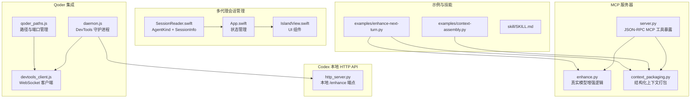
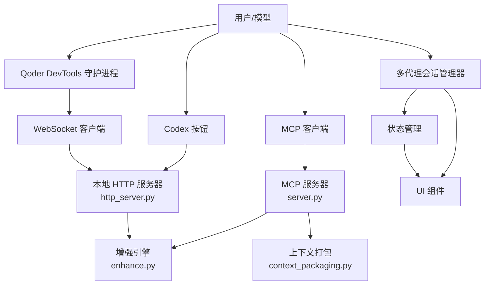
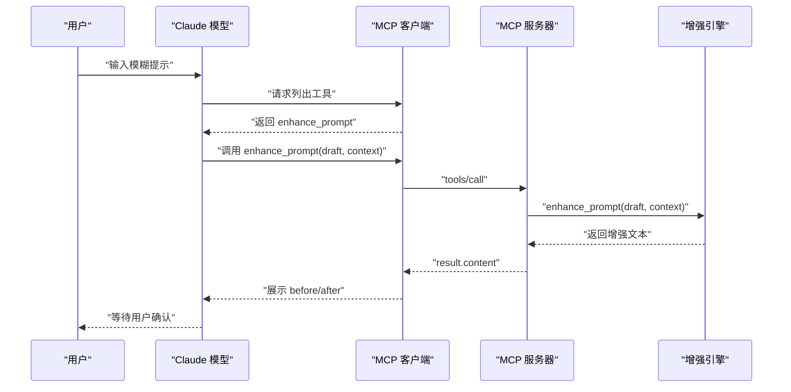
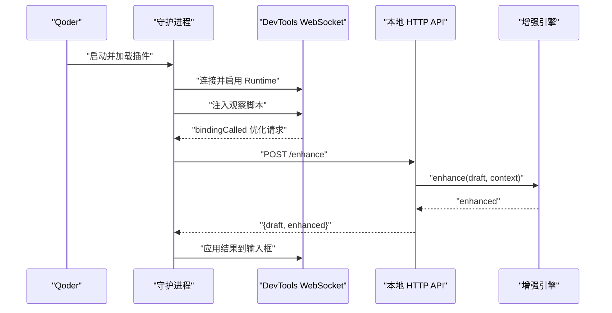
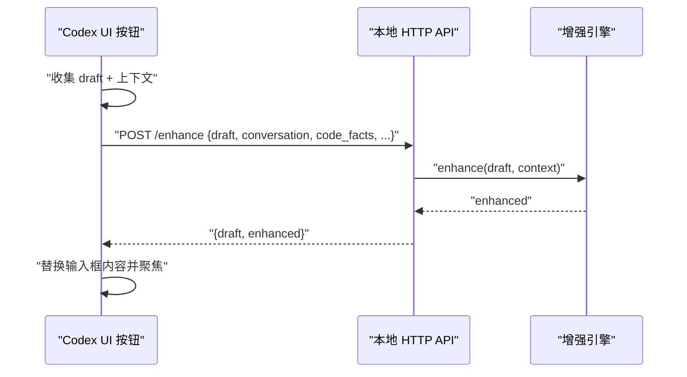
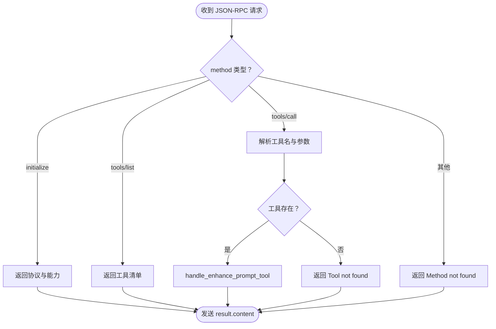
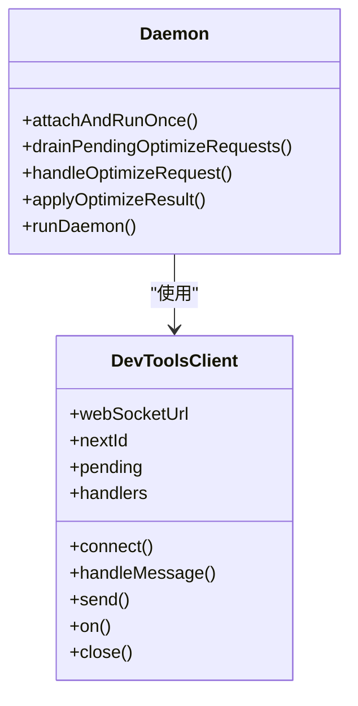
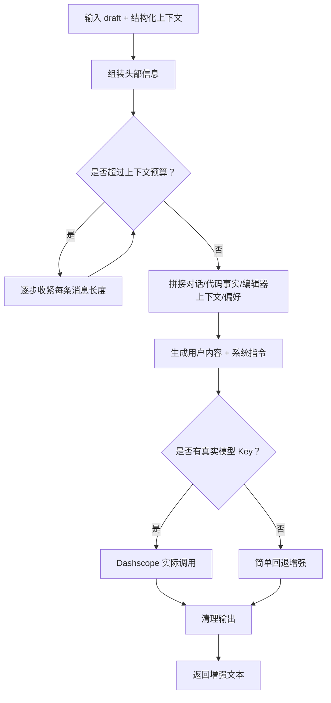
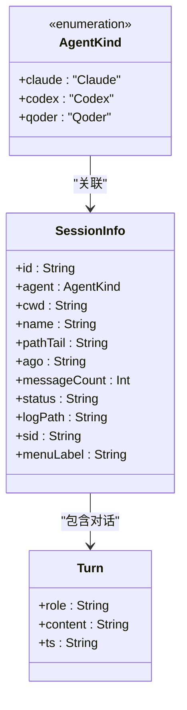
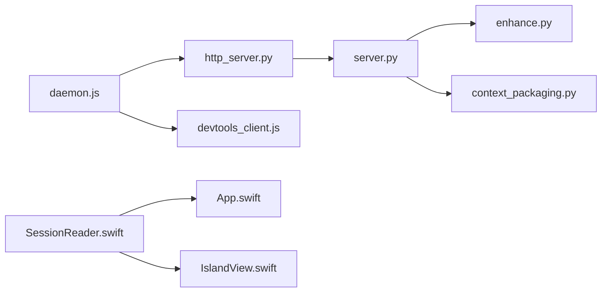

# 集成指南

<cite>
**本文引用的文件**
- [README.md](file://README.md)
- [package.json](file://package.json)
- [docs/TECH_SCHEME.md](file://docs/TECH_SCHEME.md)
- [docs/claude-code-integration.md](file://docs/claude-code-integration.md)
- [docs/qoder-integration.md](file://docs/qoder-integration.md)
- [docs/codex-button-integration.md](file://docs/codex-button-integration.md)
- [mcp-server/server.py](file://mcp-server/server.py)
- [mcp-server/enhance.py](file://mcp-server/enhance.py)
- [mcp-server/context_packaging.py](file://mcp-server/context_packaging.py)
- [mcp-server/http_server.py](file://mcp-server/http_server.py)
- [qoder-ui/src/daemon.js](file://qoder-ui/src/daemon.js)
- [qoder-ui/src/devtools_client.js](file://qoder-ui/src/devtools_client.js)
- [qoder-ui/src/qoder_paths.js](file://qoder-ui/src/qoder_paths.js)
- [claude-ui/swift/Sources/SessionReader.swift](file://claude-ui/swift/Sources/SessionReader.swift)
- [claude-ui/swift/Sources/App.swift](file://claude-ui/swift/Sources/App.swift)
- [claude-ui/swift/Sources/IslandView.swift](file://claude-ui/swift/Sources/IslandView.swift)
- [claude-ui/src/session_reader.py](file://claude-ui/src/session_reader.py)
- [claude-ui/bin/claude-card.py](file://claude-ui/bin/claude-card.py)
- [examples/context-assembly.py](file://examples/context-assembly.py)
- [examples/enhance-next-turn.py](file://examples/enhance-next-turn.py)
- [skill/SKILL.md](file://skill/SKILL.md)
</cite>

## 更新摘要
**变更内容**
- 新增多代理会话管理架构说明，包括 AgentKind 枚举和 SessionInfo 结构体
- 新增 Qoder IDE 集成指南，涵盖 MCP 配置和 DevTools 集成
- 详细说明多代理会话聚合和差异化处理机制
- 更新架构图以反映多代理支持
- 增加多代理上下文聚合的实现细节

## 目录
1. [简介](#简介)
2. [项目结构](#项目结构)
3. [核心组件](#核心组件)
4. [架构总览](#架构总览)
5. [详细组件分析](#详细组件分析)
6. [多代理会话管理](#多代理会话管理)
7. [依赖关系分析](#依赖关系分析)
8. [性能考量](#性能考量)
9. [故障排除指南](#故障排除指南)
10. [结论](#结论)
11. [附录](#附录)

## 简介
本指南面向希望将 PromptCocoPilot 集成到不同开发环境的工程师与使用者，现已支持多代理集成，覆盖 Claude Code、Qoder IDE、Codex 以及跨代理会话管理。文档重点说明：
- 如何在各平台配置 MCP 服务器与技能（Skill）
- 多代理会话管理架构：AgentKind 枚举、SessionInfo 结构体和会话聚合机制
- MCP 协议的实现要点：工具注册、调用处理、结构化上下文打包与错误处理
- DevTools 集成的实现原理：WebSocket 连接管理、事件处理与自动重连
- 完整配置示例、最佳实践（环境变量、API 密钥管理、性能优化）
- 不同集成方式的优缺点与适用场景

## 项目结构
项目采用分层组织，现已扩展为多代理支持：
- mcp-server：MCP 工具实现与上下文打包
- qoder-ui：Qoder DevTools 客户端与守护进程，用于自动收集输入并调用本地 HTTP API
- claude-ui：多代理会话管理与上下文聚合，支持 Claude Code、Codex、Qoder 会话
- docs：各平台集成文档与技术方案
- examples：上下文组装与增强示例
- skill：Claude Code 的 Skill 描述文件
- tests：验证脚本与测试用例

**图表来源**
- [mcp-server/server.py:1-232](file://mcp-server/server.py#L1-L232)
- [mcp-server/enhance.py:1-167](file://mcp-server/enhance.py#L1-L167)
- [mcp-server/context_packaging.py:1-211](file://mcp-server/context_packaging.py#L1-L211)
- [mcp-server/http_server.py:1-101](file://mcp-server/http_server.py#L1-L101)
- [qoder-ui/src/daemon.js:1-165](file://qoder-ui/src/daemon.js#L1-L165)
- [qoder-ui/src/devtools_client.js:1-47](file://qoder-ui/src/devtools_client.js#L1-L47)
- [qoder-ui/src/qoder_paths.js:1-20](file://qoder-ui/src/qoder_paths.js#L1-L20)
- [claude-ui/swift/Sources/SessionReader.swift:1-304](file://claude-ui/swift/Sources/SessionReader.swift#L1-L304)
- [claude-ui/swift/Sources/App.swift:1-504](file://claude-ui/swift/Sources/App.swift#L1-L504)
- [claude-ui/swift/Sources/IslandView.swift:1-460](file://claude-ui/swift/Sources/IslandView.swift#L1-L460)
- [examples/context-assembly.py:1-93](file://examples/context-assembly.py#L1-L93)
- [examples/enhance-next-turn.py:1-55](file://examples/enhance-next-turn.py#L1-L55)
- [skill/SKILL.md:1-105](file://skill/SKILL.md#L1-L105)

**章节来源**
- [README.md:23-29](file://README.md#L23-L29)
- [docs/TECH_SCHEME.md:1-166](file://docs/TECH_SCHEME.md#L1-L166)

## 核心组件
- MCP 工具服务器：提供 enhance_prompt 工具，支持结构化上下文与 JSON-RPC 协议
- 增强引擎：基于 Dashscope 的真实模型增强，支持回退逻辑
- 上下文打包器：将对话历史、代码事实、任务状态、编辑器上下文等结构化为提示词
- 多代理会话管理器：统一管理 Claude Code、Codex、Qoder 三种代理的会话，提供会话聚合与差异化处理
- Codex 本地 HTTP API：提供 /enhance 端点，供 Codex 工具栏按钮调用
- Qoder DevTools 集成：通过 DevTools 绑定与观察脚本，自动收集输入并调用本地 API

**章节来源**
- [mcp-server/server.py:42-232](file://mcp-server/server.py#L42-L232)
- [mcp-server/enhance.py:22-167](file://mcp-server/enhance.py#L22-L167)
- [mcp-server/context_packaging.py:7-211](file://mcp-server/context_packaging.py#L7-L211)
- [mcp-server/http_server.py:1-101](file://mcp-server/http_server.py#L1-L101)
- [qoder-ui/src/daemon.js:1-165](file://qoder-ui/src/daemon.js#L1-L165)
- [qoder-ui/src/devtools_client.js:1-47](file://qoder-ui/src/devtools_client.js#L1-L47)
- [claude-ui/swift/Sources/SessionReader.swift:1-304](file://claude-ui/swift/Sources/SessionReader.swift#L1-L304)

## 架构总览
整体架构遵循"轻量化重写器 + 结构化上下文 + 多宿主暴露 + 多代理会话管理"的设计，既可通过 MCP 工具在 Claude Code/Qoder 中使用，也可通过 Codex 本地 HTTP API 由外部按钮触发，同时支持跨代理会话聚合与差异化处理。

**图表来源**
- [mcp-server/server.py:1-232](file://mcp-server/server.py#L1-L232)
- [mcp-server/enhance.py:1-167](file://mcp-server/enhance.py#L1-L167)
- [mcp-server/context_packaging.py:1-211](file://mcp-server/context_packaging.py#L1-L211)
- [mcp-server/http_server.py:1-101](file://mcp-server/http_server.py#L1-L101)
- [qoder-ui/src/daemon.js:1-165](file://qoder-ui/src/daemon.js#L1-L165)
- [qoder-ui/src/devtools_client.js:1-47](file://qoder-ui/src/devtools_client.js#L1-L47)
- [claude-ui/swift/Sources/SessionReader.swift:1-304](file://claude-ui/swift/Sources/SessionReader.swift#L1-L304)
- [claude-ui/swift/Sources/App.swift:1-504](file://claude-ui/swift/Sources/App.swift#L1-L504)
- [claude-ui/swift/Sources/IslandView.swift:1-460](file://claude-ui/swift/Sources/IslandView.swift#L1-L460)

## 详细组件分析

### Claude Code 集成
- MCP 服务器配置：在 Claude 配置文件中添加 MCP 服务器条目，指定命令、参数与环境变量（如 API Key）
- Skill 集成：将 SKILL.md 放入工作区的技能目录，使模型在遇到模糊输入时自动调用增强工具
- 使用方式：自动触发或显式调用，推荐传递结构化上下文（对话、代码事实、任务状态、当前文件/选区、用户偏好）

**图表来源**
- [docs/claude-code-integration.md:1-200](file://docs/claude-code-integration.md#L1-L200)
- [mcp-server/server.py:93-229](file://mcp-server/server.py#L93-L229)
- [mcp-server/enhance.py:90-134](file://mcp-server/enhance.py#L90-L134)
- [skill/SKILL.md:1-105](file://skill/SKILL.md#L1-L105)

**章节来源**
- [docs/claude-code-integration.md:29-98](file://docs/claude-code-integration.md#L29-L98)
- [docs/claude-code-integration.md:100-177](file://docs/claude-code-integration.md#L100-L177)
- [docs/TECH_SCHEME.md:73-84](file://docs/TECH_SCHEME.md#L73-L84)

### Qoder IDE 集成
- MCP 配置：在 ~/.qoder/mcp.json 中添加 MCP 服务器条目，启动 Qoder 并在工具列表中可见
- DevTools 集成：守护进程通过 DevTools 连接找到目标页面，注入观察脚本，监听优化请求并调用本地 HTTP API
- 自动重连：连接断开后指数回退重试，保证稳定性
- 路径管理：通过 qoder_paths.js 管理 Qoder 支持目录和 DevTools 端口文件

**图表来源**
- [docs/qoder-integration.md:1-101](file://docs/qoder-integration.md#L1-L101)
- [qoder-ui/src/daemon.js:135-165](file://qoder-ui/src/daemon.js#L135-L165)
- [qoder-ui/src/devtools_client.js:1-47](file://qoder-ui/src/devtools_client.js#L1-L47)
- [qoder-ui/src/qoder_paths.js:1-20](file://qoder-ui/src/qoder_paths.js#L1-L20)
- [mcp-server/http_server.py:39-84](file://mcp-server/http_server.py#L39-L84)
- [mcp-server/enhance.py:90-134](file://mcp-server/enhance.py#L90-L134)

**章节来源**
- [docs/qoder-integration.md:15-59](file://docs/qoder-integration.md#L15-L59)
- [qoder-ui/src/daemon.js:1-165](file://qoder-ui/src/daemon.js#L1-L165)
- [qoder-ui/src/devtools_client.js:1-47](file://qoder-ui/src/devtools_client.js#L1-L47)
- [qoder-ui/src/qoder_paths.js:1-20](file://qoder-ui/src/qoder_paths.js#L1-L20)

### Codex 按钮集成
- 本地 HTTP API：启动 http_server.py，提供 /enhance 端点
- 按钮行为：读取输入草稿、近期对话、已收集代码事实、当前文件/选区、任务状态与用户偏好，POST 至本地端点，将返回的 enhanced 写回输入框
- 隐私边界：仅发送可见聊天文本与明确代码事实，避免包含隐藏推理内容

**图表来源**
- [docs/codex-button-integration.md:1-104](file://docs/codex-button-integration.md#L1-L104)
- [mcp-server/http_server.py:22-84](file://mcp-server/http_server.py#L22-L84)
- [mcp-server/enhance.py:90-134](file://mcp-server/enhance.py#L90-L134)

**章节来源**
- [docs/codex-button-integration.md:22-73](file://docs/codex-button-integration.md#L22-L73)
- [docs/codex-button-integration.md:74-104](file://docs/codex-button-integration.md#L74-L104)

### MCP 协议实现细节
- 初始化握手：接收 initialize 请求，返回协议版本、能力与服务器信息
- 工具清单：tools/list 返回 enhance_prompt 工具定义，包含输入模式（draft、context、结构化字段、输出选项）
- 工具调用：tools/call 路由到 handle_enhance_prompt_tool，支持结构化上下文自动打包与 JSON 输出
- 错误处理：未知方法返回 Method not found；工具不存在返回 Tool not found；解析异常与运行时异常分别处理

**图表来源**
- [mcp-server/server.py:82-229](file://mcp-server/server.py#L82-L229)

**章节来源**
- [mcp-server/server.py:42-232](file://mcp-server/server.py#L42-L232)

### DevTools 集成实现原理
- 连接管理：DevToolsClient 封装 WebSocket 连接、消息分发与请求-响应映射
- 事件处理：监听 Runtime.bindingCalled，解析绑定载荷，打印诊断信息
- 自动重连：守护进程 attachAndRunOnce 成功后监听 ws.onclose/onerror，指数回退重连
- 请求处理：轮询窗口中的待处理请求，调用本地 HTTP API 获取增强结果并应用回页面

**图表来源**
- [qoder-ui/src/devtools_client.js:1-47](file://qoder-ui/src/devtools_client.js#L1-L47)
- [qoder-ui/src/daemon.js:1-165](file://qoder-ui/src/daemon.js#L1-L165)

**章节来源**
- [qoder-ui/src/devtools_client.js:1-47](file://qoder-ui/src/devtools_client.js#L1-L47)
- [qoder-ui/src/daemon.js:1-165](file://qoder-ui/src/daemon.js#L1-L165)

### 上下文打包与增强流程
- 结构化上下文：PromptContext 包含对话、代码事实、任务状态、编辑器上下文与用户偏好；支持去重与预算裁剪
- 打包算法：smart truncation（头尾保留）、按预算逐步收紧、限制最大消息数与选区长度
- 增强逻辑：严格系统指令、语言保持、自包含输出；支持真实模型调用与回退

**图表来源**
- [mcp-server/context_packaging.py:79-178](file://mcp-server/context_packaging.py#L79-L178)
- [mcp-server/enhance.py:71-134](file://mcp-server/enhance.py#L71-L134)

**章节来源**
- [mcp-server/context_packaging.py:7-211](file://mcp-server/context_packaging.py#L7-L211)
- [mcp-server/enhance.py:1-167](file://mcp-server/enhance.py#L1-L167)

## 多代理会话管理

### AgentKind 枚举与 SessionInfo 结构体
多代理会话管理的核心是 AgentKind 枚举和 SessionInfo 结构体，它们提供了统一的会话抽象和差异化处理能力。

**图表来源**
- [claude-ui/swift/Sources/SessionReader.swift:5-32](file://claude-ui/swift/Sources/SessionReader.swift#L5-L32)

### 会话聚合机制
多代理会话管理器负责从不同代理源收集会话信息并进行统一排序：

- **Claude Code 源**：读取 ~/.claude/sessions/*.json 和 ~/.claude/projects/*/session_id.jsonl
- **Codex 源**：读取 ~/.codex/sessions/*.jsonl 并解析会话索引
- **Qoder 源**：扫描 ~/.qoder/projects/**/* 以获取 Qoder 兼容的会话格式

会话聚合遵循以下规则：
1. 按最后活动时间降序排列
2. 同时考虑会话状态（busy 优先于 idle）
3. 提供统一的菜单标签和预览信息

**章节来源**
- [claude-ui/swift/Sources/SessionReader.swift:42-289](file://claude-ui/swift/Sources/SessionReader.swift#L42-L289)
- [claude-ui/swift/Sources/App.swift:162-192](file://claude-ui/swift/Sources/App.swift#L162-L192)

### 差异化处理实现
不同代理的会话格式和处理逻辑存在差异，会话管理器通过以下方式实现差异化处理：

- **Claude Code**：使用 JSONL 格式，包含完整的对话历史和状态信息
- **Codex**：使用特殊的会话元数据格式，需要解析会话索引文件获取更好的显示名称
- **Qoder**：与 Claude 兼容的 JSONL 格式，但缺少独立的会话索引文件，需要从会话内容中提取项目路径

**章节来源**
- [claude-ui/swift/Sources/SessionReader.swift:98-281](file://claude-ui/swift/Sources/SessionReader.swift#L98-L281)

### UI 组件集成
多代理会话管理通过 SwiftUI 组件提供用户界面：

- **会话选择器**：显示所有代理的会话，带有代理标识色和状态指示
- **上下文预览**：显示压缩后的对话预览，支持展开查看完整上下文
- **状态管理**：通过 AppState 统一管理会话列表、当前选择和增强状态

**章节来源**
- [claude-ui/swift/Sources/IslandView.swift:169-291](file://claude-ui/swift/Sources/IslandView.swift#L169-L291)
- [claude-ui/swift/Sources/App.swift:92-233](file://claude-ui/swift/Sources/App.swift#L92-L233)

## 依赖关系分析
- 组件耦合
  - server.py 依赖 enhance.py 与 context_packaging.py
  - http_server.py 复用 server.py 的处理逻辑
  - daemon.js 依赖 devtools_client.js 与本地 HTTP API
  - SessionReader.swift 独立管理多代理会话，不依赖具体代理实现
- 外部依赖
  - Dashscope API（可选，用于真实增强）
  - DevTools 端口与目标页面（Qoder）
  - HTTP 服务器（Codex）
  - 不同代理的会话存储格式

**图表来源**
- [mcp-server/server.py:35-41](file://mcp-server/server.py#L35-L41)
- [mcp-server/http_server.py:13-16](file://mcp-server/http_server.py#L13-L16)
- [qoder-ui/src/daemon.js:1-6](file://qoder-ui/src/daemon.js#L1-L6)
- [claude-ui/swift/Sources/SessionReader.swift:44-47](file://claude-ui/swift/Sources/SessionReader.swift#L44-L47)

**章节来源**
- [mcp-server/server.py:35-41](file://mcp-server/server.py#L35-L41)
- [mcp-server/http_server.py:13-16](file://mcp-server/http_server.py#L13-L16)
- [qoder-ui/src/daemon.js:1-6](file://qoder-ui/src/daemon.js#L1-L6)
- [claude-ui/swift/Sources/SessionReader.swift:44-47](file://claude-ui/swift/Sources/SessionReader.swift#L44-L47)

## 性能考量
- 模型选择：增强阶段使用快速小模型（如 deepseek-v4-flash），降低延迟与 Token 消耗
- 上下文预算：限制上下文总字符数，优先保留结论段落，避免超限
- 回退策略：无 Key 时使用简单回退，保障可用性
- 重连与并发：DevTools 守护进程指数回退重连，HTTP 服务器线程化处理请求
- 会话读取优化：多代理会话管理器使用增量读取和缓存机制，避免重复解析大量会话文件

**章节来源**
- [mcp-server/enhance.py:22-40](file://mcp-server/enhance.py#L22-L40)
- [mcp-server/context_packaging.py:35-53](file://mcp-server/context_packaging.py#L35-L53)
- [qoder-ui/src/daemon.js:135-165](file://qoder-ui/src/daemon.js#L135-L165)
- [mcp-server/http_server.py:86-101](file://mcp-server/http_server.py#L86-L101)
- [claude-ui/swift/Sources/SessionReader.swift:60-96](file://claude-ui/swift/Sources/SessionReader.swift#L60-L96)

## 故障排除指南
- Claude Code
  - 工具不可见：检查 MCP 配置文件路径与命令可执行性，重启 Claude Code
  - 增强效果一般：确认已配置 DASHSCOPE_API_KEY，或切换至真实模型增强
- Qoder
  - 无法连接 DevTools：确认 QODER_DEVTOOLS_PORT 设置或读取 Active Port 文件，检查目标页面是否存在
  - 自动重连频繁：检查网络与端口占用，观察日志中的重连延迟
  - MCP 工具不可用：检查 ~/.qoder/mcp.json 配置，确保命令路径正确
- Codex
  - 本地 API 未响应：确认 http_server.py 已启动，端口未被占用，请求体格式正确
  - 隐私合规：仅发送可见聊天与明确代码事实，避免包含隐藏推理
- 多代理会话管理
  - 会话列表为空：检查各代理的会话存储目录权限，确认 ~/.claude、~/.codex、~/.qoder 目录存在
  - 会话状态显示异常：检查会话文件格式，确认 JSONL 格式正确
  - 代理标识错误：确认 AgentKind 枚举值与实际代理类型匹配

**章节来源**
- [docs/claude-code-integration.md:180-191](file://docs/claude-code-integration.md#L180-L191)
- [docs/qoder-integration.md:1-101](file://docs/qoder-integration.md#L1-L101)
- [docs/codex-button-integration.md:101-104](file://docs/codex-button-integration.md#L101-L104)
- [claude-ui/swift/Sources/SessionReader.swift:131-281](file://claude-ui/swift/Sources/SessionReader.swift#L131-L281)

## 结论
PromptCocoPilot 提供统一的上下文感知提示词增强能力，现已扩展为多代理支持，通过 MCP 工具与 Skill 在 Claude Code 中无缝集成，通过 DevTools 与本地 HTTP API 在 Qoder 与 Codex 中扩展，同时通过多代理会话管理器实现跨代理的统一体验。建议优先使用真实模型增强，并结合结构化上下文与透明 before/after 展示，以获得最佳用户体验。

## 附录

### 配置示例与参数说明
- Claude Code MCP 配置（示例路径与环境变量）
  - 参考：[docs/claude-code-integration.md:43-61](file://docs/claude-code-integration.md#L43-L61)
- Qoder MCP 配置（示例路径与环境变量）
  - 参考：[docs/qoder-integration.md:18-31](file://docs/qoder-integration.md#L18-L31)
- Qoder DevTools 路径配置
  - 参考：[qoder-ui/src/qoder_paths.js:3-20](file://qoder-ui/src/qoder_paths.js#L3-L20)
- Codex 本地 HTTP API 启动与端点
  - 参考：[docs/codex-button-integration.md:24-36](file://docs/codex-button-integration.md#L24-L36)
- MCP 工具输入参数（结构化字段）
  - 参考：[mcp-server/server.py:117-191](file://mcp-server/server.py#L117-L191)
- 多代理会话管理配置
  - 参考：[claude-ui/swift/Sources/SessionReader.swift:42-47](file://claude-ui/swift/Sources/SessionReader.swift#L42-L47)

### 最佳实践
- 环境变量与密钥管理
  - DASHSCOPE_API_KEY：用于真实模型增强
  - DEEPSEEK_BASE_URL：兼容模式地址（可选）
  - 参考：[docs/claude-code-integration.md:53-58](file://docs/claude-code-integration.md#L53-L58)
- 结构化上下文优先
  - 使用 conversation、code_facts、task_state、current_file、selected_code、user_preferences
  - 参考：[docs/TECH_SCHEME.md:65-72](file://docs/TECH_SCHEME.md#L65-L72)
- 性能优化
  - 使用快速小模型进行增强
  - 控制上下文预算，避免超限
  - 多代理会话管理使用增量读取，避免重复解析
  - 参考：[mcp-server/context_packaging.py:35-53](file://mcp-server/context_packaging.py#L35-L53)
- 多代理集成最佳实践
  - 统一会话标签格式，包含代理标识和会话状态
  - 保持增强逻辑的一致性，忽略代理差异
  - 提供清晰的错误处理和回退机制

### 不同集成方式的优缺点与适用场景
- Claude Code（MCP + Skill）
  - 优点：生态成熟、工具可编程、Skill 自动引导
  - 缺点：当前实现未透传真实 LLM 生成函数（需配置 Key）
  - 适用：需要与模型协同、结构化上下文丰富的场景
  - 参考：[docs/claude-code-integration.md:14-26](file://docs/claude-code-integration.md#L14-L26)
- Qoder（MCP + DevTools）
  - 优点：IDE 内集成、自动观察输入、稳定重连、支持任务模式
  - 缺点：依赖 DevTools 端口与页面匹配、需要额外的路径配置
  - 适用：Quest/任务模式下的上下文增强、需要与 Qoder 生态深度集成的场景
  - 参考：[docs/qoder-integration.md:1-101](file://docs/qoder-integration.md#L1-L101)
- Codex（本地 HTTP API）
  - 优点：无需修改客户端即可提供按钮能力
  - 缺点：需自行实现按钮与上下文收集
  - 适用：已有 Codex UI 扩展能力或桌面客户端支持按钮钩子
  - 参考：[docs/codex-button-integration.md:1-104](file://docs/codex-button-integration.md#L1-L104)
- 多代理会话管理
  - 优点：统一界面、跨代理会话聚合、状态一致
  - 缺点：需要适配不同代理的会话格式、可能增加复杂度
  - 适用：需要在多个 AI 编程 IDE 间切换使用的场景
  - 参考：[claude-ui/swift/Sources/SessionReader.swift:285-289](file://claude-ui/swift/Sources/SessionReader.swift#L285-L289)