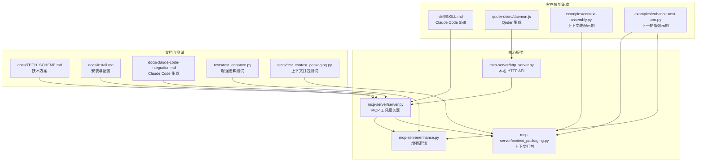
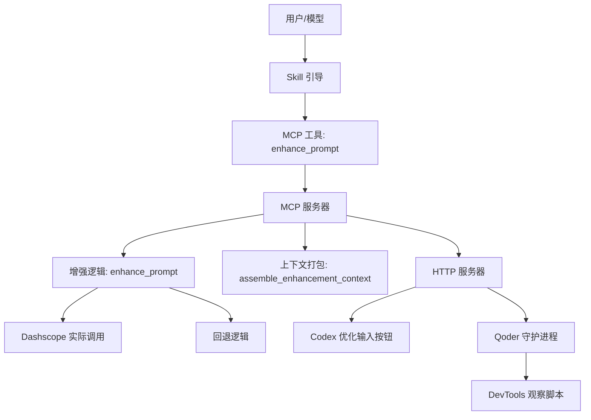
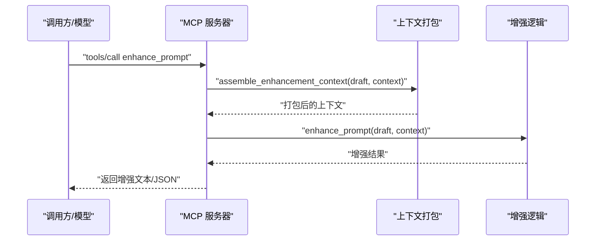
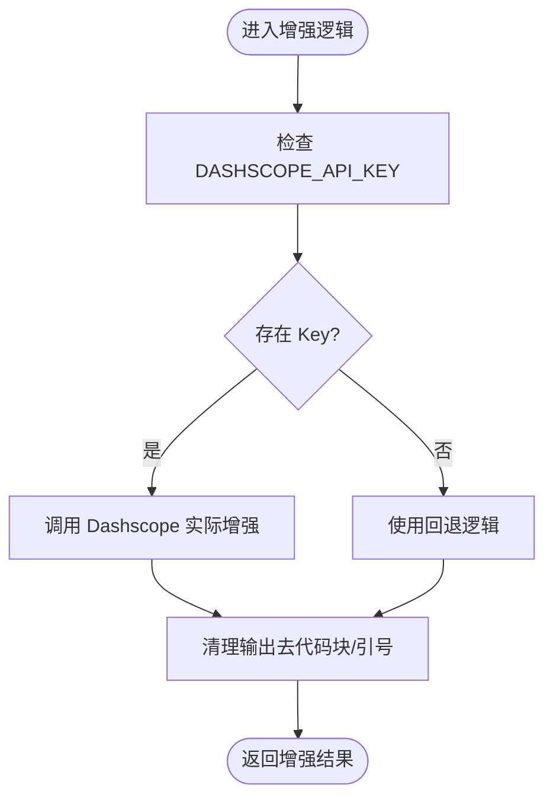
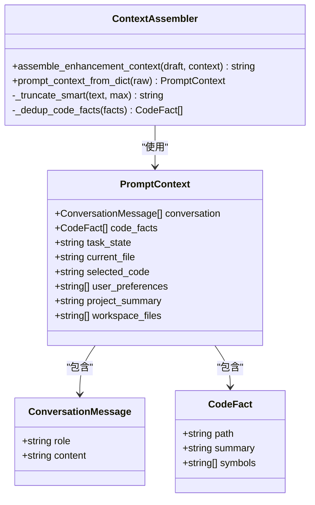
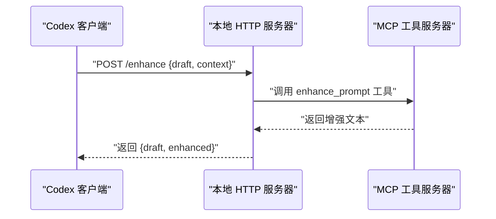
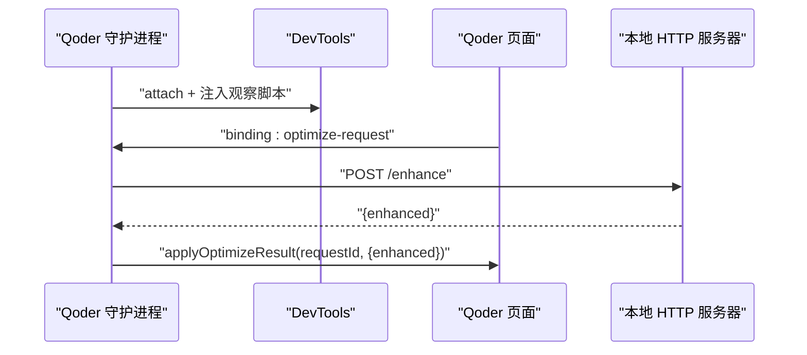
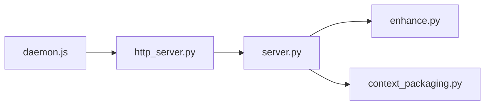

# 项目概述

<cite>
**本文引用的文件**
- [README.md](file://README.md)
- [package.json](file://package.json)
- [mcp-server/server.py](file://mcp-server/server.py)
- [mcp-server/enhance.py](file://mcp-server/enhance.py)
- [mcp-server/context_packaging.py](file://mcp-server/context_packaging.py)
- [mcp-server/http_server.py](file://mcp-server/http_server.py)
- [skill/SKILL.md](file://skill/SKILL.md)
- [docs/TECH_SCHEME.md](file://docs/TECH_SCHEME.md)
- [docs/install.md](file://docs/install.md)
- [docs/claude-code-integration.md](file://docs/claude-code-integration.md)
- [docs/qoder-integration.md](file://docs/qoder-integration.md)
- [docs/codex-button-integration.md](file://docs/codex-button-integration.md)
- [examples/context-assembly.py](file://examples/context-assembly.py)
- [examples/enhance-next-turn.py](file://examples/enhance-next-turn.py)
- [tests/test_enhance.py](file://tests/test_enhance.py)
- [tests/test_context_packaging.py](file://tests/test_context_packaging.py)
- [qoder-ui/src/daemon.js](file://qoder-ui/src/daemon.js)
</cite>

## 目录
1. [引言](#引言)
2. [项目结构](#项目结构)
3. [核心组件](#核心组件)
4. [架构总览](#架构总览)
5. [详细组件分析](#详细组件分析)
6. [依赖关系分析](#依赖关系分析)
7. [性能考量](#性能考量)
8. [故障排除指南](#故障排除指南)
9. [结论](#结论)
10. [附录](#附录)

## 引言
PromptCocoPilot 是一个专为 Claude Code 设计的上下文感知提示词增强工具，旨在复刻 Kilo Code 的 Enhance Prompt 功能。其核心目标是在用户发送前提供一个“轻量级专用重写器”，通过整合对话历史、代码事实、编辑器上下文与用户偏好，生成更清晰、具体、可执行的提示词，并支持用户审阅后再发送，从而显著提升首次执行的成功率与一致性。

项目强调“预发送优化”的价值主张：将“下一轮问题”与“前面已经发生过的上下文”一起打包，形成“草稿 + 结构化上下文”的增强输入，避免孤立润色带来的语义漂移。技术上采用 Python + Node.js 的混合栈，既保证 MCP 服务器的易部署性，又通过 Node.js 提供与 Qoder IDE 的集成与观察机制，同时支持通过 HTTP API 为 Codex 等客户端提供“优化输入”按钮能力。

项目状态：已实现 Skills + MCP 核心能力，支持真实 Dashscope 调用，文档与配置示例完善；在 Claude Code 与 Qoder 中均可使用，支持“增强前后对比 + 用户审阅”的 UX 模式。

## 项目结构
项目采用按职责分层的组织方式：
- mcp-server：MCP 服务器与核心增强逻辑，提供增强工具与上下文打包能力
- skill：Claude Code Skill 描述文件，定义何时与如何使用增强工具
- docs：安装、集成与技术方案文档
- examples：上下文装配与下一轮增强的示例
- tests：单元测试与验证脚本
- qoder-ui：与 Qoder IDE 的集成（Node.js 守护进程与观察脚本）
- package.json：Node.js 脚本与测试入口

图表来源
- [mcp-server/server.py:1-232](file://mcp-server/server.py#L1-L232)
- [mcp-server/enhance.py:1-167](file://mcp-server/enhance.py#L1-L167)
- [mcp-server/context_packaging.py:1-211](file://mcp-server/context_packaging.py#L1-L211)
- [mcp-server/http_server.py:1-101](file://mcp-server/http_server.py#L1-L101)
- [skill/SKILL.md:1-105](file://skill/SKILL.md#L1-L105)
- [qoder-ui/src/daemon.js:1-165](file://qoder-ui/src/daemon.js#L1-L165)
- [examples/context-assembly.py:1-93](file://examples/context-assembly.py#L1-L93)
- [examples/enhance-next-turn.py:1-55](file://examples/enhance-next-turn.py#L1-L55)
- [docs/TECH_SCHEME.md:1-166](file://docs/TECH_SCHEME.md#L1-L166)
- [docs/install.md:1-81](file://docs/install.md#L1-L81)
- [docs/claude-code-integration.md:1-200](file://docs/claude-code-integration.md#L1-L200)
- [tests/test_enhance.py:1-69](file://tests/test_enhance.py#L1-L69)
- [tests/test_context_packaging.py:1-160](file://tests/test_context_packaging.py#L1-L160)

章节来源
- [README.md:23-29](file://README.md#L23-L29)
- [docs/TECH_SCHEME.md:7-19](file://docs/TECH_SCHEME.md#L7-L19)

## 核心组件
- 轻量级专用重写器：严格遵循“只重写、不回答/不执行”的原则，系统指令明确禁止讨论、解释或输出非增强文本，确保增强结果可直接发送。
- 对话历史上下文支持：支持最近 N 条消息的智能截断（保留首尾，避免丢失结论），并限制总上下文预算，防止越界。
- 下一轮问题打包：将用户新草稿、前文对话、已读代码事实、当前任务状态、当前文件/选区、用户偏好统一打包，形成“增强前的完整上下文”。
- MCP 工具暴露：通过 JSON-RPC 标准协议注册工具，支持结构化输入（conversation、code_facts、task_state、current_file、selected_code、user_preferences、project_summary、workspace_files）与可选自由文本 context。
- 本地 HTTP API：为 Codex 等客户端提供“优化输入”按钮的稳定本地端点，简化集成。
- Qoder 集成：通过 Node.js 守护进程连接 Qoder DevTools，监听输入优化请求并通过本地 HTTP API 返回增强结果。
- 真实 LLM 增强：默认使用 Dashscope 兼容端点进行高质量改写，支持环境变量配置与回退逻辑，满足不同部署场景。

章节来源
- [README.md:5-22](file://README.md#L5-L22)
- [mcp-server/enhance.py:71-83](file://mcp-server/enhance.py#L71-L83)
- [mcp-server/context_packaging.py:35-39](file://mcp-server/context_packaging.py#L35-L39)
- [mcp-server/server.py:49-80](file://mcp-server/server.py#L49-L80)
- [mcp-server/http_server.py:22-36](file://mcp-server/http_server.py#L22-L36)
- [qoder-ui/src/daemon.js:100-126](file://qoder-ui/src/daemon.js#L100-L126)
- [mcp-server/enhance.py:22-68](file://mcp-server/enhance.py#L22-L68)

## 架构总览
整体架构采用“混合暴露 + 结构化上下文”的设计：
- 核心逻辑（增强与上下文打包）由 Python 实现，保证易部署与与 Claude 生态兼容；
- MCP 工具作为统一入口，支持结构化字段与自由文本；
- 本地 HTTP API 为 Codex 等客户端提供按钮式“优化输入”能力；
- Node.js 守护进程与 Qoder DevTools 集成，实现输入拦截与结果回填；
- 技术方案文档与安装指南提供端到端的部署与使用路径。

图表来源
- [mcp-server/server.py:82-232](file://mcp-server/server.py#L82-L232)
- [mcp-server/enhance.py:90-133](file://mcp-server/enhance.py#L90-L133)
- [mcp-server/context_packaging.py:79-178](file://mcp-server/context_packaging.py#L79-L178)
- [mcp-server/http_server.py:39-96](file://mcp-server/http_server.py#L39-L96)
- [qoder-ui/src/daemon.js:100-126](file://qoder-ui/src/daemon.js#L100-L126)

## 详细组件分析

### 组件 A：MCP 工具服务器（server.py）
- 职责：实现 JSON-RPC 协议，注册并处理 enhance_prompt 工具调用；支持结构化字段与自由文本 context；可返回结构化输出（original/enhanced/context_used）。
- 关键输入：draft（必填）、context（可选）、include_history、conversation、code_facts、task_state、current_file、selected_code、user_preferences、project_summary、workspace_files、structured_output。
- 输出：增强后的提示词文本；支持 JSON 结果用于 UI 展示 before/after 与改动说明。
- 设计要点：最小实现兼容常见 Claude MCP 客户端；保留扩展空间（未来可接入官方 mcp SDK）。

图表来源
- [mcp-server/server.py:49-80](file://mcp-server/server.py#L49-L80)
- [mcp-server/context_packaging.py:79-178](file://mcp-server/context_packaging.py#L79-L178)
- [mcp-server/enhance.py:90-133](file://mcp-server/enhance.py#L90-L133)

章节来源
- [mcp-server/server.py:49-232](file://mcp-server/server.py#L49-L232)

### 组件 B：增强逻辑（enhance.py）
- 职责：根据系统指令与上下文重写用户草稿；支持真实 Dashscope 调用与回退逻辑；提供 next-turn 增强入口。
- 系统指令：严格限定“只重写、不回答/不执行”，输出需去除代码块与引号，语言与草稿保持一致，必须具备可执行性（包含具体文件、行为与成功标准）。
- 真实调用：自动检测 DASHSCOPE_API_KEY 或从指定 env 文件加载，使用兼容端点进行高质量改写；失败时自动回退至简单结构化改进。
- 回退策略：在开发/测试环境下提供基础增强，保留上下文提示与结构化输出。

图表来源
- [mcp-server/enhance.py:27-68](file://mcp-server/enhance.py#L27-L68)
- [mcp-server/enhance.py:118-133](file://mcp-server/enhance.py#L118-L133)

章节来源
- [mcp-server/enhance.py:1-167](file://mcp-server/enhance.py#L1-L167)

### 组件 C：上下文打包（context_packaging.py）
- 数据模型：ConversationMessage、CodeFact、PromptContext；支持项目摘要（project_summary）与工作区文件清单（workspace_files）。
- 打包策略：智能截断（保留首尾）、去重合并（同一文件路径的事实合并）、总预算控制（默认约 6k 字符），优先保留对话与代码事实。
- 结构化输出：将草稿、项目上下文、最近对话、代码事实、任务状态、编辑器上下文、用户偏好、工作区文件等组合为可读文本，供增强器使用。

图表来源
- [mcp-server/context_packaging.py:7-33](file://mcp-server/context_packaging.py#L7-L33)
- [mcp-server/context_packaging.py:79-211](file://mcp-server/context_packaging.py#L79-L211)

章节来源
- [mcp-server/context_packaging.py:1-211](file://mcp-server/context_packaging.py#L1-L211)

### 组件 D：本地 HTTP API（http_server.py）
- 职责：为 Codex 等客户端提供稳定的本地 /enhance 端点，接收 draft 与 context，调用 MCP 工具处理并返回增强结果。
- 错误处理：对缺失 draft、无效 JSON、异常等进行标准化响应码与错误信息。
- CORS 支持：允许任意来源访问，便于浏览器或桌面应用集成。

图表来源
- [mcp-server/http_server.py:22-66](file://mcp-server/http_server.py#L22-L66)
- [mcp-server/server.py:49-80](file://mcp-server/server.py#L49-L80)

章节来源
- [mcp-server/http_server.py:1-101](file://mcp-server/http_server.py#L1-L101)

### 组件 E：Qoder 集成（daemon.js）
- 职责：连接 Qoder DevTools，注入观察脚本，拦截输入优化请求，调用本地 HTTP API 获取增强结果并回填到输入框。
- 机制：通过 Runtime.binding 与页面脚本通信，周期轮询待处理请求，异步处理并应用结果。
- 容错：连接断开自动重连，错误时向页面反馈“服务未开”。

图表来源
- [qoder-ui/src/daemon.js:44-126](file://qoder-ui/src/daemon.js#L44-L126)

章节来源
- [qoder-ui/src/daemon.js:1-165](file://qoder-ui/src/daemon.js#L1-L165)

## 依赖关系分析
- 组件耦合：server.py 依赖 enhance.py 与 context_packaging.py；http_server.py 复用 server.py 的工具处理逻辑；qoder-ui 依赖本地 HTTP 服务。
- 外部依赖：Dashscope 兼容端点（生产增强）、Node.js（Qoder 集成）、JSON-RPC（MCP 协议）。
- 风险点：MCP 默认实现为最小兼容版本，建议在支持时升级为官方 mcp SDK；HTTP 服务需确保端口可用与跨域配置。

图表来源
- [mcp-server/server.py:35-41](file://mcp-server/server.py#L35-L41)
- [mcp-server/http_server.py:13-16](file://mcp-server/http_server.py#L13-L16)
- [qoder-ui/src/daemon.js:100-109](file://qoder-ui/src/daemon.js#L100-L109)

章节来源
- [mcp-server/server.py:1-44](file://mcp-server/server.py#L1-L44)
- [mcp-server/http_server.py:1-17](file://mcp-server/http_server.py#L1-L17)
- [qoder-ui/src/daemon.js:1-10](file://qoder-ui/src/daemon.js#L1-L10)

## 性能考量
- 上下文预算：默认约 6k 字符，避免小模型上下文窗口溢出；对长对话采用智能截断（头+尾），优先保留结论。
- 模型选择：默认使用 fast model（deepseek-v4-flash via Dashscope），降低延迟与 token 消耗。
- I/O 优化：HTTP 服务器线程化处理；MCP 服务器通过 stdio JSON-RPC 交互，减少进程间通信开销。
- 回退策略：开发/测试阶段使用简单回退，避免阻塞；生产环境建议配置真实 LLM Key。

章节来源
- [mcp-server/context_packaging.py:35-39](file://mcp-server/context_packaging.py#L35-L39)
- [mcp-server/enhance.py:25](file://mcp-server/enhance.py#L25)
- [mcp-server/http_server.py:94-101](file://mcp-server/http_server.py#L94-L101)

## 故障排除指南
- MCP 工具不可见：检查配置文件路径与命令可执行性；重启 Claude Code；手动运行 server.py 验证日志。
- 增强效果不佳：确认已配置 DASHSCOPE_API_KEY；或在 Skill 中让模型自行增强（消耗主模型 token）。
- HTTP API 无法访问：检查端口占用与 CORS 设置；确保本地服务已启动。
- Qoder 无法优化输入：确认守护进程连接 DevTools 成功；检查本地 HTTP 服务状态；查看页面绑定名称与脚本注入。

章节来源
- [docs/claude-code-integration.md:180-200](file://docs/claude-code-integration.md#L180-L200)
- [docs/install.md:35-81](file://docs/install.md#L35-L81)
- [mcp-server/http_server.py:42-84](file://mcp-server/http_server.py#L42-L84)
- [qoder-ui/src/daemon.js:135-165](file://qoder-ui/src/daemon.js#L135-L165)

## 结论
PromptCocoPilot 通过“轻量级专用重写器 + 结构化上下文 + MCP 工具 + 本地 HTTP API + Qoder 集成”的组合，实现了对 Kilo Code Enhance Prompt 的高保真复刻，并进一步扩展到多平台与多集成场景。其设计强调“预发送优化、透明审阅、上下文完整”，适合持续编码对话与复杂任务拆解，显著提升首次执行成功率与用户体验。建议在生产环境中配置真实 LLM Key，并结合 Skill 与客户端薄插件，形成“自动触发 + 结构化上下文 + 增强审阅 + 发送执行”的闭环工作流。

## 附录

### 使用场景与最佳实践
- 连续编码对话：对“下一轮问题”（如“那这个怎么改”）进行增强，保留前文代码事实与任务状态，避免上下文丢失。
- 模糊输入自动增强：当用户输入简短或不完整时，模型自动调用工具进行优化与审阅。
- 透明对比与编辑：展示 before/after 与改动说明，允许用户微调后再发送。
- 多平台集成：Claude Code（MCP + Skill）、Qoder（DevTools + 本地 HTTP）、Codex（优化输入按钮）。

章节来源
- [README.md:31-53](file://README.md#L31-L53)
- [skill/SKILL.md:58-72](file://skill/SKILL.md#L58-L72)
- [docs/TECH_SCHEME.md:73-83](file://docs/TECH_SCHEME.md#L73-L83)

### 技术深度：MCP 协议与上下文感知增强
- MCP 协议：通过 JSON-RPC 2.0 标准实现工具注册与调用，支持结构化输入与结果返回；当前为最小兼容实现，可升级为官方 SDK。
- 上下文感知增强：将“草稿 + 对话历史 + 代码事实 + 编辑器上下文 + 用户偏好 + 项目摘要 + 工作区文件”统一打包，确保增强结果具备可执行性与一致性。

章节来源
- [mcp-server/server.py:46-107](file://mcp-server/server.py#L46-L107)
- [mcp-server/context_packaging.py:79-178](file://mcp-server/context_packaging.py#L79-L178)

### 许可证与项目状态
- 许可证：MIT
- 项目状态：已实现 Skills + MCP 核心能力，支持真实 Dashscope 调用，文档与配置示例完善；在 Claude Code 与 Qoder 中可使用。

章节来源
- [README.md:171-174](file://README.md#L171-L174)
- [README.md:148-156](file://README.md#L148-L156)